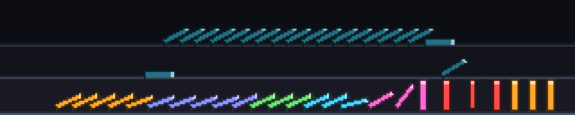

### dominoes



A domino run toppling all the way across, and then a hand standing it back up.
A finger comes in from the left and tips the first tile; the wave crosses the
panel — quick where the spacing is tight, lazy where it is wide; a branch
peels off onto a second run at the back and races the trunk; the two rejoin;
one tile very nearly does not go over; and when it is all lying down, two
hands sweep in from the right and put every tile back on its feet, which is
the half of the video everybody secretly likes best.

A 320x64 panel *is* a domino run — it is the one subject that wants a 5:1
letterbox more than a time axis does — and there is nothing to read. It is
here to be watched from across the room, not understood.

**A tile is a rigid rectangle rotating about its bottom edge, and the whole run
is that one tile with a different start time.** `build()` lays out the pivots,
wires up which tile knocks which, and solves for the exact second each one
begins to fall; `render(t)` is then a table lookup per tile — `t` minus its own
start, through one shared fall curve, clamped. Nothing is stepped per frame, so
the run costs the same however long it is, and `render` is pure by construction
rather than by care.

The fall curve is the real one: a thin rod pivoting about its end obeys
`theta'' = (3g/2L) sin(theta)`, integrated once at build time into a
time→angle table. That is where the *mass* comes from. A domino barely moves
for the first third of its fall and then goes over all at once, and a marquee
or a sine wave does not do that — the specific way the angular velocity is
still building when the tile hits its neighbour is the whole difference between
this and a coloured pixel running along a line. It is also what makes the
spacing matter: a tile catches the next one when its top corner has swung out
as far as the gap, `sin(theta_c) = gap / height`, so a tight gap is caught
early in the slow part of the arc and a wide one late in the fast part. Vary
the gap along the run — this one does, in zones of three to six tiles — and the
ripple speeds up and slows down for nothing.

The hard part was not the falling tile, it was what happens when it lands. A
domino does not drop to the floor; it lands on the *back* of the next one and
stops there, and a finished run is a stack of parallel leaning slabs, not a row
of flat dashes. Rather than solve a constrained chain, each tile carries a
ceiling on its angle that opens as its neighbour gets out of the way:

    limit(k) = rest(k) + (contact(k) - rest(k)) * (1 - progress(k+1))

with `rest = acos(thickness / pitch)`, which is where parallel slabs of that
thickness at that spacing actually settle. The neighbour's *unconstrained*
angle is used, so it is one pass and not a fixed point. Three things that would
each have needed code fall out of that single line: a tile visibly decelerates
the instant it makes contact, a finished run leans as a stack, and — the good
one — the tile in front of the stalled tile hangs there at seventy-odd degrees,
held up by the thing that will not go, until it goes, and then follows it down.

The stall itself is not a special case either. It is one gap set to 0.96 of the
tile height, which is caught right at the end of the arc, so the run genuinely
nearly dies there; the predecessor lies almost flat and just touches the next
tile at its foot. A short teeter on top of that turns a physics fact into a
beat of comedy. `--no-stall` removes it and the run is noticeably worse for it.

The branch is drawn as depth: three floors a tile height apart, so the back run
sits high on the panel in dimmed colours and the connector tiles read as a step
up and a step down. The back run is spaced tighter, so it travels faster,
usually wins the race, and comes down onto the trunk *ahead* of the front wave
— which then arrives to find the tiles already gone. Which of the two gets
there first depends on the seed, and that is the point: it is a race.

The colours are for the branch, not for decoration. Six saturated hues in
blocks of three to six tiles make the zones legible and give the eye something
to track along a 300 px line of identical objects. There are no pips: a run is
seen down its length, so what faces you is the tile's narrow edge and the pips
are on the two faces you cannot see — and four pixels of edge has nowhere to
put a pip even if it were facing you. What the tiles get instead is a dark
outline and a bright end cap, and the end caps are what make a finished run
read as a stack of slabs rather than as a row of hyphens.

Cost is the number of tiles, not the number of pixels. The frame is a `uint8`
code buffer — 0 empty, otherwise `1 + colour*3 + face` — composited tile by
tile and turned into pixels by one masked palette lookup over the lit pixels
only. Every tile standing still, upright or at rest, uses a patch baked in
`build()`; only the three to nine actually in flight are rasterised, as one
`(n, h, w)` stack. About eighty numpy calls a frame at 45 tiles, and `--pitch`
is the knob if that is ever too many. 0.24 ms mean / 0.34 p95 on a desktop.

One bug worth recording, because it cost nothing to make and would have cost
a lot on the Pi: the fall curve was built with two samples at time zero, and
`np.interp` at a repeated x does not return the value you think it does. It
answered 0.02 rad for tau = 0, which is a fifth of a pixel and completely
invisible — and marked every tile in the run as "in flight" from the first
frame, so every frame rasterised all 45 of them instead of three.

A cycle is about twelve seconds at 20 fps and it is a full story: tip, run,
branch, race, stall, collapse, hold, reset. It does not carry a number and
does not belong in the SPARSE set.

```console
$ python3 dominoes.py --host 127.0.0.1
$ python3 dominoes.py --seed 12 --pitch 1.3     # fewer tiles, lazy and wide
$ python3 dominoes.py --kick 1.6 --fall 0.28    # brisk, four tiles in the air
$ python3 dominoes.py --no-branch --no-stall    # just the wave
```
