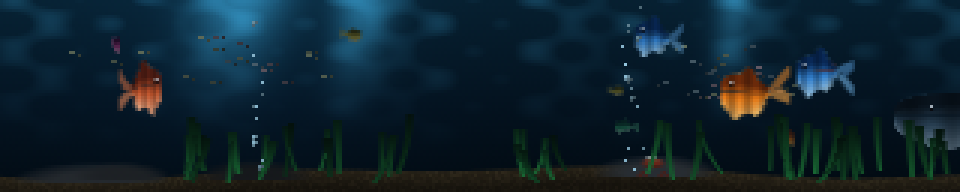

### fish

An aquarium. That is the whole of it: there is no number, no label, no legend
and nothing to work out. Seventy-seven of the panels on this wall are built to
be understood, and in a loud workshop the thing that is actually worth having
next to them is a tank of fish.



**The representation that made everything else fall out: a fish is two curves
per column, not a sprite.** Take one coordinate `u` running 0 at the tail tip to
1 at the nose. Give it a centre line `yc(u)` and a half-height `hb(u)`, and the
fish is the filled region between `yc - 0.88*hb` and `yc + 1.12*hb`, with a
half-pixel ramp at the edge for antialiasing. Every feature is then a term in
one of those two functions:

- **Swimming** is a travelling sine added to `yc`, amplitude growing towards the
  tail as `(1-u)^1.9`, phase running head to tail. The body *flexes*; a rigid
  sprite sliding sideways reads as a sticker and this does not.
- **The body** is `hb = amp * u'^0.55 * (1-u')^0.30`, normalised. Those two
  exponents are the entire silhouette — both under one, so the head is blunt and
  the peduncle is thin, and the peak lands about two thirds forward, where a
  fish is actually deepest. The first version used `sin(pi*s^k)^0.62` and drew a
  flat-topped lozenge: a fish with no shoulder reads as a leaf however good the
  tail is.
- **Dorsal, anal and pectoral fins** are three more bumps added to those limits
  over narrow ranges of `u`, drawn 30% transparent so the water shows through.
  The pectoral costs three pixels and is a surprising amount of the "fish".
- **The caudal fin** is a separate flare left of `u = 0.3` with a wedge cut out
  of the middle. The fork is what makes a five-pixel tail read as a tail.
- **Shading** is one scalar — height above the centre line over `hb` — through a
  dark-back-to-pale-belly ramp, plus a couple of bars. And one dark pixel with
  one bright pixel over its shoulder, for the eye, which is the most
  load-bearing pixel in the file: without it a small fish is a coloured dash.

Because the wave is *in the geometry*, a tail-beat frame is free at run time.
`build()` rasterises six beat phases and `render()` picks one.

**A fish that turns is a fish that gets narrower.** Its path is
`cx + ax*sin(th + 0.28*sin 2th)`, so the velocity is `cos`-shaped: it
decelerates into the edge, hangs, and comes back. To read that as a *turn*
rather than as an instant reversal, each fish is also baked at a range of
horizontal squashes, from full profile one way through a head-on sliver to full
profile the other, and the frame picks one straight out of `dx/dt`. It is the
cheapest possible three-quarter view.

How many squashes is not a taste decision, it is solved: the turn is quantised
to that table, so one step is one visible jump in the fish's *width*, and the
count comes from holding that jump to two pixels. Sizing it by size class
instead had it backwards — the biggest fish got the fewest levels, so a 37 px
fish crossed the panel in five steps and changed width sixteen pixels at a
time, which reads as a snap rather than a turn, on the most watched fish in the
tank. The levels are also spaced uniformly in width rather than in velocity,
with the foreshortening curve moved into the lookup: spaced the other way the
widest jump lands exactly where the turn is fastest. Both are asserted off the
rendered silhouettes. It costs 14.5 MB of baked sprites against 3.6 MB, and
nothing per frame — the frame is still one indexed blit. The phase warp, rather than an added
third harmonic, is deliberate: `sin(th + a sin 2th)` has derivative
`cos(...)*(1 + 2a cos 2th)`, and with `a < 0.5` the second factor never changes
sign, so the fish turns exactly twice a period. The harmonic version gave four
and six zero crossings for some phases — a fish flickering round mid-crossing
for no reason.

**Depth is sort order and nothing else.** Every fish carries a `z` in 0..1 drawn
from a power law, which sets its length, its speed, how far its colour is hazed
towards the water, and where it lands in the back-to-front blit. An even spread
of sizes has no foreground; the whole effect is one big slow fish crossing the
panel while a cloud of tiny ones flickers around it.

Three populations, because they want completely different cost models. Ten
sprite fish are blitted, and each is about six numpy calls. Forty-odd tiny far
ones — the shoal — are three pixels each and are drawn as three *vectorised
scatters*, so forty of them cost the same fifteen calls as four would; they
travel as two or three loose clouds sharing a frequency and a phase, because
scattering them uniformly looks exactly like dust on the panel. And the
furniture: weed baked at twenty-four sway phases and blitted as one strip,
bubbles rising in irregular strings from two vents, a crab on the sand that
mostly does nothing, light shafts and a caustic ripple.

**There is one fish that is a jerk**, and it is the only story on the panel. It
is mid-depth, saturated red, faster than anything its size, and every fifty
seconds or so it latches onto a specific neighbour and harries it for twenty
seconds before losing interest. It is a chase with no state at all: its
position is its own patrol blended towards *the victim's own closed form
evaluated at t minus half a second*, with a slow oscillator squashed to 0..1 as
the blend weight. The lag is what makes it look like a pursuit rather than like
two fish glued together. And every four minutes something large and slow — a
dark grey thing about a quarter of the panel long — crosses and is gone.

**Purity.** A shoal is naturally an update loop, and an update loop would
desync the moment the scheduler built a segment ahead on its worker thread. So
every path here is closed form: a base drift plus a couple of sinusoids whose
frequencies and phases are drawn once in `build()` from `--seed`. The
frequencies are mutually irrational, so **the tank has no cycle** — the only
periodic event in it is the visitor. `render(t)` is exact at any `t`, which the
test script asserts by comparing a cold call against the same `t` reached by
driving frame by frame from zero.

**Cost.** Measured over 6000 frames on the desktop: **mean 0.35 ms, p95 0.44,
p99 0.51, worst 0.94**, with `build()` at 95 ms. That is about ninety numpy
calls and five whole-frame passes; the dither offset is folded into the baked
background rather than added as its own pass, which removes one walk of the
frame for nothing (the cost is that opaque sprites overwrite the offset, so the
fish are undithered — fine, since the banding it kills is in the big smooth
water gradient). **`--fish` is the knob**, because that is the only term that
scales: each sprite fish is roughly six calls, and the shoal, the weed and the
bubbles are flat. `--fish 5 --no-shoal` measures 0.27 ms.

What was hard was the peduncle. The body wave displaces the centre line, and the
tail joins the body through a two-pixel stalk — measured *vertically* along a
45-degree path, two pixels is less than one, and the tail visibly came off the
fish at the extremes of the beat. Inflating the half-thickness by `sec(slope)`
is the correction a stroked path needs and it fixed it, but only after a second
floor in absolute pixels: 0.16 of a small fish's depth is under half a pixel and
antialiases away to nothing. Neither failure is visible in a screenshot at the
wrong phase, so `scripts/test-fish.py` flood fills every baked sprite and
requires exactly one connected component.

```console
$ python3 fish.py --host 127.0.0.1
$ python3 fish.py --fish 14 --shoal 60      # busier tank
$ python3 fish.py --fish 5 --no-shoal       # the cheap tank
$ python3 fish.py --visitor 60              # see the big one sooner
$ python3 fish.py --seed 22                 # a different tank entirely
$ python3 scripts/test-fish.py --bench
```
