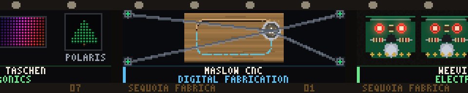

### hackfilm



The makerspace's own projects, on a strip of film that pulls down one frame at
a time. Seven cells, each a small generative homage to something a member of
Sequoia Fabrica built and then wrote up on the wiki, captioned with its name and
its grove: the Maslow's four belts converging on its sled; three Weevil Eye
boards on the bench at three stages of a soldering class; the flatbed knitting
machine with a jacquard coming off it; the six Glow Lights themes as a swatch
card; a spoon over its bullseye template; a two-colour riso print with the pink
plate two pixels out; and this wall, drawn on itself, next to Polaris.

Every other panel here is about somewhere else — the grid, the bay, the sky, the
encyclopedia. This one is about the room the wall is bolted to.

**Where the content came from.** `wiki.sequoiafabrica.org`, read as rendered
HTML (there is no API — `/api.php` and `/w/api.php` both 404 — and a plain fetch
403s unless you send a browser User-Agent). The pages used, one per frame, and
they are recorded in the fourth field of `FRAMES` in the source so the next
person to extend this knows where to read:

| frame | grove | wiki page |
|---|---|---|
| MASLOW CNC | Digital Fabrication | `Maslow CNC` |
| WEEVIL EYE | Electronics | `Electronics/WeevilEye` |
| KNITTING MACHINE | Textiles | `Textiles/Industrial Knitting Machine` |
| GLOW LIGHTS | Electronics | `GlowProject`, `Electronics/RaspberryPiWorkstations` |
| SPOONMAKING | Woodworking | `Spoonmaking & Engraving` |
| RISO EZ220 | Printmaking | `Riso EZ220U`, `Printmaking` |
| FLASCHEN TASCHEN | Electronics | `FlaschenTaschen` |

`Groves` and `Groves Table` are where the grove names and the colour code come
from. Note that Printmaking is not itself a grove on that table — it is a wiki
page, and the riso lives under it; `#grove-fine-arts` exists but the table says
"No information yet." The caption says PRINTMAKING because that is what the wiki
actually says, and putting FINE ARTS there would have been a guess.

**Seven, and not more, is the honest number.** The wiki has 125 pages and most
of them are governance, policy and tool operating instructions. Of the pages
that sound like projects, several are one sentence long — `Electronics/
GlowBoxen` is "A shelf lighting project at Sequoia Fabrica", `Electronics/
Outatime` is "Back to the Future" — and there is no way to draw those without
inventing what they look like. They are deliberately absent. Three of the seven
frames are Electronics because Electronics is the grove that writes things down;
they are interleaved so no two adjacent cells share a grove, which the test
asserts. No individual is named anywhere, although the wiki names members in
places: projects and groves reach the wall, people do not.

Everything is drawn in code from the words on the page, the way `fine` draws its
dog and `crash` draws its Sad Mac — rectangles, ellipses, lines and character
grids over a palette. Nothing is traced and nothing is downloaded. Details come
from the pages rather than from imagination: the needle bed is drawn at 7 gauge
because the machine page says 7 gauge, the Weevil Eye has a photoresistor
between its two LED eyes because the class handout lists exactly those parts,
the Maslow's frame is bigger than the sheet because the page describes a
machine that cuts a full sheet of plywood without breaking it down, and neither
riso plate is a solid because the page's hard rule is to keep fills under about
75% or the drum jams.

**The one representation choice: the whole strip is a single baked image, and
`render()` is one slice of it.** Seven cells of 160 columns are drawn once in
`build()` into a 64 × 1120 image — film base, sprocket perforations, edge print
and all — then the array is padded on the right with a copy of its own first 320
columns, and on the top and bottom with two rows of base. After that a frame is

```
np.copyto(out, pad[wy : wy+64, x0 : x0+320])
```

one numpy call, the same cost whatever is in the picture. That is the entire
reason the panel can afford seven detailed illustrations on a Pi 3: it never
draws any of them. It measures 0.003 ms mean on a desktop, and the thing that
actually matters is that the cost does not scale with the artwork, so a future
frame eight is free at run time.

The pan falls out of the same choice. `x0` comes from an ease-out-back curve:
fast off the mark, about nine percent past the mark, then back — a claw yanking
the film down and the frame rocking into the gate, rather than a carousel
gliding. `wy` is a one pixel vertical weave read out of a seeded array at
20 Hz, at full amplitude while the film moves and decaying over the third of a
second after it lands. Both are pure functions of `t`; the weave is an index
into a baked array rather than a call to the RNG, which is the trap here — the
version that calls the RNG once a frame looks identical on a desktop and drifts
against the preview baker on the wall.

The panel is exactly two cells wide, which is not a coincidence: it means the
held frame sits centred with half of each neighbour showing at the edges, and
that is what makes it read as a strip of film rather than as a slideshow.
Sixteen millimetre, so the perforations are down one edge only — two bright rows
of holes on a 64 row panel would fight the picture — and the other edge carries
the edge print, `SEQUOIA FABRICA` and the frame number.

Cycle: seven frames at 5 s in the gate and 0.85 s of pull-down, so 41 seconds,
at 20 fps. `scripts/test-hackfilm.py` checks the things a screenshot cannot: that
`render` is pure, that every hold parks its cell *exactly* centred on every lap
(a settle that does not settle creeps a pixel a cycle and is unreadable after a
minute), that the wrap has no seam, that every pixel of every caption is drawn
at full colour including the bottom row of every glyph, and that no frame claims
a grove that does not exist.

```console
$ python3 hackfilm.py --host ft.local
$ python3 hackfilm.py --hold 3 --advance 0.5      # a brisker projector
$ python3 hackfilm.py --weave 0 --seed 7          # locked gate, different grain
```
