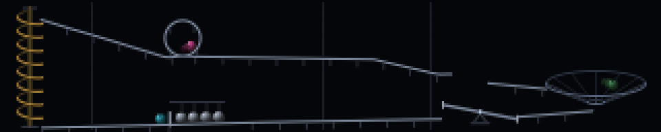

### marble



A marble run, seen from the side. A ball rolls off a screw lift at the top
left, down a steep ramp, round a loop-the-loop, along a long shallow one, off a
ski jump, into a Newton's cradle, over a see-saw that tips under it, down a
funnel it spirals three times round, and back to the screw. Fourteen seconds a
lap, three balls on the run at once, and no numbers anywhere.

A marble run is the most watchable thing on the internet and nobody can quite
explain why, but a 320x64 panel is a marble run seen from the side — which is
how they are built and how they are filmed — and a room full of machines is
the right room for one.

The representation that made it tractable: **the whole run is solved once in
`build()` into a single table of `(t, x, y, z, spin)` covering one lap**, and
`render` is a `bisect` into that table plus a lerp. The table is built by
walking the track part by part and carrying the ball's speed forward,

    v² ← v² + 2 g dh − k v² ds

which is `v² = 2gh` written incrementally, plus rolling resistance. Time is
then `ds / v`, accumulated. Nothing is integrated per frame, so the panel is a
pure function of `t` by construction, which is what the scheduler and the
preview baker both need — and it costs nothing, because the expensive part
happened once.

The reason to do it that way rather than with eased tweens is that a marble
moving at a constant speed round a curve destroys the whole effect, and it
destroys it in a way you notice without being able to name. Doing the
kinematics properly also makes things *true* rather than merely drawn. The
loop-the-loop is the clearest case: it only works if `v² ≥ g r` at the top, the
ramp above it is what pays for that, and `build()` comes out with a 31% margin
in `v²`. Turn the rolling resistance up from 0.0022 to 0.0034 and the ball no
longer makes it round — which is exactly the failure a real marble run has, and
is asserted by the test script rather than left to the eye.

The two beats worth the trouble:

**The Newton's cradle** is the best single moment available at this size. Four
steel balls sit in a groove against a stop. The marble rolls in, stops dead,
and a *different* ball leaves the far end at the speed the first one arrived
with; the queue then nudges along one place, because the arriving marble is the
new fourth ball. Conserving the count is what makes it survive being watched
twice — a version where the same ball reappears reads as a glitch the second
time. In the table this is the one permitted discontinuity in position, and the
test asserts that it is exactly one, exactly the length of the queue, and
exactly at the cradle.

**The see-saw** is not on a timer. Its height profile is `y(u) = y_pivot −
u·s(u)` where `u` is the marble's signed distance from the pivot and `s` flips
sign as `u` crosses zero — so the tip is *inside the potential*. The ball
climbs the entry half and visibly slows (57 → 45 px/s), crosses the pivot, its
weight carries the far end over, and the lever dropping is what pays for the
speed it leaves with (48 → 111 px/s). Whether a mechanism moves because the
marble moved it or because a timer coincided with the marble is visible even
when you cannot articulate it, and this is the cheapest way to be on the right
side of that.

The screw lift is the exception and is meant to be: it is the motor, and it is
the reset. Its rotation is geared to the rise, and `build()` picks the ride time
so the screw's period divides the lap exactly *and* divides it by the number of
marbles — otherwise the second ball arrives at the bottom between two threads
and rides up through the metal. That falls out as `ride = N·t_gravity /
(m − N)` for an integer `m` divisible by the marble count.

The track is a fixed hand-drawn layout and `--seed` only chooses which marble
colours turn up and in what order. A generated track loses at this size: 64
rows with a 12-row loop and a 9-row funnel in it leaves no slack for a
generator to find, and every mechanism has to be given enough width to be
legible on its own. The one thing that *is* derived rather than placed is where
the ski jump lands — the launch velocity is whatever the ball actually had at
the lip, so the landing rail starts wherever the parabola says.

Two smaller things that mattered more than expected. The rail is offset a
marble radius along the track normal so the ball rides on top of it rather than
through it, and on the loop that normal is the outward radial one, so at the
top the track is correctly *above* the ball, holding it in. And the funnel is
the only part drawn in three dimensions: height on a cone depends only on
radius, so the physics uses that and the depth axis shows up on screen as a
squashed ellipse, with the back half of every line drawn darker. Without that
depth cue the spiral reads as a zigzag.

Cost is flat and small. Every moving part is pre-rendered in `build()` as a
stack of patches indexed by phase — sixteen screw rotations, thirteen see-saw
tilts, twelve cradle settle states — so a frame is one background copy, three
patch copies and one `np.maximum` per marble sprite: about twenty numpy calls
whatever is happening on screen, and nothing that scales with anything. The
sprites are baked per colour, brightness, rotation and subpixel offset, which
buys smooth positioning, a visible roll and the funnel's depth shading for one
blit each; the two dim ghosts behind each ball are the same bank at lower
brightness and are what keep a 90 px/s ball from strobing at 20 fps. The path
lookup is plain Python floats off `bisect`, which is cheaper than the numpy
call that would replace it.

```console
$ python3 marble.py --host 127.0.0.1
$ python3 marble.py --marbles 1            # follow one all the way round
$ python3 marble.py --gravity 130          # slow and calm; 260 is frantic
$ python3 scripts/test-marble.py --bench
```
