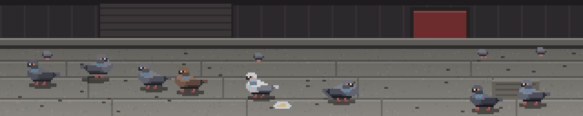

### pigeon



A stretch of Potrero Hill pavement with the local rock doves on it. They walk,
they peck, they look suspicious about it. One of them puffs his chest out and
turns slow circles at another who could not care less. Two of them squabble
over a foil-wrapped burrito end somebody dropped. Twice a minute the whole
flock goes up at once and clatters off the top of the panel, leaving a bare
pavement, a few feathers coming down and one pale scruffy bird who does not
fly — because he never does — standing in the middle of the frame pecking at
the concrete until everybody lands again, slightly rearranged.

There is no number on this panel and nothing to understand. It is here to be
enjoyable to walk past.

**The one representation choice is that the head is a separate sprite from the
body.** Everything else falls out of that, because the single most
recognisable thing a pigeon does is a consequence of its head and body moving
independently. A walking pigeon does not bob its head for decoration: it holds
the head *still in space* while the body walks forward underneath it, then
snaps the head forward to a new fixed point and holds it there again. That is
how a bird with immobile eyes stabilises an image. Nearly every animated pigeon
swings the head as a smooth function of the body, which is why nearly every
animated pigeon looks like a chicken toy.

With two sprites it is one line:

```
body_x(t) = x0 + v*t                          smooth
head_x(t) = x0 + v*P*(k + f(p))               stepped
head_rel  = head_x - body_x = STEP*(f(p) - p)
```

`k` and `p` are the stride index and phase from `t/P`, and `f(p)` is flat for
the first 78% of the stride and then ramps. Relative to the body the head
slides *backwards* through the stride and snaps forward at the end of it; in
the world it does not move at all. At the default 10 px/s and P = 0.4 s the
stride is four pixels, so the head holds for six frames and covers the four
pixels in three. `scripts/test-pigeon.py` asserts this in pixels rather than
in code: it finds the orange iris and the body's belly rows independently in
each frame of a stride, and requires the head to be motionless for at least
twice as long as the body ever is, while still covering the same ground by the
end. A still frame cannot tell the two versions apart, and neither can a
reviewer; only that check can.

**The behaviour is a timeline, not a state machine.** `render` has to be a pure
function of `t`, so nothing here ticks over between frames. `build()` draws
each bird's whole performance for the cycle from `--seed`: a contiguous list of
segments — idle, walk, strut, squabble, fly — and inside each idle segment a
list of head beats (stab, hold, look back over the shoulder, look up).
`render(t)` bisects into that list and interpolates. Purity is then free, but
the real win is that the *timing* becomes something you compose: the startles
are placed where they land best rather than emerging, the squabble is booked
next to the thing being squabbled over and both birds walk there to arrive on
the beat, and every bird's script is generated so that it ends the cycle
standing exactly where it started, which is what lets the loop close
invisibly.

Composing it also means the failures are all continuity failures, and they were
all real. Trimming a walk to make room for an appointment left the destination
in the payload, so a bird arrived where it had not walked to. The distance to
walk was measured before the idle filling that moved the bird, so the strut
started fourteen pixels off. The strut and the squabble are oscillations about
a fixed spot, so a duration that is not a whole number of their own cycles
leaves the bird mid-swing and it snaps back on the segment boundary — their
durations are now snapped to whole turns and whole lunges. All three look
identical in a screenshot and all three are asserted exactly, over ninety
builds across seeds, bird counts and cycle lengths.

Drawing: birds dark on light concrete, which is the way round it really is and
the way round that survives being seen at an angle from three metres. A 1px
dark underside line and a baked shadow keep each silhouette off the pavement —
the shadow is blitted from a second, pre-darkened copy of the background, so it
picks up the real concrete texture and costs one masked copy. The only colour
on a pigeon is the iridescent neck, and it earns its place twice: it is the
one saturated thing in a grey panel, and it flips green to purple as the head
turns, because iridescence is a structural colour and genuinely does depend on
the angle.

The birds are all the same size, which bounds the scene: a bird twice as far
away would have to be half as tall, and 64 rows cannot carry that. So the
foreground is a frieze about twenty rows deep and the depth cue is four
eight-pixel birds up on the kerb instead. The flight sprite anchors five rows
higher than a standing one, so take-off is a leap rather than a jump-cut.

Cost is sprites and blits, not pixels: one background copy plus a shadow, a
body and a head per bird. `--birds` is the knob — 0.064 ms/frame at eight on
the desktop, 0.137 at twenty.

```console
$ python3 pigeon.py --host 127.0.0.1
$ python3 pigeon.py --birds 14 --seed 11      # a bigger, messier flock
$ python3 pigeon.py --startles 4 --cycle 45   # jumpier birds
$ python3 pigeon.py --birds 3 --speed 4       # three very slow pigeons
$ python3 scripts/test-pigeon.py --bench
```
