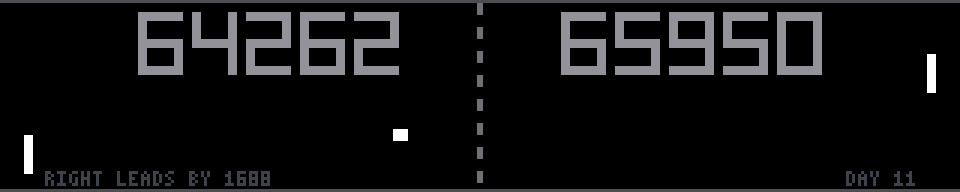

### pong



Pong, on a panel that is exactly the right shape for it. Black ground, a dashed
net, two blocky paddles, a square ball, and the score in slab numerals across
the top. No gradients, no glow, no particles.

**The score is why it is here.** It is not this rally's score and it is not the
score since the panel came up: it is every point these two machines have played
since 00:00 UTC on 1 August 2026, and it climbs whether or not anybody is in
the room — about 10,900 points a day. Walk past twice in a month and the
numbers have moved by tens of thousands; the grey line along the bottom says
which of them is winning the long game and by how much. That is the reason to
look at this panel a second time rather than once.

**Horizontal speed is the clock; everything vertical is theatre.** That single
split is the demo. A demo cannot write files and `render()` must be a pure
function of `t`, so the match cannot be simulated forward and remembered — it
has to be *computable* at any instant. It is, because the ball's horizontal
speed never depends on anything that happens vertically: it starts at `v0`, is
multiplied by `--rally-gain` on every return, and is capped. A rally with `R`
returns therefore lasts

    serve pause + (half a court)/v0 + Σ court/vk + (court + run-off)/vR + celebration

which is closed form in `(R, v0)`. The angles, the wall bounces, the paddles
flailing about — all of it changes what you watch and changes that number by
exactly nothing.

**So the score is a lookup, not a count.** The parameters of rally `j` — `R`,
`v0`, and who loses — come from one `RandomState` seeded in `build()` for `j`
in `[0, M)`, with `M = 4096` by default; rally `n` uses slot `n mod M`. The
book of rallies therefore repeats every `M` of them, which is about nine hours,
and nobody stands in front of an LED wall for nine hours. In exchange, the
cumulative time and the cumulative score are two `cumsum`s of length `M`, and
at any absolute time `u` since the epoch:

    block = u // S                    S = the book's total duration
    j     = searchsorted(cum_dur, u mod S)
    left  = block·K + cumL[j]         right = block·(M−K) + cumR[j]

Two integer divisions and a `searchsorted`. No history, no file, no continuity
across restarts: reboot the Pi, redeploy the demo, change the rotation, and the
number is still right, because it was never being counted. `--epoch N` pins the
clock for tests and screenshots, exactly as `dvd --epoch` does.

`K` — the number of rallies in a book that LEFT wins — is **exact, not
sampled**. The book's outcomes are a shuffle of a multiset with exactly `K`
wins in it. A sampled edge of 0.66% over 4096 rallies has a standard error of
half a percent, so for some seeds the long game would have come out the other
way round and the panel would have quietly contradicted its own README.

**Two players, both bad, badly in different ways.** A competent Pong AI
produces an infinite rally and nothing ever happens.

* **LEFT lunges.** Reaction 0.10 s and 108 px/s, far the faster paddle — but it
  commits. For the first 55% of the ball's flight it chases a straight-line
  extrapolation that *ignores the top and bottom walls*, so on any shot that
  bounces it charges confidently to the wrong end of the court and has 45% of
  the flight to sprint back. Between shots it pre-positions where it guesses
  the return will go. It is never still, and it travels about 20 px/s.
* **RIGHT plods.** Reaction 0.42 s and 64 px/s. It aims at the truth with a
  small steady bias and never overshoots, and between shots it slides back to
  the middle and waits — it is parked dead centre 63% of the time. It loses
  points by arriving late, never by going the wrong way.

Steady beats flashy by a whisker. `--edge` is the fraction of points LEFT wins
and defaults to 0.4934, so RIGHT gains 54 points every 4096 — about 150 a day,
a lead you can watch grow over a month and never a blowout. At one day the
score reads `5377 / 5499`; at one year, `1956538 / 2008840`, still 1.3% apart.

**The angle comes from where it hit**, as the 1972 machine does: a hit near the
tip leaves steeply, a hit on the middle leaves flat. It is one line and it is
most of what makes the play legible — the correlation between hit offset and
outgoing angle is 0.98 over the whole book. It is bent only when it has to be.
The outgoing angle is picked from a grid of 96 candidates as the one closest to
what the hit offset asks for **among those the receiving paddle can actually
reach in time**, so the rally cannot end on a shot neither player was ever
going to make. When the *next* shot is the deciding one the rule inverts and
the winner plays a placement, as far from the beaten paddle as the hit offset
can be argued into allowing.

**The hard part was making the picture agree with the book.** The loser is
decided before any geometry happens, so the geometry has to be talked into it,
and the failure mode is silent: a paddle that covers the ball on the deciding
shot, or misses it on any other one, hands the point to the wrong player and
looks completely normal doing it. Both are now guaranteed and both are asserted
over all 4096 rallies and all 13,182 contacts. A paddle that has to lose does
it by being late — its reaction is stretched until it runs out of segment a
clear paddle-width short and is still gliding when the ball goes past, which is
the failure both characters actually have; the lunger gets a better-looking
option first, reading the bounce backwards and lunging at the ball's mirror
image. The closest miss in the whole book is 12.7 px, so no point is ever won
by a pixel. In the other direction, eight contacts in thirteen thousand need
the receiving paddle to stretch the last pixel or two rather than concede a
point nobody scored; the test counts them.

**Cost is trivial and deliberately so.** The walls, the net, both scores and
the grey readout change only when the score does, so they are composited into
one frame-sized array once per rally. A frame is one `np.copyto` of that, three
rectangle fills and two `np.interp` calls over a few dozen paddle keypoints:
**0.027 ms mean, 0.042 p95** on a desktop over ten minutes of match, with a
3.4 ms spike on the eight-second boundary where the composite is rebuilt.
Nothing here is ever per-pixel.

The score's scale is measured rather than assumed: at five digits it is drawn
at 3× (87 px a side) and it steps down to 2× on its own when the match reaches
eight digits, some years from now, rather than running the two numbers into
each other over the net.

```console
$ python3 pong.py --epoch 1786577088 --duration 60   # deterministic
$ python3 pong.py --edge 0.6 --rally-gain 1.12       # a rout, and fast
$ python3 pong.py --rally-length 0.12                # grinding rallies only
$ python3 scripts/test-pong.py --bench
```
