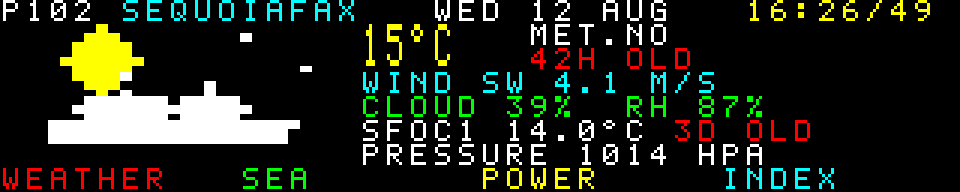

### teletext



A Ceefax page cycle: 40x8 character cells, seven colours and black, pictures
built out of the 2x3 block mosaic alphabet, and real numbers with their real
ages on them.

Teletext is this wall's direct ancestor -- a character display with no
half-tones and no blending, eight colours because they are the corners of the
RGB cube, carrying weather and tides and share prices to the whole of Britain
from 1974 to 2012. It is worth having on the rotation because it looks like
nothing else here, and it looks like nothing else because it could not look
like anything else.

**The grid is not a style choice, it is arithmetic.** 320 px is exactly 40
columns of 8 px, which is the real teletext column count. 64 px is exactly 8
rows of 8 px, where the real page had 25 -- so this is a page *cropped* to a
strip, not a page squeezed. The alternative was seven 9 px rows, which fits
neither the double-height stretch nor the 3-way mosaic split cleanly, and gains
nothing. Eight rows go: header, a double-height headline over two, four rows of
body, and the four coloured Fastext links along the bottom. Everything the
missing seventeen rows would have held is on another page, which is what page
numbers are for.

**One representation choice makes everything else fall out.** A page is never
pixels. It is three `(8, 40)` integer arrays -- glyph index, foreground colour,
background colour, one per cell -- and there is exactly one function in the file
that turns those into pixels, by expanding them through a bank of 8x8 bitmaps.
Text and mosaic graphics are the same operation with different indices. The
"colour clash" that gives teletext its look is then not simulated but
structural: one integer per cell means one colour per cell, so a green tree
against a blue sky really does have to choose, and the pictures are composed
around that the way the BBC's artists composed around it.

The mosaic alphabet is built rather than typed: 64 codes, and code *k* lights
the sub-blocks whose bits are set, in reading order. The sub-rows are 3, 3 and
2 px tall because 8 does not divide by three -- the real SAA5050 cell was 6x10
split 3/3/4 and had the same problem from the other side. A block is 4x3 px, so
the whole panel is an 80x24 mosaic canvas, and every picture here is composed in
that space: 18x28 blocks for the weather symbol, 9x80 for the tide curve, 18x80
for the ident. Drawing *in blocks* rather than in pixels is the difference
between a teletext picture and pixel art, and it is most of why the ident reads
as 1979.

The font is a 5x7 bitmap written out as literals in the file. That is
deliberate: at five pixels wide a real typeface is mush, a demo module must not
depend on Pillow, and this way the glyph size is known rather than assumed --
the test asserts that every glyph fits its five columns and that double height
really is the same glyph with its scan lines doubled and split over two rows.

**The pages.** Page order and the arriving-page noise come from `--seed`; the
only clock-driven thing on the panel is the ticking header clock.

* **100** index, and the freshness board: every product this demo reads, with
  its real age, green fresh / yellow stale / red long gone. The subtitle
  reveals a character at a time.
* **101** station ident -- a sequoia grove, pure mosaic, no data at all. Sky
  and ground are background colour blocks on cell boundaries so that no cell
  has to hold two colours; the trunks stand in the row below the canopy for
  the same reason.
* **102** weather: met.no's modelled temperature as the double-height headline
  with its symbol drawn in blocks beside it, wind, cloud and humidity, and the
  measured NWS station reading underneath with *its* own separate age.
  (`wx-model-*`, TTL 2 h; `wx-obs-SFOC1`, TTL 90 min.)
* **103** sea: NOAA's predicted tide curve for station 9414290 filled from the
  bottom across a twelve-hour window, the next high or low as the headline, and
  NDBC buoy 46026's swell height, period and direction on one line.
  (TTL 48 h and 1 h.)
* **104** power: sequoia.garden's battery -- state of charge as the headline,
  a day of terminal voltage as a mosaic trace, and the current draw and load.
  (TTL 30 min.) `solar.py` draws this day at length; this is the summary of it.

**Nothing is invented.** A product that is absent gets `NO DATA` and a reason,
never a plausible number; a stale one is drawn with its age beside it in yellow
or red. The case that took the most care is the tide: predictions are fetched
for a fixed span, so if the fetcher misses for a couple of days the curve
simply stops covering the present. The page then slides its window back to the
end of what was actually predicted, draws that, and says `TIDE ENDED /
PREDICTION RAN OUT` instead of naming a next high water. Real teletext pages
were visibly stale all the time and dated themselves for exactly this reason,
so the honest state is also the period-correct one.

**Motion is period-correct.** Pages do not crossfade, they flip: the header's
page number rolls like a set searching, and the new page arrives over about half
a second as mosaic garbage that resolves top rows first, which is what a page
looked like arriving a packet at a time. Everything is baked in `build()` --
the five finished pages and the three noise frames each -- so a frame is a
memcpy, one row-cut for the subtitle reveal and six 8x8 blits for the clock
digits. It measures 0.004 ms mean on a desktop and there is no term in it that
grows with anything.

The clock is the one wall-clock element and it reads `time.time()` inside
`render`; `--at` pins it, which is how the purity check and the fresh/stale/
absent tests are run.

```console
$ python3 teletext.py --host 127.0.0.1
$ python3 teletext.py --page 101              # just the ident, held
$ python3 teletext.py --hold 4 --load 0.3     # a brisker rotation
$ python3 teletext.py --at 1786500000         # pin the clock, for a still
$ python3 scripts/test-teletext.py            # reads the page back off the pixels
```
