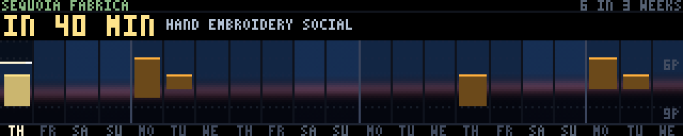

### tonight



The makerspace's own class and social calendar, drawn as the thing it actually
is: **a field of evenings, with the lights on in the ones that are booked.**
It answers the question somebody walking past the wall has about the programme,
which is not "what is the programme". It is **is something on, and is it soon.**

x is days, one cell per calendar day, today at the left edge. y is *time of
day*, over a narrow window — typically 17:00 to 22:00. The ground behind it is
the real sky: computed solar elevation for this latitude and this date, so the
top of the field is late-afternoon blue, the bottom is night, and a band of
dusk runs across it and climbs a couple of rows from left to right as the
season turns. An event is a lit rectangle at its true hour, its true length,
with a bright edge on the row where it starts. A busy week is a row of lit
windows. A quiet one is a dark building.

That is the one representation choice and everything else falls out of it. In
particular: **nothing about this panel is a list.** The shape of the next three
weeks — which nights, how long, how far apart — is the content, and it is a
shape a list cannot show.

**Three weeks, not one, and the data forced that.** This started as a
seven-day timeline, which is the obvious answer and is wrong here. The endpoint
returns fourteen upcoming events, and on the day this was written they ran from
the 13th of August to the 3rd of November — **eighty-three days**. One or two
evenings a week is what a volunteer-run makerspace actually schedules, so a
next-seven-days panel is empty five days in seven, and an empty panel is
indistinguishable from a broken one. Three weeks reliably holds three to five
events *and* holds them as three repeats of the same seven-day pattern, so the
weekly rhythm — these socials are Monday, Tuesday and Thursday evenings — reads
as a shape rather than having to be inferred. Monday boundaries get a brighter
rule than the other day boundaries, which is what makes the three repeats
visible. When even three weeks holds nothing the span grows a week at a time
until it reaches the next event, up to nine weeks, and the header says `2 IN 6
WEEKS` so the axis can never quietly change scale.

**The vertical window is measured off the record, not chosen.** Every start in
the feed is 18:00 or 19:00 and every end is 20:00 to 21:00, because these are
things people come to after work. So the field spends its 39 rows on the hours
that carry events, clamped so that a calendar of nothing but 7 pm socials
cannot collapse to a six-hour window with one block in the middle of it. At the
usual 17:00–22:00 a two-hour social is a fifteen-row block; on a flat 24-hour
axis it would be a five-row smear. A morning class appearing in the record
widens the window on its own and the two hour labels at the right-hand edge say
what it became. They sit at the right on purpose: that is the far future, the
least valuable columns on the panel, and it is where an event is least likely
to be drawn over them — a block always wins against its own axis.

**Today's cell is the one that is half spent.** Above the current time of day
its sky is darkened, and the boundary is a bright line with a pip travelling
along it. "The evening has not started" and "you have missed most of it" are
the same picture at two different times, and the gap between that line and the
next lit block *is* the wait. Outside the window — most of the working day —
the line clamps to an edge and goes plain grey, because a bright line pinned to
the top row would be claiming the present moment is five o'clock.

**Urgency is brightness, in one hue, with no legend.** Grey is finished, amber
is on the calendar, gold is starting within the hour, green is running now.
There is deliberately no colour per *kind* of event: that would need a legend
there is no room for, and worse, it would say that which social it is matters
more than whether it is tonight. The one state worth shouting — something
starting inside the hour — puts `IN 40 MIN` across the panel at double height,
pulsing, with its block pulsing in step so the words and the rectangle they are
about are visibly the same thing.

**The thing that had to be fixed twice was that brightness ramp.** The urgent
colour started as a near-white cream and the body of every block was drawn at a
single 42 % of its colour. 42 % of a cream is a warm grey, so the *most urgent*
block on the panel came out duller than the ordinary amber ones and read as an
event that had already finished — exactly backwards, and it looked completely
plausible. Two changes: the urgent colour moved back into the lamp's own hue
and got more saturated rather than whiter, and the body fraction became a
per-state number so "now" is nearly solid and "on the calendar" stays an
outline with a wash in it. `test-tonight.py` asserts the ordering in pixels
rather than trusting the constants.

**The timezone, which is the single most likely way to put every event on this
wall an hour late.** `sequoia.garden/api/calendar.json` stamps its starts like
`2026-08-13T19:00:00-08:00`. -08:00 is Pacific *Standard* Time; California in
August is on -07:00. Honour the offset and the whole panel slides one row down,
which looks exactly as reasonable as the right answer.

The feed settles the argument itself. "Member Applicant Orientation" recurs six
times between August and November and every listing is stamped 19:00. If the
*instant* were authoritative, that one recurring orientation would be at 8 pm
all summer and would silently move to 7 pm on the 3rd of November — two days
after the clocks change — for no reason anybody organised. If the *wall-clock
fields* are authoritative it is at 7 pm every time, which is what a recurring
evening event is. So the fetcher parses the local fields and throws the offset
away. Note that the two readings **agree** for anything in November: a fixed
-08:00 is correct once standard time starts, so the bug is invisible for four
months of the year and an hour wide for the other eight. The test asserts the
August and November cases together, because either one alone passes under both
readings.

**Titles are edited in the fetcher, and only the font work happens in the
demo.** "Upmending (upcycling + mending) Social" loses its parenthetical gloss
before it is ever stored — that gloss is for somebody reading a web page, and
on a wall read at three metres it is noise in front of the word that matters.
`&` becomes `/` (the same substitution `ftdata._muni_short` makes, so the tree
has one separator and not two), whitespace collapses, case folds up, and the
result is capped on a word boundary at 44 characters. That leaves the longest
real title at 28 characters, which is 111 of the panel's 320 columns at single
height — so the nearest event's name is printed **in full**, never abbreviated,
which was the thing this panel most wanted and least expected to get. What the
demo does is drop the characters its 3x5 font has no glyph for: no apostrophe,
no exclamation mark, so "Let's make BioYarn!" draws as `LETS MAKE BIOYARN`.

**A quiet week is a state, not an error.** An empty calendar draws the three
weeks of empty evenings with `NOTHING ON` and `THE CALENDAR IS CLEAR` across
them, which is a picture. Stale data prints `STALE 9H` beside the count in
amber and otherwise draws normally — a calendar fetched this morning is still
true tonight, and hiding it would be the dishonest move. No record at all
draws a card saying nobody has asked yet and what to run.

**Where the data comes from.** One product, `sequoia-calendar`, keyless and
2.7 kB on the wire, cached hourly with a six-hour TTL. Neither number is about
the data going off: the countdown on the wall is computed from the clock
against cached absolute timestamps, so "in 40 minutes" stays right to the
minute between fetches, and the TTL is really a dead-fetcher detector. Dropping
`url` and the rest of the trimming takes the record to about 1.3 kB. This is
the one panel on the wall with no privacy question to answer — the feed carries
a title, two times and an all-day flag, and nothing that names a person.

This is a wall-clock panel, like `muni`: `build()` takes the present moment
once from `time.time()` and every frame after that is a pure function of `t`.
`--now` pins it. `--pretend` moves the clock to a moment relative to a real
event so the urgent states can be reviewed on an afternoon when nothing is
happening; nothing but the clock is fabricated, every block and every sunset
under it is the true one, and the panel stamps SIM anyway.

It measures 0.026 ms mean and 0.036 ms p95 per frame on a desktop — one
full-frame copy and a handful of short writes, with no per-frame cost that
scales with the number of events, since all of the placement happens in
`build()`.

```console
$ python3 ftdata.py --once --only sequoia-calendar
$ python3 tonight.py --host 127.0.0.1
$ python3 tonight.py --pretend soon        # forty minutes to go
$ python3 tonight.py --pretend now         # it has started
$ python3 tonight.py --pretend quiet       # a month with nothing near
$ python3 tonight.py --span 42 --24h       # six weeks, 24 hour clock
$ FT_DATA_CACHE=/tmp/empty python3 tonight.py
$ python3 scripts/test-tonight.py --live
$ python3 scripts/test-tonight.py --at '2026-08-13 18:20' \
                                  --shot-live screenshots/tonight.png
```
