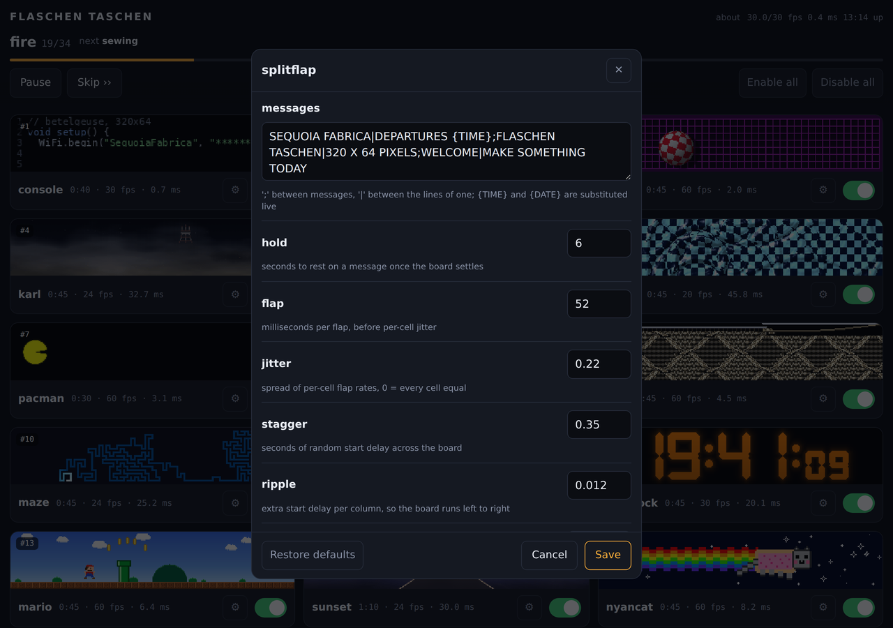
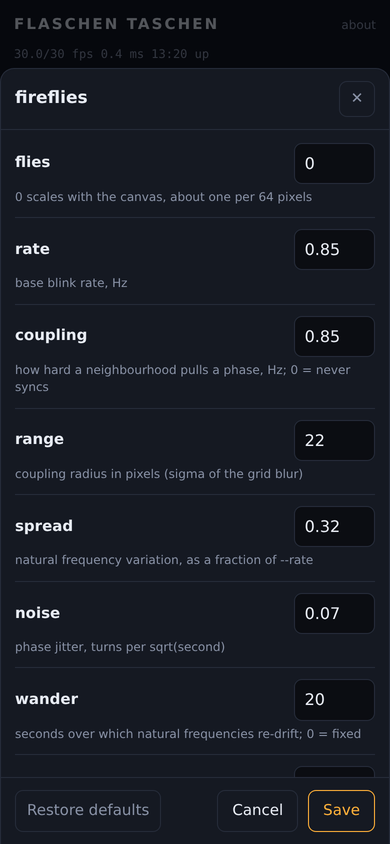

# Demos

Effects for a FlaschenTaschen display. The Python ones here are numpy demos
that push whole frames; the C++ ones live in [`src/`](src/) and are built with
`make`.

```console
$ python3 fire.py --host 127.0.0.1
$ python3 tunnel.py --texture checker --palette magma
$ python3 metaballs.py --balls 8 --palette toxic --contour 6
```

Every demo takes `--host`, `--port`, `--width`, `--height`, `--layer`,
`--band`, `--fps` and `--duration`; `--duration` auto-stops, so a launched
stream can never become a runaway flooder. `--help` lists the rest, and most
take `--palette`.

Requirements: numpy, plus Pillow for `scroller.py`, and the `flaschen` client
from [`../api/python`](../api/python) (`pip install ./api/python`, or just run
from a clone — the demos fall back to the checkout).

No display to hand? [`../tools/ft-emulator`](../tools/ft-emulator) is a server that
renders to a browser instead of hardware, which is how the screenshots below
were taken.

## megademo


Plays the effects back to back as one continuous show, with real transitions
instead of hard cuts, and a scrolling banner over the bottom. Both effects are
live during a transition and their frames are blended; the type is chosen per
boundary, because a sparse effect crossfaded under a busy one is invisible and
wants a fade through black instead.

Effects are built on a worker thread a couple of segments ahead. Building
everything up front means a slow black start and every table resident at once;
building at the transition stalls visibly, since `scroller` bakes for seconds.

```console
$ python3 megademo.py --playlist "fire:20,tunnel:15:wipe,water:12+drops=4"
$ python3 megademo.py --no-banner --segment 25 --transition 3
```

## ftsched


The installation's rotation, as a daemon rather than a shell script, with a
control panel you can open from a phone in the room.

```console
$ python3 ftsched.py --host 127.0.0.1 --listen 0.0.0.0:8081
```

The rotation used to be a `bash` loop launching `python3 demo.py --duration
45` per segment, which cost a fresh interpreter and a fresh `import numpy`
every 45 seconds — about 1.4 s of black wall each time on a Pi 3, so roughly
3% of the show was the rotation booting. It also made every segment change a
hard cut, because two effects cannot be alive at once across a process
boundary, and there was nothing to ask what was playing or to skip it.

`ftsched` keeps the modules imported, builds ahead on a worker thread the same
way `megademo` does, blends between segments, and serves a JSON API and the
page above. Three threads: render, build, http. The HTTP side only reads a
snapshot the render loop publishes once a second, and pushes commands onto a
queue drained at the top of the next frame, so a slow client cannot stall the
wall.

**Steering.** Tap a card to jump straight to it, the switch to drop an effect
from the rotation. A jump is implemented as the current segment ending early,
so it rides the ordinary transition rather than cutting. What is switched off
persists across restarts via `--state-file`; the running order itself does
not, since that belongs in the rotation file, where it gets reviewed.

**Settings.** The gear on a card opens an editor for that effect's own
options — the splitflap board's messages, the number of fireflies, which
palette `life` burns through.



Nothing in the panel knows what a firefly is. Every demo already declares its
options in `add_arguments()` with a type, a default, its choices and a line of
help, so [`ftsched_opts.py`](ftsched_opts.py) reads that description back off
the parser and `/api/schema` serves it; the page generates the form. Adding an
option to a demo puts a control in the editor and there is nothing to keep in
step — which is the only version of this that is still true in a year. It does
mean walking `ArgumentParser._actions`, which is private, but there is no
public introspection API and the alternative is parsing `--help`.

Two shapes need fixing up on the way through: a flag *pair* like scroller's
`--plasma` / `--no-plasma` is two actions writing one dest and collapses to
one switch, and an option taking more than one value is left out rather than
shown as a control that cannot round-trip it. Values are checked against the
schema at the API — an unknown option or a value outside the declared choices
comes back as a 400 with a sentence in it, rather than as a build that raises
forty-five seconds later and switches the effect off.

A change applies the next time that effect is *built*, since rebuilding
underneath the one on screen would drop the wall for as long as the build
takes. The exception is the effect on air, which is played again from the top
so the change actually shows: retyping the splitflap board while looking at it
has to do something, or the control reads as broken for the rest of the slot.
Note that the `ms` figure on the card was measured with the settings the
rotation shipped with — turn `--flies` up far enough and the pairing arithmetic
below is no longer describing what is on the wall.

Edits live in the `--state-file` alongside what is switched off, and for the
same reason: what somebody retyped from their phone in the shop has not been
through review, so it is kept apart from the rotation file and can only touch
entries that file already lists. Only what differs is stored, so a later edit
to the rotation is not silently overridden by a state file nobody remembers
writing, and *Restore defaults* means the settings the entry was installed
with rather than the demo's bare argparse defaults, which nobody chose. The
file is rewritten within the second rather than at shutdown — this machine
usually goes down by being unplugged.

**Frame rate is per segment**, as it was when each demo ran as its own
process: `boing` costs 3.5 ms and runs at 60, `water` costs 57.0 and runs at 12.
Holding the whole show to one rate would make the cheap effects choppier than
they are today for no gain. Each rate leaves roughly 40% headroom over the
measured cost. The demo is *built* at the rate it will be driven at, because
several of them scale motion per frame off `args.fps`.

**Cost.** Each card shows that effect's measured p95 on the Pi — CPU time per
frame, over the whole of that entry's own slot, with the options the entry
ships with, on numpy 2.0.2 and the ARM at the 600 MHz the under-voltage
throttle pins it to. Measure a demo with different settings and the figure no
longer describes it. These matter
in pairs, not singly: a transition renders *both* neighbours into one frame,
so a pair can cost more than either one's own rate allows — `floor` into
`printer` is 50.6 ms against the 50 ms frame the pair is held to. The
transition is therefore paced to what the pair actually costs and steps back
up afterwards; two seconds at a lower rate during a crossfade does not read,
whereas frames arriving late do. `pair_check()` reports the ones that get
paced down a long way, since that usually means the running order could be
better. Anything that cannot fit a frame even alone — meaning it does not fit
the 50 ms of a 20 fps frame, the slowest rate the show will blend at — is
marked `solo` and gets a cut on either side instead: `slime` at 123.7 ms,
`fireflies` at 69.3, and, since the numpy 2 measurements, `water` at 57.0.

**Building costs the current segment some frame rate.** The builder is a
thread, and Python threads share the GIL, so while an expensive `build()` runs
the effect on screen dips — `nyancat` measured 60.0/60 fps in steady state and
32/60 during the few seconds `printer` was building behind it. That is the
trade being made on purpose: the shell rotation this replaces went *entirely
black* for 1.4 s at every segment change, and a brief rate dip in the middle
of a 45 s slot is a much better failure than a stall at the transition. Moving
builds to a subprocess would remove it, at the cost of shipping the built
tables back across a pipe.

**Previews.** The clips in `previews/` are 16 frames at 8 fps, committed rather
than generated at runtime: baking three dozen of them costs every demo's
`build()` and would steal the CPU the render loop needs. Rebuild after
changing a demo:

```console
$ python3 scripts/make-previews.py --force knit sunset
```

A still cannot show what most of these are — `splitflap` is *entirely* motion,
and `slime` looks like noise until it moves. (Two are stills anyway:
`pacman-ghosts` does not move, and `daliclock` does not change within a two
second window.)

They are **animated WebP**, losslessly encoded, having been GIFs. GIF was
costing about a third more for pixels that were also worse: its compression is
weak enough that the palette had to be cut to 128 colours to keep the files
reasonable, which is real damage on a wall whose whole business is gradients.
Lossless WebP compresses a paletted image so much better that 256 colours in
WebP still come out smaller than 128 in GIF — measured over this rotation, 32%
smaller and strictly closer to what the demo rendered, with `fire`, `slime`,
`metaballs`, `nyancat` and `pacman` landing exact. Lossy WebP was measured too
and is the wrong tool: 320×64 of dithered noise and hard pixel edges is the
worst case for a DCT, and at a quality matching GIF's error it saved nothing.

**Segments** are `py` (a demoscene module, rendered in-process) or `exec` (an
external command that draws on the wall itself, for the C++ tools). The
scheduler stops sending for an `exec` slot and supervises the child, killing
it if it outruns its time. Transitions cannot cross a process boundary, so
those always cut.

```console
$ python3 ftsched.py --dump-rotation > rotation.json   # then edit, and:
$ python3 ftsched.py --rotation rotation.json
```

An `exec` entry names the layers it draws on (`clears`), which are blanked
when its slot ends — the C++ tools set a layer with a timeout of their own, so
a pacman would otherwise sit on top of the next effect for the rest of it. Our
own layer is blanked when the child starts, or the frozen last frame of the
outgoing effect shows through wherever the child's layer is black. `wait`
says whether the child exiting ends the slot: true for the ones that run for
their whole `-t`, false for `send-text`, which sets a layer and returns at
once.

[`rotation-betelgeuse.json`](rotation-betelgeuse.json) is the Sequoia Fabrica
installation's running order: 46 entries, 35 minutes, and **all of them
native**. The segments that predate the numpy demos were ported rather than
shelled out to — the pixel art into [`pixelart.py`](#pixelart), the C
binaries into [`life.py`](#life) and [`maze.py`](#maze), the `send-text` jokes
into [`console.py`](#console) — so every one of them now blends into its
neighbours, has a preview, and runs from a checkout on any machine instead of
from absolute paths on one Pi. `exec` remains as the escape hatch it was
built to be; nothing in this rotation needs it.

Site-specific text lives in that file rather than in `ftsched.py`: the marquee
and the split-flap messages. The running order itself is generated to satisfy
the pairing rule above and currently has **zero** transitions paced down; note
that a `solo` neighbour cuts, so the edges either side of `water`, `slime` and
`fireflies` are free and an expensive effect can sit there.

One caveat on reading that report: `pair_check()` drops the `solo` entries
before it walks the list, which pairs the two entries *either side* of a solo
one with each other. Those two never actually blend — `transition_for()`
returns a cut when either neighbour is solo — so a warning spanning a solo
entry is describing a transition that does not happen, and the free edges the
paragraph above relies on are invisible to it.

The order is genuinely load-bearing, and it is easy to break by accident:
removing one cheap segment leaves the two expensive ones that were either side
of it adjacent, which is how dropping `full-moon` put `goldengate` next to
`fire` and paced that transition down to 21 fps from 30. The floor is now set
by `printer`, which at 37.9 ms is the most expensive thing still blending, so
its two edges run at 75% however the rest is arranged; the order is chosen to
bring everything else up to at least that. `water` used to hold that job and
has since gone `solo`, which is why the tightest pairs moved.

An entry's `module` may differ from its `name` — the six pixel-art segments
are one module with six sets of options — and previews are keyed by name.

The API is a handful of verbs — `jump`, `toggle`, `next`, `pause`/`resume`,
`restart`, `configure` — POSTed as JSON to `/api/command`, with `/api/state`
returning everything the page renders and `/api/schema` what each demo can be
told to do:

```console
$ curl -s localhost:8081/api/state | jq '.now, .health'
$ curl -sX POST localhost:8081/api/command -d '{"op":"jump","index":12}'
$ curl -s localhost:8081/api/schema | jq '.modules.fireflies[].label'
$ curl -sX POST localhost:8081/api/command -d \
    '{"op":"configure","name":"splitflap","options":{"colour":"amber"}}'
```

`configure` carries the whole set of options for that entry rather than a
patch, so an editor that has been open a while cannot half-apply against a
rotation that has moved under it; `"options": null` puts the entry back to
what the rotation file says.

There is no authentication: it is a wall in a makerspace, and the worst anyone
on the shop wifi can do is change what is on it. Bind it to the LAN or to a
Tailscale address, not to the internet.

Deployment is [`ftsched.service`](ftsched.service), which `Conflicts=` with
the old `ft_demos.service` so the two can never both drive layer 0.




On a phone the editor is a sheet up from the bottom, where a thumb is, rather
than a dialog floating in the middle of the screen. It is a `<dialog>`, so the
backdrop, the focus trap, Esc and making everything behind it inert come from
the browser instead of from three hundred lines here.

## The front door


`ftsched` serves its panel on 8081, which is fine for a checkout and wrong for
an installation: a port number is something you have to be *told*, and someone
standing in front of the wall with a phone types the hostname and nothing else.
So **nginx** owns the root — see
[`deploy/nginx-betelgeuse.conf`](../deploy/nginx-betelgeuse.conf). It proxies
`ftsched` at `/`, routes `/api/display` to [`ftctl`](#ftctl), serves the
previews off disk, and keeps one page of its own at `/about` covering what the
wall is and how to push your own pixels at it, which the panel has no business
explaining.

Everything therefore lives in **one origin on one port**. That is not only
tidier: it is what lets the panel be served over TLS at all without the page
having to know which of its links need a different scheme and port, and it
means the same URLs work on the shop wifi and over the tailnet. An earlier
version of this fronted the two separately and had to rewrite links based on
`X-Forwarded-Proto`; proxying deleted that problem rather than solving it.

```console
$ tailscale serve --bg --https=443 http://127.0.0.1:80
```

One line, because there is nothing left that needs a second rule. `tailscale
serve` terminates TLS with a real `ts.net` certificate, renews it, and exposes
it to the tailnet only — three things this would otherwise have to get right by
itself.

This used to be `ftindex.py`, a Python front door of our own, and the reasons it
existed are worth keeping even though it is gone:

- **A separate process from `ftsched`.** The scheduler drives the wall on a
  frame deadline; the front door is the thing most likely to be hit by a room
  full of curious people, and it must be restartable without touching the
  render loop.
- **Previews served from disk, not proxied.** They are the overwhelming
  majority of the bytes — a cold page load is three dozen files and a couple of
  megabytes, against a 5 kB poll once a second — and putting that burst through
  `ftsched` would run it through the GIL the render loop is waiting on.
- **A page rather than a connection refused** when the scheduler is down. The
  `error_page` rule keeps the original 502 rather than turning bad news into a
  200.

nginx satisfies all three and is better at the static bytes that dominate the
traffic, which is the whole argument for the swap: the GIL problem that
justified a hand-written proxy stops being a problem when the process is not
Python. `ftindex.py`'s own flags gave the game away — `--ft-port`, `--width`
and `--height` only ever templated the about page; it never talked to the wall.

`/about` keeps working the same way, with its two live parts — the hostname and
the now-playing line — filled in by the browser instead of server-side.

`ftsched` listens on `127.0.0.1:8081` and `ftctl` on `127.0.0.1:8082`, so the
front door is the only way in and neither is also answering on a port nobody
was told about. That does mean there is no second way to drive the wall if nginx
is the broken thing; the fallback is an ssh tunnel, which is a fair trade for
not having more unauthenticated listeners on the shop wifi.

```console
$ ssh -N -L 8081:127.0.0.1:8081 pi@betelgeuse
```

## The effects

### fire


Doom-style fire: a row of burning fuel along the bottom, and every frame each
cell takes the heat of the cell below it, shifted sideways at random and
cooled a little. The randomness is what turns a smooth gradient into flames.
Done as one vectorized step over the whole buffer.

```console
$ python3 fire.py --palette ice --wind -0.4 --cool 4
```

### tunnel


For every pixel, the angle around the centre and a depth that grows as you
approach it, used as texture coordinates. Scrolling the depth flies you
forward; scrolling the angle rolls the tunnel. Both depend only on the pixel,
so they are computed once and each frame is two integer adds, a mask and a
gather.

```console
$ python3 tunnel.py --texture rings --speed 120 --roll -0.3
```

### starfield


Stars drift towards the camera and are divided by their depth, so one crawls
while it is far away and then sweeps past. Each is drawn several times along
the distance it covered during the frame, which is what makes the streaks.

```console
$ python3 starfield.py --stars 800 --speed 1.6 --warp 6 --tint ice
```

### metaballs


Each ball contributes a field that falls off with distance; the fields are
summed and coloured through a palette. Because the sum is smooth, two balls
approaching each other bulge and merge into one shape rather than overlapping
— which is the point, and something you cannot get by drawing circles.

```console
$ python3 metaballs.py --balls 8 --palette toxic --contour 6
```

### rotozoom


Rotate and scale a tiled texture by working backwards: for each pixel on
screen, apply the inverse transform to find where it lands in the texture.
Every pixel then gets exactly one sample with no gaps to fill, which is why
the effect was cheap enough for hardware that could not multiply quickly.

```console
$ python3 rotozoom.py --texture xor --spin 0.35 --zoom-min 0.4
```

### laser


A laser cutter working through a job: a searing head tracing a vector path,
the kerf cooling behind it, and the piece dropping out when the outline
closes.

One scalar heat field carries all of it — the head writes 1.0 along the arc it
covered this frame, the field decays, and a black→red→orange→white ramp turns
it into kerf, trail and head bloom together. Cooling is a half-life in
*seconds* rather than a per-frame factor, so the trail is the same length in
wall time whether the demo runs at 8 fps or 30.

Paths are generated — gears, finger-jointed panels, filigree, slot lettering —
cut holes first, outline last, with dark rapid moves between contours and the
head stepping in arc length so corners do not speed up.

Heat alone cannot tell what belongs to the part, since lettering cut ten
seconds ago has already decayed out of the ramp, so a per-job cut mask relights
the whole piece for the second it takes to fall.

```console
$ python3 laser.py --cool 2.0 --shapes gear,filigree
```

### printer


A 3D printer seen side-on: gantry climbing a row per layer, nozzle glowing,
part rising with visible infill — and sometimes failing into spaghetti.

Silhouettes are functions of normalised coordinates rather than sprites, so
they rasterise to whatever height the panel gives. Each layer is classified
into perimeter, skin and infill, and only the infill stencil is drawn, which is
why the cross-section is a lattice rather than a filled outline.

Failure is two independent draws per print — whether, and then independently
where, anywhere from 8% to 94% of the way up. Over 148 prints that gave 29.7%
failures spread evenly across the height; an early failure leaves nothing but
nest, a late one leaves a near-complete part with strands draped over it.

The spaghetti took three attempts. The coil phase has to come off one clock
shared by the whole strand: sampled per point it is confetti, and tied to
emission rate it is a smooth rope. Only the shared clock gives loose curling
filament.

```console
$ python3 printer.py --fail-rate 0.15 --speed 1.4
```

### lathe


A woodturning lathe: a blank spinning between centres, a gouge walking the
length of it on the tool rest, shavings arcing off the cut, and a turned shape
appearing pass by pass.

A lathe bed is the rare subject that genuinely *is* this shape — headstock at
one end, tailstock at the other, and a long thin thing spanning the gap — so a
5:1 panel is not a constraint to design around here but the natural framing.
The work fills nearly the whole width and there is still room under it for the
rest and the tool.

Everything comes out of one array: **a radius per column** along the axis. The
silhouette is that profile mirrored about the axis, so drawing the blank is a
column fill. Cutting is the gouge writing a shallower radius into the columns
it crossed this frame. Shading is `sqrt(1 - (dy/r)^2)`, the actual cylinder
normal, which buys the round form for a lookup. Nothing is a sprite, and no
part of the drawing knows what shape is being turned — change the control
points and the silhouette, the cut and the shading all follow.

The growth rings are the reason to build it this way rather than as a
silhouette plus a texture. Rings live in the log's cross section, indexed by
distance from the pith, and every visible point on a solid of revolution at
column x sits at exactly radius `r[x]` from the axis — so the ring texture is a
**1-D lookup on the radius**, and taking radius off *reveals inner rings*.
Bands crowd where the profile falls away steeply and spread out along a taper,
which is what real turned work does, and they move as the cut deepens. Getting
that for free is the payoff for the representation; a texture painted onto the
silhouette would have had to be animated by hand and would still have been
wrong.

Spin is sold three ways, none of them a blur. The pith is a little off the
axis, so the ring radius is `r - e·cos(α - β)` with α the material angle at
that pixel — which expands onto `s` and `c`, the two shading terms already in
hand, and needs no per-pixel trigonometry at all. That makes the bands breathe
once a revolution. The specular band sits at a fixed angle and stays put while
the surface moves under it, which is what a highlight on a spinning cylinder
does. And the headstock pulley turns on the same phase, so there is one
unambiguous rotating object on screen.

Roughing creeps up on the shape over several passes, alternating direction the
way a turner does, each pass aimed at an interpolated version of the target and
leaving a little chatter; the finish pass lands on the target exactly and a
sanding pass takes the ripple out and raises a sheen. Then the lathe spins
down, the work lifts off — as a snapshot of the last frame, rising and fading,
so the fresh blank is already turning underneath and the machine is never
empty — and it starts again. That whole arc is about forty-two seconds.

Cost is a tight window of rows around the axis, deliberately not padded for the
once-a-cycle lift: within it a frame is one divide, four gathers and a blend
over roughly nine thousand pixels. The ring table, the shading and specular
ramps against position across the cylinder, the wood palettes and the whole
static shop — bed, headstock, tailstock, tool rest — are all baked in `build()`.
Rates are per second rather than per frame (feed in px/s, the fresh-cut glow as
a half-life in seconds), so it looks the same at 8 fps and at 30.

```console
$ python3 lathe.py --profile baluster --species walnut --feed 24
$ python3 lathe.py --profile beads --passes 6 --no-chips
```

### knit


An Aran cable sweater worked stitch by stitch. A knitting chart is already a
pixel grid — colourwork and cable charts are low-resolution raster art — so
stitches are 5x5 sprites blitted from source data, never drawn as curves.

What sells it is that the work is visibly *happening*: the row advances a
stitch at a time with jitter and hesitations, needles meet at the live stitch
with loops hanging from them, and rows alternate direction the way hand
knitting actually does. Cable crossings animate as the cable-needle move — the
front pair lifts clear leaving a shadowed hole, the other pair slides through,
the held pair drops into the vacated columns.

The chart is generated: counting cable ropes to the left of a stitch identifies
its rhombus, and the parity of that count is a checkerboard over the lattice,
which is what alternates seed-filled diamonds with reverse stockinette.

```console
$ python3 knit.py --diamond 14 --stitch-rate 9
```

### wheel


A bicycle drivetrain: three-cross laced wheel, chainring and cranks, chain
tracking both sprockets. Gear ratio is derived rather than tuned — both
sprockets share a chain pitch, so pitch radii follow from tooth counts and the
ratio falls out.

All spokes of a flange are tangent to one circle about the hub, so the tangent
angle for a pixel at `(r, a)` is `a ∓ arccos(d/r)`. That is baked once; a frame
reduces it modulo the spoke spacing, with no loop over spokes.

The moiré is the point, not an artifact. Thin spokes crossing a discrete pixel
grid genuinely strobe, and `--sweep` walks the rotation rate through the speeds
where the pattern stalls, crawls and reverses. The rim reflector cannot alias,
so it keeps sweeping while the spokes stand still — which is what makes the
illusion read as an illusion rather than a paused demo.

```console
$ python3 wheel.py --speed 5.0 --sweep 0 --spokes 32
```

### sunset


Driving west into a San Francisco sunset: sliced sun low over the Pacific,
glitter on the water, road running to the vanishing point, Sutro Tower on a
headland, Karl rolling in.

The sun is sliced with horizontal gaps that widen downward — the retro
treatment, and also the right call for a panel that bands in the dark end,
since deliberate horizontal structure reads as intentional where accidental
contouring does not.

Two things that only showed up by looking: distance haze on a gentle ramp
smeared the sky's reflection over the whole plane and the ocean read as wet
tarmac, fixed by confining it to a hard band a few rows deep at the horizon;
and a depth-scrolled water texture cannot win at this size — tight enough for
foreground crests, it aliases to hash across the mid field — so the swell is
one sine of each row's depth instead.

```console
$ python3 sunset.py --sun 0.8 --fog 0.4 --no-tower
```

### grove


Drifting through a sequoia grove: trunks running off the top of the frame,
warm shafts angling between them, fog in the gaps. You see a slice, not whole
trees, which is what standing in a grove actually looks like.

Bark is sampled at `arcsin(x/half)` — the true angle around the cylinder — so
fibres crowd toward the silhouette and the trunk reads as round rather than as
a flat bar. Depths are spaced geometrically, because linear spacing puts
everything in the middle distance where the parallax rates are indistinguishable.

Shafts carry a depth too, so occlusion is free: a nearer trunk blitted
afterwards interrupts the beam, and that interruption is what makes the light
feel three-dimensional. Nothing is blurred at run time — softness is baked into
the sprites.

```console
$ python3 grove.py --speed 6 --shafts 3 --fog 1.4
```

### goldengate


The bridge standing out of the fog. Geometry comes from the real thing in feet
— 4200 ft main span, 526 ft of tower over a 220 ft deck — at one pixels-per-foot
scale that happens to serve both axes of a 320x64 panel.

The detail that stops it reading as a generic suspension bridge is that the
main cable's vertex sits *on* the deck at midspan. Stepped Art Deco setbacks,
portal braces whose openings shorten going up, and single-pixel suspenders
every 6 px do the rest.

Fog is two tileable noise tiles scrolled across each other, windowed by a
rolling edge and a travelling bank envelope, with density tied to bank height
so a high bank is a thick one. The level clamps at both ends rather than
wandering mid-range — otherwise you get permanent haze instead of weather, and
never the frame where only the tower tops show.

```console
$ python3 goldengate.py --time-of-day 6 --day-cycle 0 --fog 0.8
```

### karl


Karl the Fog over the Twin Peaks ridgeline, swallowing Sutro Tower and letting
it go again. The calmest thing here — a full cycle from clear to buried takes
minutes.

Two noise textures scrolled at different rates and weighted differently by row,
with the detail layer's sample position displaced by the coarse layer. That
domain warping is what makes it curl rather than slide, and it costs a gather
rather than a simulation.

Density comes off the clock as three sines at incommensurate periods, saturated
at the ends so it *dwells* buried and then dwells clear instead of passing
through both.

Worth knowing if you touch the compositing: on this hardware, broadcasting an
`(H,W,1)` against an `(H,W,3)` is about four times slower than doing the same
arithmetic three times on contiguous planes.

```console
$ python3 karl.py --density 1.3 --speed 0.6 --no-tower
```

### slime


A Physarum transport network. Sixteen thousand agents each sense the trail
ahead of them at three angles, turn toward the strongest, move, and deposit;
the trail map is blurred and decayed each step. Nothing draws the network — the
filaments, junctions and loops are what those rules settle into.

Three departures from the textbook rule, each fixing a specific failure:

*Capping* the trail map stops it being winner-take-all. Uncapped, the busiest
strand reads brightest, out-attracts its neighbours, and within a minute two
fat strands hold the entire population.

*Food* — weak, slowly drifting attractant sources — is the one that matters
most. Even capped and well tuned, the network **relaxes**: strands merge, bends
straighten, and after a few minutes all that is left is motionless vertical
lines, which are the shortest closed paths a wrapping 64-row canvas admits. No
decay value fixes that; it is the end state of the tuning rather than a failure
of it. Foraging forces junctions that relaxation cannot remove, and moving
sources keep it re-solving.

*Spore batches* nucleate new colonies that grow and fuse while starved branches
prune. They have to be a batch in one place and facing outward — scattered
agents just join the nearest strand, and random headings give a trapped orbit
that shows as permanent confetti.

`--deposit` is expressed as the resulting equilibrium mean trail value, with
the per-agent amount derived from it, so changing agent count or decay does not
move the brightness — only the sharpness of pruning. Decay 0.94 is about
sixteen steps of memory; 0.98 floods to a uniform lit field in twenty seconds
and 0.85 never organises at all.

The trail is seeded with blurred noise and given a few hundred warmup steps
inside `build()`, so frame zero is already a network rather than something you
wait for.

```console
$ python3 slime.py --agents 24000 --sensor-dist 5 --palette ice
```

### fireflies


A field of oscillators that spontaneously synchronise. Each firefly has its own
natural rate and flashes when its phase wraps; coupling pulls it toward its
neighbours, and out of that come waves of synchrony that sweep across the panel
and collide.

Coupling is deliberately **local**, not mean-field. Mean-field is cheaper, but
the whole field then snaps into unison at once, which is far duller to watch —
local coupling is what produces travelling waves, and a 5:1 panel is the right
shape to see them cross. Each phase is splatted as a unit vector into a coarse
grid, the grid is blurred, and the result sampled back at each position: O(N)
plus a small blur, with the blur radius acting as the coupling range.
Normalising by the blurred *count* makes the pull depend on how much a
neighbourhood agrees rather than how crowded it is, so a synchronised patch
recruits its border.

Two things keep it from going static, which is the real design problem — a
fully locked field is as boring as a scattered one. The frequency spread is
wide enough that full lock is unreachable, and the natural frequencies
themselves drift, so there is no fixed consensus to converge on: leaders change
and every truce eventually breaks. Measured over five minutes the global order
parameter roams 0.08 to 0.84 indefinitely, reaching 0.8 within twenty seconds
from a cold start, so a short slot still shows the arc. With `--coupling 0` it
sits at 0.05 and never organises, which is the control worth keeping in mind.

```console
$ python3 fireflies.py --coupling 2.5 --range 40 --no-grass
```

### mario


A self-playing side-scrolling platformer: a little plumber runs right through
an endlessly generated level, jumping pipes and gaps, collecting coins and
stomping the odd goomba, over three layers of parallax.

The background is a sequoia grove rather than the round two-lobed bushes the
genre expects — cinnamon trunks bare for two thirds of their height, the
nearest of them running off the top of the panel. They are the only scenery at
the character's own scale, so they are what the scene reads as; the level in
front of them stays eight-bit. Trees are stamped into one wide strip at two
depths, the far ones shorter and blended toward the sky, and the strip is
scrolled by slicing, so the whole grove costs one wrapped blit a frame.

Uses 8 px tiles with a two-tile character rather than classic 16 px ones. At
16 the panel is four tiles: ground plus character leaves under a tile of
headroom and there is no jump arc at all. At 8 it is eight tiles — one ground,
two character, five of air — which is what makes a three-tile pipe clearable.
`--scale 2` gives real 16 px tiles and demonstrates the problem: no pipe
height passes the clearance test, so the generator emits only gaps.

The level generator is bounded by the physics rather than tuned by hand.
`build()` derives the airtime and horizontal reach of a jump, then admits an
obstacle only if the actual trajectory clears it at *both* edges of its span —
the apex is over the middle, so the edges are the tight part — and leaves more
than one jump's reach of flat ground between obstacles. That is what stops it
ever generating something unclearable, which on an unattended wall would strand
the character hours later.

```console
$ python3 mario.py --density 0.6 --speed 70 --run-fps 14
```

### nyancat


The pop-tart cat, trailing a rainbow through twinkling stars. The sprite lives
in the source as rows of characters with a palette per character, so it can be
edited in a diff rather than shipped as an image; moving parts (four tail
poses, the paws) are separate grids composed into the six loop frames at
startup and scaled with `np.repeat`.

The sprite animates on its own clock (`--cat-fps`, default 10) rather than the
display rate — the original is much slower than a display refresh, and tying
the two together makes it look wrong at any frame rate but one. The trail is
baked a whole square-wave period wider than the panel, so scrolling it is a
slice at an offset.

A 320x64 panel is close to the ideal shape for this: the cat sits right of
centre and the rainbow reaches the far edge.

```console
$ python3 nyancat.py --cat-x 0.4 --speed 40 --no-stars
```

### floor


A Mode-7 perspective plane: gradient sky with a sun, a horizon, and textured
ground receding to it, with forward motion and a slow steer. Each screen row
below the horizon is at a constant distance, so per-row depth, texture step,
mip level and fog are all precomputed and a frame costs an add, a truncate and
one gather. An anisotropic mip chain kills the fish-scale moire that otherwise
covers the mid field, since a row near the horizon spans hundreds of texels of
depth while stepping a fraction of one across.

```console
$ python3 floor.py --texture road --palette magma --speed 90
```

### cycle


Colour-cycled plasma. The image is computed exactly once and the animation is
entirely the palette rotating under it — the classic technique, and about ten
times cheaper per frame than anything else here at 0.05 ms. The palette must
be *cyclic* or every wrap shows as a seam sweeping across the panel, so the
non-cyclic ramps are mirrored to close the loop.

```console
$ python3 cycle.py --pattern spiral --palette rainbow --bands 3
```

### water


A damped wave equation with drops falling on it, rendered by refraction rather
than by colouring height: the local slope offsets a lookup into a background,
so the surface bends what is beneath it. Uses a nine-point isotropic Laplacian
— the usual four-neighbour stencil makes ripples spread as diamonds and sits
right on the stability limit. Boundaries are fixed rather than wrapping, so
ripples reflect instead of reappearing on the far edge.

```console
$ python3 water.py --background grid --drops 5 --refract 34
```

### fireworks


Shells launch, arc up and burst into sparks that fall and fade. One fixed-size
particle pool in flat arrays, updated with whole-array operations and recycled
through dead slots, so every frame costs the same. Trails come from a decay
buffer. Spark speed is the load-bearing parameter: below about a pixel per
frame the sparks creep and the decay buffer paints a solid disc instead of
rays, so speed and drag have to be raised together.

```console
$ python3 fireworks.py --rate 3 --types willow,crackle --palette ice
```

### boing


The Amiga Boing Ball: a red and white checkered sphere spinning about a tilted
axis, bouncing in a purple wireframe room. The silhouette and the surface
coordinates of every pixel are precomputed once, so a frame is an add, an xor
and a masked blit. Checker counts derive from the radius and are forced even,
so the equator lands on a cell boundary and the pattern stays consistent
across the longitude wrap.

```console
$ python3 boing.py --radius 24 --segments 16 --bands 8
```

### daliclock


A clock whose digits melt into each other. Seven-segment glyphs are generated
rather than loaded from a font, and the morph interpolates their signed
distance fields and re-thresholds — so the outline moves and you get one solid
deforming figure, where a crossfade would give two superimposed glyphs at half
brightness. Time is read from the system clock inside the frame callback, so
the melt stays locked to the second rather than drifting with frame rate.

```console
$ python3 daliclock.py --12h --palette green --morph 0.6
```

### splitflap


A split-flap departures board. Changing a letter riffles through *every*
intervening card in a fixed stack order, so blank→Z takes 26 flips and blank→B
takes two — that staggering, plus per-cell rate jitter and start delay, is what
makes the board ripple instead of switching in unison.

The flip is a real mechanism, not a crossfade: the outgoing glyph's top half
squashes toward the seam while the incoming glyph's top arrives above it, so
mid-flip a cell legitimately shows two different characters with a hard dark
seam between them. Past ninety degrees you see the card's back, which is the
incoming bottom half unfolding downward. Foreshortening is a nearest-neighbour
row resample rather than a blur, which at 64 rows would turn to mush.

Every squashed step of every card is baked at startup, so a frame is a handful
of small blits and settled cells are never touched — it is the cheapest demo
here by a wide margin. Glyphs are a 5x7 bitmap font in the source, no font file.

`{TIME}` and `{DATE}` are substituted live, so it can be a clock as well as a
sign.

```console
$ python3 splitflap.py --messages "SEQUOIA FABRICA|OPEN HOUSE {TIME};MAKE THINGS|ASK ANYONE" --hold 12
```

### pixelart


The sprite sheets in [`pixelart/`](pixelart) — a sequoia, space invaders,
pacman and his ghosts, an eight-frame sewing machine — which have been on the
Sequoia Fabrica wall for years, played until now by an external C binary
reading JSON files of hex strings.

Sprites are either joined side by side into one strip and moved as a unit
(four invaders in a row, seven sequoias marching past) or played in place as
frames of an animation (the sewing machine, pacman's chomp), and placed
centred, bouncing or scrolling. `--art` takes ranges, so `sew1..8` and
`sf-tree*7` mean what they look like.

`--poses` is both at once: it names alternative sheets of the same slots, so a
strip can hold four different sprites and still animate, all of them changing
pose together. That is how an arcade cabinet did it, and it is the difference
between a row of invaders and a printed banner of invaders. The second pose is
baked from the first by
[`scripts/make-invader-poses.py`](scripts/make-invader-poses.py), which moves
the limbs rather than redrawing them — the bodies stay byte-identical, so
nothing in the outline flickers when the pose changes.

A scroll needs `--travel` pointed whichever way the artwork faces, or pacman
chomps his way backwards across the wall.

Half the set is greyscale line art and half is full colour, so `--render auto`
checks for chroma: the ghosts are drawn as they are, and the tree and the
invaders are painted from a palette. The palette is laid **across** the strip
rather than mapped from brightness — brightness to hue turns every antialiased
edge into a different colour and the shape into confetti, which is exactly what
the first attempt at this looked like.

```console
$ python3 pixelart.py --art sf-tree --mode center
$ python3 pixelart.py --art pacman-32x32-1..6 --sequence-ms 50 \
      --mode scroll --travel right
$ python3 pixelart.py --art space-invaders-1..4 --poses ,b --sequence-ms 500 \
      --mode bounce
```

### life


Conway, one cell per pixel, which at 320x64 is 20,480 cells — enough for
gliders to travel and for still lifes to settle out all over the board.

The rule is four lines of numpy. Everything else is about making a black and
white automaton worth looking at on an LED wall: cells are coloured by how
long they have been alive, so a fresh birth is bright and a block that has sat
there a minute has faded to an ember, and dead cells leave a decaying trail so
a glider draws its own wake. Life always dies down, so when the population
stops changing — allowing for period-2 oscillators, which change forever
without going anywhere — a fresh patch is seeded somewhere and the board gets
reinvaded rather than reset.

Neighbour counting is eight slices of one padded scratch board. `np.roll`
would build sixteen full-size temporaries per generation, which on a Pi is
most of the cost of the rule.

### maze


A maze carved, flooded and solved, on a loop. The old C version drew a
finished maze and left it there, but a finished maze is a texture; the making
of it is the part worth watching. A depth-first walk knocks down walls with
the head glowing at the frontier, visibly backtracking when it paints itself
into a corner; then a breadth-first flood pours down every dead end at once;
then the route lights up end to end and holds.

The carve order and the route are baked into grids rather than kept as lists,
so each frame is one comparison against a rising playhead instead of a Python
loop over a few thousand cells.

### console


Code typing itself out, with a cursor and syntax colouring — the three Arduino
one-liners that used to appear as static text for five seconds each.

The typing is deliberately uneven: a constant interval reads as a machine
printing, while a little jitter and a longer beat after a semicolon reads as
someone at a keyboard. Every character's arrival time is worked out up front,
which is what lets `render()` stay a pure function of `t` — the demo can be
started at any moment, seeked, or run at any frame rate and look the same. The
cursor blinks only while idle; blinking through the typing looks like a fault.

Lines are just an argument, so this is the one demo anyone in the space can
add to without touching code.

### scroller


Rainbow glow text bouncing over a plasma field. The plasma is baked as a
seamless loop and replayed, and the text, its tint and its glow are baked once
into one wide strip, so each frame is a couple of slices. The bounce is
applied in *screen* space, not text space — a text-space wave travels with the
letters and just slides rigidly.

Expect a few seconds of black at startup while it bakes; `--plasma-frames`
trades loop length for startup time.

```console
$ python3 scroller.py --text "GREETZ  " --amp 16 --no-plasma
```

### headroom


Max Headroom: a plasticky head in dark glasses stuttering in front of a
backdrop of neon stripes that rotates and recedes. The stutter is the
character, not a defect — holds, one-frame repeats, jumps back to an earlier
pose and the occasional freeze, all of them the artefacts of video that keeps
skipping, with a horizontal tear and an RGB split arriving on the glitch frames.

The room is one `np.take` from a table that packs the angle around the
vanishing point, 1/radius, the radial fade and the row parity into a single
index, so a frame is one gather rather than four trig evaluations over 20480
pixels. What that buys is also what it costs: the vanishing point cannot wander
continuously, because moving it means re-deriving `atan2` and `1/r` every
frame, so it cuts between three baked positions instead. On this material the
cuts read as deliberate camera jumps.

The head is a union of eight ellipsoids solved in closed form — the ray-ellipsoid
quadratic has an analytic nearest root, so there is no marching — baked into 20
yaw poses over about 100°, then blitted. Three of its features are painted as
bands in head space rather than built as geometry: the glasses, the hairline,
and the lit crest of the hair. That last one is what stops the hair reading as a
polished gold helmet — a single material shades smoothly however it is lit,
whereas splitting it into a lit front and an unlit swept-back mass gives the
silhouette a direction at 64 rows.

Getting it to read as plastic rather than as a mannequin took a pale, nearly
unpigmented base with the room's magenta arriving through the fill and a hard
specular carrying the surface; an earlier pass with the colour in the base
instead came out as meat.

The caption says MAX TAILSPACE, which is what a head and a room become when you
take the opposite of both halves — the sort of joke the character would have
made about himself, and it keeps the wall from claiming to be someone it is
not. `--say` takes anything; the stutter is derived from whatever it is given.

```console
$ python3 headroom.py --room acid --spin -1.5 --glitch 1
$ python3 headroom.py --say "" --side left --no-scanlines
$ python3 headroom.py --say BLIPVERT --room ice
```

### wopr


WOPR from *WarGames*: the lamp banks thinking on the left, the Falken exchange
printing itself out on the right. Two things made the 1983 prop memorable and
neither is a graphic — the monolith's rows of amber lamps blinking against each
other with a sweep occasionally crossing a bank, and chunky phosphor capitals
arriving one at a time.

The two speakers differ by colour *and* by rhythm, which is what lets you tell
who is talking from across the room without reading a word. WOPR prints
steadily with a few percent of jitter, because it is a computer; the human's
replies are paler, sit behind a `>` prompt, run at about half the speed, and
carry real hesitation — a wide spread per keystroke and an occasional quarter
second of nothing at a word boundary. A constant interval never reads as a
person.

The lamps are 112 numbers, not 4600 pixels: each gets a baked rate, phase and
duty, so its brightness is `((t*rate + phase) % 1) < duty`, and painting the
bank is a single gather through an index map with the glow already folded into
a weight map. The chase is a gaussian in lamp-column space, one per bank, with
incommensurate speeds so the banks never line up. Two things that did *not*
work: dimming the gaps between lamp rows for the grille, since those are
already black, and letting the chase push brightness past 1.0 — the store into
uint8 is unsafe, so a lamp at 1.2 wrapped round to dark green confetti.

The script is an argument, so anyone can retype it: `;` between lines, a
leading `>` for the human. The whole exchange lands in about 35 s and then
holds, so it finishes on FINE rather than being cut off mid-sentence.

```console
$ python3 wopr.py --layout lights --colour green
$ python3 wopr.py --script 'SHALL WE PLAY A GAME?;>LOVE TO.' --cps 14
```

### defcon


The big board from the same film, playing out an exchange: coastline in thin
glowing vector, missile tracks arcing over it, warheads blooming as expanding
rings, and a DEFCON readout stepping down while it all goes wrong. 320x64 is a
letterbox, and a letterbox is what a wall map wants to be.

**The map is real geography baked into the file** — Natural Earth 1:110m
coastline, public domain, simplified offline with Douglas-Peucker and encoded
as 81 polylines and 897 points in about 2 kB of source. Nothing is read at
runtime and nothing needs the network, which matters on a Pi that boots into
the rotation with no guarantee that anything else is reachable.

The projection is forced by the panel rather than chosen: 320 square pixels
across 360° of longitude is 1.125° a pixel, so 64 rows buy exactly 72° of
latitude. Taking that as 8°N–80°N turns out to be a gift rather than a
compromise, because that band *is* where the film's war happens — North
America, the Atlantic, Europe, Russia, China, Japan.

The map never moves, so it is rasterised once at 2x and box-filtered down; that
supersample is the whole reason the coast reads as a line rather than as a rash
of lit pixels, since a 1x Bresenham line on a 320-wide panel is either dashes
or, thickened, a blob. Per frame the demo composites into one float32
accumulator and maps it through a palette — about five whole-array passes and
no allocation. Each trajectory's pixel path is baked as a flat index array, so
a live track is six numpy calls over fifty-odd elements, and the spent tracks
that accumulate into the finale are drawn in eight pre-concatenated groups
rather than as ninety separate scatters.

It opens with tracks already in the air, because an effect that starts empty
spends its first seconds looking broken. From there the interval between
launches shrinks geometrically over the whole 80 s cycle — about one launch
every five seconds at the start, six to eight a second by the end — and flight
times shorten on the same curve, which compounds. DEFCON is derived from that
schedule rather than run off its own clock: the level drops as cumulative
launches cross fixed fractions of the total, so the countdown is a consequence
of the exchange instead of a caption over it.

Then it ends the way the film does. The impacts pile into a rising glare —
baked as one float per 1/60 s, an exponential pulse per detonation summed and
clipped, so it costs a scalar add — the board whites out, and everything goes
dark. After a beat of nothing, a block caret appears and types the line out a
character at a time:

> THE ONLY WINNING MOVE IS NOT TO PLAY

It reads as the machine at the other end composing it rather than as a caption
being switched on. The rhythm is a machine's — one interval wobbled five per
cent, because dead-constant timing at this size reads as a progress bar filling
and anything more uneven reads as a person at the keyboard, which is the wrong
character — with a beat where a terminal would return the carriage and a longer
one before the last word. The caret is solid while it writes and blinks only
once the line is finished; a caret that blinks *through* the typing looks like a
fault. The whole performance is capped at 55% of the phase and scales down
uniformly if it will not fit, so a long `--message` or a short `--cycle` types
faster rather than being cut off mid-word.

It is set in the same baked 3x5 pixel font as the readouts, scaled up and
wrapped to whatever fits, so there is no font file to be missing on the Pi. Then
the map fades back at DEFCON 5 and it starts again. The whiteout draws the board *under*
an additive white that dies as `(1-k)⁴`; a flat filled panel read as a fault
rather than as a detonation.

```console
$ python3 defcon.py --colour amber --arcs 10
$ python3 defcon.py --cycle 30 --speed 1.5      # hurry the war along
$ python3 defcon.py --message ""                # no epigram, longer war
```

### tron


Light cycles, seen from above. Of everything in this directory this is the one
whose source material was already the right shape: the game grid in the film is
a wide rectangle viewed from overhead, which is what the wall is.

Two bikes leave solid ribbons behind them and turn only at right angles, on a
faint grid inside a lit border. The bike is hotter than its trail and carries a
lead spark, so the eye can find the live end of a line that is otherwise
uniform. When one is boxed in it **derezzes**: the panel flashes, the bike
bursts into blocks that scatter and fade over about 0.4 s, and then its ribbon
dissolves from the far end with a bright front running along it, like a fuse
burning backwards. Four rounds fit in the cycle.

The arena is a small integer array — at the default `--grid 2` it is 160x32
cells — scaled up with `np.repeat`, so a frame is a couple of array ops rather
than any drawing. Sim state is a pure function of the step index, which is what
keeps `render()` a pure function of `t`: a forward jump is just extra steps, and
a backward jump reseeds and replays. That matters because ftsched starts a demo
at t=0 having built it earlier, and the preview baker steps it at its own rate.

Two things worth saying plainly. **The riders rarely trap themselves.** On a
5120-cell board, two bikes with a 20-cell lookahead can dodge almost forever, so
most rounds end at a deadline where the steering comes off the rider with the
shortest way out and it is pointed at a wall. It is a real collision with a
visible obstacle, but the timing is scheduled rather than emergent. And **more
riders is not the fix on this hardware**: `--riders 3` and `--riders 4` are
genuinely better to watch, but they measure 44 and 40 ms a frame on a Pi 3
against the 33.3 that 30 fps allows, so they will not hold frame rate on the
wall. They are there for a faster host.

```console
$ python3 tron.py --riders 4 --colour neon      # better, but not on a Pi 3
$ python3 tron.py --grid 4 --speed 18           # chunkier, legible further away
$ python3 tron.py --rounds 2 --derez 2
```

### sneakers


SETEC ASTRONOMY, rearranging itself into TOO MANY SECRETS. Both are the same
fourteen letters — A C E E M N O O R S S T T Y — and the demo is that fact,
animated: every letter is a tile that lifts off the line, flies to its position
in the other phrase along a staggered arc, overshoots and settles.

A single line of large type is the best possible use of a 5:1 panel. Fourteen
glyphs across 320 px is 18 px of advance each, which at the default scale is
15 px of ink and 27 px tall — big enough to read from across a room, which is
the entire point. If both phrases are not legible the joke does not exist.

It opens the way the film's box does, with the letters churning through garbage
before they lock, and it holds each phrase long enough to actually be read. The
palette is amber phosphor with a scanline texture, deliberately unlike `wopr`
and `console`, which already own green.

**The anagram is checked at build time.** A supplied `--words` pair that is not
actually an anagram is refused with the difference spelled out, because the
failure mode otherwise is letters quietly appearing and vanishing mid-flight,
which looks like a rendering bug rather than a typo. The glyphs come from a 6x9
bitmap font in this file, baked at 16 brightness levels and two scanline
phases; a frame is a background copy and at most 28 tile blits, and there is no
font file to be missing on the Pi.

Honest about one thing: through the middle half-second of a crossing, fourteen
letters permuting inside a 64 px band do clump near the centre. In motion it
reads as objects crossing each other; a still frame makes it look worse than it
is. `--arc 1.5` buys more vertical separation if you want it.

```console
$ python3 sneakers.py --colour green --arc 1.5
$ python3 sneakers.py --words 'ELVIS|LIVES;DORMITORY|DIRTY ROOM'
$ python3 sneakers.py --hold 3 --speed 1.6       # impatient version
```

### trench


The Death Star trench, and the targeting computer that swings down over it.

Two walls, a floor and a strip of sky converging on a vanishing point, studded
with panel lines, hatches and lit greebles rushing past. The panel's shape does
the work: a 5:1 letterbox with the vanishing point centred puts the four
convergence lines in an X across the frame and leaves the near walls as big
slabs sweeping the outer thirds, which is what sells the speed.

Then the computer comes down — a dim amber bezel with hot orange reticle
brackets, the trench still visible through the middle — the two blips close on
the centre over about fifteen seconds, the lock verticals blink, and it swings
back up and out of frame. The run finishes without it, the torpedoes go in, and
the exhaust port blooms the whole panel white-amber before it all resets.

The geometry is a baked per-pixel inverse map, the rectangular cousin of what
`tunnel.py` does with a circle: `build()` resolves every pixel's ray against
four planes and stores one flat texture index plus a fog scalar, each surface is
written into the atlas twice back to back, and flying forward is `idx + off*W`
followed by a single `np.take`. Roll is thirteen baked angles picked per frame
and camera shake is a slice offset into padded maps, so neither costs anything.
Three passes over the frame in total.

It is deliberately dark. The far field falls off steeply because a gentler
curve left an aliased speckle cloud crawling around the vanishing point; the
price is that the middle third of the panel is nearly black for most of the run,
which on an LED wall reads as depth rather than as absence.

```console
$ python3 trench.py --no-computer --speed 1.4
$ python3 trench.py --greebles 2 --shake 1.5
$ python3 trench.py --cycle 30                  # one quick run
```

### fsn


"It's a UNIX system. I know this." The 3D file system navigator from Jurassic
Park — real software, SGI's `fsn` — as a flythrough over a dark plane of
extruded boxes.

Directories are gateways you fly *through*, with their path name above them and
ranks of small file blocks on plinths either side; walkways and a converging
ground grid tie the level together. The camera runs forward, banks, and passes
through one gateway after another, and the moment the pillars swell past the
edges of the panel with the next level visible through the opening is the best
thing in it. Labels are what make it say *filesystem* — the geometry alone reads
as structure but not as a directory tree, so `/HOME`, `/ETC`, `/PROC` and the
rest are doing real work rather than decorating.

The camera only translates, never rotates, so every box stays axis-aligned in
camera space and each visible face is a quad with straight screen-space edges;
bank is a shear folded into the projection. Boxes are pre-sorted by centre z and
tiled over three periods, so painter's order is a `bisect` slice with no
per-frame sort, and the ground, sky and clear are baked per bank angle so the
background is a memcpy.

**This one is where the Pi stopped being an abstraction.** It first measured
65 ms a frame there against 1.1 ms on a desktop, and the fix was not fewer
pixels but fewer numpy calls: on this hardware a numpy call inside real code
costs about 80 µs almost regardless of array size. Reducing the drawn content
was worth about 1.5 ms; restructuring was worth 30. Three traps, all worth
knowing before writing another of these:

- `np.clip` under numpy 1.19 costs **0.4 ms per call at any size** — a
  deprecation shim. Eight a frame is 3 ms of nothing.
- A **`float32` scalar** costs 50 µs per arithmetic operation against 1.6 µs
  for a plain Python float. All scalar maths here is `math`, not numpy.
- `int_array + 0.5` silently promotes to float64, so a scanline pass written
  the obvious way runs in double precision.

Even so it lands around 45 ms p95 on the wall's Pi rather than the 20 that was
wanted, so it runs at 20 fps in the rotation rather than 30. It is a slow camera
move over a mostly static landscape and it does not miss the extra frames;
dropping them unpredictably would have looked worse than not asking for them.

Worth knowing when reading any of these numbers: betelgeuse currently reports
`throttled=0x50005` with its ARM clock pinned at 600 MHz instead of 1200, which
is under-voltage, not heat. Every timing here was taken in that state, so they
are all roughly a factor of two pessimistic against a Pi 3 on a healthy supply.

```console
$ python3 fsn.py --caption --density 1.2
$ python3 fsn.py --depth 6 --speed 1.5
$ python3 fsn.py --no-labels --no-grid       # just the landscape
```

### esper


The Esper machine from Blade Runner: a photograph, enhanced to death. Deckard
talks to a screen — ENHANCE 224 176, PAN RIGHT, STOP, TRACK 45 LEFT — and the
machine walks a reticle over a still and dives into it, until a detail that was
never visible in the original fills the frame.

That sequence is almost the only thing in cinema built for a 5:1 letterbox. The
picture is a wide still, the commands run along the bottom in one thin line, and
the whole drama is a crop rectangle moving. **The blockiness is the aesthetic
rather than a compromise** — every move lands frankly pixelated and resolves in
three visible steps, 8x8 blocks to 4x4 to 2x2 to full detail, which is what the
film's enhancements do and what a 320 px panel does anyway.

**The photograph is generated, not baked.** `build()` draws a 1280x256 room in
numpy: deep shadow, a sodium lamp, venetian blind bars across the left wall, a
doorway with a figure in it, a chair, and a mirror on the far wall reflecting a
workbench. It is detailed at several scales on purpose, because a source with
detail at only one scale gives you one good zoom and then nothing — the
wallpaper stripes are 8 px, the chair slats 3 px.

On that bench is a soldering iron, 48 px end to end with a tip two pixels
across, and it is the payoff. At the opening framing the whole bench is a smudge
and the tip is a single warm pixel indistinguishable from a highlight on the
glass; at the last enhance the tip is the brightest thing on the panel and the
thing it is attached to is unmistakable. The cord trailing off the handle and
the tapered hot tip are what carry the read. The V-cradle it rests in is at the
edge of what survives at this size — what comes across is that the iron is
propped in *something*, which is enough; a coiled-wire holder was tried first
and read as nothing at all, because at five pixels a turn a helix is not a
shape.

A zoom is one gather. The source and its three mosaic levels are stored flat as
(N, 3) uint8, and a frame computes 320 column and 64 row indices from the
current crop and does a single `np.take`. No resampling, no PIL, no float in the
per-frame path. Scanlines are free: the source is stored twice, once dimmed, and
odd rows index the second copy.

Eight moves, about 60 s, so it wants a `seconds: 70` slot — a cut before the
mirror is a cycle with no ending in it.

```console
$ python3 esper.py --colour amber               # monochrome Esper CRT
$ python3 esper.py --cycle 40 --speed 1.2       # the short version
$ python3 esper.py --no-commands                # just the photograph moving
```

### chladni


Cymatics: sand on a vibrating plate. Drive a metal plate at one of its
resonances and the sand does not scatter, it migrates — grains sitting on an
antinode are thrown up and land somewhere else, grains that happen to land on a
nodal line, where the plate is not moving, stay put — and within a few seconds
the sand has drawn the mode shape. Then the drive frequency sweeps to the next
resonance, the figure comes apart and reassembles into a different one, and
that reorganisation is the part worth watching.

**The panel's shape is the reason to do this rather than a compromise to work
around.** The Chladni figures everyone has seen are square-plate ones, where
the two modes that superpose are `(n,m)` and `(m,n)` — degenerate because the
plate is symmetric, which is where the familiar `cos(nπx)cos(mπy) −
cos(mπx)cos(nπy)` comes from. On a 5:1 plate that symmetry is gone: swapping
the indices no longer gives the same frequency, so a mode cannot be paired with
its own transpose. What you can do instead is solve for the pairs that *are*
degenerate — with `a` half-waves along the long axis and `b` across, the
frequency goes as `(a/5)² + b²`, so `(a,b)` and `(c,d)` are degenerate exactly
when `a² + 25b² = c² + 25d²`. Whole families fall out of that: (10,1)/(5,2),
(20,2)/(10,4), (25,4)/(20,5). Because the two members of a pair can have wildly
different aspect — one term fine along the plate and coarse across it, the
other the reverse — the figures are far more varied than the square-plate ones,
and the six in the rotation were chosen by rendering every exactly-degenerate
pair up to 30 half-waves and looking at them. The rejects were mostly too fine:
six half-waves across 64 rows is a 10 px feature that turns to hash the moment
grains land on it.

Everything per mode is precomputed, and that is what makes it affordable. Each
term is an outer product of two 1-D cosine tables, so a whole field is two
outer products and a subtract; `build()` bakes the field, `|s|` and both
components of its gradient for all six modes as flat arrays. A frame during a
hold — about two thirds of the run — is then two gathers and a `bincount` over
a few thousand grains, a decay and a palette lookup, with no trigonometry in it
at all. Only during a sweep is a field derived, and even then it is a dozen
whole-array passes over 20480 pixels.

Two details carry the look. The random kick a grain gets is **proportional to
the local amplitude**, so a grain on a node is in dead air and stops while a
grain on an antinode is being thrown around; a constant jitter blurs every
nodal line into a band and nothing ever settles. But amplitude-proportional
noise alone goes to *zero* on a node, so a grain that arrives stops dead in the
pixel it landed in, forever — legible, but the lines come out dotted with the
gaps frozen in place for the whole hold, which reads as a dashed line somebody
drew. A small amplitude-independent `--creep` keeps settled grains shuffling
*along* the trough they are in (across it they are pushed straight back), and
that is the difference between the two; `--creep 0` is the control, and it
drops the lit fraction of the panel by more than half.

The sweep interpolates the two mode *fields* and takes the gradient of the
blend, rather than blending the two precomputed gradient fields. The nodal set
of a superposition is a real curve that moves continuously from one figure to
the other and the grains can follow it; averaging two gradients instead gives
every grain two places to go at once and it splits the difference into a smear.
Jitter is boosted through the middle of a sweep, since a plate driven between
two resonances is mostly just shaking — which is what makes a transition read
as the sand coming apart and re-settling rather than as a crossfade between two
pictures.

Grains land in a deposit buffer with a half-life in *seconds*, so a nodal line
builds up bright instead of flickering as a few loose pixels, and the amount
deposited is derived from the decay rather than given — `--gain` means "grains
per pixel that read as white" and stays true whatever `--grains` and
`--persist` are set to. Under the sand, `--plate` paints the vibration itself
very dimly, so an antinode is dark steel rather than dead black and the figure
sits on something.

It costs **0.20 ms a frame on a desktop** (p95, 320x64, 5000 grains, 30 fps),
of which the sweep frames are the expensive ones; `build()` is 21 ms. It has
**not** been measured on a Pi 3, and that is the number that decides what frame
rate it should run at. The whole cycle is six modes at 5.5 s held plus 2.5 s
sweeping, so 48 s, which fits a normal slot with the wrap landing on a mode
change like any other. `build()` settles the sand for a hundred steps before
returning, so frame zero is a figure rather than a cloud.

The mode set is picked for a 5:1 plate; it renders correctly at any
`--width`/`--height`, but on a squarer canvas the same six figures are simply
squashed rather than replaced by ones suited to that aspect.

```console
$ python3 chladni.py --palette copper --grains 8000
$ python3 chladni.py --hold 3 --sweep 4         # more sweeping, less sitting
$ python3 chladni.py --creep 0 --plate 0        # the frozen, dotted control
```

### sort


Sorting algorithms racing, one array element per column. Quicksort, radix,
bubble and heapsort take it in turns on the same 320 values, each announced by
a small label, each ending in the classic ascending confirmation sweep.

**The panel is the array.** 320 columns is a 320-element array with a pixel to
spare, so nothing is aggregated, scaled or sampled away — every comparison the
algorithm makes is a column you can point at, and a wide letterbox is the
shape an array wants to be anyway. Value is carried twice, by bar height and
by hue, because 64 rows is only six bits of height and from across a room a
field of one-pixel bars is a texture rather than a signal. Hue is what
actually reads at this size: a shuffled array is confetti, a nearly-sorted one
is visibly a rainbow with a few wrong stripes in it, and a partition settling
appears as a smooth ramp inside a region of noise. `--style band` drops the
bars for a full-height colour field, which carries further down a big room but
lights every pixel flat out and loses the contrast that makes the working
region stand out; the bars are the default for that reason.

**The steps had to be decoupled from the frames.** Bubble sort on 320 elements
is 50,830 steps, quicksort 4,580 and radix 960; one step per frame would run
bubble for half an hour and be done with radix in half a minute, and there is
no single rate that suits both. So each algorithm is run to completion in
`build()` and recorded as a flat trace — at most two writes and a highlight
state per step — and `render()` plays back as many steps as its segment's
clock says have happened. Each algorithm then takes the same wall time
whatever it costs, and the visible *rate* is what tells you how much work it
is doing: quicksort strolls, bubble sort tears along and still only just gets
there. Recording rather than stepping live is also what keeps `render()` a
function of `t`, since the trace is replayed from a per-segment snapshot: a
restart at t=0, a seek or a different frame rate all land on the same picture.

Without the working state drawn there is nothing here but bars moving, so the
pivot and partition bounds, radix's write cursor with the sorted prefix
growing behind it, bubble's pair and its shrinking unsorted region and
heapsort's sift path are all lit — two cursor columns full height, the active
region lifted out of the dim. Between algorithms the array is thrown back in
the air by an animated Fisher-Yates rather than cut to a fresh permutation.

Cheap, and structurally so: a frame builds one index image and does one
`np.take` through a table holding six tiers of the palette, which is where the
highlighting comes from as well. **0.07 ms a frame measured on a desktop** —
the Pi figure has not been taken yet, but the per-frame work is a handful of
whole-array passes over 20,480 pixels and nothing else.

The trace does cost memory rather than time: bubble's 50,830 steps are eight
`int16` per step, about 800 kB, and the whole default set is a little over a
megabyte of index-and-value pairs. Storing frames instead of steps would be
two orders of magnitude worse.

```console
$ python3 sort.py --algorithms quicksort,merge,insertion --style band
$ python3 sort.py --algorithms bubble --cycle 90        # just the slow one
$ python3 sort.py --element-px 2 --palette magma --no-labels
```

### voxel


A hang glider's tour of San Francisco Bay: in off the Pacific, through the
Golden Gate *between the towers*, across the front of the city with Alcatraz
opening to port, north up the bay past Treasure Island and the Bay Bridge,
round Angel Island, back west over Sausalito and up over Hawk Hill with
Tamalpais on the horizon, then out past Point Bonita to the open sea and round.
Comanche-style voxel space: for every screen column, march a ray out along the
ground, look up the height under it, and work out how far up the screen that
lands. The nearest thing wins. It is the oldest trick for drawing landscape in
real time and it is still the right one here, because the cost is set by the
number of columns and the depth budget rather than by any amount of geometry.

**The terrain is real, and it is in the file.** 768x768 cells of USGS 3DEP
elevation at 45.8 x 57.6 m a cell, covering 37.635–38.035 N and 122.28–122.68 W
— Mount Tamalpais in the north-west, the Marin Headlands over the strait, the
Golden Gate, San Francisco out to Twin Peaks and San Bruno Mountain, Angel
Island, Alcatraz, Yerba Buena, the Berkeley hills. 3DEP is public domain;
`scripts/make-voxel-dem.py` is the one-off bake that downloads it, fills the
voids where the survey stops at the continental shelf, works out which of it is
water and writes `voxel-dem.npz`, and the provenance is written down at the top
of that script. The demo itself reads only the committed asset and needs
nothing but numpy — no network, no GDAL. It comes to 201 kB because the heights
are quantised to whole metres and stored as the horizontal *difference*:
terrain is smooth, so the differences are small numbers around zero and DEFLATE
eats them, four or five times better than it manages on the raw heights. Sea
level is stored as exactly zero, so the Bay and the Pacific are a comparison
rather than a second map.

**The map was labelled with the wrong box, and nothing looked wrong.** The bake
asked the National Map's ImageServer for 0.4° of longitude by 0.31° of latitude
as a square image. That service will not letterbox: when the bbox aspect and
the image aspect disagree it silently widens the bbox until they match and
returns *that*, with nothing in the response to say so. So the grid held 0.4° of
latitude — 44 km of California — while the file said 34, and everything scaled
from that header was wrong in proportion to how far it sat from the middle of
the map. Alcatraz was 200 m out and looked fine. Mount Tamalpais was three
kilometres south of where it is. The Bay Bridge got built a kilometre clear of
Yerba Buena Island, in open water, which is the sort of thing you only catch by
knowing where the bridge is meant to touch down. It is fixed in the header and
in the script, and `fetch()` now refuses a bbox whose aspect does not match the
image it is asking for, because that is the only check that would have caught
it.

**The depth march never loops over depth.** The obvious implementation walks
the ray one step at a time per column, and that is a few thousand numpy calls a
frame; on a Pi 3 a numpy call costs about 80 µs whatever size the array is, so
it is over budget before it has drawn anything. Instead the whole (steps ×
columns) grid of sample heights is built in one go and the painter's ordering
falls out of a running minimum: down the depth axis the projected row of the
highest-thing-so-far only ever decreases, so *the number of steps whose ceiling
is still below a screen row is exactly the index of the first step that covers
it*. That count, for every row at once, is a histogram of the ceilings followed
by a cumulative sum — `np.bincount` and `np.cumsum` — and it is the whole
reason the effect fits in a frame.

**Everything on screen is one integer.** The palette is a flat table laid out
as `(class × shade) × haze band`, so a pixel's colour is one gather at the very
end and nothing in the frame computes RGB. Distance haze is free, because the
depth step chooses a band and the band is already the right colour. The chop
and the sun's glitter on the water are an integer *add* on the pixels that are
water — a brighter shade is `+NFOG` — and they pick up the correct haze for
their distance without knowing anything about it. A bridge is a class like any
other, so painting it is writing class numbers into that index image before the
gather.

**The bridges have to be objects.** A heightmap cannot have sky under a road
deck. Each column's ray is intersected with the vertical plane of the deck, a
2x2 solve vectorised across the whole width, which gives that column's position
along the span and its distance from the eye together; and since the raycast
has already left a depth per pixel, hiding it behind Lime Point is one compare.
There are two of them, and that is why the geometry is a table rather than
code: a name, a latitude, a bearing, a list of span lengths in feet and three
colours, from which the same compositor draws either. The Golden Gate is the
real thing in the units `goldengate` uses — 4200 ft of main span, 526 ft of
tower over a deck 220 ft above the water — with the detail that carries the
silhouette, the main cable's vertex sitting *on* the deck at midspan. The Bay
Bridge is the western crossing, 2310 ft of main span either side of the central
anchorage, in silver-grey steel rather than International Orange; at the three
to eleven kilometres the tour sees it from, what survives is a pale line low on
the haze with two nubs on it where the towers are, and the temptation to scale
it up is the temptation to draw something that is not there. Its eastern span
is left out because Yerba Buena Island is in front of it.

**The Gate transit is the shot the route is built around.** The flight crosses
the plane of the bridge 267 m from midspan — the main span runs 640 m either
side of that — at 161 m above the water, which is between the deck at 67 m and
the tower tops at 227 m. So it genuinely passes between the towers and under
the cables, and for two seconds the deck is overhead and the suspenders are
sliding past on both sides. Everything else about the waypoints was arranged
around making that happen on the right heading.

**Sutro Tower is there and it is five pixels.** 298 m of tower on a 255 m
ridge, which makes it the only part of San Francisco legible from across the
bay, so it is drawn: sunset.py's sprite unchanged, three prongs on a lattice
body stepping out to a splayed tripod base, scaled by nearest neighbour into a
table of silhouettes at every whole pixel height and depth-tested as a
billboard against the raycast, so Twin Peaks in front of it hides it. The
downtown skyline was tried and left out — from six kilometres it is four rows of
very slightly lighter grey against a hazy hill, which is to say it is nothing.
The one thing worth knowing about the size table is why its lower bound is
where it is: the tower crosses the threshold *during* a pass, and set one pixel
higher — at the size where it still reads as a trident — it dropped out for a
single frame on the way past. A landmark slightly too small beats one that
blinks.

**The route is a Fourier series, and that is not a flourish.** A closed flight
path has to be three things at once. Exactly periodic, so a segment that
overruns the loop lands back where it started rather than drifting off the map
— measured at 2 × 10⁻¹⁰ m of drift after thirty-seven loops. Smooth to the
second derivative, because that is what the bank is built out of. And uniform in
arc length, because otherwise the glider surges and stalls between waypoints, a
lurch this file has already been fixed for once. A harmonic series is the first
two for free, and its derivatives are closed-form rather than divided
differences. An interpolating spline would have passed exactly through the
waypoints and put a discontinuity in that second derivative at every one of
them — eleven places a loop where the wing snaps from one bank to another.

Two things it took two attempts to get right. The corners are rounded by
rolling the coefficients off with a *Gaussian* rather than by cutting them off
at the last one: a rectangular window rings, and since curvature carries a
factor of k² a ripple far too small to see in the flight path is a wobble you
cannot miss in the horizon. And the arc-length parameterisation is a separate
pass that does *not* re-smooth — evaluate the curve densely, resample it at even
spacing along itself, refit, twelve times. Smoothing again on every pass is a
heat flow, and a heat flow shrinks a closed curve: it took a 26 km tour down to
7 km, which looked entirely plausible until somebody measured it. Done properly
the ground speed varies by 2.3% over the whole loop.

**Height goes with what is beside you, and the instinct was backwards.**
Parallax is the only thing that says you are moving, and it goes as one over the
distance to what you pass, so the obvious move is to fly as low as possible.
That was tried at 130–200 m the whole way round and it is wrong twice over.
First, an eye at 150 m over a bay 10 km wide puts every far shore inside two
pixels of the horizon: the picture becomes a flat line with water under it and
there is nothing to have parallax *against*. Second, and this is the one that
is easy to miss, a 320x64 panel at this focal length has a **25 degree vertical
field** — so anything closer than about four and a half times your height is
below the bottom of the frame. Alcatraz was routed past at 200 m, and at 800 m
abeam it was not subtle, it was *invisible*. So the Gate is flown at 145 m
between deck and tower tops, the open crossings at 235–265 where you look down
on the bay and Alcatraz, Angel Island and the Berkeley hills are separately
visible instead of stacked on one line, Hawk Hill at 350 with 80 m of air over
it, and the landmarks are passed at one to two kilometres rather than at three
hundred metres.

**A hang glider cannot tour the bay in three minutes.** The circuit is 28.9 km
and the loop is 210 seconds, which is 138 m/s — 496 km/h, about eleven times
what a wing actually does. A real one at 13 m/s would need thirty-seven
minutes. That is a deliberate trade and it is the right one: the alternative is
either a tour nobody watches to the end, or a demo that circles one thermal and
reads as rotation rather than travel, which is what this was before. Flying
lower makes a given speed read faster, so a good part of the apparent motion is
bought with height rather than with speed; and `--loop` is one flag away if you
want it slower.

**The wing is off by default, and that is a change of mind.** In a coordinated
turn the pilot and the wing keep the same relationship and it is the world that
tilts, so the two spars can be a static overlay costing one composite while the
horizon rolls behind them — a cheap way to frame the shot, and `--wing` still
does it. But they were drawn for a demo that circled one point. The tour changes
heading far more often, and against a picture whose whole subject is the
landscape going past, two fixed diagonals across the sky stop reading as
structure overhead and start reading as scaffolding over the view. The frame is
better without them.

The bank is independent of that, and is scaled well down from
true: at this speed the turns really are banked most of the way over, and on a
panel five times wider than it is tall the horizon rises about five pixels per
degree of roll and leaves through the corner before you reach ten.

**The bank was a square wave once, and the flight path was the reason.** The
bank comes from the curvature of the path, and the path used to carry a wobble
at three times the circuit rate; curvature comes out of the second derivative,
where a harmonic at k times the fundamental picks up a factor of k², so at nine
times the weight the wobble contributed more curvature than the circle it
decorated. The signal arriving at the roll clamp was forty to sixty times the
clamp, 99% of the loop sat pinned hard over at one limit or the other, and the
horizon flipped between them in a couple of frames. It was not a display
problem. The glider was genuinely lurching, and no smoothing applied after the
clamp could have helped.

The gain onto the roll was measured rather than guessed, at the value that puts
the 95th percentile of the turn rate on the limiter's knee, and the limiter is
`limit · tanh(x/limit)` rather than a clamp, because a clamp has a corner in it
and a corner in the roll is the horizon stopping dead. On the tour the same
gain gives a roll running −5.6° to +2.6°, changing at a median of 0.19°/s and
never faster than 1.3°/s, with the soft limiter engaged for 6% of the loop —
against 0.13 to 0.71°/s on the old thermal circuit, which is the price of
actually turning corners instead of circling, and still nothing like a snap.
A real wing has roll inertia and takes about a second to roll in, so the bank is
read off the curve a second behind where the glider is. Doing that with an
integrator would have put state in `render()`, which has to stay a pure function
of `t` or the demo cannot be seeked; evaluating the same closed curve at
`t − lag` is the same thing analytically, shifts every harmonic by its own share
of the delay, and stays exactly periodic.

Two things that only showed up by looking at frames. The sky ramp is indexed in
*thirds* of a row rather than whole ones — with whole rows, the sheared horizon
steps the index by one somewhere along the width and draws a vertical seam
straight down a gradient this smooth. And the haze colour is deliberately
darker and greyer than the sky above it: matched to the sky, which is the honest
thing for thick haze, the skyline stops existing and the whole picture collapses
into one diagonal gradient.

The far plane is 17 km rather than 13, which is what it takes to have Mount
Tamalpais on the horizon at all — from the Sausalito leg it is 13.4 km off, and
at 784 m it is the highest thing in the model. That costs about 0.04 ms a frame,
because the depth schedule is geometric and stretching it only makes the steps
slightly coarser rather than adding any. On this desktop the whole frame is
0.51 ms mean and 0.69 ms at the 95th percentile at `--steps 96`.

**The Pi 3 is the only number that matters, and betelgeuse is running at half
its clock.** `vcgencmd get_throttled` reports `0x50005` — under-voltage, not
heat — and the ARM clock sits at 600 MHz against a rated 1200 whatever the
governor believes. Everything below is at 600 MHz, on the system numpy 1.19.5,
as CPU time over a whole 210-second loop. Restoring the power supply roughly
halves all of it.

| | p50 | p95 | fits, at 40% headroom |
|---|---|---|---|
| first version of this file | 63 ms | 78 ms | 7 fps |
| after the first optimisation pass, `--steps 96` | 47 ms | 61 ms | 9 fps |
| after the second, `--steps 96` | 45 ms | 56 ms | 10 fps |
| **the default now** (`--steps 64`) | **39 ms** | **51 ms** | **11 fps** |
| `--coarse` | 30 ms | 42 ms | 14 fps |

Three things the desktop hid, and one that the first pass got wrong.

`--steps` is **not** the cost knob it looks like — 96 to 32 saves only a
quarter of the frame, because half the work is per output *pixel* and does not
care how many depth samples there were. It is now 64 by default, which is the
setting where the difference from 96 is a slight coarsening of the nearest
hillsides and nothing else; 48 and below is visibly blocky in the foreground
and is not worth having.

**The 95th percentile is one shot.** Not the average frame at all: for the ten
seconds either side of the Gate transit the bridge is the whole width and most
of the height of the panel, and it was costing 25 ms of a 65 ms frame while
the rest of the loop paid 5. Almost all of that was the compositor's fault
rather than the bridge's. `np.putmask` cannot write through a non-contiguous
array — it silently copies, puts, and copies back — so painting four parts
into a sub-rectangle of the frame was eight copies of that rectangle, and the
box is now gathered into a contiguous scratch once. And the mask that decides
which rows each part covers was asking `row >= top` of *floats*, which on this
machine is four times what the same question costs of shorts; a row is inside
a part exactly when it is at or below `ceil(top)`, so that is what it asks.

**The dtype is the lever, and int16 is a real one.** A float32 pass is 21 ns an
element here and an int32 pass is 5, so it pays to cast early rather than
late; and the two running scans — the painter's-order minimum down the depth
axis and the prefix sum over the histogram — cannot be vectorised down the
axis they run along, which makes them the frame's longest serial stretches and
the most sensitive to width. `np.minimum.accumulate` over the depth grid is
1.37 ms in float32, 1.88 in int32 and **0.64 in int16**. Everything that is a
screen row, a bin number or a step index is a short now, and the ceiling, the
clamp and the narrowing all happen *before* the scan rather than after, which
is free to do because every one of them is monotonic and so commutes with a
running minimum.

**`--coarse` marches the landscape at half width and doubles it back**, which
is nearly two thirds of the frame halved and is what gets the demo to 15 fps.
The bridges, Sutro Tower, the birds, the sun and the palette are still drawn at
full width afterwards, so what coarsens is the terrain and nothing that has an
edge you were looking at: side by side the shoreline and the hillsides step in
twos and the water's glitter is chunkier, and the Golden Gate is pixel for
pixel the same. It is off by default because it is a visible change and the
default should be the honest picture.

**And the numpy the wall runs on is worth as much as the inner loop.** 1.19.5
is what Raspberry Pi OS ships and it is from 2020. Measured beside it in a
throwaway `pip install --target` — the system numpy untouched, because
`ftsched` runs against it — the *unmodified* file was 17% quicker under 2.0.2
(52→43 ms median, 65→53 at the 95th) and only 6% quicker under 1.26.4, so it
is 2.x's rebuilt ufunc loops doing it rather than the cheaper
`__array_function__` dispatch that 1.26 also has. Against the file as it is
now, which has less dispatch left to save, 2.0.2 is 6 to 8%: 35 ms median and
45 at the 95th by default, and 26 and 37 with `--coarse`, which is 16 fps. It
is a free win for every demo in the rotation and not only this one — and the
only reason it has not been taken here is that changing the numpy the wall
runs against is not a decision to make as a side effect of tuning one demo.
2.0.2 is the last release that supports the Pi's Python 3.9.

```console
$ python3 voxel.py --light dusk --fog 1.4
$ python3 voxel.py --loop 420 --altitude -60    # half speed, and lower
$ python3 voxel.py --bank 1.6 --roll-lag 0      # steeper, and no roll inertia
$ python3 voxel.py --coarse                     # half-width landscape, 15 fps
$ python3 voxel.py --no-wing --no-tower --birds 0 --steps 96
$ python3 scripts/make-voxel-dem.py     # re-bake the terrain (needs Pillow)
```

### propagation


Live HF space weather, laid out as an instrument panel rather than as an
effect. Somebody walks past the wall, looks at it for two seconds, and either
goes and turns the radio on or does not — so every quantity has one place, the
same place every time, with its units and its age beside it.

**Why these numbers.** SFI is the 10.7 cm solar flux, the proxy for how hard
the sun is ionising the F layer, and it is what decides whether 15 m and 10 m
are open at all. SSN is the sunspot number, saying the same thing more slowly.
A and K are geomagnetic: K measures how disturbed the field is over three
hours, A flattens a day of K into one linear number. K is the one that ruins an
afternoon — flux can be splendid and a K of 6 will still have shut the high
bands and laid an aurora hiss across the low ones — so it gets the biggest type
on the panel and the whole left tile. Bz and solar wind speed sit underneath it
because southward Bz is *why* K will be bad, several hours before K knows.

**One K is not enough.** A single number cannot tell you whether a storm is
arriving or leaving, and those call for opposite decisions, so the middle
column carries the published 3-hourly planetary Kp for the last day as a bar
strip on the conventional colour scale, with the G1 threshold ruled across it.
Bars rather than a line: each Kp is an interval, not an instant. The right-hand
end is labelled with the last bar's own UTC hour rather than "now", because on
a stale cache it is emphatically not now. `--hours 72` widens it to the three
days the cache holds.

**The band ladder is the part people actually read.** Four band pairs, day and
night, green/amber/red. That judgement is N0NBH's and it is *quoted* rather
than recomputed, because reproducing somebody's editorial call badly is worse
than citing it. The chips carry the word as well as the colour, so a
photograph of the panel — or a colour-blind reader — is not left guessing.

Across the bottom is 24 hours of GOES 1–8 Å X-ray flux as a filled log
sparkline over four decades, A at the floor to X at the ceiling, each column
coloured by its own class. A quiet day is a flat teal band; an M-flare is an
orange spike you see before you read anything. The status line names the
current class and the day's peak, and an M or X event in progress blinks — a
D-layer blackout is the one thing here that has earned the right to move.

**The data comes off a disk cache, not a socket.** `build()` and `render()`
call `ftdata.load()`, which reads one JSON file and nothing else. That is not a
workaround, it is the point: the scheduler builds the next segment on a worker
thread sharing the GIL with the render loop, so a `build()` that blocks on a
socket does not merely wait — it stops the wall for everybody, and a hung
server means the segment never builds at all. See the docstring in
[`ftdata.py`](ftdata.py). **The fetcher has to be running for the panel to have
anything to show:**

```console
$ python3 ftdata.py --once            # one pass, to see it work
$ python3 ftdata.py --loop 900 &      # every fifteen minutes, its own process
$ python3 ftdata.py --list            # what is cached, and how old
```

It adds three SWPC products alongside the hamqsl one that was already there,
and all of them are trimmed in the fetcher rather than in the demo, because the cache
lives on a Pi on shop wifi: `swpc_kp` is 1.4 kB of 3-hourly Kp plus the
1-minute estimate, `swpc_xray` is 1.4 kB — 656 kB of GOES samples bucketed to
15 minutes, keeping each bucket's *maximum*, since a flare is a spike a few
minutes wide and averaging one into a quarter hour of quiet sun is how a panel
misses an M-class event — and `swpc_solarwind` is 230 bytes from the two
summary endpoints, the `/products/solar-wind/mag-1-day.json` path every older
script uses having quietly started 404ing.

**Staleness is shown in three stages, and this is the part that matters.**
Every source's age is in the status bar, always. Past its TTL a source's
numbers drop to half brightness and its age turns amber with an AGING flag.
Past three times its TTL the numbers are not drawn at all — the Kp tile reads
`--`, the strip says KP HISTORY TOO OLD, and a red STALE flag blinks — because
a stale K is the specific lie that matters: 5 shown when the truth is 2 sends
somebody to the wrong band. Absent, null and `NoRpt` fields print `--` and
never `None`; a gap in the Kp series is drawn as a gap and never as zero. If
the cache is empty the whole panel becomes a NO DATA card naming the fetcher,
the command and the cache path, rather than a blank rectangle or a tidy row of
plausible zeros. A propagation panel that admits it has nothing is strictly
better than one that is confidently wrong.

It is all baked. The layout, the glyphs, the bars and the sparkline are
rasterised once in `build()`; `render()` copies that frame and repaints three
small rectangles — the flare flag, the stale flag, and a two-pixel heartbeat
that exists because a frozen render loop and a very quiet sun look identical on
a panel made entirely of static type. That is **0.12 ms p50 and 0.21 ms p95 on
the wall's Pi** at 320x64, against an 8 ms budget; `build()` costs about 130 ms,
once, on the worker thread. The type is defcon.py's baked 3x5 font extended by
four glyphs, so there is no font file to be missing on the Pi.

So there are exactly **two distinct frames**, and that is the intent. The blink
is a square wave; on a fresh quiet cache the two differ by four pixels — the
heartbeat — rising to eighty-odd during a storm with an M-flare, when both flags
are blinking as well. An instrument may be still, but it may not be
*accidentally* still, which is the whole reason the heartbeat exists. It is
also why this one runs at 10 fps standalone rather than 30: the other twenty
frames a second are byte-identical.

```console
$ python3 propagation.py --host 127.0.0.1
$ python3 propagation.py --hours 72              # three days of Kp
$ python3 propagation.py --no-xray-strip         # more rows for the columns
$ python3 propagation.py --blink-hz 0            # hold the flags, for a photo
$ FT_DATA_CACHE=/tmp/nothing python3 propagation.py   # the no-data card
```

### tide


The San Francisco tide, live, with the water drawn moving the way it is
actually moving. Across the top, the predicted curve for a day and a bit with
now marked, the highs and lows labelled with time and height, and the present
height and trend called out — the part somebody checks in three seconds on the
way past. Underneath, the Golden Gate corridor as a map, with barbs that
lengthen with the predicted current and reverse between flood and ebb, and
drifters streaking along the channels. Both come out of NOAA CO-OPS: station
**9414290** for the water level and **SFB1201**, mid-channel at the Bay
entrance, for the current.

**Nothing here touches the network.** `ftdata.py` fetches on a timer in a
process of its own and leaves JSON in a cache; the demo reads that and does not
import a HTTP library. It has to be that way round — the scheduler builds the
next segment on a worker thread, Python threads share the GIL, and a `build()`
blocked on a socket does not merely wait, it stops the render loop getting the
interpreter back. Run the fetcher, or the panel says so:

```console
$ python3 ftdata.py --loop 900
```

**The flow field is a schematic, and it is worth being blunt about that**,
because a map with arrows on it looks like a model and this is not one. The
honest article is SFBOFS, a gridded ocean model served as netCDF over THREDDS,
which a Pi 3 at 600 MHz has no business downloading let alone interpolating. So
the picture is two much cheaper pieces glued together. The **pattern** comes
from geometry: solve Laplace's equation for a stream function over the sea
mask, north shore held at one and south shore at zero, and the velocity that
falls out is divergence-free by construction, exactly tangent to every
shoreline — the shore *is* a contour of ψ — and fast wherever the contours
crowd, which is the constrictions. The **amplitude and the sign** come from one
number, the CO-OPS prediction at the Gate: flood runs the field along
`meanFloodDir`, ebb runs it the other way, and the whole thing scales with the
predicted knots. The Bay's circulation really is dominated by fixed bathymetry,
so a fixed pattern with a varying sign and gain is not a bad first order. What
it cannot know is anything a point prediction does not: eddies, the wind, the
outflow after a wet week, or that one side of the channel turns before the
other. It is a picture of the phase over real geography, not a forecast of the
water in front of you.

Islands are the only subtlety in the solve. A hole in the domain carries an
*unknown* constant rather than a known one, so Alcatraz and Yerba Buena get
their ψ reset to the mean of the water around them as the relaxation proceeds,
which is the condition that no net flow circulates round them. It relaxes with
red-black SOR up a three-level ladder, coarse first. Plain Jacobi
over-relaxation diverges — the whole point of over-relaxation is that a cell
sees its neighbours' *new* values — and it took a screenful of overflow
warnings to remember that.

**The crop is a corridor, and the corridor is stretched.** The Bay is long
north to south, which is exactly the wrong way round for a panel five times
wider than it is tall; the whole thing squashed into 320x64 would put San Pablo
Bay and the South Bay on screen at a scale where every arrow is two pixels and
means nothing. The Golden Gate → Alcatraz → Bay Bridge line runs roughly
east-west, fits the panel, and is where the current is fastest and most worth
looking at, so that is the slice: 37.794–37.836 N, 122.365–122.525 W, about
15 km by 4.7 km. Drawn across 320 columns and 34 rows that is roughly a
three-fold horizontal stretch, and there is no version of this that is not: at
true scale a strip 15 km wide fitted to 34 rows would be 1.6 km tall and would
cut Alcatraz off the top. So it is stretched on purpose, `--extent` moves it,
and the two bridges are drawn in as landmarks — the Gate in international
orange — because two lines do more for recognising the place than any amount of
coastline. The solve itself happens on a grid that is *square in metres*, not
in pixels, and the squash is applied afterwards when the field is mapped to
screen; an affine squash preserves tangency, so a field that hugs the true
shoreline still hugs the drawn one.

The geography is `voxel-dem.npz` — the same DEM the voxel demo flies over,
reused rather than sourced again. It is committed, its bounding box has already
been fitted against four known summits, and it already carries a sea mask.

**Slack has to look like slack.** The barbs are baked once per direction at six
lengths, so the shortest bucket is *empty* rather than short and the map falls
quiet at the turn instead of showing stubs pointing nowhere. The drifters thin
out and dim with the predicted speed too, down to a floor — a map with nothing
at all on it reads as a demo that has crashed rather than as water that has
stopped. Each drifter is a three-sample streak rather than a lit pixel, because
single pixels on a dark map read as stars and a short comet reads as a
direction even in a still frame.

**Age is part of the data, and predictions do not rot the way observations
do.** A record fetched yesterday morning is still telling the truth if its span
covers now, so the test is both: the fetch age is shown in the corner via
`ftdata.describe_age()`, and separately the payload's span is checked against
the present moment. A three-day-old file whose predictions still reach forward
draws normally with `STALE` in the corner. A file whose span has run out, a
file with fields missing, a file that is not JSON, or no file at all, all get
the same answer — the words `NO TIDE DATA` and the command that fixes it, and
no curve. If only the current is missing the curve still draws and the map says
`NO CURRENT DATA` with no arrows on it. A tide clock showing yesterday's phase
is worse than a blank one: it is confidently wrong and the wall gives no hint.

**This one can be plausibly wrong, so it is asserted rather than eyeballed.**
`scripts/test-tide.py` checks the phase against the fetched JSON at real
timestamps — the six-minute curve must agree with the separately fetched hi/lo
list at every extreme and must actually turn over there; the velocity series
must be near zero at every labelled slack and must peak, with the right sign,
at every labelled max flood and ebb; halfway from a slack to the next peak the
water must be flooding and not yet at full strength. And it checks the
direction against `meanFloodDir` rather than against how the arrows look,
because a field running backwards is entirely plausible on screen and entirely
wrong: the field's bearing at the current station comes out 20° off NOAA's 61°,
and the drifters, measured by stepping the render and taking the median
displacement, run within 30° of the published flood and ebb directions. High
water at the gauge is *not* slack water at the Gate — the Bay is not a standing
wave and the current runs on for the best part of an hour — so the assertion is
that the nearest slack is close, not that the current is zero. It measures 61
minutes, which is the real lag and is visible on the panel: the curve turns
over while the barbs are still pointing in.

Times are shown in the *display's* local zone, not the station's. For a wall in
the same city as the gauge those are the same thing, and where they are not,
the time somebody standing in front of the panel can act on is the one on their
own watch.

**The cost is all in `build()`, which is the point.** The stream function, the
coastline raster, the barb sprites and the curve layout are baked once; the
frame loop advances drifters and redraws a marker. The barbs went into the
static raster too once it was clear their length is quantised and the tide
takes ten minutes to move a bucket — compositing them thirty times a second was
paying a per-frame price for a picture that changes twice an hour. On the Pi 3
at 600 MHz, pinned to the strongest current in the record so every drifter is
on screen, that is **p50 5.7–6.1 ms and p95 7.4–8.3 ms** across five runs of
900 frames on a loaded machine, against a 10 ms budget, with no frame over
11 ms; build is 1.2 s cold, next to voxel's 8.2 s.
Two changes did most of that. The relaxation used to index with a boolean mask,
which is a gather and a scatter and three times the price of a whole-array
pass; multiplying by a float mask instead gives an identical answer — land is
multiplied by zero and keeps its Dirichlet value — and took the solve from 253
to 13 ms on the desktop. And the drifters live in one `(2, N)` array rather
than two of length N, so every per-particle operation is one numpy call instead
of two, which on this machine is most of the cost whatever the size.

```console
$ python3 tide.py                                  # needs the fetcher running
$ python3 tide.py --anchor now --span 18           # sliding window, 18 hours
$ python3 tide.py --metric --24h
$ python3 tide.py --tide-station 8443970 --current-station BOS1111  # Boston
$ python3 tide.py --extent 37.79,37.87,-122.53,-122.30   # more of the bay
$ python3 tide.py --at '2026-08-10 09:27' --rate 900     # a cycle in a minute
$ python3 scripts/test-tide.py                     # the checks, against the cache
```

New stations need fetching before they can be drawn; `FT_TIDE_STATIONS` and
`FT_CURRENT_STATIONS` are comma-separated lists the fetcher adds to its
defaults, so `FT_CURRENT_STATIONS=BOS1111 python3 ftdata.py --once` registers
and fills one. The **curve** will follow any gauge in the country. The **map**
will not: it is this bay, because this bay is the DEM that ships. Each current
record carries its station's coordinates, and a station outside the crop gets
its curve drawn and the words `BOS1111 IS OFF THIS MAP` where the arrows would
have been — scaling the Golden Gate's channels by Boston Harbor's prediction
would be a plausible-looking lie, and drawing nothing is the only honest
option short of a second DEM.

### twister


The Amiga twister: a bar whose cross section rotates as you travel along it, so
a slice taken anywhere is the same square as the last one, turned a little
further. The 1990 version ran vertically because a 320x256 screen is taller
than it is wide, and a bar down the middle of it is what fits.

**Turning it through ninety degrees is the whole reason it is here.** The
twist is a thing you read *along* the object, and this panel has exactly one
axis long enough to read anything along: laid horizontally there are 320 pixels
of length to spend on eight or ten waists, 64 rows are more than enough for a
bar half that thick, and the ribbon runs off both edges so nothing is left
over. Stood upright the same effect gets 64 px of length, room for about one
turn, and two thirds of the wall stays black.

Per column the cross section is at phase `k·x + ω·t`; its `n` corners project
to `y` offsets of `r·cos(θ + i·2π/n)`, so a column is the handful of vertical
spans stacked between consecutive corners, one per face. A face is towards you
when the sine of its normal angle is positive, and its brightness is that same
`|sin|` — which is *also*, exactly, how tall it projects. That coupling is what
makes it read as one solid object being twisted rather than as coloured
stripes: the bright face is always the wide one, and a face has dimmed to
nothing by the time it turns edge on and vanishes. Worth checking numerically
rather than by eye, because a twister whose faces never quite go edge on still
looks plausible: at a fixed column through one rotation the two visible faces
trade an 8-row span at brightness 80 for a 33-row span at 232 and back, four
times, and the silhouette breathes between 50 rows and 36 — which is
`√2/2` of it, as a square seen corner-on should be.

**What makes it cheap is that all of that depends on the row and the phase and
on nothing else.** So the whole demo is one baked table — 1024 phase steps by
the panel's rows, in RGB — and a frame is an add over 320 elements and a single
`np.take` through it. Two numpy calls, and no arithmetic over the frame's
20,480 pixels at all. **0.04 ms a frame on a desktop, which puts it next to
`cycle`, and p50 2.4 / p95 2.9 ms on the wall's Pi 3** — measured there, on the
600 MHz throttled clock, with `--breathe` on. That is 60 fps with the whole
budget still in hand, which is the job: the rotation is short of cheap segments
and the scheduler wants one to put beside an expensive one.

Two slow modulations keep it from being merely a texture scrolling sideways,
and they were chosen for costing nothing. `--sway` drifts the ribbon up and
down the panel, which is a *row offset into the table*; the table is baked at
four sub-pixel positions of the ribbon as well, since 3 px of sway over 17 s
stepping a whole row at a time is a visible tick every few seconds. `--breathe`
varies the twist rate about the middle of the panel, so the ribbon winds up
tight and slackens off again — 8 waists across the panel at rest, 10 at one end
of the breath and 6 at the other — and that one does cost three more numpy
calls, over 320 elements. Their periods are deliberately unrelated to the
rotation period and to each other, so the loop is long.

Face spans are antialiased against the row grid rather than filled to the
nearest pixel: the silhouette moves slowly, and a hard edge on something slow
crawls. That is a bake-time cost, not a frame-time one. The palette has to be
*cyclic* for the same reason `cycle`'s does — colour is indexed by the phase,
and the phase wraps once a rotation — so the ramps that run dark to bright are
mirrored to close the loop, and their black end is dropped first, since a face
carrying near-black is a dead length of ribbon that no amount of lighting
brings back.

`build()` takes about 0.8 s on the Pi, nearly all of it rasterising the four
sub-pixel tables; `--sway 0` bakes one table and takes 0.2 s.

```console
$ python3 twister.py --faces 3 --turns 1.5 --palette magma
$ python3 twister.py --palette ice --specular 0.6   # one hue shows the shading plainest
$ python3 twister.py --speed -0.35 --sway 0 --breathe 0    # the plain 1990 version
$ python3 twister.py --faces 8 --radius 0.45        # nearly a cylinder
```

### scope


A bench oscilloscope: the 10x8 graticule, a trace sweeping across in a second
and fading behind itself, a trigger that mostly holds, and every half minute
the timebase drops out and it flips to X-Y for Lissajous figures. 320x64 is
very nearly a scope screen with its graticule stretched out, which is the
whole reason this works on the wall.

**The detail that sells it is that the beam moves at constant speed along the
trace, so a pixel's brightness is inversely proportional to how fast the spot
crossed it.** Peaks and flat tops glow; steep edges go thin and dim. It costs
nothing, because it is not a shading pass at all: the path is cut into
equal-*time* segments each carrying the same charge, and each segment's charge
is split between the pixels it crosses and accumulated with `bincount`. Three
sub-samples a pixel land on top of each other at a crest and spread over ten
rows at a fast zero crossing. Measured on the AM carrier at columns of
identical phosphor age, a crest reaches 213 of 255 and a crossing 114 — the
histogram *is* the physics, and nothing anywhere computes dy/dx. A trace of
even brightness is what this looks like when it silently is not working.

Persistence is one float32 buffer decayed as a half-life in *seconds*
(`--persist`, default 0.42), so the tail is the same length in wall time at 8
fps as at 30 — the rule `laser.py` follows and for the same reason. At the
default the trace has faded to about a fifth by the time the beam has crossed,
which is what makes a sweep read as a sweep rather than as a plotted curve.
The buffer is carried in palette-index units rather than 0..1 and mapped
through a P31 green, P3 amber or P11 storage-blue ramp; the graticule is a
baked static layer composited in that same index space, so it costs one uint8
maximum a frame and never changes.

Signals are baked once as 16k-sample tables, each rolled so that column zero
is a rising crossing of the trigger level. That roll *is* the trigger, and it
is why a repetitive waveform stands dead still with no state kept anywhere.
Not everything locks. The decaying exponential creeps right about ten pixels a
second, the way a bench scope does when the trigger is a hair off, and the
previous sweep is still fading a few pixels behind it; noise has nothing to
lock onto and jumps somewhere new every sweep. Dwells are quantised to whole
sweeps, so the waveform never changes half way across a trace.

X-Y is the moment worth pacing around, so it comes round twice in the 70 s
cycle and takes a different quarter of the ratio list each time. X runs at a
wider volts/division than Y, which is a real setting and the only way a
Lissajous figure uses a panel five times wider than it is tall. Each ratio is
detuned by a few hundredths so the figure precesses instead of standing still,
and the detuning has to *shrink* as the ratio gets busier: a 5:4 precessing as
fast as a 1:1 sweeps its whole envelope inside one phosphor half-life and
fills the panel with solid green. Every mode change is preceded by one dead
sweep with the beam off — cutting straight from a trace to a Lissajous with
both still lit reads as a fault rather than as a knob being turned.

The furniture is deliberately thin: s/div and V/div in the same baked 3x5
pixel font the readouts elsewhere use, along the strip between the last
division line and the border, plus a three pixel trigger-level arrowhead on
the left edge. Both are drawn only where the trace provably cannot reach them,
so below 60 rows they disappear rather than printing type through the signal.
A mode caption and a trigger-state legend were both tried and cut: 64 rows do
not have the room, and the left-hand readout already says `X-Y` when it is in
X-Y.

It runs in about 5.8 ms a frame on the wall's Pi 3, which is under-voltage
throttled to 600 MHz. Almost all of what is left is the palette gather, and
that is done as one packed 32-bit word a pixel into an RGBA frame whose first
three channels are handed back — half the cost of a row gather out of a
(256, 3) palette on that machine. The other half of the saving is that
sampling three points a pixel makes nearly every segment shorter than a row,
so the machinery for walking a vertical edge only runs on the frames that
contain one.

```console
$ python3 scope.py --phosphor amber --timebase 0.05
$ python3 scope.py --phosphor blue --persist 1.6        # long-persistence tube
$ python3 scope.py --signals square,burst --dwell 12
$ python3 scope.py --xy-dwell 40 --dwell 3              # mostly Lissajous
$ python3 scope.py --no-readout --beam 0.7              # just the trace
```

### wireworld


The Wireworld cellular automaton, running a circuit that actually computes.
Four states — empty, conductor, electron head, electron tail — and one rule
that matters: **a conductor becomes a head if exactly one or two of its eight
neighbours are heads.** Head becomes tail, tail becomes conductor, empty stays
empty.

**"One or two" is what makes it wire rather than fire.** A head always has its
tail immediately behind it, so the cell it came from is a tail and cannot fire
again — the pulse cannot run backwards, and a signal has a direction. Ahead of
it the next cell sees exactly one head and lights. And a cell with three heads
around it — a junction being driven from several sides at once — does nothing
at all, which sounds like an edge case and is in fact the entire logic family
below. Life's rule floods; this one propagates.

**What is on the panel.** Two clocks, at the left and bottom-left: a closed
loop of N conductor cells carries a single electron round forever and taps off
a pulse every N generations, so the loop's circumference *is* the period. One
loop is 24 cells, the other 36; they coincide every 72, and 72 generations is
the whole board's cycle. Clock A's pulses run east along the top bus, clock B's
along the bottom, and three gates in the middle read them:

- **OR** is a merge — the two inputs arrive at one cell, which fires on either.
- **AND-NOT** (`A and not B`) is the same nine cells with the control input
  forked into three that all touch the centre. A control pulse then puts three
  heads around the centre and it stays dark, while a signal pulse alone is one
  head and gets through. Two extra cells between OR and AND-NOT; that is the
  whole difference.
- **AND** is `A and not (A and not B)`, so it is the AND-NOT gate fed back into
  another one: the second gate's output rail runs east across the panel and
  climbs into the third gate as its control line.

So the three rails carry three rhythms you can read against each other. Over
one 72-generation cycle clock A fires three times and clock B twice, landing
together exactly once. The OR fires on all four of those events, the AND-NOT on
the two that clock A has to itself, and the AND on the single coincidence. That
is the truth table, drawn as timing.

**Diodes, and why there are exactly two.** The standard one-way junction: a gap
in the wire bridged by two pairs of prongs. Forwards, the near side lights the
first pair, the first pair lights the second, and the far side sees two heads
and fires. Backwards, the far side lights both pairs at once and they put three
heads around the near side — one too many — and it stops dead. Only the merge
needs them, and it needs them badly: when either input fires the centre cell,
the centre's head is a neighbour of the *other* input's last cell, which fires
and runs away backwards up the wire. Left to itself it meets the next real
pulse coming the other way and the two annihilate, which silently deletes a
quarter of the circuit's events while leaving a picture that still looks
perfectly busy. Both diodes therefore sit hard against the gate, because the
reverse pulse has to be dead before the forward one arrives and here they are
only ten generations apart. `scripts/wireworld-check.py` removes them and
asserts that the OR gate's rate drops.

**Cells are 2x2 pixels.** The circuit is a hand-laid 160x32, which at `--cell
2` fills a 320x64 wall exactly. `--cell 1` was rendered and looked at rather
than reasoned about: the same circuit then occupies the middle quarter of the
panel inside a black border, and single-pixel wire with single-pixel electrons
on it is a texture rather than a diagram from more than a couple of metres
away. Two is the default for that reason; a panel of another shape gets the
circuit centred, and cropped if it will not fit.

**The step rate is per second, not per frame** (`--rate`, default 14), so the
circuit runs at the same speed whatever `--fps` it is driven at. That makes the
automaton's state a function of elapsed time, which for a cellular automaton
usually means giving up on `render()` being a pure function of `t`. Here it
does not have to be: the board repeats every 72 generations, so `build()`
settles the transient and stores the whole cycle as 72 grids — 370 kB — and
`render()` indexes into it. A restart, a seek, or a different frame rate all
land on the same picture. Electrons get a few generations of afterglow behind
them (`--glow`), because a one-cell-per-generation head is otherwise a blink
rather than a movement and the direction of travel is what you want to read.

Measured on betelgeuse (Pi 3, undervolt-throttled to 600 MHz): **0.05 ms p50 /
0.08 ms p95 on a frame that lands on the same generation as the last one** —
it returns the same buffer untouched — and **3.6 ms p50 / 4.0 ms p95 on a frame
that steps**, which at 30 fps and 14 generations a second is a little under
half of them. `build()` costs 0.65 s once. Storing the cycle as finished RGB
frames instead would make even the stepping frames free, at 4.4 MB and at the
cost of pinning the palette and the panel size into the precompute; 4 ms
against a 20 ms budget did not justify it.

**A mis-laid Wireworld circuit still animates convincingly while computing
nothing**, which is a nastier failure than usual, so
`scripts/wireworld-check.py` drives every piece and reads the answer off rather
than trusting a look at it: the rule for all four states against all nine
neighbour counts, three loop lengths against their periods, the diode passing
one pulse forwards and none backwards and leaving nothing behind either way,
both gates over their whole truth table, and then the assembled circuit for its
firing rates, its 72-generation period, and the two ways this dies quietly —
every electron consumed, leaving a static picture that is still a valid frame,
or the 1-or-2 rule wrong and conductor lighting everywhere.

```console
$ python3 wireworld.py --host 127.0.0.1
$ python3 wireworld.py --rate 6 --palette ice      # slow enough to follow
$ python3 wireworld.py --cell 1 --glow 0.7
$ python3 wireworld.py --palette magma --rate 24   # hard to keep up with
$ python3 scripts/wireworld-check.py               # the assertions
```

## demoscene.py

The shared part. Each demo parses the usual options, precomputes what it can,
then hands a `render(t, frame) -> (H, W, 3)` callback to a fixed-rate loop
that pushes frames with `send_array_banded()`.

```python
import demoscene as ds

ap = ds.parser("Bouncing dot")
ap.add_argument("--radius", type=float, default=6.0)
args = ap.parse_args()

def render(t, frame):
    ...

ds.run(render, args)
```

It also carries the colour helpers, which matter more than they look. An
effect that computes one scalar per pixel and maps it through a palette is
both far cheaper than computing RGB directly and much easier to make look
good, since the palette carries the art. `gradient()` builds a lookup table
from colour stops, `rainbow()` sweeps hue, and `fire`, `ice`, `toxic` and
`magma` ship ready to use.

## Writing one that looks right on a wide panel

These effects are usually written for something squarer and taller than a
320x64 wall, and most of them need adjusting for it. Things that caught us:

- Anything with a **rate per row** — fire's cooling, for one — is tuned for a
  screen two or three times taller. Over 64 rows it never finishes, and you
  get a solid sheet of colour.
- **Shading on radius** needs scaling against the display, and on a panel this
  wide almost every pixel counts as near, so the effect flattens out. Shade on
  something in the effect's own units instead, like depth.
- A **tiled texture** must be genuinely seamless or rotation will show hard
  diagonal seams. Sine terms need whole numbers of cycles across the texture,
  and a radial term cannot tile at all.
- **Single-pixel elements** carry no weight. A near star drawn the same size
  as a far one makes a starfield read as static rather than as motion.

The frame-interval trace in [`../tools/ft-emulator`](../tools/ft-emulator) is useful
here: a stall shows up as a spike there long before it moves the average, and
stalls rather than average jitter are what read as visible flicker.

## Older Python demos

`fsa.py`, `grid.py`, `ripple.py` and `sierpinski_rain.py` predate the shared
module and use `flaschen_np.py`, a local numpy client, setting pixels
individually rather than pushing frames.
