# Demos

Effects for a FlaschenTaschen display. The Python ones here are numpy demos
that push whole frames; the C++ ones live in [`src/`](src/) and are built with
`make`.

```console
$ python3 fire.py --host 127.0.0.1
$ python3 tunnel.py --texture checker --palette magma
$ python3 metaballs.py --balls 8 --palette toxic --contour 6
```

Every demo takes `--host`, `--port`, `--width`, `--height`, `--layer`,
`--band`, `--fps` and `--duration`; `--duration` auto-stops, so a launched
stream can never become a runaway flooder. `--help` lists the rest, and most
take `--palette`.

Requirements: numpy, plus Pillow for `scroller.py`, and the `flaschen` client
from [`../api/python`](../api/python) (`pip install ./api/python`, or just run
from a clone — the demos fall back to the checkout).

No display to hand? [`../tools/ft-emulator`](../tools/ft-emulator) is a server that
renders to a browser instead of hardware, which is how the screenshots below
were taken.

## megademo


Plays the effects back to back as one continuous show, with real transitions
instead of hard cuts, and a scrolling banner over the bottom. Both effects are
live during a transition and their frames are blended; the type is chosen per
boundary, because a sparse effect crossfaded under a busy one is invisible and
wants a fade through black instead.

Effects are built on a worker thread a couple of segments ahead. Building
everything up front means a slow black start and every table resident at once;
building at the transition stalls visibly, since `scroller` bakes for seconds.

```console
$ python3 megademo.py --playlist "fire:20,tunnel:15:wipe,water:12+drops=4"
$ python3 megademo.py --no-banner --segment 25 --transition 3
```

## The effects

### fire


Doom-style fire: a row of burning fuel along the bottom, and every frame each
cell takes the heat of the cell below it, shifted sideways at random and
cooled a little. The randomness is what turns a smooth gradient into flames.
Done as one vectorized step over the whole buffer.

```console
$ python3 fire.py --palette ice --wind -0.4 --cool 4
```

### tunnel


For every pixel, the angle around the centre and a depth that grows as you
approach it, used as texture coordinates. Scrolling the depth flies you
forward; scrolling the angle rolls the tunnel. Both depend only on the pixel,
so they are computed once and each frame is two integer adds, a mask and a
gather.

```console
$ python3 tunnel.py --texture rings --speed 120 --roll -0.3
```

### starfield


Stars drift towards the camera and are divided by their depth, so one crawls
while it is far away and then sweeps past. Each is drawn several times along
the distance it covered during the frame, which is what makes the streaks.

```console
$ python3 starfield.py --stars 800 --speed 1.6 --warp 6 --tint ice
```

### metaballs


Each ball contributes a field that falls off with distance; the fields are
summed and coloured through a palette. Because the sum is smooth, two balls
approaching each other bulge and merge into one shape rather than overlapping
— which is the point, and something you cannot get by drawing circles.

```console
$ python3 metaballs.py --balls 8 --palette toxic --contour 6
```

### rotozoom


Rotate and scale a tiled texture by working backwards: for each pixel on
screen, apply the inverse transform to find where it lands in the texture.
Every pixel then gets exactly one sample with no gaps to fill, which is why
the effect was cheap enough for hardware that could not multiply quickly.

```console
$ python3 rotozoom.py --texture xor --spin 0.35 --zoom-min 0.4
```

### laser


A laser cutter working through a job: a searing head tracing a vector path,
the kerf cooling behind it, and the piece dropping out when the outline
closes.

One scalar heat field carries all of it — the head writes 1.0 along the arc it
covered this frame, the field decays, and a black→red→orange→white ramp turns
it into kerf, trail and head bloom together. Cooling is a half-life in
*seconds* rather than a per-frame factor, so the trail is the same length in
wall time whether the demo runs at 8 fps or 30.

Paths are generated — gears, finger-jointed panels, filigree, slot lettering —
cut holes first, outline last, with dark rapid moves between contours and the
head stepping in arc length so corners do not speed up.

Heat alone cannot tell what belongs to the part, since lettering cut ten
seconds ago has already decayed out of the ramp, so a per-job cut mask relights
the whole piece for the second it takes to fall.

```console
$ python3 laser.py --cool 2.0 --shapes gear,filigree
```

### printer


A 3D printer seen side-on: gantry climbing a row per layer, nozzle glowing,
part rising with visible infill — and sometimes failing into spaghetti.

Silhouettes are functions of normalised coordinates rather than sprites, so
they rasterise to whatever height the panel gives. Each layer is classified
into perimeter, skin and infill, and only the infill stencil is drawn, which is
why the cross-section is a lattice rather than a filled outline.

Failure is two independent draws per print — whether, and then independently
where, anywhere from 8% to 94% of the way up. Over 148 prints that gave 29.7%
failures spread evenly across the height; an early failure leaves nothing but
nest, a late one leaves a near-complete part with strands draped over it.

The spaghetti took three attempts. The coil phase has to come off one clock
shared by the whole strand: sampled per point it is confetti, and tied to
emission rate it is a smooth rope. Only the shared clock gives loose curling
filament.

```console
$ python3 printer.py --fail-rate 0.15 --speed 1.4
```

### lathe


A woodturning lathe: a blank spinning between centres, a gouge walking the
length of it on the tool rest, shavings arcing off the cut, and a turned shape
appearing pass by pass.

A lathe bed is the rare subject that genuinely *is* this shape — headstock at
one end, tailstock at the other, and a long thin thing spanning the gap — so a
5:1 panel is not a constraint to design around here but the natural framing.
The work fills nearly the whole width and there is still room under it for the
rest and the tool.

Everything comes out of one array: **a radius per column** along the axis. The
silhouette is that profile mirrored about the axis, so drawing the blank is a
column fill. Cutting is the gouge writing a shallower radius into the columns
it crossed this frame. Shading is `sqrt(1 - (dy/r)^2)`, the actual cylinder
normal, which buys the round form for a lookup. Nothing is a sprite, and no
part of the drawing knows what shape is being turned — change the control
points and the silhouette, the cut and the shading all follow.

The growth rings are the reason to build it this way rather than as a
silhouette plus a texture. Rings live in the log's cross section, indexed by
distance from the pith, and every visible point on a solid of revolution at
column x sits at exactly radius `r[x]` from the axis — so the ring texture is a
**1-D lookup on the radius**, and taking radius off *reveals inner rings*.
Bands crowd where the profile falls away steeply and spread out along a taper,
which is what real turned work does, and they move as the cut deepens. Getting
that for free is the payoff for the representation; a texture painted onto the
silhouette would have had to be animated by hand and would still have been
wrong.

Spin is sold three ways, none of them a blur. The pith is a little off the
axis, so the ring radius is `r - e·cos(α - β)` with α the material angle at
that pixel — which expands onto `s` and `c`, the two shading terms already in
hand, and needs no per-pixel trigonometry at all. That makes the bands breathe
once a revolution. The specular band sits at a fixed angle and stays put while
the surface moves under it, which is what a highlight on a spinning cylinder
does. And the headstock pulley turns on the same phase, so there is one
unambiguous rotating object on screen.

Roughing creeps up on the shape over several passes, alternating direction the
way a turner does, each pass aimed at an interpolated version of the target and
leaving a little chatter; the finish pass lands on the target exactly and a
sanding pass takes the ripple out and raises a sheen. Then the lathe spins
down, the work lifts off — as a snapshot of the last frame, rising and fading,
so the fresh blank is already turning underneath and the machine is never
empty — and it starts again. That whole arc is about forty-two seconds.

Cost is a tight window of rows around the axis, deliberately not padded for the
once-a-cycle lift: within it a frame is one divide, four gathers and a blend
over roughly nine thousand pixels. The ring table, the shading and specular
ramps against position across the cylinder, the wood palettes and the whole
static shop — bed, headstock, tailstock, tool rest — are all baked in `build()`.
Rates are per second rather than per frame (feed in px/s, the fresh-cut glow as
a half-life in seconds), so it looks the same at 8 fps and at 30.

```console
$ python3 lathe.py --profile baluster --species walnut --feed 24
$ python3 lathe.py --profile beads --passes 6 --no-chips
```

### knit


An Aran cable sweater worked stitch by stitch. A knitting chart is already a
pixel grid — colourwork and cable charts are low-resolution raster art — so
stitches are 5x5 sprites blitted from source data, never drawn as curves.

What sells it is that the work is visibly *happening*: the row advances a
stitch at a time with jitter and hesitations, needles meet at the live stitch
with loops hanging from them, and rows alternate direction the way hand
knitting actually does. Cable crossings animate as the cable-needle move — the
front pair lifts clear leaving a shadowed hole, the other pair slides through,
the held pair drops into the vacated columns.

The chart is generated: counting cable ropes to the left of a stitch identifies
its rhombus, and the parity of that count is a checkerboard over the lattice,
which is what alternates seed-filled diamonds with reverse stockinette.

```console
$ python3 knit.py --diamond 14 --stitch-rate 9
```

### wheel


A bicycle drivetrain: three-cross laced wheel, chainring and cranks, chain
tracking both sprockets. Gear ratio is derived rather than tuned — both
sprockets share a chain pitch, so pitch radii follow from tooth counts and the
ratio falls out.

All spokes of a flange are tangent to one circle about the hub, so the tangent
angle for a pixel at `(r, a)` is `a ∓ arccos(d/r)`. That is baked once; a frame
reduces it modulo the spoke spacing, with no loop over spokes.

The moiré is the point, not an artifact. Thin spokes crossing a discrete pixel
grid genuinely strobe, and `--sweep` walks the rotation rate through the speeds
where the pattern stalls, crawls and reverses. The rim reflector cannot alias,
so it keeps sweeping while the spokes stand still — which is what makes the
illusion read as an illusion rather than a paused demo.

```console
$ python3 wheel.py --speed 5.0 --sweep 0 --spokes 32
```

### sunset


Driving west into a San Francisco sunset: sliced sun low over the Pacific,
glitter on the water, road running to the vanishing point, Sutro Tower on a
headland, Karl rolling in.

The sun is sliced with horizontal gaps that widen downward — the retro
treatment, and also the right call for a panel that bands in the dark end,
since deliberate horizontal structure reads as intentional where accidental
contouring does not.

Two things that only showed up by looking: distance haze on a gentle ramp
smeared the sky's reflection over the whole plane and the ocean read as wet
tarmac, fixed by confining it to a hard band a few rows deep at the horizon;
and a depth-scrolled water texture cannot win at this size — tight enough for
foreground crests, it aliases to hash across the mid field — so the swell is
one sine of each row's depth instead.

```console
$ python3 sunset.py --sun 0.8 --fog 0.4 --no-tower
```

### grove


Drifting through a sequoia grove: trunks running off the top of the frame,
warm shafts angling between them, fog in the gaps. You see a slice, not whole
trees, which is what standing in a grove actually looks like.

Bark is sampled at `arcsin(x/half)` — the true angle around the cylinder — so
fibres crowd toward the silhouette and the trunk reads as round rather than as
a flat bar. Depths are spaced geometrically, because linear spacing puts
everything in the middle distance where the parallax rates are indistinguishable.

Shafts carry a depth too, so occlusion is free: a nearer trunk blitted
afterwards interrupts the beam, and that interruption is what makes the light
feel three-dimensional. Nothing is blurred at run time — softness is baked into
the sprites.

```console
$ python3 grove.py --speed 6 --shafts 3 --fog 1.4
```

### goldengate


The bridge standing out of the fog. Geometry comes from the real thing in feet
— 4200 ft main span, 526 ft of tower over a 220 ft deck — at one pixels-per-foot
scale that happens to serve both axes of a 320x64 panel.

The detail that stops it reading as a generic suspension bridge is that the
main cable's vertex sits *on* the deck at midspan. Stepped Art Deco setbacks,
portal braces whose openings shorten going up, and single-pixel suspenders
every 6 px do the rest.

Fog is two tileable noise tiles scrolled across each other, windowed by a
rolling edge and a travelling bank envelope, with density tied to bank height
so a high bank is a thick one. The level clamps at both ends rather than
wandering mid-range — otherwise you get permanent haze instead of weather, and
never the frame where only the tower tops show.

```console
$ python3 goldengate.py --time-of-day 6 --day-cycle 0 --fog 0.8
```

### karl


Karl the Fog over the Twin Peaks ridgeline, swallowing Sutro Tower and letting
it go again. The calmest thing here — a full cycle from clear to buried takes
minutes.

Two noise textures scrolled at different rates and weighted differently by row,
with the detail layer's sample position displaced by the coarse layer. That
domain warping is what makes it curl rather than slide, and it costs a gather
rather than a simulation.

Density comes off the clock as three sines at incommensurate periods, saturated
at the ends so it *dwells* buried and then dwells clear instead of passing
through both.

Worth knowing if you touch the compositing: on this hardware, broadcasting an
`(H,W,1)` against an `(H,W,3)` is about four times slower than doing the same
arithmetic three times on contiguous planes.

```console
$ python3 karl.py --density 1.3 --speed 0.6 --no-tower
```

### slime


A Physarum transport network. Sixteen thousand agents each sense the trail
ahead of them at three angles, turn toward the strongest, move, and deposit;
the trail map is blurred and decayed each step. Nothing draws the network — the
filaments, junctions and loops are what those rules settle into.

Three departures from the textbook rule, each fixing a specific failure:

*Capping* the trail map stops it being winner-take-all. Uncapped, the busiest
strand reads brightest, out-attracts its neighbours, and within a minute two
fat strands hold the entire population.

*Food* — weak, slowly drifting attractant sources — is the one that matters
most. Even capped and well tuned, the network **relaxes**: strands merge, bends
straighten, and after a few minutes all that is left is motionless vertical
lines, which are the shortest closed paths a wrapping 64-row canvas admits. No
decay value fixes that; it is the end state of the tuning rather than a failure
of it. Foraging forces junctions that relaxation cannot remove, and moving
sources keep it re-solving.

*Spore batches* nucleate new colonies that grow and fuse while starved branches
prune. They have to be a batch in one place and facing outward — scattered
agents just join the nearest strand, and random headings give a trapped orbit
that shows as permanent confetti.

`--deposit` is expressed as the resulting equilibrium mean trail value, with
the per-agent amount derived from it, so changing agent count or decay does not
move the brightness — only the sharpness of pruning. Decay 0.94 is about
sixteen steps of memory; 0.98 floods to a uniform lit field in twenty seconds
and 0.85 never organises at all.

The trail is seeded with blurred noise and given a few hundred warmup steps
inside `build()`, so frame zero is already a network rather than something you
wait for.

```console
$ python3 slime.py --agents 24000 --sensor-dist 5 --palette ice
```

### fireflies


A field of oscillators that spontaneously synchronise. Each firefly has its own
natural rate and flashes when its phase wraps; coupling pulls it toward its
neighbours, and out of that come waves of synchrony that sweep across the panel
and collide.

Coupling is deliberately **local**, not mean-field. Mean-field is cheaper, but
the whole field then snaps into unison at once, which is far duller to watch —
local coupling is what produces travelling waves, and a 5:1 panel is the right
shape to see them cross. Each phase is splatted as a unit vector into a coarse
grid, the grid is blurred, and the result sampled back at each position: O(N)
plus a small blur, with the blur radius acting as the coupling range.
Normalising by the blurred *count* makes the pull depend on how much a
neighbourhood agrees rather than how crowded it is, so a synchronised patch
recruits its border.

Two things keep it from going static, which is the real design problem — a
fully locked field is as boring as a scattered one. The frequency spread is
wide enough that full lock is unreachable, and the natural frequencies
themselves drift, so there is no fixed consensus to converge on: leaders change
and every truce eventually breaks. Measured over five minutes the global order
parameter roams 0.08 to 0.84 indefinitely, reaching 0.8 within twenty seconds
from a cold start, so a short slot still shows the arc. With `--coupling 0` it
sits at 0.05 and never organises, which is the control worth keeping in mind.

```console
$ python3 fireflies.py --coupling 2.5 --range 40 --no-grass
```

### mario


A self-playing side-scrolling platformer: a little plumber runs right through
an endlessly generated level, jumping pipes and gaps, collecting coins and
stomping the odd goomba, over three layers of parallax.

The background is a sequoia grove rather than the round two-lobed bushes the
genre expects — cinnamon trunks bare for two thirds of their height, the
nearest of them running off the top of the panel. They are the only scenery at
the character's own scale, so they are what the scene reads as; the level in
front of them stays eight-bit. Trees are stamped into one wide strip at two
depths, the far ones shorter and blended toward the sky, and the strip is
scrolled by slicing, so the whole grove costs one wrapped blit a frame.

Uses 8 px tiles with a two-tile character rather than classic 16 px ones. At
16 the panel is four tiles: ground plus character leaves under a tile of
headroom and there is no jump arc at all. At 8 it is eight tiles — one ground,
two character, five of air — which is what makes a three-tile pipe clearable.
`--scale 2` gives real 16 px tiles and demonstrates the problem: no pipe
height passes the clearance test, so the generator emits only gaps.

The level generator is bounded by the physics rather than tuned by hand.
`build()` derives the airtime and horizontal reach of a jump, then admits an
obstacle only if the actual trajectory clears it at *both* edges of its span —
the apex is over the middle, so the edges are the tight part — and leaves more
than one jump's reach of flat ground between obstacles. That is what stops it
ever generating something unclearable, which on an unattended wall would strand
the character hours later.

```console
$ python3 mario.py --density 0.6 --speed 70 --run-fps 14
```

### nyancat


The pop-tart cat, trailing a rainbow through twinkling stars. The sprite lives
in the source as rows of characters with a palette per character, so it can be
edited in a diff rather than shipped as an image; moving parts (four tail
poses, the paws) are separate grids composed into the six loop frames at
startup and scaled with `np.repeat`.

The sprite animates on its own clock (`--cat-fps`, default 10) rather than the
display rate — the original is much slower than a display refresh, and tying
the two together makes it look wrong at any frame rate but one. The trail is
baked a whole square-wave period wider than the panel, so scrolling it is a
slice at an offset.

A 320x64 panel is close to the ideal shape for this: the cat sits right of
centre and the rainbow reaches the far edge.

```console
$ python3 nyancat.py --cat-x 0.4 --speed 40 --no-stars
```

### floor


A Mode-7 perspective plane: gradient sky with a sun, a horizon, and textured
ground receding to it, with forward motion and a slow steer. Each screen row
below the horizon is at a constant distance, so per-row depth, texture step,
mip level and fog are all precomputed and a frame costs an add, a truncate and
one gather. An anisotropic mip chain kills the fish-scale moire that otherwise
covers the mid field, since a row near the horizon spans hundreds of texels of
depth while stepping a fraction of one across.

```console
$ python3 floor.py --texture road --palette magma --speed 90
```

### cycle


Colour-cycled plasma. The image is computed exactly once and the animation is
entirely the palette rotating under it — the classic technique, and about ten
times cheaper per frame than anything else here at 0.05 ms. The palette must
be *cyclic* or every wrap shows as a seam sweeping across the panel, so the
non-cyclic ramps are mirrored to close the loop.

```console
$ python3 cycle.py --pattern spiral --palette rainbow --bands 3
```

### water


A damped wave equation with drops falling on it, rendered by refraction rather
than by colouring height: the local slope offsets a lookup into a background,
so the surface bends what is beneath it. Uses a nine-point isotropic Laplacian
— the usual four-neighbour stencil makes ripples spread as diamonds and sits
right on the stability limit. Boundaries are fixed rather than wrapping, so
ripples reflect instead of reappearing on the far edge.

```console
$ python3 water.py --background grid --drops 5 --refract 34
```

### fireworks


Shells launch, arc up and burst into sparks that fall and fade. One fixed-size
particle pool in flat arrays, updated with whole-array operations and recycled
through dead slots, so every frame costs the same. Trails come from a decay
buffer. Spark speed is the load-bearing parameter: below about a pixel per
frame the sparks creep and the decay buffer paints a solid disc instead of
rays, so speed and drag have to be raised together.

```console
$ python3 fireworks.py --rate 3 --types willow,crackle --palette ice
```

### boing


The Amiga Boing Ball: a red and white checkered sphere spinning about a tilted
axis, bouncing in a purple wireframe room. The silhouette and the surface
coordinates of every pixel are precomputed once, so a frame is an add, an xor
and a masked blit. Checker counts derive from the radius and are forced even,
so the equator lands on a cell boundary and the pattern stays consistent
across the longitude wrap.

```console
$ python3 boing.py --radius 24 --segments 16 --bands 8
```

### daliclock


A clock whose digits melt into each other. Seven-segment glyphs are generated
rather than loaded from a font, and the morph interpolates their signed
distance fields and re-thresholds — so the outline moves and you get one solid
deforming figure, where a crossfade would give two superimposed glyphs at half
brightness. Time is read from the system clock inside the frame callback, so
the melt stays locked to the second rather than drifting with frame rate.

```console
$ python3 daliclock.py --12h --palette green --morph 0.6
```

### splitflap


A split-flap departures board. Changing a letter riffles through *every*
intervening card in a fixed stack order, so blank→Z takes 26 flips and blank→B
takes two — that staggering, plus per-cell rate jitter and start delay, is what
makes the board ripple instead of switching in unison.

The flip is a real mechanism, not a crossfade: the outgoing glyph's top half
squashes toward the seam while the incoming glyph's top arrives above it, so
mid-flip a cell legitimately shows two different characters with a hard dark
seam between them. Past ninety degrees you see the card's back, which is the
incoming bottom half unfolding downward. Foreshortening is a nearest-neighbour
row resample rather than a blur, which at 64 rows would turn to mush.

Every squashed step of every card is baked at startup, so a frame is a handful
of small blits and settled cells are never touched — it is the cheapest demo
here by a wide margin. Glyphs are a 5x7 bitmap font in the source, no font file.

`{TIME}` and `{DATE}` are substituted live, so it can be a clock as well as a
sign.

```console
$ python3 splitflap.py --messages "SEQUOIA FABRICA|OPEN HOUSE {TIME};MAKE THINGS|ASK ANYONE" --hold 12
```

### scroller


Rainbow glow text bouncing over a plasma field. The plasma is baked as a
seamless loop and replayed, and the text, its tint and its glow are baked once
into one wide strip, so each frame is a couple of slices. The bounce is
applied in *screen* space, not text space — a text-space wave travels with the
letters and just slides rigidly.

Expect a few seconds of black at startup while it bakes; `--plasma-frames`
trades loop length for startup time.

```console
$ python3 scroller.py --text "GREETZ  " --amp 16 --no-plasma
```

### headroom


Max Headroom: a plasticky head in dark glasses stuttering in front of a
backdrop of neon stripes that rotates and recedes. The stutter is the
character, not a defect — holds, one-frame repeats, jumps back to an earlier
pose and the occasional freeze, all of them the artefacts of video that keeps
skipping, with a horizontal tear and an RGB split arriving on the glitch frames.

The room is one `np.take` from a table that packs the angle around the
vanishing point, 1/radius, the radial fade and the row parity into a single
index, so a frame is one gather rather than four trig evaluations over 20480
pixels. What that buys is also what it costs: the vanishing point cannot wander
continuously, because moving it means re-deriving `atan2` and `1/r` every
frame, so it cuts between three baked positions instead. On this material the
cuts read as deliberate camera jumps.

The head is a union of eight ellipsoids solved in closed form — the ray-ellipsoid
quadratic has an analytic nearest root, so there is no marching — baked into 20
yaw poses over about 100°, then blitted. Three of its features are painted as
bands in head space rather than built as geometry: the glasses, the hairline,
and the lit crest of the hair. That last one is what stops the hair reading as a
polished gold helmet — a single material shades smoothly however it is lit,
whereas splitting it into a lit front and an unlit swept-back mass gives the
silhouette a direction at 64 rows.

Getting it to read as plastic rather than as a mannequin took a pale, nearly
unpigmented base with the room's magenta arriving through the fill and a hard
specular carrying the surface; an earlier pass with the colour in the base
instead came out as meat.

The caption says MAX TAILSPACE, which is what a head and a room become when you
take the opposite of both halves — the sort of joke the character would have
made about himself, and it keeps the wall from claiming to be someone it is
not. `--say` takes anything; the stutter is derived from whatever it is given.

```console
$ python3 headroom.py --room acid --spin -1.5 --glitch 1
$ python3 headroom.py --say "" --side left --no-scanlines
$ python3 headroom.py --say BLIPVERT --room ice
```

### wopr


WOPR from *WarGames*: the lamp banks thinking on the left, the Falken exchange
printing itself out on the right. Two things made the 1983 prop memorable and
neither is a graphic — the monolith's rows of amber lamps blinking against each
other with a sweep occasionally crossing a bank, and chunky phosphor capitals
arriving one at a time.

The two speakers differ by colour *and* by rhythm, which is what lets you tell
who is talking from across the room without reading a word. WOPR prints
steadily with a few percent of jitter, because it is a computer; the human's
replies are paler, sit behind a `>` prompt, run at about half the speed, and
carry real hesitation — a wide spread per keystroke and an occasional quarter
second of nothing at a word boundary. A constant interval never reads as a
person.

The lamps are 112 numbers, not 4600 pixels: each gets a baked rate, phase and
duty, so its brightness is `((t*rate + phase) % 1) < duty`, and painting the
bank is a single gather through an index map with the glow already folded into
a weight map. The chase is a gaussian in lamp-column space, one per bank, with
incommensurate speeds so the banks never line up. Two things that did *not*
work: dimming the gaps between lamp rows for the grille, since those are
already black, and letting the chase push brightness past 1.0 — the store into
uint8 is unsafe, so a lamp at 1.2 wrapped round to dark green confetti.

The script is an argument, so anyone can retype it: `;` between lines, a
leading `>` for the human. The whole exchange lands in about 35 s and then
holds, so it finishes on FINE rather than being cut off mid-sentence.

```console
$ python3 wopr.py --layout lights --colour green
$ python3 wopr.py --script 'SHALL WE PLAY A GAME?;>LOVE TO.' --cps 14
```

### defcon


The big board from the same film, playing out an exchange: coastline in thin
glowing vector, missile tracks arcing over it, warheads blooming as expanding
rings, and a DEFCON readout stepping down while it all goes wrong. 320x64 is a
letterbox, and a letterbox is what a wall map wants to be.

**The map is real geography baked into the file** — Natural Earth 1:110m
coastline, public domain, simplified offline with Douglas-Peucker and encoded
as 81 polylines and 897 points in about 2 kB of source. Nothing is read at
runtime and nothing needs the network, which matters on a Pi that boots into
the rotation with no guarantee that anything else is reachable.

The projection is forced by the panel rather than chosen: 320 square pixels
across 360° of longitude is 1.125° a pixel, so 64 rows buy exactly 72° of
latitude. Taking that as 8°N–80°N turns out to be a gift rather than a
compromise, because that band *is* where the film's war happens — North
America, the Atlantic, Europe, Russia, China, Japan.

The map never moves, so it is rasterised once at 2x and box-filtered down; that
supersample is the whole reason the coast reads as a line rather than as a rash
of lit pixels, since a 1x Bresenham line on a 320-wide panel is either dashes
or, thickened, a blob. Per frame the demo composites into one float32
accumulator and maps it through a palette — about five whole-array passes and
no allocation. Each trajectory's pixel path is baked as a flat index array, so
a live track is six numpy calls over fifty-odd elements, and the spent tracks
that accumulate into the finale are drawn in eight pre-concatenated groups
rather than as ninety separate scatters.

It opens with tracks already in the air, because an effect that starts empty
spends its first seconds looking broken. From there the interval between
launches shrinks geometrically over the whole 80 s cycle — about one launch
every five seconds at the start, six to eight a second by the end — and flight
times shorten on the same curve, which compounds. DEFCON is derived from that
schedule rather than run off its own clock: the level drops as cumulative
launches cross fixed fractions of the total, so the countdown is a consequence
of the exchange instead of a caption over it.

Then it ends the way the film does. The impacts pile into a rising glare —
baked as one float per 1/60 s, an exponential pulse per detonation summed and
clipped, so it costs a scalar add — the board whites out, and everything goes
dark. After a beat of nothing, a block caret appears and types the line out a
character at a time:

> THE ONLY WINNING MOVE IS NOT TO PLAY

It reads as the machine at the other end composing it rather than as a caption
being switched on. The rhythm is a machine's — one interval wobbled five per
cent, because dead-constant timing at this size reads as a progress bar filling
and anything more uneven reads as a person at the keyboard, which is the wrong
character — with a beat where a terminal would return the carriage and a longer
one before the last word. The caret is solid while it writes and blinks only
once the line is finished; a caret that blinks *through* the typing looks like a
fault. The whole performance is capped at 55% of the phase and scales down
uniformly if it will not fit, so a long `--message` or a short `--cycle` types
faster rather than being cut off mid-word.

It is set in the same baked 3x5 pixel font as the readouts, scaled up and
wrapped to whatever fits, so there is no font file to be missing on the Pi. Then
the map fades back at DEFCON 5 and it starts again. The whiteout draws the board *under*
an additive white that dies as `(1-k)⁴`; a flat filled panel read as a fault
rather than as a detonation.

```console
$ python3 defcon.py --colour amber --arcs 10
$ python3 defcon.py --cycle 30 --speed 1.5      # hurry the war along
$ python3 defcon.py --message ""                # no epigram, longer war
```

### tron


Light cycles, seen from above. Of everything in this directory this is the one
whose source material was already the right shape: the game grid in the film is
a wide rectangle viewed from overhead, which is what the wall is.

Two bikes leave solid ribbons behind them and turn only at right angles, on a
faint grid inside a lit border. The bike is hotter than its trail and carries a
lead spark, so the eye can find the live end of a line that is otherwise
uniform. When one is boxed in it **derezzes**: the panel flashes, the bike
bursts into blocks that scatter and fade over about 0.4 s, and then its ribbon
dissolves from the far end with a bright front running along it, like a fuse
burning backwards. Four rounds fit in the cycle.

The arena is a small integer array — at the default `--grid 2` it is 160x32
cells — scaled up with `np.repeat`, so a frame is a couple of array ops rather
than any drawing. Sim state is a pure function of the step index, which is what
keeps `render()` a pure function of `t`: a forward jump is just extra steps, and
a backward jump reseeds and replays. That matters because ftsched starts a demo
at t=0 having built it earlier, and the preview baker steps it at its own rate.

Two things worth saying plainly. **The riders rarely trap themselves.** On a
5120-cell board, two bikes with a 20-cell lookahead can dodge almost forever, so
most rounds end at a deadline where the steering comes off the rider with the
shortest way out and it is pointed at a wall. It is a real collision with a
visible obstacle, but the timing is scheduled rather than emergent. And **more
riders is not the fix on this hardware**: `--riders 3` and `--riders 4` are
genuinely better to watch, but they measure 44 and 40 ms a frame on a Pi 3
against the 33.3 that 30 fps allows, so they will not hold frame rate on the
wall. They are there for a faster host.

```console
$ python3 tron.py --riders 4 --colour neon      # better, but not on a Pi 3
$ python3 tron.py --grid 4 --speed 18           # chunkier, legible further away
$ python3 tron.py --rounds 2 --derez 2
```

### sneakers


SETEC ASTRONOMY, rearranging itself into TOO MANY SECRETS. Both are the same
fourteen letters — A C E E M N O O R S S T T Y — and the demo is that fact,
animated: every letter is a tile that lifts off the line, flies to its position
in the other phrase along a staggered arc, overshoots and settles.

A single line of large type is the best possible use of a 5:1 panel. Fourteen
glyphs across 320 px is 18 px of advance each, which at the default scale is
15 px of ink and 27 px tall — big enough to read from across a room, which is
the entire point. If both phrases are not legible the joke does not exist.

It opens the way the film's box does, with the letters churning through garbage
before they lock, and it holds each phrase long enough to actually be read. The
palette is amber phosphor with a scanline texture, deliberately unlike `wopr`
and `console`, which already own green.

**The anagram is checked at build time.** A supplied `--words` pair that is not
actually an anagram is refused with the difference spelled out, because the
failure mode otherwise is letters quietly appearing and vanishing mid-flight,
which looks like a rendering bug rather than a typo. The glyphs come from a 6x9
bitmap font in this file, baked at 16 brightness levels and two scanline
phases; a frame is a background copy and at most 28 tile blits, and there is no
font file to be missing on the Pi.

Honest about one thing: through the middle half-second of a crossing, fourteen
letters permuting inside a 64 px band do clump near the centre. In motion it
reads as objects crossing each other; a still frame makes it look worse than it
is. `--arc 1.5` buys more vertical separation if you want it.

```console
$ python3 sneakers.py --colour green --arc 1.5
$ python3 sneakers.py --words 'ELVIS|LIVES;DORMITORY|DIRTY ROOM'
$ python3 sneakers.py --hold 3 --speed 1.6       # impatient version
```

### trench


The Death Star trench, and the targeting computer that swings down over it.

Two walls, a floor and a strip of sky converging on a vanishing point, studded
with panel lines, hatches and lit greebles rushing past. The panel's shape does
the work: a 5:1 letterbox with the vanishing point centred puts the four
convergence lines in an X across the frame and leaves the near walls as big
slabs sweeping the outer thirds, which is what sells the speed.

Then the computer comes down — a dim amber bezel with hot orange reticle
brackets, the trench still visible through the middle — the two blips close on
the centre over about fifteen seconds, the lock verticals blink, and it swings
back up and out of frame. The run finishes without it, the torpedoes go in, and
the exhaust port blooms the whole panel white-amber before it all resets.

The geometry is a baked per-pixel inverse map, the rectangular cousin of what
`tunnel.py` does with a circle: `build()` resolves every pixel's ray against
four planes and stores one flat texture index plus a fog scalar, each surface is
written into the atlas twice back to back, and flying forward is `idx + off*W`
followed by a single `np.take`. Roll is thirteen baked angles picked per frame
and camera shake is a slice offset into padded maps, so neither costs anything.
Three passes over the frame in total.

It is deliberately dark. The far field falls off steeply because a gentler
curve left an aliased speckle cloud crawling around the vanishing point; the
price is that the middle third of the panel is nearly black for most of the run,
which on an LED wall reads as depth rather than as absence.

```console
$ python3 trench.py --no-computer --speed 1.4
$ python3 trench.py --greebles 2 --shake 1.5
$ python3 trench.py --cycle 30                  # one quick run
```

### fsn


"It's a UNIX system. I know this." The 3D file system navigator from Jurassic
Park — real software, SGI's `fsn` — as a flythrough over a dark plane of
extruded boxes.

Directories are gateways you fly *through*, with their path name above them and
ranks of small file blocks on plinths either side; walkways and a converging
ground grid tie the level together. The camera runs forward, banks, and passes
through one gateway after another, and the moment the pillars swell past the
edges of the panel with the next level visible through the opening is the best
thing in it. Labels are what make it say *filesystem* — the geometry alone reads
as structure but not as a directory tree, so `/HOME`, `/ETC`, `/PROC` and the
rest are doing real work rather than decorating.

The camera only translates, never rotates, so every box stays axis-aligned in
camera space and each visible face is a quad with straight screen-space edges;
bank is a shear folded into the projection. Boxes are pre-sorted by centre z and
tiled over three periods, so painter's order is a `bisect` slice with no
per-frame sort, and the ground, sky and clear are baked per bank angle so the
background is a memcpy.

**This one is where the Pi stopped being an abstraction.** It first measured
65 ms a frame there against 1.1 ms on a desktop, and the fix was not fewer
pixels but fewer numpy calls: on this hardware a numpy call inside real code
costs about 80 µs almost regardless of array size. Reducing the drawn content
was worth about 1.5 ms; restructuring was worth 30. Three traps, all worth
knowing before writing another of these:

- `np.clip` under numpy 1.19 costs **0.4 ms per call at any size** — a
  deprecation shim. Eight a frame is 3 ms of nothing.
- A **`float32` scalar** costs 50 µs per arithmetic operation against 1.6 µs
  for a plain Python float. All scalar maths here is `math`, not numpy.
- `int_array + 0.5` silently promotes to float64, so a scanline pass written
  the obvious way runs in double precision.

Even so it lands around 45 ms p95 on the wall's Pi rather than the 20 that was
wanted, so it runs at 20 fps in the rotation rather than 30. It is a slow camera
move over a mostly static landscape and it does not miss the extra frames;
dropping them unpredictably would have looked worse than not asking for them.

Worth knowing when reading any of these numbers: betelgeuse currently reports
`throttled=0x50005` with its ARM clock pinned at 600 MHz instead of 1200, which
is under-voltage, not heat. Every timing here was taken in that state, so they
are all roughly a factor of two pessimistic against a Pi 3 on a healthy supply.

```console
$ python3 fsn.py --caption --density 1.2
$ python3 fsn.py --depth 6 --speed 1.5
$ python3 fsn.py --no-labels --no-grid       # just the landscape
```

### esper


The Esper machine from Blade Runner: a photograph, enhanced to death. Deckard
talks to a screen — ENHANCE 224 176, PAN RIGHT, STOP, TRACK 45 LEFT — and the
machine walks a reticle over a still and dives into it, until a detail that was
never visible in the original fills the frame.

That sequence is almost the only thing in cinema built for a 5:1 letterbox. The
picture is a wide still, the commands run along the bottom in one thin line, and
the whole drama is a crop rectangle moving. **The blockiness is the aesthetic
rather than a compromise** — every move lands frankly pixelated and resolves in
three visible steps, 8x8 blocks to 4x4 to 2x2 to full detail, which is what the
film's enhancements do and what a 320 px panel does anyway.

**The photograph is generated, not baked.** `build()` draws a 1280x256 room in
numpy: deep shadow, a sodium lamp, venetian blind bars across the left wall, a
doorway with a figure in it, a chair, and a mirror on the far wall reflecting a
workbench. It is detailed at several scales on purpose, because a source with
detail at only one scale gives you one good zoom and then nothing — the
wallpaper stripes are 8 px, the chair slats 3 px.

On that bench is a soldering iron, 48 px end to end with a tip two pixels
across, and it is the payoff. At the opening framing the whole bench is a smudge
and the tip is a single warm pixel indistinguishable from a highlight on the
glass; at the last enhance the tip is the brightest thing on the panel and the
thing it is attached to is unmistakable. The cord trailing off the handle and
the tapered hot tip are what carry the read. The V-cradle it rests in is at the
edge of what survives at this size — what comes across is that the iron is
propped in *something*, which is enough; a coiled-wire holder was tried first
and read as nothing at all, because at five pixels a turn a helix is not a
shape.

A zoom is one gather. The source and its three mosaic levels are stored flat as
(N, 3) uint8, and a frame computes 320 column and 64 row indices from the
current crop and does a single `np.take`. No resampling, no PIL, no float in the
per-frame path. Scanlines are free: the source is stored twice, once dimmed, and
odd rows index the second copy.

Eight moves, about 60 s, so it wants a `seconds: 70` slot — a cut before the
mirror is a cycle with no ending in it.

```console
$ python3 esper.py --colour amber               # monochrome Esper CRT
$ python3 esper.py --cycle 40 --speed 1.2       # the short version
$ python3 esper.py --no-commands                # just the photograph moving
```

### wardial


A war dialer working through a San Francisco exchange: a log of what each
number did, a map of the exchange filling in as it goes, and the call progress
audio along the bottom. WarGames put one on screen in 1983 without naming it;
by the time ToneLoc was being passed around on floppies it had a config file
and a scan log, and this is that screen.

**Every number is the reserved fictional block, and that is also the joke.**
The scan runs 555-0100 to 555-0199, the range the numbering plan sets aside so
that films can put a number on screen without ringing a stranger — which is
exactly one hundred numbers, which is exactly a 10x10 map. And 555 was not
chosen arbitrarily by the film industry either: in the days of two-letter
exchange names it was KLondike 5, which is what the panel calls it. On a wall
in a public workshop the safe choice and the authentic one turned out to be the
same choice. The area code is 415, with `--area 628` for the overlay.

**The whole scan is a schedule.** `build()` draws every attempt's outcome and
duration from a seeded generator and sorts them into one list; `render()`
binary searches it and carries no state between frames. The log is four baked
strips copied into place and the map is one `np.take` through a baked index
image, the way `wopr` paints its lamp banks.

**The trace is call progress, not audio.** 320 columns cannot represent 1600 Hz
and pretending otherwise draws noise, so it is an envelope — signal level
against about a second and a half of history. What that does carry honestly is
cadence, which is the part anyone recognises: the stutter of the dial, two-on
four-off ringing, the half-second chop of a busy signal, and the flat unbroken
wall of a carrier.

Outcome timings differ, so the loop is seed-dependent: measured over 39 seeds
it runs 41.2 to 44.9 s including the hold, which fits a 45 s slot with the
exchange swept and totted up rather than cut off half way down the map.

```console
$ python3 wardial.py --area 628 --cps 3.5
$ python3 wardial.py --seed 7 --order serial --no-trace
```

### ansi


A BBS answering, and drawing its welcome screen one character at a time. Before
a page arrived all at once, a screen arrived at the speed of the line and you
watched it happen — the box border creeping across the top, the sysop's name
appearing letter by letter. That reveal is the demo; everything else exists to
give it something worth revealing.

**The panel is a text screen, exactly.** 320x64 divides into 40 columns and 8
rows of 8x8 cells with nothing left over. Glyphs are 1-bit the way a CP437 ROM
font was, thresholded after rendering, because an antialiased edge on an LED
wall is a smudge and was not something a character generator could produce. The
font size is *measured* rather than assumed — a nominal 10 px face is not 10 px
of capital, and it differs between DejaVu, Liberation and Pillow's fallback, so
sizes are walked down until the capitals actually fit the cell. Picking a
number instead shaved the bottom row off every E on one machine.

**Box-drawing and shading characters are computed, not rendered.** A font may
not have a double-line corner and the fallback certainly does not, so asking
Pillow for one is a working panel here and a screen of empty rectangles on the
Pi. But those glyphs are geometry — two rails at rows 2 and 5, two at columns 2
and 5, and which directions the junction opens into — so they are built from
that description and are identical everywhere.

**Foreground colour only.** Real ANSI art leans on background colours; on an
LED wall a lit background is expensive light that washes out the type sitting
on it, so the shading is done with block characters in colour on black. The
palette is the sixteen CGA colours at their real values, including a blue too
dark to read, which is why nobody put text in it.

**The reveal is two slice copies.** Cells arrive in reading order, so what has
been sent is always "every row above this one, plus a prefix of this row" — two
rectangles, no mask and no compositing. 300 baud is a deliberate lie: at the
1200 and 2400 these boards ran, a 40-column screen paints in under two seconds
and the reveal is over before you look up.

```console
$ python3 ansi.py --cps 80        # 1200 baud, if you want the truth
$ python3 ansi.py --no-cursor --ring 0.5
```

### gibson


Flying through the Gibson: glowing wireframe towers rushing past on both sides,
a grid floor running to a vanishing point, no horizon to speak of. Hackers
(1995) had to show what being inside a mainframe looks like and chose a night
flight over a city — a completely fictional depiction of a computer, and the
most durable image the genre produced, because it has speed in it.

A 5:1 letterbox has a vertical field of view of about 25 degrees, which would
ruin a tunnel or a landscape and is exactly what you see through a windscreen.

**The towers are translucent glass, and that is the whole trick.** One light
blue, semi-transparent, with wireframe rims lighter than the faces — so a box in
front tints the box behind it rather than hiding it, and where two overlap the
pair goes paler than either. Nothing composites and nothing sorts by depth:
everything is drawn as *density* into a scalar buffer and coloured once at the
end through a single black→blue→white ramp. Two panes of the same blue stacked
are simply a larger number than one, which is what glass does anyway, and it is
order-independent.

**A box face fills without a polygon rasteriser.** The camera looks straight
down +z with no rotation, so a face at constant z — the front and back of an
axis-aligned box — projects to an axis-aligned *rectangle*; and a whole batch of
rectangles fills with no loop at all, by writing ±d at their corners into a
difference image and running a cumulative sum down and then across. That is two
cumsums over the panel however many towers are in shot. The four side faces are
trapezoids and are left unfilled — perspective offsets the front and back
rectangles from each other and the wireframe joins their corners, which is
enough to read as a box.

**The floor is behind the glass rather than added to it**, in its own buffer and
attenuated where a box covers it. That attenuation has to be driven by
*coverage*, not density — a pane of glass is faint but completely covers what is
behind it, so scaling by density dimmed the grid by about a tenth and the lines
went on marching across the towers as though painted there. It is deliberately
not total: the grid staying faintly visible through a tower is most of what
makes the tower read as glass.

**Every line is drawn in one operation.** The obvious way to draw a few hundred
wireframe edges is a loop with a couple of numpy calls each, which on the Pi 3
is several hundred calls at 55–80 µs of overhead — 20 ms before a pixel is
written. Instead all edges are projected as arrays, clipped to the frame with a
vectorised Liang-Barsky, sorted into four length classes, sampled into one flat
point cloud and written in a single indexed assignment. Cost is set by the size
of the cloud, not by how many objects are in the scene.

The length classes matter: one fixed sample count cannot serve both a twelve
pixel tower edge and a floor line running the width of the panel, and the first
version drew the floor as a dotted grid because of it. Clipping first is what
bounds the longest class by the panel rather than by the geometry.

**The shape of this file is what the Pi measured, not what read well**, and
three plausible ideas were wrong in ways a desktop hides. It began accumulating
with `np.bincount`, which sums where points coincide and makes crossing lines
glow for free — on the Pi that is 8.5–10 ms for three calls *however few points
go in*, because the price is the 20480-bin output and the float64 it insists
on; three indexed assignments over the same data are 1–2 ms. Making the length
classes finer halved the point cloud and changed the frame time by nothing,
because each class costs ~15 array operations whatever is in it and the two
effects cancelled exactly. And `np.linspace` was being called once per class per
frame to produce a fixed array of numbers, at 3.9 ms of a 45 ms frame.

Together those took it from 44 ms to 23 on the wall's own hardware; the glass
added the two cumsums and put it back to 30 mean / 36 p95, which is where it
sits — though the worst frame *improved*, 74 ms to 54, because filling costs the
same every frame whereas the wireframe spiked whenever a tower swept the panel.
What is given up is the summing: where two lines cross the pixel is whichever
was written last. Depth is the only shading — weight falls off with distance and
fades to nothing before the near plane, so nothing ever pops, and edges too
faint to see are dropped before any work is done on them, which halved the worst
frame because those are also the longest ones on screen.

Filled towers make this one of the *densest* things in the rotation, so unlike
the other three here it is deliberately not in megademo's `SPARSE` set.

**It loops exactly.** The tower field repeats every 112 units, the camera covers
that in a fixed time, and the sway that keeps it off rails is given exactly half
that frequency so the two come back into phase together.

```console
$ python3 gibson.py --speed 26 --fov 130
$ python3 gibson.py --fill 0                    # bare wireframe, as it started
$ python3 gibson.py --fill 0.22 --occlude 1.0   # heavier glass, opaque to the grid
```

### toasters


After Dark's flying toasters, 1989. Not from a hacker film — from the machines
the films were about — and on a wall in a workshop it is the most immediately
recognised thing in the rotation.

**The angle is changed on purpose.** The original flies at roughly 45 degrees,
which on a 320x64 panel puts a toaster on screen for a second and a half and
reads as rain. The slope here is exactly (H + sprite height) / (W + sprite
width) — the panel's own diagonal, about 1 in 4 — so a toaster enters at the top
right, crosses the whole panel and leaves at the bottom left. That is the shape
of the original gesture even though it is not the original angle.

**That slope is also what makes it loop.** A sprite covers one panel-width
horizontally in the same time it covers one panel-height vertically, so both
wrap together and the field returns to its starting arrangement every
`--period` seconds; speeds are whole multiples of one crossing per period and
the flap rate is a whole number of beats in it, so the loop point is invisible.

**The art is text**, a character grid with a palette beside it, so it diffs
legibly and a row of the wrong length is caught by an assertion at build rather
than by a smear on the wall. Four wing drawings are played 0-1-2-3-2-1, so the
downstroke and upstroke are the same art seen twice. A frame is a black fill and
one masked copy per sprite — nothing is scaled or rotated at run time.

Two things were drawn wrong first and are worth recording: rounding both ends of
the toast turns a slice of bread into a circle, which on black reads as an
orange; and seating the body high enough to hide the wing shoulder also hides
the whole downstroke, so the wings disappear for two frames in six.

```console
$ python3 toasters.py --toasters 10 --toast 6 --period 22
$ python3 toasters.py --flaps 2
```

### chladni


Cymatics: sand on a vibrating plate. Drive a metal plate at one of its
resonances and the sand does not scatter, it migrates — grains sitting on an
antinode are thrown up and land somewhere else, grains that happen to land on a
nodal line, where the plate is not moving, stay put — and within a few seconds
the sand has drawn the mode shape. Then the drive frequency sweeps to the next
resonance, the figure comes apart and reassembles into a different one, and
that reorganisation is the part worth watching.

**The panel's shape is the reason to do this rather than a compromise to work
around.** The Chladni figures everyone has seen are square-plate ones, where
the two modes that superpose are `(n,m)` and `(m,n)` — degenerate because the
plate is symmetric, which is where the familiar `cos(nπx)cos(mπy) −
cos(mπx)cos(nπy)` comes from. On a 5:1 plate that symmetry is gone: swapping
the indices no longer gives the same frequency, so a mode cannot be paired with
its own transpose. What you can do instead is solve for the pairs that *are*
degenerate — with `a` half-waves along the long axis and `b` across, the
frequency goes as `(a/5)² + b²`, so `(a,b)` and `(c,d)` are degenerate exactly
when `a² + 25b² = c² + 25d²`. Whole families fall out of that: (10,1)/(5,2),
(20,2)/(10,4), (25,4)/(20,5). Because the two members of a pair can have wildly
different aspect — one term fine along the plate and coarse across it, the
other the reverse — the figures are far more varied than the square-plate ones,
and the six in the rotation were chosen by rendering every exactly-degenerate
pair up to 30 half-waves and looking at them. The rejects were mostly too fine:
six half-waves across 64 rows is a 10 px feature that turns to hash the moment
grains land on it.

Everything per mode is precomputed, and that is what makes it affordable. Each
term is an outer product of two 1-D cosine tables, so a whole field is two
outer products and a subtract; `build()` bakes the field, `|s|` and both
components of its gradient for all six modes as flat arrays. A frame during a
hold — about two thirds of the run — is then two gathers and a `bincount` over
a few thousand grains, a decay and a palette lookup, with no trigonometry in it
at all. Only during a sweep is a field derived, and even then it is a dozen
whole-array passes over 20480 pixels.

Two details carry the look. The random kick a grain gets is **proportional to
the local amplitude**, so a grain on a node is in dead air and stops while a
grain on an antinode is being thrown around; a constant jitter blurs every
nodal line into a band and nothing ever settles. But amplitude-proportional
noise alone goes to *zero* on a node, so a grain that arrives stops dead in the
pixel it landed in, forever — legible, but the lines come out dotted with the
gaps frozen in place for the whole hold, which reads as a dashed line somebody
drew. A small amplitude-independent `--creep` keeps settled grains shuffling
*along* the trough they are in (across it they are pushed straight back), and
that is the difference between the two; `--creep 0` is the control, and it
drops the lit fraction of the panel by more than half.

The sweep interpolates the two mode *fields* and takes the gradient of the
blend, rather than blending the two precomputed gradient fields. The nodal set
of a superposition is a real curve that moves continuously from one figure to
the other and the grains can follow it; averaging two gradients instead gives
every grain two places to go at once and it splits the difference into a smear.
Jitter is boosted through the middle of a sweep, since a plate driven between
two resonances is mostly just shaking — which is what makes a transition read
as the sand coming apart and re-settling rather than as a crossfade between two
pictures.

Grains land in a deposit buffer with a half-life in *seconds*, so a nodal line
builds up bright instead of flickering as a few loose pixels, and the amount
deposited is derived from the decay rather than given — `--gain` means "grains
per pixel that read as white" and stays true whatever `--grains` and
`--persist` are set to. Under the sand, `--plate` paints the vibration itself
very dimly, so an antinode is dark steel rather than dead black and the figure
sits on something.

It costs **0.20 ms a frame on a desktop** (p95, 320x64, 5000 grains, 30 fps),
of which the sweep frames are the expensive ones; `build()` is 21 ms. It has
**not** been measured on a Pi 3, and that is the number that decides what frame
rate it should run at. The whole cycle is six modes at 5.5 s held plus 2.5 s
sweeping, so 48 s, which fits a normal slot with the wrap landing on a mode
change like any other. `build()` settles the sand for a hundred steps before
returning, so frame zero is a figure rather than a cloud.

The mode set is picked for a 5:1 plate; it renders correctly at any
`--width`/`--height`, but on a squarer canvas the same six figures are simply
squashed rather than replaced by ones suited to that aspect.

```console
$ python3 chladni.py --palette copper --grains 8000
$ python3 chladni.py --hold 3 --sweep 4         # more sweeping, less sitting
$ python3 chladni.py --creep 0 --plate 0        # the frozen, dotted control
```

### sort


Sorting algorithms racing, one array element per column. Quicksort, radix,
bubble and heapsort take it in turns on the same 320 values, each announced by
a small label, each ending in the classic ascending confirmation sweep.

**The panel is the array.** 320 columns is a 320-element array with a pixel to
spare, so nothing is aggregated, scaled or sampled away — every comparison the
algorithm makes is a column you can point at, and a wide letterbox is the
shape an array wants to be anyway. Value is carried twice, by bar height and
by hue, because 64 rows is only six bits of height and from across a room a
field of one-pixel bars is a texture rather than a signal. Hue is what
actually reads at this size: a shuffled array is confetti, a nearly-sorted one
is visibly a rainbow with a few wrong stripes in it, and a partition settling
appears as a smooth ramp inside a region of noise. `--style band` drops the
bars for a full-height colour field, which carries further down a big room but
lights every pixel flat out and loses the contrast that makes the working
region stand out; the bars are the default for that reason.

**The steps had to be decoupled from the frames.** Bubble sort on 320 elements
is 50,830 steps, quicksort 4,580 and radix 960; one step per frame would run
bubble for half an hour and be done with radix in half a minute, and there is
no single rate that suits both. So each algorithm is run to completion in
`build()` and recorded as a flat trace — at most two writes and a highlight
state per step — and `render()` plays back as many steps as its segment's
clock says have happened. Each algorithm then takes the same wall time
whatever it costs, and the visible *rate* is what tells you how much work it
is doing: quicksort strolls, bubble sort tears along and still only just gets
there. Recording rather than stepping live is also what keeps `render()` a
function of `t`, since the trace is replayed from a per-segment snapshot: a
restart at t=0, a seek or a different frame rate all land on the same picture.

Without the working state drawn there is nothing here but bars moving, so the
pivot and partition bounds, radix's write cursor with the sorted prefix
growing behind it, bubble's pair and its shrinking unsorted region and
heapsort's sift path are all lit — two cursor columns full height, the active
region lifted out of the dim. Between algorithms the array is thrown back in
the air by an animated Fisher-Yates rather than cut to a fresh permutation.

Cheap, and structurally so: a frame builds one index image and does one
`np.take` through a table holding six tiers of the palette, which is where the
highlighting comes from as well. **0.07 ms a frame measured on a desktop** —
the Pi figure has not been taken yet, but the per-frame work is a handful of
whole-array passes over 20,480 pixels and nothing else.

The trace does cost memory rather than time: bubble's 50,830 steps are eight
`int16` per step, about 800 kB, and the whole default set is a little over a
megabyte of index-and-value pairs. Storing frames instead of steps would be
two orders of magnitude worse.

```console
$ python3 sort.py --algorithms quicksort,merge,insertion --style band
$ python3 sort.py --algorithms bubble --cycle 90        # just the slow one
$ python3 sort.py --element-px 2 --palette magma --no-labels
```

### voxel


A hang glider's tour of San Francisco Bay: in off the Pacific, through the
Golden Gate *between the towers*, across the front of the city with Alcatraz
opening to port, north up the bay past Treasure Island and the Bay Bridge,
round Angel Island, back west over Sausalito and up over Hawk Hill with
Tamalpais on the horizon, then out past Point Bonita to the open sea and round.
Comanche-style voxel space: for every screen column, march a ray out along the
ground, look up the height under it, and work out how far up the screen that
lands. The nearest thing wins. It is the oldest trick for drawing landscape in
real time and it is still the right one here, because the cost is set by the
number of columns and the depth budget rather than by any amount of geometry.

**The terrain is real, and it is in the file.** 768x768 cells of USGS 3DEP
elevation at 45.8 x 57.6 m a cell, covering 37.635–38.035 N and 122.28–122.68 W
— Mount Tamalpais in the north-west, the Marin Headlands over the strait, the
Golden Gate, San Francisco out to Twin Peaks and San Bruno Mountain, Angel
Island, Alcatraz, Yerba Buena, the Berkeley hills. 3DEP is public domain;
`scripts/make-voxel-dem.py` is the one-off bake that downloads it, fills the
voids where the survey stops at the continental shelf, works out which of it is
water and writes `voxel-dem.npz`, and the provenance is written down at the top
of that script. The demo itself reads only the committed asset and needs
nothing but numpy — no network, no GDAL. It comes to 201 kB because the heights
are quantised to whole metres and stored as the horizontal *difference*:
terrain is smooth, so the differences are small numbers around zero and DEFLATE
eats them, four or five times better than it manages on the raw heights. Sea
level is stored as exactly zero, so the Bay and the Pacific are a comparison
rather than a second map.

**The map was labelled with the wrong box, and nothing looked wrong.** The bake
asked the National Map's ImageServer for 0.4° of longitude by 0.31° of latitude
as a square image. That service will not letterbox: when the bbox aspect and
the image aspect disagree it silently widens the bbox until they match and
returns *that*, with nothing in the response to say so. So the grid held 0.4° of
latitude — 44 km of California — while the file said 34, and everything scaled
from that header was wrong in proportion to how far it sat from the middle of
the map. Alcatraz was 200 m out and looked fine. Mount Tamalpais was three
kilometres south of where it is. The Bay Bridge got built a kilometre clear of
Yerba Buena Island, in open water, which is the sort of thing you only catch by
knowing where the bridge is meant to touch down. It is fixed in the header and
in the script, and `fetch()` now refuses a bbox whose aspect does not match the
image it is asking for, because that is the only check that would have caught
it.

**The depth march never loops over depth.** The obvious implementation walks
the ray one step at a time per column, and that is a few thousand numpy calls a
frame; on a Pi 3 a numpy call costs about 80 µs whatever size the array is, so
it is over budget before it has drawn anything. Instead the whole (steps ×
columns) grid of sample heights is built in one go and the painter's ordering
falls out of a running minimum: down the depth axis the projected row of the
highest-thing-so-far only ever decreases, so *the number of steps whose ceiling
is still below a screen row is exactly the index of the first step that covers
it*. That count, for every row at once, is a histogram of the ceilings followed
by a cumulative sum — `np.bincount` and `np.cumsum` — and it is the whole
reason the effect fits in a frame.

**Everything on screen is one integer.** The palette is a flat table laid out
as `(class × shade) × haze band`, so a pixel's colour is one gather at the very
end and nothing in the frame computes RGB. Distance haze is free, because the
depth step chooses a band and the band is already the right colour. The chop
and the sun's glitter on the water are an integer *add* on the pixels that are
water — a brighter shade is `+NFOG` — and they pick up the correct haze for
their distance without knowing anything about it. A bridge is a class like any
other, so painting it is writing class numbers into that index image before the
gather.

**The bridges have to be objects.** A heightmap cannot have sky under a road
deck. Each column's ray is intersected with the vertical plane of the deck, a
2x2 solve vectorised across the whole width, which gives that column's position
along the span and its distance from the eye together; and since the raycast
has already left a depth per pixel, hiding it behind Lime Point is one compare.
There are two of them, and that is why the geometry is a table rather than
code: a name, a latitude, a bearing, a list of span lengths in feet and three
colours, from which the same compositor draws either. The Golden Gate is the
real thing in the units `goldengate` uses — 4200 ft of main span, 526 ft of
tower over a deck 220 ft above the water — with the detail that carries the
silhouette, the main cable's vertex sitting *on* the deck at midspan. The Bay
Bridge is the western crossing, 2310 ft of main span either side of the central
anchorage, in silver-grey steel rather than International Orange; at the three
to eleven kilometres the tour sees it from, what survives is a pale line low on
the haze with two nubs on it where the towers are, and the temptation to scale
it up is the temptation to draw something that is not there. Its eastern span
is left out because Yerba Buena Island is in front of it.

**The Gate transit is the shot the route is built around.** The flight crosses
the plane of the bridge 267 m from midspan — the main span runs 640 m either
side of that — at 161 m above the water, which is between the deck at 67 m and
the tower tops at 227 m. So it genuinely passes between the towers and under
the cables, and for two seconds the deck is overhead and the suspenders are
sliding past on both sides. Everything else about the waypoints was arranged
around making that happen on the right heading.

**Sutro Tower is there and it is five pixels.** 298 m of tower on a 255 m
ridge, which makes it the only part of San Francisco legible from across the
bay, so it is drawn: sunset.py's sprite unchanged, three prongs on a lattice
body stepping out to a splayed tripod base, scaled by nearest neighbour into a
table of silhouettes at every whole pixel height and depth-tested as a
billboard against the raycast, so Twin Peaks in front of it hides it. The
downtown skyline was tried and left out — from six kilometres it is four rows of
very slightly lighter grey against a hazy hill, which is to say it is nothing.
The one thing worth knowing about the size table is why its lower bound is
where it is: the tower crosses the threshold *during* a pass, and set one pixel
higher — at the size where it still reads as a trident — it dropped out for a
single frame on the way past. A landmark slightly too small beats one that
blinks.

**The route is a Fourier series, and that is not a flourish.** A closed flight
path has to be three things at once. Exactly periodic, so a segment that
overruns the loop lands back where it started rather than drifting off the map
— measured at 2 × 10⁻¹⁰ m of drift after thirty-seven loops. Smooth to the
second derivative, because that is what the bank is built out of. And uniform in
arc length, because otherwise the glider surges and stalls between waypoints, a
lurch this file has already been fixed for once. A harmonic series is the first
two for free, and its derivatives are closed-form rather than divided
differences. An interpolating spline would have passed exactly through the
waypoints and put a discontinuity in that second derivative at every one of
them — eleven places a loop where the wing snaps from one bank to another.

Two things it took two attempts to get right. The corners are rounded by
rolling the coefficients off with a *Gaussian* rather than by cutting them off
at the last one: a rectangular window rings, and since curvature carries a
factor of k² a ripple far too small to see in the flight path is a wobble you
cannot miss in the horizon. And the arc-length parameterisation is a separate
pass that does *not* re-smooth — evaluate the curve densely, resample it at even
spacing along itself, refit, twelve times. Smoothing again on every pass is a
heat flow, and a heat flow shrinks a closed curve: it took a 26 km tour down to
7 km, which looked entirely plausible until somebody measured it. Done properly
the ground speed varies by 2.3% over the whole loop.

**Height goes with what is beside you, and the instinct was backwards.**
Parallax is the only thing that says you are moving, and it goes as one over the
distance to what you pass, so the obvious move is to fly as low as possible.
That was tried at 130–200 m the whole way round and it is wrong twice over.
First, an eye at 150 m over a bay 10 km wide puts every far shore inside two
pixels of the horizon: the picture becomes a flat line with water under it and
there is nothing to have parallax *against*. Second, and this is the one that
is easy to miss, a 320x64 panel at this focal length has a **25 degree vertical
field** — so anything closer than about four and a half times your height is
below the bottom of the frame. Alcatraz was routed past at 200 m, and at 800 m
abeam it was not subtle, it was *invisible*. So the Gate is flown at 145 m
between deck and tower tops, the open crossings at 235–265 where you look down
on the bay and Alcatraz, Angel Island and the Berkeley hills are separately
visible instead of stacked on one line, Hawk Hill at 350 with 80 m of air over
it, and the landmarks are passed at one to two kilometres rather than at three
hundred metres.

**A hang glider cannot tour the bay in three minutes.** The circuit is 28.9 km
and the loop is 210 seconds, which is 138 m/s — 496 km/h, about eleven times
what a wing actually does. A real one at 13 m/s would need thirty-seven
minutes. That is a deliberate trade and it is the right one: the alternative is
either a tour nobody watches to the end, or a demo that circles one thermal and
reads as rotation rather than travel, which is what this was before. Flying
lower makes a given speed read faster, so a good part of the apparent motion is
bought with height rather than with speed; and `--loop` is one flag away if you
want it slower.

**The wing is off by default, and that is a change of mind.** In a coordinated
turn the pilot and the wing keep the same relationship and it is the world that
tilts, so the two spars can be a static overlay costing one composite while the
horizon rolls behind them — a cheap way to frame the shot, and `--wing` still
does it. But they were drawn for a demo that circled one point. The tour changes
heading far more often, and against a picture whose whole subject is the
landscape going past, two fixed diagonals across the sky stop reading as
structure overhead and start reading as scaffolding over the view. The frame is
better without them.

The bank is independent of that, and is scaled well down from
true: at this speed the turns really are banked most of the way over, and on a
panel five times wider than it is tall the horizon rises about five pixels per
degree of roll and leaves through the corner before you reach ten.

**The bank was a square wave once, and the flight path was the reason.** The
bank comes from the curvature of the path, and the path used to carry a wobble
at three times the circuit rate; curvature comes out of the second derivative,
where a harmonic at k times the fundamental picks up a factor of k², so at nine
times the weight the wobble contributed more curvature than the circle it
decorated. The signal arriving at the roll clamp was forty to sixty times the
clamp, 99% of the loop sat pinned hard over at one limit or the other, and the
horizon flipped between them in a couple of frames. It was not a display
problem. The glider was genuinely lurching, and no smoothing applied after the
clamp could have helped.

The gain onto the roll was measured rather than guessed, at the value that puts
the 95th percentile of the turn rate on the limiter's knee, and the limiter is
`limit · tanh(x/limit)` rather than a clamp, because a clamp has a corner in it
and a corner in the roll is the horizon stopping dead. On the tour the same
gain gives a roll running −5.6° to +2.6°, changing at a median of 0.19°/s and
never faster than 1.3°/s, with the soft limiter engaged for 6% of the loop —
against 0.13 to 0.71°/s on the old thermal circuit, which is the price of
actually turning corners instead of circling, and still nothing like a snap.
A real wing has roll inertia and takes about a second to roll in, so the bank is
read off the curve a second behind where the glider is. Doing that with an
integrator would have put state in `render()`, which has to stay a pure function
of `t` or the demo cannot be seeked; evaluating the same closed curve at
`t − lag` is the same thing analytically, shifts every harmonic by its own share
of the delay, and stays exactly periodic.

Two things that only showed up by looking at frames. The sky ramp is indexed in
*thirds* of a row rather than whole ones — with whole rows, the sheared horizon
steps the index by one somewhere along the width and draws a vertical seam
straight down a gradient this smooth. And the haze colour is deliberately
darker and greyer than the sky above it: matched to the sky, which is the honest
thing for thick haze, the skyline stops existing and the whole picture collapses
into one diagonal gradient.

The far plane is 17 km rather than 13, which is what it takes to have Mount
Tamalpais on the horizon at all — from the Sausalito leg it is 13.4 km off, and
at 784 m it is the highest thing in the model. That costs about 0.04 ms a frame,
because the depth schedule is geometric and stretching it only makes the steps
slightly coarser rather than adding any. On this desktop the whole frame is
0.51 ms mean and 0.69 ms at the 95th percentile at `--steps 96`.

**The Pi 3 is the only number that matters, and betelgeuse is running at half
its clock.** `vcgencmd get_throttled` reports `0x50005` — under-voltage, not
heat — and the ARM clock sits at 600 MHz against a rated 1200 whatever the
governor believes. Everything below is at 600 MHz, on the system numpy 1.19.5,
as CPU time over a whole 210-second loop. Restoring the power supply roughly
halves all of it.

| | p50 | p95 | fits, at 40% headroom |
|---|---|---|---|
| first version of this file | 63 ms | 78 ms | 7 fps |
| after the first optimisation pass, `--steps 96` | 47 ms | 61 ms | 9 fps |
| after the second, `--steps 96` | 45 ms | 56 ms | 10 fps |
| **the default now** (`--steps 64`) | **39 ms** | **51 ms** | **11 fps** |
| `--coarse` | 30 ms | 42 ms | 14 fps |

Three things the desktop hid, and one that the first pass got wrong.

`--steps` is **not** the cost knob it looks like — 96 to 32 saves only a
quarter of the frame, because half the work is per output *pixel* and does not
care how many depth samples there were. It is now 64 by default, which is the
setting where the difference from 96 is a slight coarsening of the nearest
hillsides and nothing else; 48 and below is visibly blocky in the foreground
and is not worth having.

**The 95th percentile is one shot.** Not the average frame at all: for the ten
seconds either side of the Gate transit the bridge is the whole width and most
of the height of the panel, and it was costing 25 ms of a 65 ms frame while
the rest of the loop paid 5. Almost all of that was the compositor's fault
rather than the bridge's. `np.putmask` cannot write through a non-contiguous
array — it silently copies, puts, and copies back — so painting four parts
into a sub-rectangle of the frame was eight copies of that rectangle, and the
box is now gathered into a contiguous scratch once. And the mask that decides
which rows each part covers was asking `row >= top` of *floats*, which on this
machine is four times what the same question costs of shorts; a row is inside
a part exactly when it is at or below `ceil(top)`, so that is what it asks.

**The dtype is the lever, and int16 is a real one.** A float32 pass is 21 ns an
element here and an int32 pass is 5, so it pays to cast early rather than
late; and the two running scans — the painter's-order minimum down the depth
axis and the prefix sum over the histogram — cannot be vectorised down the
axis they run along, which makes them the frame's longest serial stretches and
the most sensitive to width. `np.minimum.accumulate` over the depth grid is
1.37 ms in float32, 1.88 in int32 and **0.64 in int16**. Everything that is a
screen row, a bin number or a step index is a short now, and the ceiling, the
clamp and the narrowing all happen *before* the scan rather than after, which
is free to do because every one of them is monotonic and so commutes with a
running minimum.

**`--coarse` marches the landscape at half width and doubles it back**, which
is nearly two thirds of the frame halved and is what gets the demo to 15 fps.
The bridges, Sutro Tower, the birds, the sun and the palette are still drawn at
full width afterwards, so what coarsens is the terrain and nothing that has an
edge you were looking at: side by side the shoreline and the hillsides step in
twos and the water's glitter is chunkier, and the Golden Gate is pixel for
pixel the same. It is off by default because it is a visible change and the
default should be the honest picture.

**And the numpy the wall runs on is worth as much as the inner loop.** 1.19.5
is what Raspberry Pi OS ships and it is from 2020. Measured beside it in a
throwaway `pip install --target` — the system numpy untouched, because
`ftsched` runs against it — the *unmodified* file was 17% quicker under 2.0.2
(52→43 ms median, 65→53 at the 95th) and only 6% quicker under 1.26.4, so it
is 2.x's rebuilt ufunc loops doing it rather than the cheaper
`__array_function__` dispatch that 1.26 also has. Against the file as it is
now, which has less dispatch left to save, 2.0.2 is 6 to 8%: 35 ms median and
45 at the 95th by default, and 26 and 37 with `--coarse`, which is 16 fps. It
is a free win for every demo in the rotation and not only this one — and the
only reason it has not been taken here is that changing the numpy the wall
runs against is not a decision to make as a side effect of tuning one demo.
2.0.2 is the last release that supports the Pi's Python 3.9.

```console
$ python3 voxel.py --light dusk --fog 1.4
$ python3 voxel.py --loop 420 --altitude -60    # half speed, and lower
$ python3 voxel.py --bank 1.6 --roll-lag 0      # steeper, and no roll inertia
$ python3 voxel.py --coarse                     # half-width landscape, 15 fps
$ python3 voxel.py --no-wing --no-tower --birds 0 --steps 96
$ python3 scripts/make-voxel-dem.py     # re-bake the terrain (needs Pillow)
```

### twister


The Amiga twister: a bar whose cross section rotates as you travel along it, so
a slice taken anywhere is the same square as the last one, turned a little
further. The 1990 version ran vertically because a 320x256 screen is taller
than it is wide, and a bar down the middle of it is what fits.

**Turning it through ninety degrees is the whole reason it is here.** The
twist is a thing you read *along* the object, and this panel has exactly one
axis long enough to read anything along: laid horizontally there are 320 pixels
of length to spend on eight or ten waists, 64 rows are more than enough for a
bar half that thick, and the ribbon runs off both edges so nothing is left
over. Stood upright the same effect gets 64 px of length, room for about one
turn, and two thirds of the wall stays black.

Per column the cross section is at phase `k·x + ω·t`; its `n` corners project
to `y` offsets of `r·cos(θ + i·2π/n)`, so a column is the handful of vertical
spans stacked between consecutive corners, one per face. A face is towards you
when the sine of its normal angle is positive, and its brightness is that same
`|sin|` — which is *also*, exactly, how tall it projects. That coupling is what
makes it read as one solid object being twisted rather than as coloured
stripes: the bright face is always the wide one, and a face has dimmed to
nothing by the time it turns edge on and vanishes. Worth checking numerically
rather than by eye, because a twister whose faces never quite go edge on still
looks plausible: at a fixed column through one rotation the two visible faces
trade an 8-row span at brightness 80 for a 33-row span at 232 and back, four
times, and the silhouette breathes between 50 rows and 36 — which is
`√2/2` of it, as a square seen corner-on should be.

**What makes it cheap is that all of that depends on the row and the phase and
on nothing else.** So the whole demo is one baked table — 1024 phase steps by
the panel's rows, in RGB — and a frame is an add over 320 elements and a single
`np.take` through it. Two numpy calls, and no arithmetic over the frame's
20,480 pixels at all. **0.04 ms a frame on a desktop, which puts it next to
`cycle`, and p50 2.4 / p95 2.9 ms on the wall's Pi 3** — measured there, on the
600 MHz throttled clock, with `--breathe` on. That is 60 fps with the whole
budget still in hand, which is the job: the rotation is short of cheap segments
and the scheduler wants one to put beside an expensive one.

Two slow modulations keep it from being merely a texture scrolling sideways,
and they were chosen for costing nothing. `--sway` drifts the ribbon up and
down the panel, which is a *row offset into the table*; the table is baked at
four sub-pixel positions of the ribbon as well, since 3 px of sway over 17 s
stepping a whole row at a time is a visible tick every few seconds. `--breathe`
varies the twist rate about the middle of the panel, so the ribbon winds up
tight and slackens off again — 8 waists across the panel at rest, 10 at one end
of the breath and 6 at the other — and that one does cost three more numpy
calls, over 320 elements. Their periods are deliberately unrelated to the
rotation period and to each other, so the loop is long.

Face spans are antialiased against the row grid rather than filled to the
nearest pixel: the silhouette moves slowly, and a hard edge on something slow
crawls. That is a bake-time cost, not a frame-time one. The palette has to be
*cyclic* for the same reason `cycle`'s does — colour is indexed by the phase,
and the phase wraps once a rotation — so the ramps that run dark to bright are
mirrored to close the loop, and their black end is dropped first, since a face
carrying near-black is a dead length of ribbon that no amount of lighting
brings back.

`build()` takes about 0.8 s on the Pi, nearly all of it rasterising the four
sub-pixel tables; `--sway 0` bakes one table and takes 0.2 s.

```console
$ python3 twister.py --faces 3 --turns 1.5 --palette magma
$ python3 twister.py --palette ice --specular 0.6   # one hue shows the shading plainest
$ python3 twister.py --speed -0.35 --sway 0 --breathe 0    # the plain 1990 version
$ python3 twister.py --faces 8 --radius 0.45        # nearly a cylinder
```

### scope


A bench oscilloscope: the 10x8 graticule, a trace sweeping across in a second
and fading behind itself, a trigger that mostly holds, and every half minute
the timebase drops out and it flips to X-Y for Lissajous figures. 320x64 is
very nearly a scope screen with its graticule stretched out, which is the
whole reason this works on the wall.

**The detail that sells it is that the beam moves at constant speed along the
trace, so a pixel's brightness is inversely proportional to how fast the spot
crossed it.** Peaks and flat tops glow; steep edges go thin and dim. It costs
nothing, because it is not a shading pass at all: the path is cut into
equal-*time* segments each carrying the same charge, and each segment's charge
is split between the pixels it crosses and accumulated with `bincount`. Three
sub-samples a pixel land on top of each other at a crest and spread over ten
rows at a fast zero crossing. Measured on the AM carrier at columns of
identical phosphor age, a crest reaches 213 of 255 and a crossing 114 — the
histogram *is* the physics, and nothing anywhere computes dy/dx. A trace of
even brightness is what this looks like when it silently is not working.

Persistence is one float32 buffer decayed as a half-life in *seconds*
(`--persist`, default 0.42), so the tail is the same length in wall time at 8
fps as at 30 — the rule `laser.py` follows and for the same reason. At the
default the trace has faded to about a fifth by the time the beam has crossed,
which is what makes a sweep read as a sweep rather than as a plotted curve.
The buffer is carried in palette-index units rather than 0..1 and mapped
through a P31 green, P3 amber or P11 storage-blue ramp; the graticule is a
baked static layer composited in that same index space, so it costs one uint8
maximum a frame and never changes.

Signals are baked once as 16k-sample tables, each rolled so that column zero
is a rising crossing of the trigger level. That roll *is* the trigger, and it
is why a repetitive waveform stands dead still with no state kept anywhere.
Not everything locks. The decaying exponential creeps right about ten pixels a
second, the way a bench scope does when the trigger is a hair off, and the
previous sweep is still fading a few pixels behind it; noise has nothing to
lock onto and jumps somewhere new every sweep. Dwells are quantised to whole
sweeps, so the waveform never changes half way across a trace.

X-Y is the moment worth pacing around, so it comes round twice in the 70 s
cycle and takes a different quarter of the ratio list each time. X runs at a
wider volts/division than Y, which is a real setting and the only way a
Lissajous figure uses a panel five times wider than it is tall. Each ratio is
detuned by a few hundredths so the figure precesses instead of standing still,
and the detuning has to *shrink* as the ratio gets busier: a 5:4 precessing as
fast as a 1:1 sweeps its whole envelope inside one phosphor half-life and
fills the panel with solid green. Every mode change is preceded by one dead
sweep with the beam off — cutting straight from a trace to a Lissajous with
both still lit reads as a fault rather than as a knob being turned.

The furniture is deliberately thin: s/div and V/div in the same baked 3x5
pixel font the readouts elsewhere use, along the strip between the last
division line and the border, plus a three pixel trigger-level arrowhead on
the left edge. Both are drawn only where the trace provably cannot reach them,
so below 60 rows they disappear rather than printing type through the signal.
A mode caption and a trigger-state legend were both tried and cut: 64 rows do
not have the room, and the left-hand readout already says `X-Y` when it is in
X-Y.

It runs in about 5.8 ms a frame on the wall's Pi 3, which is under-voltage
throttled to 600 MHz. Almost all of what is left is the palette gather, and
that is done as one packed 32-bit word a pixel into an RGBA frame whose first
three channels are handed back — half the cost of a row gather out of a
(256, 3) palette on that machine. The other half of the saving is that
sampling three points a pixel makes nearly every segment shorter than a row,
so the machinery for walking a vertical edge only runs on the frames that
contain one.

```console
$ python3 scope.py --phosphor amber --timebase 0.05
$ python3 scope.py --phosphor blue --persist 1.6        # long-persistence tube
$ python3 scope.py --signals square,burst --dwell 12
$ python3 scope.py --xy-dwell 40 --dwell 3              # mostly Lissajous
$ python3 scope.py --no-readout --beam 0.7              # just the trace
```

### wireworld


The Wireworld cellular automaton, running a circuit that actually computes.
Four states — empty, conductor, electron head, electron tail — and one rule
that matters: **a conductor becomes a head if exactly one or two of its eight
neighbours are heads.** Head becomes tail, tail becomes conductor, empty stays
empty.

**"One or two" is what makes it wire rather than fire.** A head always has its
tail immediately behind it, so the cell it came from is a tail and cannot fire
again — the pulse cannot run backwards, and a signal has a direction. Ahead of
it the next cell sees exactly one head and lights. And a cell with three heads
around it — a junction being driven from several sides at once — does nothing
at all, which sounds like an edge case and is in fact the entire logic family
below. Life's rule floods; this one propagates.

**What is on the panel.** Two clocks, at the left and bottom-left: a closed
loop of N conductor cells carries a single electron round forever and taps off
a pulse every N generations, so the loop's circumference *is* the period. One
loop is 24 cells, the other 36; they coincide every 72, and 72 generations is
the whole board's cycle. Clock A's pulses run east along the top bus, clock B's
along the bottom, and three gates in the middle read them:

- **OR** is a merge — the two inputs arrive at one cell, which fires on either.
- **AND-NOT** (`A and not B`) is the same nine cells with the control input
  forked into three that all touch the centre. A control pulse then puts three
  heads around the centre and it stays dark, while a signal pulse alone is one
  head and gets through. Two extra cells between OR and AND-NOT; that is the
  whole difference.
- **AND** is `A and not (A and not B)`, so it is the AND-NOT gate fed back into
  another one: the second gate's output rail runs east across the panel and
  climbs into the third gate as its control line.

So the three rails carry three rhythms you can read against each other. Over
one 72-generation cycle clock A fires three times and clock B twice, landing
together exactly once. The OR fires on all four of those events, the AND-NOT on
the two that clock A has to itself, and the AND on the single coincidence. That
is the truth table, drawn as timing.

**Diodes, and why there are exactly two.** The standard one-way junction: a gap
in the wire bridged by two pairs of prongs. Forwards, the near side lights the
first pair, the first pair lights the second, and the far side sees two heads
and fires. Backwards, the far side lights both pairs at once and they put three
heads around the near side — one too many — and it stops dead. Only the merge
needs them, and it needs them badly: when either input fires the centre cell,
the centre's head is a neighbour of the *other* input's last cell, which fires
and runs away backwards up the wire. Left to itself it meets the next real
pulse coming the other way and the two annihilate, which silently deletes a
quarter of the circuit's events while leaving a picture that still looks
perfectly busy. Both diodes therefore sit hard against the gate, because the
reverse pulse has to be dead before the forward one arrives and here they are
only ten generations apart. `scripts/wireworld-check.py` removes them and
asserts that the OR gate's rate drops.

**Cells are 2x2 pixels.** The circuit is a hand-laid 160x32, which at `--cell
2` fills a 320x64 wall exactly. `--cell 1` was rendered and looked at rather
than reasoned about: the same circuit then occupies the middle quarter of the
panel inside a black border, and single-pixel wire with single-pixel electrons
on it is a texture rather than a diagram from more than a couple of metres
away. Two is the default for that reason; a panel of another shape gets the
circuit centred, and cropped if it will not fit.

**The step rate is per second, not per frame** (`--rate`, default 14), so the
circuit runs at the same speed whatever `--fps` it is driven at. That makes the
automaton's state a function of elapsed time, which for a cellular automaton
usually means giving up on `render()` being a pure function of `t`. Here it
does not have to be: the board repeats every 72 generations, so `build()`
settles the transient and stores the whole cycle as 72 grids — 370 kB — and
`render()` indexes into it. A restart, a seek, or a different frame rate all
land on the same picture. Electrons get a few generations of afterglow behind
them (`--glow`), because a one-cell-per-generation head is otherwise a blink
rather than a movement and the direction of travel is what you want to read.

Measured on betelgeuse (Pi 3, undervolt-throttled to 600 MHz): **0.05 ms p50 /
0.08 ms p95 on a frame that lands on the same generation as the last one** —
it returns the same buffer untouched — and **3.6 ms p50 / 4.0 ms p95 on a frame
that steps**, which at 30 fps and 14 generations a second is a little under
half of them. `build()` costs 0.65 s once. Storing the cycle as finished RGB
frames instead would make even the stepping frames free, at 4.4 MB and at the
cost of pinning the palette and the panel size into the precompute; 4 ms
against a 20 ms budget did not justify it.

**A mis-laid Wireworld circuit still animates convincingly while computing
nothing**, which is a nastier failure than usual, so
`scripts/wireworld-check.py` drives every piece and reads the answer off rather
than trusting a look at it: the rule for all four states against all nine
neighbour counts, three loop lengths against their periods, the diode passing
one pulse forwards and none backwards and leaving nothing behind either way,
both gates over their whole truth table, and then the assembled circuit for its
firing rates, its 72-generation period, and the two ways this dies quietly —
every electron consumed, leaving a static picture that is still a valid frame,
or the 1-or-2 rule wrong and conductor lighting everywhere.

```console
$ python3 wireworld.py --host 127.0.0.1
$ python3 wireworld.py --rate 6 --palette ice      # slow enough to follow
$ python3 wireworld.py --cell 1 --glow 0.7
$ python3 wireworld.py --palette magma --rate 24   # hard to keep up with
$ python3 scripts/wireworld-check.py               # the assertions
```

### propagation


Live HF space weather, laid out as an instrument panel rather than as an
effect. Somebody walks past the wall, looks at it for two seconds, and either
goes and turns the radio on or does not — so every quantity has one place, the
same place every time, with its units and its age beside it.

**Why these numbers.** SFI is the 10.7 cm solar flux, the proxy for how hard
the sun is ionising the F layer, and it is what decides whether 15 m and 10 m
are open at all. SSN is the sunspot number, saying the same thing more slowly.
A and K are geomagnetic: K measures how disturbed the field is over three
hours, A flattens a day of K into one linear number. K is the one that ruins an
afternoon — flux can be splendid and a K of 6 will still have shut the high
bands and laid an aurora hiss across the low ones — so it gets the biggest type
on the panel and the whole left tile. Bz and solar wind speed sit underneath it
because southward Bz is *why* K will be bad, several hours before K knows.

**One K is not enough.** A single number cannot tell you whether a storm is
arriving or leaving, and those call for opposite decisions, so the middle
column carries the published 3-hourly planetary Kp for the last day as a bar
strip on the conventional colour scale, with the G1 threshold ruled across it.
Bars rather than a line: each Kp is an interval, not an instant. The right-hand
end is labelled with the last bar's own UTC hour rather than "now", because on
a stale cache it is emphatically not now. `--hours 72` widens it to the three
days the cache holds.

**The band ladder is the part people actually read.** Four band pairs, day and
night, green/amber/red. That judgement is N0NBH's and it is *quoted* rather
than recomputed, because reproducing somebody's editorial call badly is worse
than citing it. The chips carry the word as well as the colour, so a
photograph of the panel — or a colour-blind reader — is not left guessing.

Across the bottom is 24 hours of GOES 1–8 Å X-ray flux as a filled log
sparkline over four decades, A at the floor to X at the ceiling, each column
coloured by its own class. A quiet day is a flat teal band; an M-flare is an
orange spike you see before you read anything. The status line names the
current class and the day's peak, and an M or X event in progress blinks — a
D-layer blackout is the one thing here that has earned the right to move.

**The data comes off a disk cache, not a socket.** `build()` and `render()`
call `ftdata.load()`, which reads one JSON file and nothing else. That is not a
workaround, it is the point: the scheduler builds the next segment on a worker
thread sharing the GIL with the render loop, so a `build()` that blocks on a
socket does not merely wait — it stops the wall for everybody, and a hung
server means the segment never builds at all. See the docstring in
[`ftdata.py`](ftdata.py). **The fetcher has to be running for the panel to have
anything to show:**

```console
$ python3 ftdata.py --once            # one pass, to see it work
$ python3 ftdata.py --loop 900 &      # every fifteen minutes, its own process
$ python3 ftdata.py --list            # what is cached, and how old
```

It adds three SWPC products alongside the hamqsl one that was already there,
and all of them are trimmed in the fetcher rather than in the demo, because the cache
lives on a Pi on shop wifi: `swpc_kp` is 1.4 kB of 3-hourly Kp plus the
1-minute estimate, `swpc_xray` is 1.4 kB — 656 kB of GOES samples bucketed to
15 minutes, keeping each bucket's *maximum*, since a flare is a spike a few
minutes wide and averaging one into a quarter hour of quiet sun is how a panel
misses an M-class event — and `swpc_solarwind` is 230 bytes from the two
summary endpoints, the `/products/solar-wind/mag-1-day.json` path every older
script uses having quietly started 404ing.

**Staleness is shown in three stages, and this is the part that matters.**
Every source's age is in the status bar, always. Past its TTL a source's
numbers drop to half brightness and its age turns amber with an AGING flag.
Past three times its TTL the numbers are not drawn at all — the Kp tile reads
`--`, the strip says KP HISTORY TOO OLD, and a red STALE flag blinks — because
a stale K is the specific lie that matters: 5 shown when the truth is 2 sends
somebody to the wrong band. Absent, null and `NoRpt` fields print `--` and
never `None`; a gap in the Kp series is drawn as a gap and never as zero. If
the cache is empty the whole panel becomes a NO DATA card naming the fetcher,
the command and the cache path, rather than a blank rectangle or a tidy row of
plausible zeros. A propagation panel that admits it has nothing is strictly
better than one that is confidently wrong.

It is all baked. The layout, the glyphs, the bars and the sparkline are
rasterised once in `build()`; `render()` copies that frame and repaints three
small rectangles — the flare flag, the stale flag, and a two-pixel heartbeat
that exists because a frozen render loop and a very quiet sun look identical on
a panel made entirely of static type. That is **0.12 ms p50 and 0.21 ms p95 on
the wall's Pi** at 320x64, against an 8 ms budget; `build()` costs about 130 ms,
once, on the worker thread. The type is defcon.py's baked 3x5 font extended by
four glyphs, so there is no font file to be missing on the Pi.

So there are exactly **two distinct frames**, and that is the intent. The blink
is a square wave; on a fresh quiet cache the two differ by four pixels — the
heartbeat — rising to eighty-odd during a storm with an M-flare, when both flags
are blinking as well. An instrument may be still, but it may not be
*accidentally* still, which is the whole reason the heartbeat exists. It is
also why this one runs at 10 fps standalone rather than 30: the other twenty
frames a second are byte-identical.

```console
$ python3 propagation.py --host 127.0.0.1
$ python3 propagation.py --hours 72              # three days of Kp
$ python3 propagation.py --no-xray-strip         # more rows for the columns
$ python3 propagation.py --blink-hz 0            # hold the flags, for a photo
$ FT_DATA_CACHE=/tmp/nothing python3 propagation.py   # the no-data card
```

### tide


The San Francisco tide, live, with the water drawn moving the way it is
actually moving. Across the top, the predicted curve for a day and a bit with
now marked, the highs and lows labelled with time and height, and the present
height and trend called out — the part somebody checks in three seconds on the
way past. Underneath, the Golden Gate corridor as a map, with barbs that
lengthen with the predicted current and reverse between flood and ebb, and
drifters streaking along the channels. Both come out of NOAA CO-OPS: station
**9414290** for the water level and **SFB1201**, mid-channel at the Bay
entrance, for the current.

**Nothing here touches the network.** `ftdata.py` fetches on a timer in a
process of its own and leaves JSON in a cache; the demo reads that and does not
import a HTTP library. It has to be that way round — the scheduler builds the
next segment on a worker thread, Python threads share the GIL, and a `build()`
blocked on a socket does not merely wait, it stops the render loop getting the
interpreter back. Run the fetcher, or the panel says so:

```console
$ python3 ftdata.py --loop 900
```

**The flow field is a schematic, and it is worth being blunt about that**,
because a map with arrows on it looks like a model and this is not one. The
honest article is SFBOFS, a gridded ocean model served as netCDF over THREDDS,
which a Pi 3 at 600 MHz has no business downloading let alone interpolating. So
the picture is two much cheaper pieces glued together. The **pattern** comes
from geometry: solve Laplace's equation for a stream function over the sea
mask, north shore held at one and south shore at zero, and the velocity that
falls out is divergence-free by construction, exactly tangent to every
shoreline — the shore *is* a contour of ψ — and fast wherever the contours
crowd, which is the constrictions. The **amplitude and the sign** come from one
number, the CO-OPS prediction at the Gate: flood runs the field along
`meanFloodDir`, ebb runs it the other way, and the whole thing scales with the
predicted knots. The Bay's circulation really is dominated by fixed bathymetry,
so a fixed pattern with a varying sign and gain is not a bad first order. What
it cannot know is anything a point prediction does not: eddies, the wind, the
outflow after a wet week, or that one side of the channel turns before the
other. It is a picture of the phase over real geography, not a forecast of the
water in front of you.

Islands are the only subtlety in the solve. A hole in the domain carries an
*unknown* constant rather than a known one, so Alcatraz and Yerba Buena get
their ψ reset to the mean of the water around them as the relaxation proceeds,
which is the condition that no net flow circulates round them. It relaxes with
red-black SOR up a three-level ladder, coarse first. Plain Jacobi
over-relaxation diverges — the whole point of over-relaxation is that a cell
sees its neighbours' *new* values — and it took a screenful of overflow
warnings to remember that.

**The crop is a corridor, and the corridor is stretched.** The Bay is long
north to south, which is exactly the wrong way round for a panel five times
wider than it is tall; the whole thing squashed into 320x64 would put San Pablo
Bay and the South Bay on screen at a scale where every arrow is two pixels and
means nothing. The Golden Gate → Alcatraz → Bay Bridge line runs roughly
east-west, fits the panel, and is where the current is fastest and most worth
looking at, so that is the slice: 37.794–37.836 N, 122.365–122.525 W, about
15 km by 4.7 km. Drawn across 320 columns and 34 rows that is roughly a
three-fold horizontal stretch, and there is no version of this that is not: at
true scale a strip 15 km wide fitted to 34 rows would be 1.6 km tall and would
cut Alcatraz off the top. So it is stretched on purpose, `--extent` moves it,
and the two bridges are drawn in as landmarks — the Gate in international
orange — because two lines do more for recognising the place than any amount of
coastline. The solve itself happens on a grid that is *square in metres*, not
in pixels, and the squash is applied afterwards when the field is mapped to
screen; an affine squash preserves tangency, so a field that hugs the true
shoreline still hugs the drawn one.

The geography is `voxel-dem.npz` — the same DEM the voxel demo flies over,
reused rather than sourced again. It is committed, its bounding box has already
been fitted against four known summits, and it already carries a sea mask.

**Slack has to look like slack.** The barbs are baked once per direction at six
lengths, so the shortest bucket is *empty* rather than short and the map falls
quiet at the turn instead of showing stubs pointing nowhere. The drifters thin
out and dim with the predicted speed too, down to a floor — a map with nothing
at all on it reads as a demo that has crashed rather than as water that has
stopped. Each drifter is a three-sample streak rather than a lit pixel, because
single pixels on a dark map read as stars and a short comet reads as a
direction even in a still frame.

**Age is part of the data, and predictions do not rot the way observations
do.** A record fetched yesterday morning is still telling the truth if its span
covers now, so the test is both: the fetch age is shown in the corner via
`ftdata.describe_age()`, and separately the payload's span is checked against
the present moment. A three-day-old file whose predictions still reach forward
draws normally with `STALE` in the corner. A file whose span has run out, a
file with fields missing, a file that is not JSON, or no file at all, all get
the same answer — the words `NO TIDE DATA` and the command that fixes it, and
no curve. If only the current is missing the curve still draws and the map says
`NO CURRENT DATA` with no arrows on it. A tide clock showing yesterday's phase
is worse than a blank one: it is confidently wrong and the wall gives no hint.

**This one can be plausibly wrong, so it is asserted rather than eyeballed.**
`scripts/test-tide.py` checks the phase against the fetched JSON at real
timestamps — the six-minute curve must agree with the separately fetched hi/lo
list at every extreme and must actually turn over there; the velocity series
must be near zero at every labelled slack and must peak, with the right sign,
at every labelled max flood and ebb; halfway from a slack to the next peak the
water must be flooding and not yet at full strength. And it checks the
direction against `meanFloodDir` rather than against how the arrows look,
because a field running backwards is entirely plausible on screen and entirely
wrong: the field's bearing at the current station comes out 20° off NOAA's 61°,
and the drifters, measured by stepping the render and taking the median
displacement, run within 30° of the published flood and ebb directions. High
water at the gauge is *not* slack water at the Gate — the Bay is not a standing
wave and the current runs on for the best part of an hour — so the assertion is
that the nearest slack is close, not that the current is zero. It measures 61
minutes, which is the real lag and is visible on the panel: the curve turns
over while the barbs are still pointing in.

Times are shown in the *display's* local zone, not the station's. For a wall in
the same city as the gauge those are the same thing, and where they are not,
the time somebody standing in front of the panel can act on is the one on their
own watch.

**The cost is all in `build()`, which is the point.** The stream function, the
coastline raster, the barb sprites and the curve layout are baked once; the
frame loop advances drifters and redraws a marker. The barbs went into the
static raster too once it was clear their length is quantised and the tide
takes ten minutes to move a bucket — compositing them thirty times a second was
paying a per-frame price for a picture that changes twice an hour. On the Pi 3
at 600 MHz, pinned to the strongest current in the record so every drifter is
on screen, that is **p50 5.7–6.1 ms and p95 7.4–8.3 ms** across five runs of
900 frames on a loaded machine, against a 10 ms budget, with no frame over
11 ms; build is 1.2 s cold, next to voxel's 8.2 s.
Two changes did most of that. The relaxation used to index with a boolean mask,
which is a gather and a scatter and three times the price of a whole-array
pass; multiplying by a float mask instead gives an identical answer — land is
multiplied by zero and keeps its Dirichlet value — and took the solve from 253
to 13 ms on the desktop. And the drifters live in one `(2, N)` array rather
than two of length N, so every per-particle operation is one numpy call instead
of two, which on this machine is most of the cost whatever the size.

```console
$ python3 tide.py                                  # needs the fetcher running
$ python3 tide.py --anchor now --span 18           # sliding window, 18 hours
$ python3 tide.py --metric --24h
$ python3 tide.py --tide-station 8443970 --current-station BOS1111  # Boston
$ python3 tide.py --extent 37.79,37.87,-122.53,-122.30   # more of the bay
$ python3 tide.py --at '2026-08-10 09:27' --rate 900     # a cycle in a minute
$ python3 scripts/test-tide.py                     # the checks, against the cache
```

New stations need fetching before they can be drawn; `FT_TIDE_STATIONS` and
`FT_CURRENT_STATIONS` are comma-separated lists the fetcher adds to its
defaults, so `FT_CURRENT_STATIONS=BOS1111 python3 ftdata.py --once` registers
and fills one. The **curve** will follow any gauge in the country. The **map**
will not: it is this bay, because this bay is the DEM that ships. Each current
record carries its station's coordinates, and a station outside the crop gets
its curve drawn and the words `BOS1111 IS OFF THIS MAP` where the arrows would
have been — scaling the Golden Gate's channels by Boston Harbor's prediction
would be a plausible-looking lie, and drawing nothing is the only honest
option short of a second DEM.

### swell


What the Pacific is actually doing, drawn side-on and moving at the speed it is
actually doing it. `tide` next door draws a *prediction* — a harmonic fit
computed years ago that would print the same curve this afternoon if every buoy
in the ocean were switched off. This is a *measurement*. Eighteen nautical miles
west of the Golden Gate there is a three-metre discus hull, **NDBC station
46026**, which every ten minutes reports how high the sea around it is, how long
between crests, and which way they are running; the middle band of the panel is
that sea, in section.

**It used to be a plan view, and the plan view is what was wrong with it.** Seen
from above there is no third dimension to put a metre and a half of swell into,
so the first version encoded wave height as *contrast*: a bigger sea swung
further through the blue ramp. It was pretty and it was honest and nobody could
read it, which is exactly the complaint that produced this rewrite — "it does
kinda look like waves, but I'm not really sure what the numbers are showing".
Contrast is an encoding, an encoding needs a legend, and a legend is a sentence
nobody walking past a wall is going to read. In profile the encoding disappears.
The height of the water on the wall **is** the height of the water, on a fixed
scale, with the significant height drawn as a bracket at the left edge and
labelled `5FT`. Nobody needs told what five feet means when five feet is drawn.

**The rhythm is the point and always was.** A crest passes any given point on
the wall once every T seconds, T being the period the buoy measured: the train
is drawn at the wavelength deep water gives it (L = gT²/2π) and moved at the
speed that follows (c = L/T). Nine seconds is a rhythm somebody can feel without
reading a digit. What is new is that the panel now *says so* — the headline is a
sentence, `5FT WAVES EVERY 9 SEC`, and a bar across the top of the water spans
one crest to the next labelled `9 SEC BETWEEN CRESTS`, so the sentence and the
picture are visibly the same claim. That tie is the single biggest thing this
version does that the old one did not.

**The surface is a sum, because a sea surface is a sum.** The `.spec` sidecar
carries the directional spectral summary, which splits the sea state into a
swell part and a windsea part with a height, a period and a direction each, and
the profile adds them: a long groundswell with short chop riding on its back.
Drawn from above the two trains crossed and made a plaid; drawn in section the
superposition is simply what a clean day and a blown-out day look like, and the
difference is visible from the far end of the room. The verdict beside the
headline — CLEAN, MIXED or CHOPPY, on the ratio of the two heights — now comes
with the comparison it is making (`MOSTLY SWELL`, `SWELL AND CHOP`,
`MOSTLY CHOP`), because a word like CLEAN with nothing to lean on invites the
question "clean compared with what".

**The waves are not all the same size, and that is deliberate and also a
caveat.** Each partition is drawn as three components a few per cent either side
of its measured period, weighted 1:2:1, rather than as one pure sinusoid: a real
spectrum has width, and width is why no two crests in the ocean match. The
carrier still crosses any point every T seconds — the sidebands only beat slowly
against it — so the rhythm is untouched while the surface stops looking like
graph paper. **But the individual waves are a rendering, not a record.**
Significant height is a statistic, roughly the mean of the highest third; the
buoy never published a list of waves and this panel does not pretend it did.
What is measured is the height, the rhythm, the split and the direction. The
irregularity between one crest and the next is the model saying "and it is not a
sine wave", nothing more.

**The vertical scale is fixed at three metres significant**, which is a proper
storm off this coast, with about a fifth of headroom because the two trains sum.
Fixed rather than fitted to the day for the reason a fitted axis is always
wrong: a panel that normalises itself cannot be compared with yesterday's, and
comparing is most of what anybody wants from it. The cost is that an ordinary
one-and-a-half-metre afternoon uses a bit under half the band, which is the
truth about an ordinary afternoon. A near-flat calm draws as a still line with a
half-pixel of texture on it and the bracket collapsed to `1FT`, and that reads
as *calm* rather than as broken, which was the state most at risk from the
rewrite.

**The horizontal scale is in seconds, not metres.** The zoom is fixed at 3.4
wavelengths of the *longest* train across the panel — keyed on the swell and not
on whichever train is biggest, because "n wavelengths across" makes every train
look alike and the first cut of this drew a four-second windsea as three wide
smooth bands, the same picture as a groundswell only faster. Keyed on the swell,
the chop is drawn at its true size *relative to* it: a blown-out day is short
steep chop with a long heave under it and looks nothing like a clean one. The
old panel's scale bar said `129M`, on a panel that also said `OBS 64M` meaning
sixty-four minutes; both of those are gone and the only horizontal unit claimed
now is the seconds between crests, which is the unit the animation is keeping
anyway.

**The section is cut along the way the water is running**, so the dominant
crests are drawn undistorted and the other train is projected onto that line —
which lengthens its apparent wavelength by 1/cos of the angle between them and
leaves its period alone, correct for a section across a crossing sea, and the
reason a cross swell shows up as a slow heave under fast chop. That leaves
direction with no natural home, since a profile has no compass, so it gets a
small inset in the corner: a north tick, an arrow the way the water is going,
and the bearing it is coming *from* spelled out beside it, which is the
convention every forecast uses.

**No buoy is drawn on the water.** It was tempting — 46026 is a three-metre
discus hull and drawing it bobbing would mark where the data comes from — but
the section is 128 m wide and 4 m tall on a band 320 px by 31, which is a
vertical exaggeration of about fourteen. Anything solid drawn on that surface is
a lie about one axis or the other, and a lie about scale is the one thing a
panel whose whole argument is "the picture is the measurement" cannot afford.
The still-water line and the height bracket do the same job and are honest.

**The strip along the bottom is twenty-four hours of trend**, significant height
as a filled area with the dominant period dotted over it on a fixed 4–20 s
scale, because "5FT" says nothing about whether that is a swell building for
tomorrow or the end of one. It used to be labelled `9FT` at one end and `20S` at
the other with nothing saying what it was or how long it ran; the axis maxima
now name their quantity in the colour of their trace (`HEIGHT 9FT`,
`PERIOD 20 SEC`) and the strip says `PAST 24 HOURS` under it. The right edge is
the newest *sample*, not the wall clock. Holes are the interesting part: the
buoy drops samples constantly — on the day this was written it reported a wave
height on 87 of 156 ten-minute slots and a dominant period on 42 — and drawn
faithfully that is not a trend line, it is a comb. So holes up to half an hour
are bridged and longer ones are left as holes, which keeps the property that
matters: an outage still looks like an outage.

**Eleven numbers became six.** Gone: the height in metres beside the height in
feet, the bearing in degrees beside the compass point, the metres-wide scale
bar, the wind speed, the station number and the `SWL`/`SEA`/`9S` shorthand. What
is left is a sentence, the two halves of the sea in words (`SWELL 5FT` over
`CHOP 1FT`), the verdict and what it means, the buoy's name, and an age that
says it is an age: `45 MIN AGO`, not `OBS 45M`. The water temperature survives
only on panels wider than this one, which is the header's ladder choosing what
to lose rather than clipping a word in half.

**Two different things can be stale, and the panel says which.** The fetch age
says whether the fetcher is alive; the observation age says whether the *buoy*
is. Station 46237 on the San Francisco bar was serving a week-old file
throughout the writing of this, perfectly parseable, and a panel that trusted
the fetch age would have animated it without a murmur. So the observation age
sits in the corner, goes to warning colour past ninety minutes — NDBC's own
pipeline runs half an hour behind the buoy on a good day, and a panel that cries
stale every afternoon is one nobody believes on the day it matters — and past
twelve hours the water is not drawn at all, replaced by `SF 18NM W SILENT` over
`LAST WAVE 5 DAYS AGO`. Animating a sea state at a rhythm the ocean is no longer
keeping is the one lie this panel could tell.

**600 kB of text becomes 2.7 kB of JSON, and most of it is never downloaded.**
The realtime2 files are newest-row-first, which is the piece of luck the fetcher
is built on: the last day of a buoy's life is the first sixteen kilobytes of a
file that runs to six hundred, so it issues a ranged GET and NDBC's CloudFront
answers 206 with the top of the file. A server that ignored the header would
answer 200 with the lot and the parser would still be right, just dearer. `MM`
means missing and it is everywhere, so nothing assumes a row is complete: each
headline value is taken from the newest row that actually has it and carries the
time of *that* row, because a buoy with a dead wave sensor keeps reporting wind
and water temperature for months. Both files are parsed off their own
`#YY MM DD ...` header line rather than a hardcoded column order. TTL is an
hour, fetch interval ten minutes, which is the buoy's own cadence and no faster.
None of that changed in the rewrite: the record is the same record, and the
panel is a different reading of it.

**Frame budget.** Everything is baked in `build()`: the header, the strip, the
overlay marks, and one row of phase per component. A frame is then five calls to
turn the components into a one-dimensional surface — all on a (6, 320) array —
four to turn that surface into a band of water (subtract it from every row to
get a depth below the surface, clip, cast to an index, look the colour up), and
one scatter for the overlay. Ten numpy calls, none of which allocate, into a
buffer whose header and strip rows are never touched at all because they cannot
change between fetches. Measured over 1200 frames on the desktop: **p50 0.044
ms, p95 0.048 ms, worst frame 0.068 ms**, with `build()` at 1.2 ms. Numpy costs
tens of microseconds a call on the wall's Pi whatever the array size, so the
call count is the budget and not the pixel count.

`render` is a pure function of `t` — asserted in `scripts/test-swell.py` by
comparing a cold `render(3.7)` against the same instant driven frame by frame
from zero — and the wall clock is read only to decide when to re-read the cache.

**It can draw a beautiful, confident, wrong picture, so it is asserted in
pixels.** `scripts/test-swell.py` finds the water surface in the rendered frames
— the topmost row with six lit rows under it, because water is thick where a
letter is not, and the caption written across the sky is brighter than any crest
— and then measures it. The crest rate at one column comes back within 0.01 s of
7, 12 and 18 second swells. The crest *spacing* matches the geometry. The
pattern moves in the right direction at c = L/T. Doubling the reported height
doubles the RMS surface elevation to within a couple of per cent, which is the
check that fails the moment anybody normalises the amplitude to the day, and the
height bracket is asserted to be the length it claims to within a pixel. A
chop-driven sea is asserted to draw *short*, which is the bug that shipped in
the first cut of the profile view. It also checks that a long outage stays a
hole, that a silent buoy blames the buoy, that the three data states each render
in their own process, and that the strings the old panel was criticised for —
`1.9M`, `FROM 315`, `SWL 6.2FT`, `OBS 45M`, `129M` — are gone.

### goes


The last six hours of weather over California, from orbit, on a twelve-second
loop. GOES-18 hangs over the equator at 137° W and rescans the Pacific
Southwest every five minutes; this plays the most recent seventy-odd of those
frames as a time lapse. The marine layer slides in and out of the Gate,
thunderheads go up over the Sierra through the afternoon and spread into
anvils, a front walks down the coast. It is the only thing on the wall that is
a photograph of right now rather than a drawing of it, and the loop is short
enough that somebody walking past sees the weather actually move.

**The band, and what it costs.** The panel is five times wider than it is tall
and nothing NESDIS publishes is that shape, so this needed a decision rather
than a resize, and the candidates were rendered at 320x64 and looked at rather
than reasoned about. Two obvious ones died on sight. GOES-18's `CONUS` product
is **not** the continental United States — from 137° W the "CONUS" scan is the
eastern Pacific with the West Coast down the right-hand edge, four fifths open
ocean, and a latitude band of it is a band of sea. GOES-19's CONUS is the real
country, and a 5:3 frame squashed to 5:1 turns Florida into a stub and the Gulf
into a smear; the undistorted 5:1 crop of it reads better than expected but
puts the whole United States across 320 pixels, twelve kilometres each, at
which scale a thunderstorm complex is a blob and the Bay Area is four pixels.

What works is a **crop with no squash at all**: 500 by 100 pixels out of the
600x600 `psw` sector image is exactly 5:1, so it goes to 320x64 with nothing
stretched. That band runs from about 350 km west of the Farallones to central
Utah — 1127 km by 301 km — centred so San Francisco Bay lands a third of the
way in from the left and vertically dead centre. **What it costs is the two
ends of the state**: the band is roughly 36.4° to 39.6° N, so Eureka is off the
top and Los Angeles, San Diego and the Salton Sea are off the bottom. For a
wall in a San Francisco workshop that is the right trade. The Bay is the part
people look for, the ocean to the west of it is where the weather comes from,
and at 3.5 km a pixel the fog bank has shape instead of being three pixels of
grey. `--product` and the fetcher's `FT_GOES_SECTOR` will point it somewhere
else; the crop is a constant in `ftdata.py` because the sector grid is fixed
and never moves.

The picture is the **satellite's own view and not a map**, which is worth
saying because it looks enough like one to be mistaken for one. A geostationary
grid is not north-up and it foreshortens north-south at this latitude, so the
band is slightly skewed — its centre line runs from 37.7° N at the left edge to
38.1° N at the right — and one panel pixel is 3.5 km across but 4.7 km down.
Nothing here does that. It is what looking at 37° N from over the equator does,
and it is the same picture NOAA puts on its own website.

**The geography was checked rather than assumed**, because an off-by-one in a
crop gives a perfectly plausible picture of the wrong place. The sector images
carry NESDIS's own state borders drawn on them in white, and taking a pixelwise
minimum over frames hours apart leaves those lines and throws the clouds away —
a clean vector map, for free. Fitting the ABI fixed-grid projection (a
geostationary perspective from 137.0° W) to three surveyed points on it — the
Oregon/California/Nevada corner at 42° N 120° W, Nevada's north-east corner,
and the Nevada/Utah/Arizona corner — lands with sub-pixel residuals and a scale
of **56.1 µrad a pixel, which is the instrument's own 2 km grid**; a wrong fit
would not have found that number. Landmarks held out of the fit then check it:
Lake Tahoe, the Great Salt Lake, Lake Mead, the Salton Sea and San Francisco
Bay all land within about three pixels of where the imagery puts them, and
crosses drawn at the computed positions of the Bay, the Farallones, Monterey
Bay, Sacramento and Tahoe sit on the right features in the finished 320x64
frame.

**GeoColor is two different products and the label says which.** In daylight it
is true colour — white cloud, brown Central Valley, green Coast Range. After
dark there is no visible light to work with, so it becomes infrared cloud over
a static night map with city lights in orange: the Bay Area, Sacramento, the 99
corridor, Reno over the hill. A window that straddles sunset therefore changes
character completely partway through, which is the best thing about it and
would look like a fault if it were not announced. Each frame carries `DAY`,
`DUSK`, `SUNSET`, `DAWN`, `SUNRISE` or `NIGHT IR`, worked out from the sun's
elevation — at *both ends of the band*, not the middle, because the band is
fifty minutes of solar time wide and for the best part of an hour twice a day
one end genuinely is dark and the other is not. The thresholds are GeoColor's
rather than the almanac's: the product starts fading to its night rendering at
a solar zenith of 80°, which is the better part of an hour before sunset, and
that is why the east end of the picture goes murky while the clock still says
afternoon.

**Only cooked pixels are cached.** The source is a 240 kB JPEG every five
minutes and a window of them is sixteen megabytes, which is not something to
keep on a Pi's SD card or to hand to a demo that would then have to decode it.
So `ftdata.py` decodes, crops and resizes each frame to the panel's exact
geometry in the fetcher process and stores **only the 61 kB result**, as one
`(N, 64, 320, 3)` uint8 array in a compressed `.npz` sidecar beside the JSON
record. Seventy-two frames is **3.5 MB**, and it is worth saying that the
compression is nearly pointless — 5.8 MB raw down to 3.5, nineteen per cent,
because satellite imagery at 3.5 km a pixel is mostly texture. It stays
compressed anyway: `np.load` of the whole thing is 18 ms on the desktop and it
is read once per build.

**And they are not cached on the SD card.** Sixty-one kilobytes a frame is a
good number; rewriting all seventy-two of them every pass to add three is not.
That is 3.5 MB a pass, 336 MB a day onto the card a Pi boots from, and by a wide
margin the heaviest writer on the machine — everything else in the cache is a
few hundred bytes to a few kilobytes of JSON. SD cards die of writes. So the
record and its sidecar go to different filesystems: the JSON stays in
`~/.cache/ftdata` on the card, where it is cheap and worth keeping across a
reboot, and the sidecar goes to `FT_DATA_BLOBS`, which defaults to
`/run/ftdata` and is tmpfs on Linux. Arranging for that directory to exist and
be writable is the one deployment detail — a line of unit file if the fetcher
is run under systemd, a `mkdir` if it is not — and it is optional, because a
sidecar that cannot be written there is written beside the records instead.
Measured over two consecutive passes against a populated cache on betelgeuse:
**1,636 bytes to the card per pass, down from 3,365,556** — 157 kB a day
against 323 MB, a two-thousandfold cut, and the 3.4 MB that moves is now 2% of
a 182 MB tmpfs on a machine with 670 MB of RAM free. The fetcher's whole run
peaks at 53 MiB including those pages.

Splitting the frames into seventy-two files would have cut the writes too, and
this is better: the pixels are pure cache with a half-hour TTL, so the right
answer is not to write them more cleverly but not to write them to a card at
all. What it costs is the window across a reboot — one honest `NO IMAGERY` card
until the first fetch after it lands — and the records, which are the part
worth keeping, still survive. It costs the demo nothing either way: a sandbox
that leaves `/run` readable is enough, since the demo only ever reads the
sidecar (verified on the Pi: it loads the array and gets `EROFS` if it tries to
write there). And a checkout that has no `/run/ftdata` and cannot make one puts
sidecars beside the records with no setup at all, so `python3 ftdata.py --once`
followed by `python3 goes.py` works out of the box; `FT_DATA_BLOBS` overrides
both.

**The fetch is incremental, and it never asks for a directory listing.** The
record lists the frame timestamps it already holds; a pass keeps the ones still
inside the window, downloads only the slots that are new, and drops what has
aged out. Frame names are *predicted* rather than discovered: GOES-18's psw
scans start on a minute ending 1, 6, 11 … — ten days of the directory index,
2888 files, without one exception — so the fetcher can name the file it wants.
That matters, because the index itself is **3.1 MB** (349 kB gzipped) of every
frame since last week, which would be a large download to learn three names.
Cold start is the whole window: 66 frames, about 16 MB, 35 s. **Steady state at
a fifteen-minute timer is three frames, about 735 kB a tick — 2.9 MB an hour**,
plus one or two 404s at 150 bytes when the newest slot is not posted yet, which
is normal and not an error.

The sidecar is written under a fresh random name each pass —
`goes-psw-fb9e2e0a.npz` — and the JSON record renamed over the old one
afterwards. Write-then-rename makes each of two files atomic but says nothing
about the *pair*, and a reader landing between the renames would otherwise get
the new record with the old array and never know. Naming the array after its
contents means every record ever visible points at a file that exists and holds
exactly what it describes; the previous sidecars are swept the next pass — in
both the tmpfs directory and the cache directory, which is how the move to
`/run` cleans up after itself: the first pass after the change writes the window
to RAM and deletes the 3.4 MB that had been sitting on the card, with no
migration step to remember.

**Missing, partial and stale are three different things and it says which.** No
cache, no sidecar, a sidecar that will not open, a truncated one, or a record
pointing outside the cache directory all get the same answer: the `NO IMAGERY`
card with the fetcher's command and the cache path on it. A window shorter than
asked for plays anyway and prints `12/72` beside the age — a cold start *is* a
partial window, and half an hour of weather moving beats a card that says wait
— though one or two slots missing out of seventy is the CDN having an ordinary
day and is not worth a number on the wall. And a window whose newest frame has
gone past its half-hour TTL keeps playing with `STALE` and the age in red,
because six hours of real weather from this morning is still worth watching so
long as nobody can mistake it for now.

**Playback is an index and one blend, which is the whole point.** Every frame
in the cache is already the right size and the right crop, so `render()` picks
one, dissolves it into the next, and scatters two precomputed text masks. Each
frame's timestamp belongs to the frame and not to the clock, so all seventy-odd
labels are typeset in `build()`; the caption strip is smoked into the imagery
there too, once, so it rides through the dissolve for free instead of being
composited every frame. The blend is integer — `a + ((b - a) * k >> 7)` through
an int16 scratch, five whole-frame passes — rather than demoscene's float
crossfade, because integer is about three times cheaper on the wall's Pi and
this runs thirty times a second forever. Sevenths and not eighths so it stays
inside int16: 255 × 127 is 32385, with three hundred to spare.

On betelgeuse's Pi 3 at 600 MHz, on a loaded machine, three runs of 1200 frames
at 320x64: **p50 3.2 ms, p95 3.9–4.1 ms**, max 5.6, against a 6 ms budget —
0.7/1.0 with `--no-blend`, 0.09/0.14 for the no-data card. Build is 0.59 s, and
it is the array load and the label typesetting. The no-data card was 6.2/7.7 ms
before it was baked once and copied, which is the same mistake in miniature as
everything else on this wall: laying out four lines of type thirty times a
second to draw the same picture. A non-default `--width`/`--height` resamples
the whole stack in `build()` and that is not free — 3.2 s at 512x96 — so the
geometry the fetcher stores should be the geometry the wall wants. Moving the
sidecar into tmpfs changed neither: three runs each of the old code, the new
code reading from the card, and the new code reading from `/run` came out at p50
2.9–3.0 ms, p95 4.0–4.3, build 0.38–0.52 s on a 71-frame window, and all nine
runs hashed to the same digest — the picture is identical byte for byte, which
is the only thing a caching change is allowed to leave alone.

**The fetcher has to be running.** Nothing in `goes.py` touches the network — it
imports numpy and nothing else, no Pillow, no HTTP library, no JPEG decoder —
and `ftdata.load()` and `load_blob()` open no transport either; the only thing
either pulls in beyond the interpreter's baseline is `urllib.parse`, which
`np.load` drags in through `zipfile` to parse nothing at all.

```console
$ python3 ftdata.py --loop 900                    # the fetcher, its own process
$ python3 ftdata.py --once --only goes-psw        # one pass, top up the window
$ python3 goes.py                                 # needs the fetcher running
$ python3 goes.py --frame-rate 3 --hold 3         # slower, longer look at now
$ python3 goes.py --no-blend                      # cut instead of dissolve
$ python3 goes.py --bar 0                         # no caption, all picture
$ python3 goes.py --at '2026-08-09 09:00'         # the STALE path, on demand
$ FT_DATA_CACHE=/tmp/nothing python3 goes.py      # the no-data card
$ FT_GOES_FRAMES=24 python3 ftdata.py --once --only goes-psw   # two hours, 1.2 MB
```

`FT_GOES_FRAMES` sets the window length and `FT_GOES_SECTOR` the sector;
`FT_GOES_MAX_FETCH` caps how much one pass will pull, so a cold start on bad
wifi fills in over several ticks rather than blocking on sixteen megabytes.

### winds


The wind over San Francisco Bay, drawn the way Windy draws it: a coastline,
and a few hundred particles blown across it by the forecast field, streaking
longer and warmer as the air speeds up and collapsing to slow embers where it
goes calm. The speed scale runs along the bottom, the numbers at the Golden
Gate along the top. A wind map with no scale is decoration.

**The panel exists to show one thing, which is the sea-breeze jet.** The coast
range runs unbroken from Bodega to Big Sur except in one place, and that place
is the Golden Gate — a sea-level gap three kilometres wide with a metropolitan
bay behind it. The Central Valley heats, the gradient tips inland, and the
marine layer accelerates through the gap and spreads out over the water. It
runs roughly east-west, which is the one thing this bay does that suits a
panel five times wider than it is tall, and it is the reason this demo exists
rather than a thermometer.

**The crop: 37.74–37.90 N, 122.28–122.68 W.** Nine kilometres of open Pacific
on the left, the Gate dead centre, the East Bay shoreline hard against the
right-hand edge — 35.2 km by 17.8 km across 320 columns and 52 rows, so a
column is 110 m, a row is 342 m, and the picture is stretched **3.1×
horizontally**. Same deal `tide.py` makes and stated as plainly: at true scale
a strip 35 km wide fitted to 52 rows would be 5.7 km tall and would have
neither the ocean nor Berkeley on it, which would leave a slot through the
Gate with no gradient in it — the one thing the map is for. The east edge is
not a choice at all; `voxel-dem.npz` stops at 122.28 W, so downtown Oakland is
a few hundred metres off the panel. North and south are: San Pablo Bay and the
South Bay are outside, and the fan-out north past Angel Island is clipped.

What the width buys is the whole length of the jet at once, and the jet does
not run the way you would guess. The fastest air is not out over the ocean, it
is **in the gap**, and it gives most of that back within ten kilometres. One
real evening off this panel — six o'clock on a Sunday in August — 12.6 kt ten
kilometres offshore, 17.9 at the bridge, 13.8 over Alcatraz, 6.5 at the Bay
Bridge, 4.9 off Berkeley. A crop that stopped at the Gate would show the 17.9
and none of the rest of that sentence.

**The field is an interpolation of a coarse model grid. It is not a
simulation, and the difference matters.** Open-Meteo is free, keyless, and
takes comma-separated coordinate lists, so a whole grid is *one* request: 7×11
points, snapped by the API to its own model cells — it tells you where each
one landed — which come back about 3 km apart and are NOAA's HRRR. Seventy-
seven cells over an area this size is a real mesoscale model at its real
resolution, so it does know about the gap. But between those cells there is
nothing here except inverse distance weighting. The panel can tell you the
Gate is blowing and Berkeley is not; it cannot tell you about the wind shadow
behind Angel Island, the lift off Yellow Bluff, or the convergence line that
parks off Crissy Field on a good day, because none of those are in the numbers
it was handed. Nothing here solves anything. The coastline is drawn on top of
the field, not into it — the air does not know the shoreline is there.

The interpolation runs on a 48×24 lattice and is upsampled bilinearly to the
panel, because doing the weighting per pixel would be a 16 640×77 matrix and
forty times the arithmetic for a field whose shortest real wavelength is 3 km.
East and north components are interpolated separately, never speed and
bearing: the mean of 350° and 10° is 180°, which is the wrong way up the map.
The smoothing length was not guessed either — interpolate, then read the field
back at each station's own coordinates, and the soft settings this started
with (1/d², 2.4 km) came back 2.4 kt RMS low and turned a 20 kt jet into a
14 kt one. Smoothing away the exact peak the panel exists to show is not a
cosmetic failure, it is the map lying about the number. At 1/(d²+1.2²)^1.5 it
reproduces the stations to 0.4 kt RMS and still falls off smoothly between
them.

**Direction is the bug that would have looked fine.** Meteorological wind
direction is the bearing the wind comes *from* — 270° is a westerly, blowing
*towards* the east — so `u = -speed·sin(dir)`, `v = -speed·cos(dir)`, and a
field drawn without those two minus signs runs backwards, is entirely
plausible on a wall, and is entirely wrong. Nobody catches that by looking. So
`scripts/test-winds.py` asserts it three ways: against a synthetic cache of
uniform 20 kt wind from each cardinal point, where a westerly must move the
drifters right (+0.50 px/frame) and a southerly must move them up (−0.16);
against the fetched JSON at each real station, stepping the render and taking
the median drifter displacement, which comes back within **1.8° at worst
across eight stations**; and — the one that cannot be fooled by a bug living
between the particle array and the screen — by cross-correlating two rendered
frames six apart in a window over the Gate and asking which way the *picture*
went. With the header quoting 15.7 kt from 256°, the picture shifted (+0,+2)
px in six frames: a bearing of 090 against the 076 the data demands, which is
as close as a two-pixel integer shift can get. Pixel motion is not a
bearing until the 3.1× stretch is undone, and the test undoes it with the same
metres per pixel the demo used to apply it.

**It animates the forecast, and says so in words.** Standing still on the
current hour throws away the best thing in this data, which is that the sea
breeze has a daily cycle you can watch: filling after noon, howling at six,
easing overnight, dead by dawn. So the panel sweeps from now through the next
twenty-four hours and loops, one model hour at a time — no invented in-between
fields, every frame is a forecast hour that exists. The first frame of each
sweep is *now*, interpolated between the two model hours either side of it,
labelled `NOW 6:00P` in green; every other frame is labelled `FCST +7H 2:00A`
in amber. A forecast mistaken for an observation would be worse than no panel
at all. `--hours 0` pins it to now, `--hour 7` pins it to a chosen one.

Gusts ride along because they are the one extra number that changes what
somebody does about the answer: eighteen knots steady and eighteen gusting
thirty are different afternoons on the water. They are drawn as a number and
not as a picture, which is about the right weight for them.

**Being polite to a free service is arithmetic, not vibes.** Open-Meteo counts
a multi-location request as one call per location, so 77 points four times an
hour is 7 392 location-calls a day against a 10 000/day fair-use budget and
308/hour against a 5 000/hour one. That, and not aesthetics, is why the grid
is 77 points and not 200 — and asking for points closer together than 3 km
just returns the same model cell twice, which the fetcher deduplicates and
stores under its snapped coordinates: the honest statement of where these
numbers actually live.

**Staleness, as everywhere else here.** A forecast keeps telling the truth for
a while after it was fetched, so both questions get asked: the fetch age is in
the corner via `ftdata.describe_age()`, and separately the payload's hours are
checked against the present moment. Five hours old but still covering now
draws normally with `STALE` in the corner. No file, a half-written file, some
other product's payload, or a record whose hours have run out from under it
all get the same answer — `NO WIND DATA`, the command that fixes it, and no
wind. Stations the model declined to answer for are dropped and counted;
a station with a hole in one hour keeps its good hours and is weighted out of
the bad one, because `w @ nan` poisons an entire field.

**The cost is in `build()`.** The coastline raster, the interpolation weights,
every hour's field, its speed wash and its colour table are all baked once —
25 hours of them, about 10 MB — and the frame loop advances drifters and
composites. On the Pi 3 at 600 MHz, pinned to the windiest hour in the record
so every drifter is moving, that is **p50 6.6–6.8 ms and p95 7.8–8.3 ms**
across runs of 900 frames on a machine already at load 3.8, against a 9 ms
budget; build is 1.2–1.6 s, next to tide's 1.2 and voxel's 8.2. Two things
bought most of it. The streak colours are baked per hour as a `(4, pixels, 3)`
table, so drawing a sample is one gather instead of two — a gather is three
times the price of a whole-array pass on this machine and the loop does four
of them. And "has this drifter left the frame?" is asked as "does clipping
move it?", which is three numpy calls where four comparisons and three ors
would be seven. Re-reading the cache re-bakes two dozen fields, which is a
third of a second and four dropped frames if it happens inside `render()`, so
it happens one hour per frame into a shadow list and the old fields stay on
the wall until the new ones are all there.

The font, the DEM crop, the sea mask and the clock are `tide.py`'s, imported
rather than copied, the same way `propagation.py` borrows `defcon.py`'s
glyphs. That is deliberate beyond saving lines: the two demos are looking at
the same bay, and if they ever disagreed about where the coast is, one of them
would be lying.

The fetcher must be running, or the panel says so:

```console
$ python3 ftdata.py --loop 900                     # or --once --only wind-bay
$ python3 winds.py                                 # sweeps 24 h in 52 s
$ python3 winds.py --hours 0                       # just now, no animation
$ python3 winds.py --hour 18 --units mph           # pinned, in mph
$ python3 winds.py --cycle 20 --particles 700      # busier, faster sweep
$ python3 winds.py --extent 37.70,37.94,-122.60,-122.30   # tighter on the bay
$ python3 winds.py --at '2026-08-09 18:00' --hours 0      # a chosen evening
$ python3 scripts/test-winds.py                    # the checks, against the cache
```

`FT_WIND_GRID=9x13 python3 ftdata.py --once --only wind-bay` asks for a denser
grid if you are feeling less polite; anything finer than about 3 km spacing
buys nothing but duplicate cells.

### wx


The weather outside *one building* — a street address, not a city — and an
honest account of where each number came from. The default address is in the
Mission in San Francisco, in the same spirit as `tide`'s default station, and
`FT_WX_SITES` and `FT_WX_STATIONS` move it. Somebody walks past, looks for two
seconds, and
decides whether to roll the door up. What they must not be able to do is
mistake a computed number for a measured one, and that turns out to be the
whole design problem, because almost none of this can be measured near here.

**Why it is a composite.** There is exactly one real instrument anywhere near
the space. Unioning the station lists across a 7×7 block of NWS gridpoints
around the address turns up 52 stations and precisely one inside San Francisco:
**SFOC1, "San Francisco Downtown", 2.8 km away**. The next nearest is Oakland
Museum at 12.3 km, across the Bay and in a different climate; KSFO is 16 km
south and in another one again. And SFOC1 reports temperature, dewpoint and
humidity and **nothing else** — no wind, no pressure. Not "sometimes": the
fields are in the JSON, `null`, every hour, with a `Z` quality flag. Every
dedicated personal-weather-station network that would have filled the gap now
needs a key — Weather Underground PWS 401s, PurpleAir 403s, Synoptic 401s,
AirNow 401s — which is exactly why this is a composite of three services rather
than one tidy feed.

So: temperature, dewpoint and humidity are **observed**, 2.8 km away. Wind,
pressure and cloud are **modelled** at the exact address by met.no. Air quality
is **modelled** by CAMS through Open-Meteo, for a grid cell a few kilometres
wide. Blending those into one authoritative-looking readout would be worse than
not building the panel, so the distinction is carried four ways at once,
because any one of them fails on somebody:

1. **Position.** Measured things live left of the first hairline; modelled
   things live right of it. Nothing crosses.
2. **A word.** Each zone is headed OBSERVED or MODELLED, with the instrument
   and *how far away it is*, or the model and whose it is.
3. **Colour.** Observed values are near-white, modelled values blue — two
   hues, not two brightnesses, since brightness is already spoken for by the
   aging state and would be destroyed exactly when provenance matters most.
4. **A mark on every number.** A modelled value is printed `~5.4`, the way one
   writes an approximation by hand. Crop the panel, photograph it, read it
   colour-blind: the tilde is still there.

The zone title, the hue and the mark are all *derived from the product's own
provenance* rather than from where the zone happens to sit, so pointing the
panel at the wrong kind of product makes it say so rather than quietly relabel
the data.

**Both temperatures are on the wall on purpose**, observed at the station and
modelled here, with the difference printed beside the modelled one. When they
disagree that is not an error to be hidden, it is the sea breeze — the gradient
across a couple of kilometres of this city, which is the most interesting thing
this panel knows. The wind is the model's alone and gets the arrow and the big
type, since nobody within 12 km measures it; the arrow flies *downwind* and the
label says FROM, because arrow conventions split the room and neither half is
wrong. If the compass point will not fit it is dropped rather than truncated:
shortening "FROM WSW" to "FROM W" does not abbreviate a label, it moves the
wind two points and says so with a straight face.

**The AQI is the number people actually cross the room for.** In this city, in
fire season, it decides whether the roll-up door opens. So it gets a block of
the EPA's own colour scale — ≤50 green, 51–100 yellow, 101–150 orange, 151–200
red, 201–300 purple, 301+ maroon — with the category word beneath it, and the
ink on the block flips from black to white when the block goes dark enough to
need it. Those six colours are not adjusted for the panel: everybody here has
spent a fire season learning to read exactly them, and a nicer green would only
be a slower one to recognise. And it still says `~55`, because a chemistry model
over the Mission is not a sensor on the roof. A bright confident block is the
easiest thing on the wall to mistake for a measurement, which is precisely why
the mark matters most there.

**The data comes off a disk cache, not a socket.** `build()` calls
`ftdata.load()`, which reads one JSON file and nothing else, for the reason in
[`ftdata.py`](ftdata.py)'s docstring: the scheduler builds the next segment on a
worker thread sharing the GIL with the render loop, so a `build()` that blocks
on a socket stops the wall for everybody. **The fetcher has to be running:**

```console
$ python3 ftdata.py --once                  # one pass, to see it work
$ python3 ftdata.py --loop 900 &            # its own process, every 15 min
$ python3 ftdata.py --list                  # what is cached, and how old
$ python3 wx.py --host 127.0.0.1
$ python3 wx.py --station KSFO --lat 37.6188 --lon -122.3750 --site "SFO"
$ python3 wx.py --blink-hz 0                # hold the flags, for a photo
$ FT_DATA_CACHE=/tmp/nothing python3 wx.py  # the no-data card
```

It adds three products, all trimmed in the fetcher rather than in the demo,
because the cache lives on a Pi on shop wifi: `wx-obs-<station>` is 450 bytes of
NWS observation (ttl 5400 s), `wx-model-<lat>_<lon>` is 540 bytes — one instant
out of 44 kB of hourly forecast, since a 64-row panel has no room for a forecast
strip — and `wx-air-<lat>_<lon>` is 500 bytes of CAMS (both ttl 7200 s). Nothing
assumes a field is present: every NWS value goes through a converter that
returns absent unless there is a number *and* the unit code is the one being
converted from, because windSpeed arrives as km/h from most stations and m/s
from a few, and applying one conversion to the other turns a 5 m/s breeze into
an 18 m/s gale.

**met.no's terms are honoured in the fetcher, and they are not decorative.**
The User-Agent identifies the project and carries a contact address (`FT_CONTACT`
overrides it); the response's `Expires` and `Last-Modified` are stored in the
payload; a fetch inside the Expires window makes **no request at all**, and one
outside it is conditional on `If-Modified-Since` and takes the 304 — which
api.met.no does return. A `--loop 900` fetcher therefore touches met.no about
twice an hour, which is roughly how often the model changes. One consequence
needs saying: a skipped or revalidated fetch rewrites the record with a new
`fetched_at` and unchanged contents. So every payload carries `t`, the epoch the
numbers *describe*, and the panel ages them by that instead. Age is part of the
data, and the part that matters is the data's, not the socket's.

**Staleness is propagation.py's three stages, in propagation.py's vocabulary**,
since anything showing both panels shows them to the same person and a second
vocabulary would be a second thing to learn. Fresh: full brightness. Past TTL: half brightness, amber ages,
AGING. Past three TTLs: the numbers are withdrawn — `--`, never a plausible
zero — the zone says OBSERVATION TOO OLD or MODEL RUN TOO OLD, and a red flag
blinks. A product nobody has ever fetched is MISSING rather than STALE; calling
an empty cache stale would imply there is something behind it. An entirely
empty cache is a NO DATA card naming the fetcher, the command and the cache
path. **The provenance survives every one of those states** — a stale zone
keeps its header, its hue and every tilde. It has nothing to say and says so in
the right voice.

**Two upgrades are already on the table, and they slot in as products.** The
panel does not know where a number came from; it knows what its *product* is
called, and `--obs-product`, `--model-product` and `--aqi-product` each name
one. A product whose name matches a prefix in `OBSERVED_PREFIXES` is drawn as
observed — no tilde, near-white, OBSERVED in the header — and anything else is
treated as modelled, because the failure that matters is claiming a measurement
nobody made.

* **PurpleAir**, if a key is obtained: add a `register_purpleair()` alongside
  the other products in `ftdata.py` writing `wx-pa-<sensor>` with `us_aqi`,
  `pm2_5`, `t` and a `label` such as `PURPLEAIR 0.4KM`, then run
  `wx.py --aqi-product wx-pa-<sensor>`. The tile relabels itself, turns mint,
  and the tilde comes off the big number, because a sensor a few hundred metres
  away *is* an observation.
* **A roof sensor over MQTT**: nothing about this needs a demo change either.
  A subscriber that
  writes `wx-local.json` into the same cache directory — same envelope,
  `fetched_at` and a payload carrying `t`, `temp_c`, `dewpoint_c`, `rh_pct`,
  optionally `wind_ms`/`wind_dir`, and `label: "ROOF"` — turns the observed
  half from 2.8 km away into the building's own roof with
  `wx.py --obs-product wx-local`. The wind line stops saying NO WIND AT THIS
  STATION and starts printing a measured wind, unmarked, on its own.

Both were tested with hand-written cache records before either service existed;
neither needs a line of this panel changed.

It is all baked. The layout, the type, the compass arrow and the AQI block are
rasterised once in `build()`; `render()` copies that frame and repaints two
small rectangles — the state flag and a heartbeat, which is there because a
frozen render loop and a calm evening look identical on a panel made of static
type. On the wall's Pi 3, throttled to 600 MHz, that is **0.11 ms p50 and 0.18
ms p95** against a 6 ms budget, with `build()` costing 26 ms once on the worker
thread — a quarter of what propagation's costs on the same machine. There are
exactly two distinct frames over a full cycle, which is why the standalone
default is 10 fps: the other twenty a second would be identical datagrams.

### adsb


Aircraft over the Bay, live. Everything airborne within fifty nautical miles of
the wall, drawn on a map of the Bay Area as a short comet — the head is where
it is, the tail is where it came from, the length is how fast it is going and
the colour is how high it is, warm on the deck through to cold and pale in the
flight levels. Two of them are named: the one nearest the building, and the
lowest, which at almost any hour of the day is somebody on short final into
SFO. Along the bottom, the counts, the altitude ramp the colours come off, and
how old the data is. The SFO approach and departure corridors are the show —
the string of warm marks coming down the peninsula and the cooler ones climbing
out north over the Bay.

**Sixty-second-old data that does not look sixty seconds old.** The fetcher
asks once a minute; sixty stationary dots that jumped every minute would look
broken, and would also be a *worse* picture than the truth, because ADS-B
carries a groundspeed and a track and those are enough to say where an aircraft
is now. So `render()` dead-reckons — each aircraft advances along its own track
at its own groundspeed, and the picture moves continuously between fetches.
Two details make that honest rather than decorative. The clock each aircraft is
advanced from is **its own**: `seen_pos` says how long ago that particular
aircraft was last heard, and a jet over the Gate updates twice a second while
something over the Diablo range may not have been heard for half a minute, so
one timestamp for the whole record would draw the quiet ones behind where they
are. And when a new record lands the correction does not snap; it is eased in
over about a second with a smoothstep, so a fix that has moved a plane three
pixels looks like a plane moving three pixels. Without that the panel visibly
twitches once a minute and reads as a bug. A correction bigger than 24 px is
not eased at all but taken instantly — that is not a correction, it is an
aircraft that was lost and re-acquired somewhere else, and sliding it across
the panel would draw a line through places it never was.

**Dead reckoning is extrapolation, so it has a shelf life**, and that is what
the TTL is for. At 500 knots a minute of extrapolation is 8 nm, roughly the
error the fix already carries; five minutes is 40 nm, which is fiction. Past
300 seconds the aircraft stop being drawn and the panel says `ADS-B DATA STALE`
with the age on it. The age is measured from the *fixes*, against the demo's
own clock, not from when the socket was read — the two differ under `--rate`,
and it is the first one that says whether the picture is true. No cache at all
gets `NO ADS-B DATA` and the command that fixes it; a good record with an empty
sky says `NO AIRCRAFT AIRBORNE WITHIN 50 NM`, which is not an error and is
drawn as a statement rather than as an alarm. In every one of those cases the
map is still drawn underneath, because the coastline is not data and does not
go stale — a blanked panel reads as a crash.

**The feed is `api.airplanes.live`, and the obvious first choice does not
work.** All three keyless aggregators publish the same readsb-descended JSON
and all three were tried against this exact query: `api.adsb.lol` answers 200
OK in a second with `{"ac": [], "total": 0}`, which is not an error and would
have given a permanently, honestly empty sky; `opendata.adsb.fi` and
`api.airplanes.live` both answer in about 250 ms with sixty-odd aircraft.
airplanes.live is what ships, adsb.fi is a one-line swap, and the User-Agent
carries a real contact address because this is a volunteer-run receiver network
being asked for something 1440 times a day. **Half of what comes back is on the
ground** — 47 of 76 on a Sunday morning, reported as the *string* `"ground"` in
`alt_baro` — and none of it can be dead-reckoned, so the fetcher drops it and
stores the count instead. The panel says "29 airborne, 47 on the ground" and
means it.

The product is `adsb-bay`: ttl 300 s, `interval=60`, `volatile=True`. It is
rewritten 1440 times a day and is worthless two minutes later, so the record
lives in tmpfs rather than on the flash card the Pi boots from; what that costs
is one honest no-data card after a reboot. The payload is columnar — one list
per field rather than one dict per aircraft, which is 40% of the bytes at this
size and is also exactly the shape `build()` wants, since every column becomes
a numpy array. Rounding is chosen against what a pixel is worth: one panel
column is 300 m, so four decimals of latitude is already three hundred times
finer than anything visible, and whole degrees of track put a 500 kt aircraft
0.7 km out after five minutes, a fifth of the error the fix itself carries.
Thirty-one aircraft come to 3.0 kB; the 120 cap is about 11 kB.

```console
$ python3 ftdata.py --loop 60 --due --fast &     # this one wants a minute
```

**The crop is stretched three times, deliberately, and the marks know it.**
37.47–37.93 N, 122.94–121.86 W is 95 km by 51 km, with SFO, Oakland, Hayward,
San Carlos and Half Moon Bay on it, the Golden Gate at the top and the wall's
own address in the middle. Across 320 columns and 57 rows that is a three-fold
horizontal stretch — the same one `tide` applies to the Gate corridor, for the
same reason: the Bay Area is roughly square and the panel is five times wider
than it is tall. San Jose is off the bottom on purpose; reaching it costs
another quarter of stretch for an airport whose traffic mostly never comes near
this building. The stretch is applied to the **velocities** as well as to the
positions, so a mark points along the direction it is really travelling across
*this* map. It is not a compass rose and does not pretend to be one, and the
tests read bearings back off the pixels by undoing the same metres per pixel.

**It needed a second coastline, and that is the one interesting thing in the
geography.** `voxel-dem.npz` — which `voxel` flies over and `tide` takes its
sea mask from — stops at 37.635 N. **SFO is at 37.619**, a mile and a half
south of its bottom edge, and its east edge is Berkeley when half the arrivals
come over the Diablo range. A traffic panel whose map stops just short of the
airport every one of its aircraft is going to or coming from is not worth
drawing. So `scripts/make-adsb-coast.py` bakes `adsb-coast.npz` off the same
USGS 3DEP service with the same threshold-and-connectivity trick: three times
the area, an eighth of the resolution, no elevation at all, one bit a cell —
1024×512 over 37.40–38.00 N, 123.00–121.80 W, at 103×130 m cells, **5 kB**
against the voxel DEM's 206. Two files, each honest about what it is for, beat
one file that is wrong for both. Inland reservoirs come out as land, which at
300 m to the pixel is the right answer: Crystal Springs would be three pixels
of water in the hills and would read as noise in the coastline.

**The cost is all in `build()`, which is the point.** The coastline crop, the
airports, the scale bar, the status strip, and — the part that matters — every
aircraft's altitude colour, unit vector and comet length are computed once when
a record lands. A frame is one full-frame copy, two array operations to advance
every aircraft at once, and four scatters to draw them: **about thirty numpy
calls whether there is one aircraft or a hundred and twenty**, which is the
number that counts on a machine where a bare numpy call costs 55–80 µs
regardless of array size. The comets are drawn the way `tide`'s drifters are,
as flat-index scatters into the reshaped map, with a per-aircraft `(N, 3)`
colour array so the altitude ramp costs a scatter rather than a loop. Marks
that have flown off the crop are discarded by clipping the streak and comparing
it against the unclipped copy — one call for every sample of every aircraft at
once, instead of four comparisons each. On this desktop, 600 sequential frames:
**p95 0.054 ms with 31 aircraft and 0.096 ms with the full 120**, `build()` 3 ms
cold. At the 76–114× this project keeps measuring against the wall's throttled
Pi 3 that is 7–11 ms, and the floor set by the call count alone — thirty calls
at 80 µs — is 2.4 ms, so the two agree and neither is near the 50 ms a 20 fps
segment gets. The standalone default is 20 fps rather than 30 because nothing
here moves faster than three pixels a second.

**A traffic map has one failure mode that beats every other: marks moving the
wrong way look completely plausible.** A track is a bearing clockwise from true
north, the screen is rows-down and columns-right, and the map is stretched on
one axis only; get any one of those wrong and you have a beautiful, confident
panel full of aircraft flying backwards over a coastline that is still
perfectly correct. So `scripts/test-adsb.py` asserts it off the rendered pixels
— the mark's centroid over a window of open Pacific, thirty seconds apart,
converted back to a bearing *and* a groundspeed — at six tracks, with a control
that negates the velocities and must be rejected. It also checks the ease
(biggest single-frame step under 2 px, landing within 2 px of the new fix,
against a control with `--ease 0` that must jump), that eight aircraft outside
the crop draw *exactly nothing* — asserted as pixel equality against the same
frame without them, which is the only way to catch a clip that smears them onto
the border — and that a stale record draws no aircraft, asserted the same way
against an empty record rather than by looking for bright pixels, because the
stale card's own type is the brightest thing on the panel. The demo is
stateful, so every check renders a *sequence* from a fresh `build()` and drives
the demo's clock itself; fresh, stale and absent each run in a separate
interpreter, because `ftdata.CACHE_DIR` binds at import. 70 checks.

```console
$ python3 adsb.py                                  # needs the fetcher running
$ python3 adsb.py --rate 20                        # twenty minutes a minute
$ python3 adsb.py --extent 37.3,38.0,-123.0,-121.8 # a wider crop
$ python3 adsb.py --labels 0 --trail 0             # bare heads, nobody named
$ FT_DATA_CACHE=/tmp/empty python3 adsb.py         # the no-data card
$ python3 scripts/test-adsb.py                     # the checks
$ python3 scripts/make-adsb-coast.py               # re-bake the coastline
```

`ADSB_LAT`/`ADSB_LON` in `ftdata.py` and `HOME` in `adsb.py` are the wall's own
address; `--extent` moves the map. The coastline will follow anywhere in the
United States that 3DEP covers, but only after a re-bake — the committed mask
is this bay, because this bay is what the wall is in.

### stringline


Every BART train on one line, drawn the way railways have drawn them since the
1880s: a **Marey diagram**, distance down, time across, one diagonal per train.
The picture reads without a legend once you know what the axes are. The
**slope** of a line is the train's speed, so the run through the Berkeley hills
is visibly steeper than the crawl down Market Street, and a train standing at a
platform is flat. Trains going the **other way** lean the other way. Where two
lines **cross**, two trains passed each other, and those crossings are drawn in
white because "where do they meet" is the question the notation was invented to
answer. **Headway** is the horizontal gap between parallel lines, so bunching —
two lines converging — is visible half an hour before anybody on a platform
could know about it. The bright vertical is now, and the dots standing on it
are where the trains are at this instant.

Deliberately **not** another dot-on-a-map panel; the wall already has `adsb`,
`quake` and `sats`. There is no route map here on purpose. A map of BART tells
you where the stations are, which has not changed since 2018. A stringline tells
you what the trains are doing.

**Distance is real track kilometres, and that is the whole design.** Stations
are horizontal gridlines spaced by how far apart they actually are, not evenly:
the eight stations between Embarcadero and Balboa Park share seven rows because
they share seven kilometres, and Orinda to Rockridge gets more rows than all of
them because the tunnel under the hills is longer than the whole of downtown
San Francisco. An evenly spaced axis is tidier and is a diagram of a railway
where every train travels at a constant speed, which throws away the one thing
the notation is for. The kilometres come out of BART's own GTFS shape
polylines — each station projected onto the line's alignment and the cumulative
arc length taken, every station landing within 69 m of the shape — so the
Transbay Tube is as long here as it is under the bay.

**The Yellow line, because it is the one that crosses the whole picture.** It
is the busiest of the five (26 of the 83 trains BART had running the evening
this was written), the longest at 100 km, and the only one that touches
Antioch, the hills, the tube, Market Street and SFO. A hundred kilometres in
ninety minutes against ninety minutes of panel width means an end-to-end run is
very nearly the diagonal of the screen, which is exactly the scale a Marey
diagram wants. `--line` takes `orange`, `green`, `red` or `blue` as well; they
are shorter, and Red in particular is a beautiful sparse picture with the
crossings very clear, but they leave more of the panel empty.

**Past and future are drawn differently, because they are different.** Left of
the now-line the trains are solid; right of it they are dashed and knocked back
to half brightness. That is not decoration and it is not a guess about which is
which: a GTFS-Realtime TripUpdate contains only the stops a train has **not**
reached yet, and a stop drops out of the feed behind the train as it passes it.
So the solid half is composed of times BART published for stops within sixty
seconds of the train actually being there — an observation in every sense that
matters here — and the dashed half is BART's prediction, still being revised.
The right-hand edge thins out honestly too: a train that has not been dispatched
from Antioch yet is not in the feed at all, so nothing is drawn for it rather
than a timetable pretending to be a forecast.

The **colours are directions**, warm one way and cool the other, the same pair
`tide` uses for flood and ebb. Slope already says direction, but at this scale a
stringline leans about seventeen degrees off horizontal and telling +17 from −17
on a one-pixel line across a room is not something anybody should have to do.
The two terminals in the gutter are labelled in the colour of the trains heading
towards them, which is the entire legend.

**BART, because BART needs no key.** `https://api.bart.gov/gtfsrt/tripupdate.aspx`
answers 200 with about 39 kB of protobuf to anybody who asks — no signup, no
token, no terms beyond politeness. The obvious first choice for a wall in the
Mission is Muni, and 511.org's GTFS-RT returns **401 without a free-but-
registered key**, which was verified before any of this was written.

**The protobuf is decoded by hand, in about sixty lines**, rather than dragging
`gtfs-realtime-bindings` and therefore `protobuf` — a C extension, a wheel and a
version skew — onto a Raspberry Pi that has enough of those already. The wire
format is self-describing: every field is a tag varint carrying a number and a
type, and the four types that appear are a varint, a length-delimited block and
two fixed widths that can be skipped without understanding them. What is
actually needed is five field numbers. The honest cost of no schema is that a
field which *changed meaning* would be read as the old meaning; against that,
the reader cannot be broken by a field being **added**, which is the thing that
actually happens to these feeds. The test file encodes its own FeedMessage and
asserts the reader against it, including the two cases the live feed rarely
shows: a negative delay (protobuf writes a negative int32 as a 64-bit two's
complement varint, and reading it naively gives 1.8×10¹⁹) and a `SKIPPED` stop.

**The fetcher keeps the other half of the diagram.** Because a TripUpdate is
only the future, the past has to be remembered: each pass merges the new
predictions into what the previous record held for that trip, and a stop that
has fallen out of the feed keeps the last time it was given. `bart-stringline`
is therefore the only product in `ftdata.py` whose new record is a function of
its old one — it is registered with the same `["blob"] = True` marker `goes`
uses, purely to be handed the cache directory so it can read itself. It carries
ninety minutes, which is one end-to-end run of the Yellow line, and comes to
16 kB on a cold start and about 23 kB once the history has filled — a hundred
trips and sixteen hundred stop times, for all five lines. The cold-start consequence
is visible and worth knowing about: for the first forty minutes after the
fetcher is started, the left of the panel fills in from the now-line outwards,
because there is no history yet to draw.

**Trips have to be matched to a line, and the feed does not say.** BART's
TripDescriptor carries a trip_id and nothing else — no route, no direction, no
headsign. Two things recover it. First, a `trip_id → line` table baked out of
the static schedule; trip ids are regenerated whenever BART publishes a new
timetable, so this is only ever a *hint*, accepted when the live stop list is
consistent with it (all stations on that line, running the right way round,
ending at or before the scheduled terminal) and ignored otherwise. That check
had to be loosened once: BART's feed drops a trip's **final stop a station
early** — a Millbrae train's last update is SFO — and requiring an exact
terminal match threw away a quarter of the feed. Second, failing the hint, the
set of stations the trip calls at: a trip whose stops all lie on exactly one
line is on that line. Run against the whole static schedule that is right for
2384 trips, wrong for none, and undecidable for 346 — the SFO–Millbrae and
Warm Springs–Berryessa shuttles, which really are on two lines at once. A trip
neither method resolves is counted and dropped, never guessed at. Guessing
would put a Red train on the Yellow diagram, which on a stringline is not a
small error: it invents a headway that does not exist.

**Station order and distance are baked**, in `stringline-lines.npz` (16 kB, all
five lines, 105 platform ids and the trip hint table), because the static GTFS
is an 892 kB zip that must never be on a fetch timer. The baker lives in the
demo itself so that the asset and the code that reads it cannot drift apart:

```console
$ python3 stringline.py --bake-lines https://www.bart.gov/dev/schedules/google_transit.zip
$ python3 ftdata.py --loop 60 --due --fast &     # this one wants a minute
```

Re-bake it when BART publishes a new schedule. Nothing breaks if you forget —
the trip hints stop matching and the station-set fallback carries it — but a
station that moves or opens will be missing until you do.

**The panel is a sliding strip, which is the whole performance story.** A
stringline is a picture in *absolute time*: a train that passed MacArthur at
5:42 passed it at 5:42 no matter when you look at the panel. So the picture is
never redrawn as the clock advances — it is **slid**. Everything, gridlines and
clock ruler included, is rasterised once into a strip seven minutes wider than
the panel, and a frame is two slices out of it: solid up to the now column and
dashed after it, which works out to a fixed split because the now column never
moves. That comes to **about ten numpy calls a frame regardless of how many
trains are running**, against the several hundred line segments a naive redraw
would need, and it also removes any possibility of the picture jittering — it
translates by whole columns and by nothing else. One column is eighteen seconds,
so it steps left three times a minute, which is the honest speed of the thing
being drawn.

The dots on the now-line are read straight out of the same rasterised field at
the now column, rather than computed separately, so a dot **is** the place a
string crosses the present moment and the two cannot disagree.

The rebuild is one `np.interp` per train — a train is a *function* of time, in
one place at any moment, so its whole diagonal falls out of a single
interpolation onto the strip's columns instead of a segment-by-segment
rasteriser. Thirty trains rebuild in 1.2 ms on a desktop; it happens once a
minute, when a new record lands. Steady-state frames are 0.017 ms mean, 0.019
p95, on the same machine.

Three degraded states, all deliberate. No record at all draws `NO BART DATA`
and the command that fixes it. A record older than its five-minute TTL still
draws its trains — the geometry is still a true account of what was happening
then — with `STALE` and the age on the header. And **BART is shut for six hours
every night**, which is not an error: an empty record draws the grid, the
station names and the time ruler with `NO TRAINS RUNNING` across the top, so
the panel looks like a railway at three in the morning rather than like a
crashed demo.

Like `tide` and `adsb`, `render()` takes the present moment from the wall clock
rather than from `t`, so it is not a pure function of its argument. `--at` and
`--rate` move and scale its idea of now, which is how the contact sheets and
the tests are made.

### caiso


What California is running on, right now, and what it has run on all day. The
wall is in a makerspace full of people drawing amps off this grid, and this is
the panel that says where those amps came from. A stacked area across 320
columns is midnight to midnight in the ISO's own zone at five-minute
resolution, filled in as far as the data goes and empty after that; three
numbers across the top say how much the state is drawing in gigawatts, what
fraction of it is carbon-free, and what a kilowatt-hour of it costs in grams of
CO2 at this minute. The shape it draws is the duck: solar comes up over the
Central Valley around six, gets to a third of the state's supply by noon, and
falls away in three hours at teatime while everybody gets home and turns things
on. Something has to fill that hole, and watching what fills it is the whole
point — on most evenings the answer is the orange band at the top.

**The source, since the old paths are gone.** CAISO's "Today's Outlook" is
backed by three keyless CSVs rewritten every five minutes. Every script older
than about a year fetches `/outlook/SP/fuelsource.csv`; that 404s. What answers
today is `/outlook/current/fuelsource.csv`, `.../demand.csv` and `.../co2.csv`,
with `/outlook/history/<YYYYMMDD>/` alongside for finished days — all four
checked by hand before this was written. No key, no registration. The
alternative is EIA-930, which is the same picture an hour later and **does**
need an API key, and OASIS, which needs a client certificate and speaks zipped
XML. The `Time` column is a bare `HH:MM` on Pacific wall clock with no offset
attached, so `ftdata.py` resolves it against `America/Los_Angeles` explicitly
rather than against `localtime` — a fetcher run from a laptop in another zone
would otherwise write a record whose midnight is somebody else's, and the panel
would draw the whole day shifted with nothing to say it had. The two DST days
are resolved row by row for the same reason: one of them is 276 rows long and
one is 300, and a uniform 288×300 s grid puts the evening peak an hour out.

**The real problem is legibility, and the answer is five bands and a lane.**
CAISO publishes thirteen columns and six of them are smaller than one row of
LED at this scale — geothermal is 1.4 rows, small hydro is half a row, biogas a
third, coal and "other" have been flat zero all year. Drawn faithfully they are
a strip of dither noise between two real bands, and each one costs a boundary
the eye has to resolve. So they are grouped by the only two questions worth
asking from across a room, *is it clean* and *does it move*:

| band | what is in it | why |
|---|---|---|
| **NUC HYD GEO** | nuclear, geothermal, large and small hydro | carbon-free and near enough flat over a day, so it is the floor everything else stacks on |
| **SOLAR** | solar | its own band, always: it is the story |
| **WIND** | wind | its own band because it runs on a different clock — often strongest overnight — and a merged "renewables" band would hide exactly that |
| **IMPORTS** | imports | deliberately a colourless slate, because nobody knows what it is: whatever the Northwest and the Southwest happened to be selling |
| **BURNED** | natural gas, coal, biomass, biogas, other | everything on fire, warm against four cool bands, and on top because it is the swing |
| **BATTERY** | batteries | a signed lane of its own under the chart, since it is the only quantity here that goes negative |

Colour does the work before any number is read: four cool bands and one warm
one, so "how much of this is combustion" is answered from the doorway. The
battery lane is the part that has aged best — California now soaks up several
gigawatts of midday solar and hands it back at the peak, and that shows up as
two lobes either side of the afternoon, charging below the line in indigo and
discharging above it in mint. It is scaled to its own extreme rather than the
chart's, because six gigawatts against a thirty-five gigawatt axis is two rows
and two rows cannot show a shape; that is exactly why it is a separate lane
with its own rule through the middle and not a band in the stack.

**Carbon-free** is solar + wind + geothermal + hydro + nuclear over everything
supplying the state. Imports are in the denominator and never the numerator,
which makes the figure a floor rather than a guess, and biomass and biogas are
renewable but not carbon-free and are not counted either. Battery *discharge*
is in the denominator too — the electricity in it came from somewhere, and that
somewhere was hours ago. Carbon intensity is not modelled at all: CAISO
publishes the emissions themselves in tons an hour by source, so grams per
kilowatt-hour is a division. The two numbers move in opposite directions, which
is a useful thing for two numbers on a wall to do.

**The now-line is the edge of the data, not the wall clock**, and it carries
its own time label — which doubles as the only calibration on the horizontal
axis, since a legend and hour labels will not both fit under a 320 px chart. If
the fetcher stopped an hour ago the line stops an hour short of where the clock
says, the gap is visible, and the header says `STALE`. Ahead of it the panel is
not dead: the day-ahead demand forecast is drawn dotted right across the day,
because it is the only thing in any of this that knows what the evening looks
like. Note that the top of the stack is *supply* and the forecast is *demand*,
and on a sunny afternoon supply runs several gigawatts above it — the gap is
what is going into the batteries, and it is the lane underneath that explains
it.

**It has to move.** A day chart is a still picture by nature and a still
picture between two animated demos reads as a crashed one. Three things, none
of them decorative: the day reveals left to right over a couple of seconds when
the segment starts, which is the day replayed; a sheen sweeps across every six
seconds; and the now-line breathes with a pulse running up it. The sheen was a
multiply first, which is cheaper and looks right in the arithmetic — black
stays black, lit pixels brighten — except that four of the five band colours
are already saturated in a channel, so it clipped and was invisible over
exactly the part of the panel it exists to animate. Lifting towards white
instead moves a saturated orange as far as it moves a dim teal. The pulse is
there because the sheen spends half a second off the right-hand edge between
passes and the breath is an integer that rounds the same way several frames
running: without it the panel holds one frame for four hundred milliseconds
twice a minute, which the test catches and an eye would too.

**Nothing here touches the network.** `build()` calls `ftdata.load()` and reads
one JSON file; the product is `caiso-mix`, ttl 3600 s, refetched every 600 s
against a five-minute source, and deliberately **not** `volatile` — the payload
is the day *so far*, so a record that survives a reboot is the difference
between coming back up with the whole morning's curve and coming back up with
one sample on a blank chart. It is the largest non-pixel record in the cache at
about 55 kB by midnight, which is 8 MB of SD card a day against `goes`' 336.

**Age is part of the data, and one failure here is worse than the others.** A
record past its hour still draws with `STALE` and its age in the corner: this
morning's curve is still this morning's curve. A record of *yesterday* does
not, and that is the one that matters — it parses, it has 288 rows, it is a
lovely duck, and drawn under today's clock it puts the evening peak where the
morning goes. So the payload's own midnight-to-midnight span is checked against
now, and a record that fails it gets `NO GRID DATA` and `RECORD IS FROM
2026-08-08` instead of a chart. Missing, corrupt and wrong-shaped records get
the same card and the command that fixes it.

**Asserted in pixels, not eyeballed**, because five coloured bands upside down
are exactly as pretty as five the right way up. `scripts/test-caiso.py` builds a
synthetic day whose answers cannot be argued with — a known solar bell, a known
evening gas peak, a battery charging at noon and discharging at seven — and
then reads the panel back: the bands must run firm, solar, wind, imports,
burned from the bottom; there must be no solar band at two in the morning; the
burned band must be thicker at eight than at one; the stack height must be the
total generation to within a row; every published column must land in exactly
one band; and the battery lane must draw below the line at noon and above it at
seven and nothing at all between the lobes. The demo is not a pure function of
`t`, so every check renders frames **sequentially from a fresh `build()`**, and
because `ftdata.CACHE_DIR` binds at import, the fresh, stale and absent cases
each run in a **separate process** with `FT_DATA_CACHE` set. One trap worth
recording: the `contains_text()` helper the tide and wind tests use only asks
whether a glyph's strokes are lit, which is fine on their mostly-black panels
and useless on this one — inside a solid band every pixel is lit and every
string in the language matches. It cost four false passes before it was
noticed; this version checks that the counters are dark too. 57 checks, 0
failed.

**The cost is all in `build()`.** The stack, the lane, the gridlines, the
legend, the forecast trace, the now-line's label and the header are rasterised
once into two uint8 frames plus a float sheen table. `render()` does one
full-frame copy, a multiply and an add over a 34-column window, and writes
three short columns — six or seven numpy calls, which on the Pi is the budget,
since a call there is 55-80 µs whatever the array size. Over two thousand
frames on this desktop: **p50 0.022 ms, p95 0.026 ms, p99 0.032 ms**, worst
frame 0.062 ms; at the measured 114× that is p95 **3.0 ms on the Pi** against
50 ms for a 20 fps segment. `build()` is 1.8–3.7 ms here, so under half a
second there, once, on the worker thread. The one thing that had to move out of
the frame loop was the header: every number on it comes out of the record, but
*finding out* whether it changed means formatting four strings and walking the
ladder of shorter forms, and doing that twenty times a second to learn nothing
had changed was the most expensive thing in the file.

```console
$ python3 ftdata.py --once --only caiso-mix        # the fetcher, first
$ python3 caiso.py --host 127.0.0.1
$ python3 caiso.py --24h --peak 40                 # fixed 40 GW axis
$ python3 caiso.py --sweep 0 --reveal 0            # hold still, for a photo
$ FT_DATA_CACHE=/tmp/empty python3 caiso.py        # the no-data card
$ python3 scripts/test-caiso.py                    # the checks
```

### quake


A week of earthquakes around San Francisco, at two scales, from the USGS ANSS
catalogue. On the left the greater Bay Area at 1.4 km to the pixel, with the
water filled, the eight strands of the plate boundary that run through it and
every located event of the last seven days on top. In the middle the same week
out to 300 km, which is where Parkfield, the Mendocino triple junction and the
rest of the ground that shakes this city but has none of its address live. On
the right the number the room actually wants — **how many days since the last
M4 within 100 km** — and underneath it the week's count, its largest, its
latest, and a strip of the planet's M4.5+.

**Most days it is nearly empty, and that is the answer.** Which is the hard
part, because an empty map is also what a projection bug, a bad date filter, a
dropped event list and a dead fetcher all produce. So the empty state is the
designed one rather than the default one: the coast and the faults are drawn
whether or not anything happened on them, the count of days is in the largest
type on the panel *because a large number there is good news*, the most recent
event breathes once a second however small it was, the header says `QUIET`
rather than nothing, and a heartbeat blinks in the corner. There is no state in
which this demo shows nothing. There is only the state in which the ground has
done nothing, which looks quite different from a panel that has stopped.

**And it has to become loud.** An M4+ in the last six hours, an M5+ in a day or
an M6+ in three days takes the panel over: the header turns into a blinking red
bar, the right-hand column becomes that one earthquake — magnitude in the
biggest type on the wall, place, distance and bearing *from this building*,
depth, how long ago, how many since — the epicentre gets a crosshair, and rings
expand out of it across whichever map it landed on. Among qualifying events the
biggest wins rather than the newest, because during a sequence the newest event
is a small aftershock and the M5.8 forty minutes ago is still the news.

**Magnitude is logarithmic, so the marker is not scaled by it.** Scaling a
marker by magnitude gives an M6 twice the radius of an M3 for thirty thousand
times the energy, which flatters the small ones; scaling by energy gives an M2
a radius of 10⁻⁸ pixels, which is worse. So the marker is not a symbol for the
number at all — it is drawn at **the size of the ground that broke**. Wells &
Coppersmith put strike-slip subsurface rupture length at
log₁₀(L) = 0.59 M − 2.44, so the radius is L/2 in kilometres, projected like
everything else on the map. Loma Prieta comes out at 21 km of radius against a
real rupture about 40 km long, which is right to within a pixel, and an M7
would take a third of the tile — also right. Below about M4.5 the rupture is
smaller than a pixel, so those are floored at one pixel and their magnitude is
carried by **colour**, a blue-through-red ramp, and their age by
**brightness**, fading to about a quarter over the week with a white core on
anything in the last hour. Three quantities, three channels, and the one that
is genuinely enormous is the one drawn to scale.

**The Bay map is stretched, and no version of it is not.** A tile's squash is
arithmetic: the region's height-to-width ratio times the tile's
width-to-height. On 155 by 57 pixels a square region is squashed 2.7 times
whatever you do, and the only real choices are how much ground to cover and
where the distortion goes. The tile covers 37.20–38.85 N, 121.15–123.55 W — 210
km across, 183 down — and lands at 2.4 times, 1.36 km per pixel across against
3.2 down. Everything is squashed equally, including the rupture discs, which is
why a large event draws as a flat ellipse: on this projection the ellipse *is*
the circle. The extent is a trade too. A tight crop of the Bay is a
better-looking map and, most weeks, an empty one — the busiest ground in
northern California is the Geysers geothermal field at 38.79 N, 60 km north of
any crop that keeps the Bay looking like the Bay, and it alone supplies half
the week's local events. Reaching up to it costs half a unit of squash and buys
the map its earthquakes. The 300 km tile is the opposite: 57 by 57 over a
620 km box, within 4% of true scale, with range rings at 100 and 300 km.

The geography is baked into the file. **Water is a mask, not a coastline**, and
that was the second attempt: drawn as polylines the Bay, Suisun Bay and the
Delta are a horizontal scribble of thin strokes with no inside and no outside,
and the eye cannot tell a channel from a fault. So each tile carries a 1-bit
ocean mask, rasterised offline from Natural Earth 1:10m at 8×8 supersampling
and base64'd — 1105 bytes and 407 bytes, about thirty lines of source — and the
shoreline falls out of a dilation for free. The faults are the eight principal
strands of the USGS 2014 National Seismic Hazard Model fault sections: San
Andreas, Hayward, Calaveras, Rodgers Creek–Maacama, Concord–Green Valley,
Greenville, San Gregorio, West Napa. There are 74 sections in that box; all of
them is a grey smear and these eight are a plate boundary, and being nearly
straight they cost 42 points between them.

**One feed, two scales, and one request that is not a feed.**
`ftdata.py` fetches `quake-usgs` from `all_week.geojson` — every event ANSS
located anywhere on Earth in seven days, which answers both halves at once.
Taking one file rather than composing `all_day` with `2.5_week` avoids the
whole class of bug where two feeds hold two versions of the same earthquake,
which happens constantly: USGS revises magnitudes for hours after an origin. It
is 1.4 MB, which at a ten-minute interval averages 2.4 kB/s, and the record
kept from it is about forty times smaller — every event within 300 km with
distance and bearing precomputed, the M4.5+ of the week as time-and-magnitude
pairs, and the single largest in full. Quarry blasts are dropped: the `type`
field distinguishes them and the East Bay quarries put several a week inside
300 km, and the count of what was dropped is kept so the filter can be checked.
The **baseline is the one thing no summary feed can answer** — a local M4
happens a few times a year, so on almost every day the answer lies outside
every window that exists, and `significant_month` is global and would not list
a Bay Area M4.2. That number comes from one FDSN event query instead, same
catalogue and equally keyless, `limit=1` ordered by time, about 1 kB and under
a second. It sits in its own try/except: losing the headline scalar must not
cost the week's map with it, so a failure stores `baseline: null` and the panel
prints `--`. The demo also checks the week's own events against it, or a local
M4 four minutes old would leave "129 DAYS" on screen with the earthquake still
on the map.

**Age is part of the data, in three stages.** Fresh draws normally with the
fetch age in the corner. Past the 3600 s TTL the corner turns amber and says
`OLD`, and the map still draws — the geography did not expire. Past three TTLs
it says `STALE`, prints `CATALOGUE 2D OLD — NOT DRAWN`, and stops drawing
earthquakes altogether, because a day-old catalogue is a map of a city where
nothing has happened since yesterday, which is a different and much worse claim
than an empty one. No file at all, or a half-written one, or one from another
product, gets the no-data card with the command that fixes it — and that card
is loud on purpose, since a quiet empty map is this demo's *good* state and the
two must never be confusable.

**It is all baked, and the thing to watch is not the frame.** The maps, the
type, the events and the sparkline are rasterised in `build()` into one uint8
frame; `render()` copies it and repaints the pulse, the heartbeat and, when
there is one, two ring masks. Over 400 sequential frames on a desktop that is
**p50 0.006 ms / p95 0.007 ms** quiet and **p50 0.035 / p95 0.037** with an
alert on screen — call it 0.8 ms and 4 ms on the wall's Pi against a 50 ms
budget at 20 fps. The rebake is the part that could stutter: re-reading the
cache and redrawing three hundred events across two maps costs 3.4 ms here and
therefore perhaps 350 ms there, seven dropped frames in one lump. So it only
happens when the record has actually changed, checked with an `os.stat` rather
than by parsing 58 kB of JSON. Most of that 3.4 ms used to be 5.3: the single
biggest cost in a rebake turned out to be `np.clip` on a *scalar* inside the
magnitude-to-colour lookup, six thousand calls for 3.3 ms, now a list index.

**The checks are the part that matters here**, because both of this demo's
failure modes look like a working panel. `scripts/test-quake.py` asserts the
projection against known coordinates in pixels — Sequoia Fabrica, the Golden
Gate, the Geysers, San Jose, Parkfield, Cape Mendocino — and the water mask
against places that are unambiguously wet or dry, with an east-west mirrored
mask as a control that has to be rejected. It asserts the rupture scale against
seismology rather than against itself: M6.9 has to give roughly Loma Prieta's
40 km, and each whole magnitude has to multiply rupture by a constant *ratio*,
which is the check that tells a log scale from a linear one. It counts, on the
live cache, that every event which projects onto the Bay tile actually
brightened its own pixel, and reads the event count and the data age back off
the rendered pixels rather than off the objects they were formatted from. And
it drives the loud path with a **synthetic M5.8 under Berkeley** written into a
cache directory, because waiting for a real one is not a test plan: the header
has to go red and blink, the distance and bearing have to appear, the epicentre
has to be marked, and the rings have to *expand*, measured as the mean radius
of the alert-coloured pixels over sequential frames — a ring stuck at a fixed
radius, or running inwards, looks perfectly fine in a still.

Two traps are worth naming. Everything renders **frames in sequence from a
fresh `build()`**; the first version sampled `render()` and read forty
references to the same reused buffer, and concluded the pulse was flat. And the
three cache states each run in a **separate process** with `FT_DATA_CACHE` set,
because `ftdata.CACHE_DIR` binds at import and a test that sets the variable
and re-imports is testing the value it already had.

```console
$ python3 ftdata.py --once --only quake-usgs   # or --loop 900
$ python3 quake.py --host 127.0.0.1
$ python3 quake.py --alert-demo             # the loud path, on the week's biggest
$ python3 quake.py --pulse-hz 0             # hold it still, for a photograph
$ FT_DATA_CACHE=/tmp/empty python3 quake.py  # the no-data card
$ python3 scripts/test-quake.py
```

### helicorder


Six hours of raw ground motion from a seismometer ten miles away, drawn as a
drum recorder. Six traces, an hour each, oldest at the top, newest at the
bottom, the pen at the leading edge of the data.

`quake` is the other end of this pipeline and the two are deliberately a pair.
That panel shows earthquakes *after* somebody's algorithm has decided they were
earthquakes: located, magnitudes assigned, plotted as discs on a map. This one
shows the measurement all of that is derived from — one station, one channel,
the ground going up and down — before anything has been decided about it. The
drum is one of the most recognisable scientific images there is, and it happens
to fit a 5:1 letterbox exactly.

**The quiet is the data.** Most of the time this panel is six ragged flat
lines, and the raggedness is not instrument noise: it is the microseism, the
whole Pacific coast ringing at five to eight seconds from swell hitting the
continental shelf. It gets louder when there is weather offshore, and you can
watch that happen over a few days. Nothing on this panel is more important than
the fact that a normal afternoon looks like a normal afternoon, because
everything the panel is for depends on the eye knowing what normal is.

**The clipping is deliberate.** The vertical scale is fixed against the
*background* — one trace lane is 2.5 times the background's own peak-to-peak,
so a quiet hour fills about two fifths of its lane — and an event that will not
fit is allowed to run out of its lane and scribble over its neighbours, in a
warmer colour so it is obvious whose ink it is. That is what the paper ones do
and what the framed ones in every seismology department look like. Rescaling to
fit would be worse in both directions: it would flatten the background to a
hairline on the rare days it mattered, and it would draw an M5 and an M2 at the
same size with a different number on the axis. The overrun is capped at one and
a half lanes, which is reached often — the M5.6 in the screenshot is five
hundred times the background, or two hundred and sixty lanes of trace asking
for twenty rows of panel — so the cap is doing real work and one local
earthquake still cannot black out the whole picture.

The screenshot is a real six hours: 04:00 to 09:20 Pacific on 24 June 2026,
ending seventy minutes after the M5.6 near Redwood Valley, 190 km north. The
lane it lands in saturates for the rest of that hour, which is the coda and the
aftershock sequence and not a drawing fault — the columns after the burst sit
at two to four times the background for another fifty minutes. It was captured
by pinning `FT_HELICORDER_END=2026-06-24T16:20:00` (UTC), which is the
fetcher's one testing lever and is unset on the wall.

**Where the numbers come from.** BK.BRK, Byerly Vault, an STS-2 broadband
seismometer under the UC Berkeley campus, 37.8735 N 122.2610 W — 17 km
north-east of this building, close enough that anything the room would feel is
emphatic on the trace, and a real instrument somebody could go and look at.
BHZ is its 40 samples-a-second vertical channel. Berkeley runs its own network
and NCEDC serves it over FDSN, keyless and with no signup:
`service.ncedc.org/fdsnws/dataselect/1/query?net=BK&sta=BRK&cha=BHZ&...`. The
data is about a second behind real time, which is startling the first time you
notice it. BK.BRIB (Briones) and BK.BKS answer the same query shape if this
vault ever goes off the air.

**The one real cost was the compression.** NCEDC hands out miniSEED with Steim2
compression and there is no ASCII option for this network — EarthScope's
`irisws/timeseries` will serve ASCII but does not archive BK, only the global
networks, and a panel captioned "the ground near you" showing a station in New
Mexico would be a lie told to avoid writing a decoder. So `ftdata.py` has a
Steim2 decoder in it, about a hundred lines: 64-byte frames of sixteen
big-endian words, word 0 a map of two bits per following word saying how many
differences that word holds, and the samples are the running sum of those
differences with the first sample carried separately.

Two things about it are worth writing down. The first is that **the
differences are packed right-aligned against bit 0**, and the obvious thing to
write — shift down from bit 31 — decodes every record into a plausible-looking
wiggle of entirely invented numbers, because for the two- and three-nibble
cases the top two bits are a sub-type field and the differences live in what is
left. Seven 4-bit differences occupy bits 0–27 and bits 28–29 are simply
unused. The second is that **the format carries the answer**: each record
stores its own last sample redundantly in the header frame, the reverse
integration constant, for no other reason than to let a decoder prove it walked
the differences correctly. It is asserted on every record and a mismatch
raises, so a subtly wrong decoder cannot quietly become six hours of fiction.
`scripts/test-helicorder.py` round-trips the decoder against a Steim2 *encoder*
written for the test, over a series chosen so that all seven packings are
exercised, and separately checks that corrupting that constant is refused.

The decoder is vectorised rather than looped because it runs on the wall's own
Pi: six hours is 864,000 samples, and a per-sample Python loop is a minute
there against about eighty milliseconds like this.

**What is stored is an envelope, not a waveform.** Six hours of BHZ is 1.7 MB
of miniSEED and what the panel can draw is 1800 columns one pixel wide, so each
12 seconds is reduced to its minimum and its maximum — which is exactly what a
pen does, and is the one decimation that does not lie about amplitude. A mean
would flatten every burst and a subsample would hit or miss one at random. That
is 3600 numbers, about 23 kB of JSON, and it is the whole six hours at the
finest resolution the panel has.

**It tops up rather than refetching.** The columns are anchored to absolute
12-second bins, so a fetch five minutes after the last one asks NCEDC for five
minutes — 23 kB — and slides the stored columns along by the number of bins the
window moved. A cold start, or a gap longer than the window, fetches the whole
six hours once. Refetching six hours every five minutes would be 20 MB an hour
off the shop wifi to receive the same 1.7 MB seventy times over; this is 280 kB
an hour. The fetch function takes `cache_dir` for this reason and is flagged as
a blob product to get it, which is the only hook `fetch()` has for "this
fetcher needs to read its own last record". It writes no sidecar.

The baseline is removed before storing. A broadband vault wanders a couple of
thousand counts over six hours with the temperature and the tide, which at this
scale is half a lane of slow drift that has nothing to do with anything, so a
two-minute box smoothing of the column midpoints is subtracted. That is the
modern version of the pen's zero adjustment, and nothing a local earthquake
does is slower than two minutes.

**The events are borrowed, not refetched.** `quake-usgs` is already in the
cache with a week of located events in it, so any event that falls inside the
window is marked on the trace — a dark bar under the ink with a bright cap
above and below the lane — and the largest one gets its magnitude and place in
the header. Two details make the marks honest rather than decorative. They are
slid from origin time by the P-wave travel time at 6.1 km/s, so the mark lands
where the ground here started moving rather than where the earthquake started,
which at 200 km is thirty seconds and a couple of columns. And an event is only
marked if its magnitude clears **two plus a hundredth per kilometre** of
distance: the catalogue is complete to about M1 around here and a quiet week
holds a couple of hundred events inside 300 km, nearly all far too small to
have reached this vault. An M2.5 at Willits is 190 km of rock away and is not
on this trace at any scale; marking it would be the panel claiming something
the picture does not show, which is the one thing a raw-data panel must not do.
That record belongs to `quake` and is never written here; if it is missing the
marks go and nothing else does.

**The vertical scale is stated in real units.** The instrument response comes
out of NCEDC's station service — 2.53×10⁹ counts per metre per second for this
vault, and it has changed eight times since 1996, so the epoch covering the
data is the one used — and the axis strip says what one full lane is worth in
microns per second peak to peak. Around 2.5 µm/s on a quiet day. A wiggle
nobody can put a number on is decoration.

**The three states.** Fresh draws normally with the fetch age in the corner.
Past the 1800 s TTL the corner says `STALE` in red and the drum keeps drawing,
because six hours of ground motion does not stop being six hours of ground
motion and every lane is labelled with the hour it belongs to. A gap inside the
window — the station down, the request truncated — is drawn as a red dash on
that lane's zero line rather than as a flat trace, which would be the panel
claiming the ground was still when in fact nobody was listening. The pen sits
at the end of the *data*, so if the fetcher stopped an hour ago the last lane
stops an hour short and the gap is visible. No record at all, a corrupt one or
one with no samples in it gets a clean `NO SEISMOGRAM` card.

**Motion.** The drum draws itself in reading order when the segment starts,
line by line, at about six hours in two and a half seconds, with the pen at the
writing point. It is the one animation this subject actually asks for, and it
is the reason `build()` bakes seven frames instead of two: a line's ink can
overrun into the line *below*, which has not been written yet, so the
half-drawn drum is not something the finished picture can be masked back into.
`stack[i]` is the paper with lines 0..i on it, `render()` takes everything left
of the pen from `stack[lane]` and everything right of it from `stack[lane-1]`,
and cutting the picture at the pen's column rather than at the lane's rows is
what makes the overrun appear exactly when the pen reaches it. Two whole-frame
slices, no mask. Afterwards a slow sheen crosses the paper and the pen
breathes; both are functions of the segment's own `t`, so the preview baker and
the wall see the same animation.

**Frame budget.** Everything is baked. `render()` is one frame copy plus either
two slice assignments (revealing) or a multiply-and-add over a 40-column window
(the sheen), plus two short column writes for the pen — six or seven numpy
calls, and numpy costs tens of microseconds a call on the wall whatever the
array size, so the call count is the budget and not the pixel count. Measured
over fourteen hundred frames here: **mean 0.021 ms, p50 0.023, p95 0.031, p99
0.036**, worst frame 0.083 ms; the reveal is cheaper than the steady state at
0.005 ms mean. `build()` is 3–5 ms, once, on the scheduler's worker thread. The
fetcher's cold pass is 1.7 MB and about a second of network plus 80 ms of
decode here, which is the only part of this that will be noticeably slower on
the Pi — and it happens once, in another process.

Run:

    python3 ftdata.py --once --only helicorder-bk
    python3 helicorder.py --host 127.0.0.1
    python3 helicorder.py --gain 1.5          # a louder trace
    FT_DATA_CACHE=/tmp/empty python3 helicorder.py     # the no-data card
    python3 scripts/test-helicorder.py

### sats


What is overhead, right now. Coastlines, the day/night terminator for this
exact minute, fifteen satellites each carrying twenty minutes of ground track
behind it and twenty ahead, the ISS labelled, San Francisco marked, and a strip
along the bottom saying when the next thing goes over the workshop and how high
it gets — `SF NEXT  CSS IN 23M  MAX EL 44 N`. The roster is the ISS and
Tiangong, nine amateur birds from AO-7 (launched 1974, still worked today)
through SO-50 and FUNcube to GreenCube at 5900 km and QO-100 sitting
motionless over Africa, and four polar weather satellites.

**The reason this one exists.** Every other live-data demo here is only as
alive as the fetcher: a tide curve with a dead fetcher is a still picture.
Orbital elements are not a measurement, they are a *description of an orbit*,
and turning one into a position needs nothing but the time of day — so this
panel moves continuously and correctly on a cache record three days old, and
would keep moving all week. `ftdata.py` fetches CelesTrak's GP elements **once
a day** (`ttl` three days, `interval` 86400) and trims 80 kB of three group
queries down to a 3.7 kB record of seven mean elements per satellite. The
obvious pick for a ham-adjacent wall would have been NOAA 15/18/19, the APT
birds a cheap dongle can hear; `GROUP=noaa` returns *not found* now and those
three are gone from `GROUP=weather` too, because NOAA ended POES operations in
2025. Their successors are here instead, Meteor-M2 3 being the one still
sending LRPT that anybody in the shop could receive.

**The projection is a plate carrée squashed exactly two and a half times.**
360° across 320 columns is 1.125° a column; the whole 180° of latitude across
64 rows is 2.8125° a row. There is no honest way round it — a true-scale world
map 320 px wide is 160 rows tall — and the alternative, keeping the scale and
cropping to the 72° that fit, would cut off everything above 36 N, which is the
ISS for most of its orbit and every polar bird entirely. So the world is
squashed, Greenland comes out short and fat, and nothing is missing.
`--lat-span 72` crops instead, for comparison. The coastline is Natural Earth
1:110m, simplified offline and baked into the source as 3.5 kB the same way
`defcon.py` bakes its own, so there is nothing to fetch at run time.

**The propagator is Kepler plus J2 secular rates, and it is not SGP4** — worth
saying plainly, because the picture looks identical either way and the
difference only ever shows up as a satellite arriving somewhere a minute early.
It does Brouwer element recovery (the mean motion in a TLE is a Kozai mean, and
using it directly gets the period wrong by seconds an orbit), the three J2
secular rates — nodal regression, which is what walks the ISS ground track west
about 5° a day, apsidal rotation, and the correction to the mean motion — and
the TLE's own *ṅ*/2 term as a quadratic in mean anomaly, which is the one piece
of drag a Kepler propagator can carry. It does **not** do SGP4's short-period
terms or BSTAR drag, which is why BSTAR is not even stored.

Measured against a public SGP4 service at five moments spanning three days, on
elements 18 hours old, the ISS subsatellite point comes out **0.09° away, 12 km
— a twelfth of a column** — rising to 0.13° when propagated a further three days
ahead, with altitude agreeing to 8 km. That is a better answer than it has any
right to be and comes almost entirely from carrying the *ṅ*/2 term. For drawing
where things are it is indistinguishable from the real thing; for pointing a
dish it is not.

The pass strip is computed once in `build()` — a 30 s search over the next day
for everything above 10°, with the horizon crossings interpolated across the
cell they fall in and the maximum refined by a parabola through the samples
either side of it. That last part is not fussiness: a pass that goes nearly
overhead moves a degree of elevation a second, so a raw grid maximum reads
88.4 where the truth is 88.8, and the raw grid *time* is half a minute out —
which is the difference between "IN 42M" and being wrong about it.

**Past the record's three-day TTL the panel stops drawing satellites and says
ORBITS TOO OLD.** That is a harder line than the other data demos take and it
is the right one here: a stale tide curve is visibly the wrong shape, but a
stale orbit is a perfectly plausible dot in the wrong place and nothing on the
panel would give it away.

Everything on it moves every frame, so nothing about the satellites is cached;
what is cached is everything that does not move — the map, the terminator
(rebuilt every two and a bit minutes, when the sun has moved half a column) and
the strip. A frame is one full-frame copy, about sixty numpy calls over a
single 1815-element array, and four scatters: **0.35 ms p50 and 0.37 ms p95**
on a desktop, so about 37 ms on the wall's 600 MHz Pi against the 50 that
20 fps allows. Three things paid for that and are worth knowing before touching
the file — Kepler's equation is not iterated (the equation of the centre to
second order plus one Newton step is already finer than the propagation it
feeds, where five blind iterations cost 45 numpy calls a frame for nothing),
geodetic latitude is a closed form rather than a fixed point (agrees with the
converged answer to 0.0007°, a four-hundredth of a row), and sidereal time over
a forty-minute track is a straight line.

`scripts/test-sats.py` is 69 checks: Kepler by substitution, GMST against its
published value at J2000, the projection against the corners of the map, the
propagation against that SGP4 service with an hour of deliberate clock error as
the control, the pass search against a brute-force 5 s scan of the same orbits,
and then the pixels — every dot read back off the panel and converted to a
latitude and longitude, the footprint ring measured to check every one of its
pixels is the right angular distance from the satellite it belongs to, and the
lit half of the map cross-correlated against where the sun actually is, with an
inverted terminator as the control. Fresh, stale and absent caches each run in
a **separate process**, because `ftdata.CACHE_DIR` binds at import and
reloading the module in one process has produced a false pass here before.

The footprint check earned its place immediately: it caught a ring wrapped as
`x % 360 - 180` instead of `(x + 180) % 360 - 180`, which is the same thing for
an eastern longitude and half a world out for a western one, and which drew a
beautiful circle around nothing at all.

```console
$ python3 ftdata.py --once --only sats    # elements; once a day is plenty
$ python3 sats.py --host 127.0.0.1
$ python3 sats.py --rate 600              # an orbit past in nine seconds
$ python3 sats.py --lat-span 72           # true scale, poles cropped
$ python3 sats.py --site 51.48,-0.00 --site-name GRN   # somebody else's sky
$ FT_DATA_CACHE=/tmp/nothing python3 sats.py           # the no-data card
```


### ships


Ships in and out of San Francisco, drawn against the water they ride. Two and
a half days run left to right with now marked: every scheduled arrival and
departure at the Port's cruise berths as a mark on the axis, captioned with the
vessel, the time, the berth and where she is coming from or going to.
Underneath, on exactly the same axis, the predicted tide at Fort Point and a
ribbon of the predicted current at the Golden Gate — warm where the flood is
running in, cold where the ebb is running out, dark and still at the turn, with
a faint vertical dropped through the board at every predicted slack.

**That pairing is the entire point of the panel.** Big ships are handled
around the water. The Bay entrance runs to five knots, and the interesting
question about a movement is not what time it is but what the tide is doing at
that time — so each caption carries a third line, `SLACK` or `EBB 2.1KN`,
taken from the current prediction at the moment of the mark, and each mark can
be read against the dark bands in the ribbon. A ship sitting on the slack is
working with the water; one that is not has other constraints. Neither half of
this panel can tell you that on its own.

**Why there are no moving ships on it.** The obvious source is AIS, and every
live AIS feed within reach wants a key: aisstream.io, MarineTraffic and
VesselFinder all register you first, and AISHub's price is a receiver of your
own feeding the pool. The [Marine Exchange of the San Francisco Bay
Region](https://www.sfmx.org/daily-reports) publishes precisely the report this
demo would want — due to arrive, due to depart, vessels in port, updated around
the clock — and sells it to members; the samples are public and the live ones
are not. There is no keyless live-position feed for this bay, so there is no
dead-reckoned map here and nothing pretends there is. What *is* public, free
and authoritative is the Port of San Francisco's own [cruise terminal
schedule](https://www.sfport.com/maritime/cruise): a PDF calendar of every
cruise call at Piers 27 and 35 for the year, with vessel, berth, line, ETA and
ETD to the minute and the port either side. Cruise ships are the largest things
that come through the Gate on a published timetable, which makes them the ones
this panel can say something true about.

**These are berth times, not bridge times**, and that is worth being plain
about. The sheet says when a ship is alongside Pier 27; a ship alongside at
07:00 passed under the Golden Gate the better part of an hour earlier. Nothing
converts between the two, because the offset depends on the pilot, the ship and
the day, and an invented one drawn to the minute would look exactly as
authoritative as the published number beside it.

**The PDF is parsed here rather than by a library.** There is no PDF module in
this project's dependencies and adding one to a Pi for eleven columns of a
table is a poor trade, so `ftdata.py` inflates the content streams, recovers
the (x, y) of every text run, groups runs into rows by y, and assigns each cell
to the nearest column of *the header row it found in the document*. Reading the
columns off the page rather than out of a table of offsets in the source is
what makes it survive a layout edit; when it does eventually break it raises,
and `fetch()` leaves the previous record in place. Two files are fetched, one
per calendar year, because in December the interesting window is on next year's
sheet, and either failing is skipped rather than fatal. Grouping text by
*stream* instead of by *page* is the trap: a page's content is often split
across several streams and a table row lands either side of the split, which
silently lost a column off five calls before the page tree got walked properly.

The product is **`sfport-cruise`**, ttl a week and interval six hours. The
payload is a year-long calendar, so like the tide predictions it keeps telling
the truth long after it was fetched — what expires is not the data but the
confidence that this is the current revision, and the Port reissues the sheet
every few weeks. Six hours between fetches because the file changes a handful
of times a quarter and is a quarter megabyte a time; four passes a day still
puts a revision on the wall the day it is published, and keeps a PDF off the
fifteen-minute timer where it would be pure waste.

**The axis is stepped and clipped.** Stepped, because a window measured
continuously from now slides a fraction of a pixel a minute and takes every
label, tick and curve column with it; quantising the left edge to half an hour
costs three pixels of drift, lets the cursor traverse between steps the way
tide.py's does, and turns a redraw every few minutes into one every thirty.
Clipped, because the NOAA payload only reaches about two days past the moment
it was fetched — so the right-hand edge is pulled back to wherever the
predictions actually stop, and *whichever of the two runs out first*. The water
level is sampled every six minutes and the current every thirty, so the
current's last sample is up to half an hour short of the tide's; clipping to
the tide alone overran it, `covers()` refused, and the ribbon, the slack guides
and every phase line silently went away, leaving a completely plausible panel
with the best thing on it missing. When less than half a day of prediction is
left the panel says so rather than drawing an axis with no water under it.

**A quiet window is a true statement and has to look like one.** Cruise calls
here run from two a week in February to two a day in September, so a two-day
axis is often empty. The header always carries the next movement and a
countdown to it, and a short `LATER` ledger fills the space the marks are not
using with the next three dated calls beyond the right-hand edge — clearly off
the axis, and skipped wherever a caption already is. Captions themselves are a
ladder rather than a truncation: two movements of the same call are typically
nine hours apart, which is almost exactly one caption wide, so a caption that
will not fit tries shorter forms and then gives up and leaves its mark, because
a mark with no words is a movement you can still see and two captions on top of
each other is neither.

**Age is part of the data, and the frame loop never touches the disk.** The
cache is read once in `build()` and `render()` reads nothing, which is stricter
than tide.py's periodic reload and is there because the scheduler builds the
next segment on a worker thread. That would leave the age frozen at build time,
so the elapsed displayed time is added back on: the corner counts up on its
own and the TTL trips exactly as it would if the file were being reread. A
schedule past its week draws its calls with `STALE` beside the age; a missing,
corrupt or empty one draws the words and the command that fixes it and no axis
at all. Losing only the predictions still draws the board.

**Cost.** Everything is a function of the window, so the whole picture is
rasterised once — the curve, the ribbon's colours, the ticks, every caption —
and a frame is that copy plus three overlays: the past half of the curve
painted under the cursor from a precomputed mask, the breathing now cursor, and
the stipple. About fifteen numpy calls on 320-element arrays, **0.020 ms p95
here**, which at the 76–114x this project keeps measuring is 1.5–2.5 ms on the
wall against a 50 ms budget at 20 fps. The first static picture is drawn in
`build()` (0.9 ms here) so the frame being crossfaded into is not the expensive
one; the window steps twice an hour, and that one frame costs about 0.6 ms
here, so roughly one hitch every thirty minutes.

**The stipple is the only thing that moves, and it moves carefully.** The axis
is *time*, not distance — two adjacent columns are eleven minutes apart, not
eleven metres — so drifting anything along it at the speed of the water is a
picture of nothing, and a phase advanced by the local current comes apart into
noise within seconds of being switched on, which is exactly what the first
version did. What is honest to animate is the water *now*, over the run of the
present flood or ebb: from the turn behind us to the turn ahead is one sign of
velocity, so a stipple crossing it at one uniform speed says which way it is
running, how hard, and how much of it is left, and cannot alias.

**Asserted rather than eyeballed**, because this is another panel that can be
plausibly wrong. `scripts/test-ships.py` checks the ribbon's *sense* against
the fetched velocity rather than against how it looks — an inverted ribbon is a
handsome picture in which every ship sails on the wrong water; that every
predicted slack has a full-height guide and no column three hours off one does;
that every movement is on the axis at its own column in the colour of its
direction; that a caption names its vessel, its clock time and the water at
that moment, read back off the panel with the demo's own glyph masks; that the
stipple moves, moves the way the water runs, and stays inside the run. Frames
are rendered **sequentially from a fresh `build()`** every time, because this
demo is not a pure function of `t` and sampling it at scattered timestamps has
produced three separate wrong conclusions in this project. The fresh, stale,
absent, corrupt and no-predictions cases each run in a **separate process**
with `FT_DATA_CACHE` set, since `ftdata.CACHE_DIR` binds at import and
reloading the module in one process only looks like it works.

```console
$ python3 ftdata.py --once
$ python3 ships.py --at '2026-09-14 10:00'      # a busier week
$ python3 scripts/test-ships.py
```

### bikes


One day of San Francisco's bike traffic, left to right: midnight to midnight
across 320 columns. The dark blue silhouette is **what this weekday normally
looks like** — the morning commute peak around eight, the midday trough, the
bigger evening peak around five, the long tail into the night — built from
three months of Bay Wheels' own published trip records. The bright gold line
over it is **today, so far**. A lit rule marks *now*, everything to the right of
it is what the rest of the day usually does, and the headline is an estimate of
how many trips have happened today with the word `EST` and the arithmetic that
produced it printed next to the number.

**This is the third design of this panel and the first one that answers the
question that was asked.** The first drew all 383 docks as a hillside sorted by
altitude and coloured by occupancy: a good picture of **state**, and the wall's
owner said, correctly, that it was hard to tell what people were doing. The
second replayed twelve hours of inferred flow as a swarm over a
distance-and-altitude cross-section of the city: a genuinely good instrument,
rejected twice — *"just some random arc"* (the altitude profile does not read as
anything to somebody walking past) and *"doesn't really communicate a clear
visual message"*. What had actually been asked for was *"the patterns of the
day, and where we are in the cycle"*, and this is that question drawn literally:
one shape everybody in the building already knows from their own commute, and a
line moving along it.

#### The honesty problem, which is the whole of the design

**The silhouette is measured. The gold line is estimated.** They are not the
same kind of number and everything about the panel is arranged so that nobody
can mistake one for the other.

Bay Wheels publishes a monthly CSV of every trip taken — start time, end time,
which dock at each end — at
`https://s3.amazonaws.com/baywheels-data/YYYYMM-baywheels-tripdata.csv.zip`,
keyless, about 20 MB zipped a month. That is a *census*, and the silhouette
comes out of it. The live GBFS feed publishes **no trips at all**: it is a
snapshot of how many bikes are in each dock right now. Everything the panel
knows about today comes from differencing those counts every ten minutes, which
sees a **floor** on movement and not a trip count — two riders swapping a dock
inside one window cancel out, a rebalancing van looks like fifteen riders, and
the several hundred free-floating ebikes that never touch a dock are invisible
to it entirely.

Putting those two on one axis and printing "+12% vs a typical Monday" would
claim a commensurability nobody had established. Three ways out were available:

1. **Plot both in absolute trips and print the percentage anyway.** Rejected:
   the percentage would be a made-up figure with two significant digits.
2. **Normalise both to their own peak and compare shape only.** Honest, and
   shape is most of what was asked for — but today's own peak is not known
   until the day has ended, so at nine in the morning the normalisation has
   nothing to divide by, and every substitute reintroduces the assumption it
   was meant to avoid. Rejected on mechanics rather than on principle.
3. **Calibrate the estimator against the archive and disclose the calibration
   on the panel.** Chosen.

**The calibration is measurable because the archive contains both halves of
it.** Every trip in the census can be replayed as the two dock-count changes it
would have caused — minus one at the dock it left, when it left; plus one at the
dock it reached, when it reached it — so the estimator can be *run on the
census*, bucket by bucket, and its output compared with the true number of trips
in the same bucket. Over 92 days in May, June and July 2026:

    true trips / dock-count moves = 1.83   (median day; 1.72 to 1.94, p10-p90)

varying by hour of the day from about 1.30 at four in the morning to 2.21 at
five in the afternoon — busy hours cancel more inside a ten-minute bucket, and
the free-floating share moves with the hour too. The gold line is the live
estimator multiplied by that hour-of-day factor. **The panel prints the
factor:**

    11711  TRIPS TODAY                              USUAL FOR A MONDAY
           EST FROM DOCK COUNTS X1.7        SHADED - 13 RECENT MONDAYS

`X1.7` is the effective multiplier over the slots actually measured so far.
Somebody who reads that line knows precisely how much of the number is
measurement and how much is arithmetic, which is a better disclosure than an
error bar they have no way to check.

**There is deliberately no percentage on the panel, and this is the part worth
arguing about.** The 5.9% figure above is the spread of the calibration measured
*by simulating the estimator on the archive*, not by comparing live GBFS against
the archive — nobody has months of paired snapshots, so that comparison cannot
be made yet. The live estimator sees things the simulation cannot: rebalancing
vans, bikes going out of service, a one-minute feed sampled every ten. So 5.9%
is a **floor** on the real error, not the error.

Against that, the thing being compared barely moves: the middle half of thirteen
Mondays' daily totals is within about **3%** of the median. The estimator's
uncertainty is roughly twice the signal a percentage would be reporting.
Printing "+12%" would be reporting noise to two digits. So the panel prints a
**verdict word** — `BUSIER THAN USUAL`, `QUIETER THAN USUAL`,
`USUAL FOR A MONDAY` — and only leaves the middle verdict when today is outside
the typical range *widened by the calibration's own uncertainty*, floored at ten
per cent. On an ordinary day it says the ordinary thing, which is the correct
output and not a failure of nerve.

The one end-to-end check that *can* be made was made: on a live record from a
Monday night, the estimator plus calibration produced 33 trips over ten measured
minutes against 23 for the same ten minutes in the archive — a factor of 1.4 on
a sample of ten minutes, which is the right *size*, and that is all a sample
that small can establish. `scripts/test-bikes.py` runs the check against
whatever is in the live cache and fails outside 0.4 to 2.5, because it is
looking for a factor of ten and not a few per cent.

#### How the silhouette was computed

`demos/bikes-typical.npz`, 43 kB, baked offline and committed the way
`adsb-coast.npz` and `bikes-terrain.npz` are:

    $ python3 bikes.py --bake-typical                    # last 3 whole months
    $ python3 bikes.py --bake-typical 202605 202606 202607

Three monthly CSVs (1.5 M trips, 66 MB of zip, about ten seconds), cropped to
San Francisco by the start coordinate against the same bounding box `ftdata.py`
crops the live feed with — Bay Wheels is one system covering four separated
cities and San Jose's commute is not this wall's. 92 dates come out, 13 or 14 of
each weekday, 514 000 SF trips a month.

The asset stores two raw matrices per weekday, one row per date and 144
ten-minute columns: the trips that happened, and what the estimator would have
reported. Raw counts rather than percentiles, so that everything on the panel
can be re-derived and argued with, and because a cold-started panel needs sums
over an arbitrary subset of the day.

The band is the **10th to 90th percentile across the dates of that weekday**,
after each date is smoothed with a 30-minute centred mean. Both of those are
drawing decisions as much as statistical ones, and both went the other way
first. The quartiles were tried and are *invisible*: the middle half of thirteen
Mondays is within 3% of the median at the morning peak, which on a 40-row chart
is a band one pixel high that reads as a rendering artefact. And without the
smoothing the band is mostly Poisson noise — a single ten-minute bucket of a
single Monday is a couple of hundred trips at the peak and a dozen at four in
the morning, so its sampling noise is comparable to the day-to-day variation the
band exists to show. Smoothing costs the morning peak about 2% of its height,
which is a smaller lie than a band twice as wide as the truth. What is left is a
crust two rows deep at the morning peak and six in the middle of the afternoon,
which is itself a true statement about when this city is predictable.

Public holidays, Bay to Breakers and rainy days are all left in. Thirteen dates
a weekday is too few to identify outliers without also removing real variety,
and a 10-to-90 band is exactly the right instrument for absorbing one odd Monday
in thirteen.

The parse was sanity-checked against what everybody already knows, and the
checks are in the test script: weekdays must peak between seven and nine and
again between four and six, with both peaks at least 1.5× the noon rate;
weekends must be a single hump between eleven and four with eight in the morning
under 60% of it. A CSV parsed as UTC instead of local would put the morning peak
at one in the morning and every one of those fails.

#### The record grew a day

`ftdata.py`'s `baywheels` product already accumulated a rolling twelve hours,
which is what the previous design replayed and is deliberately not longer. A
panel drawing *today* needs something else: every ten minutes since local
midnight, whether that is one hour ago or twenty-three. So the record gained a
`today` block — 144 slots from local midnight carrying two scalars each, `mov`
and `dt`, about 1.5 kB of JSON, reset when the local date rolls over. It is
local midnight and not UTC because the thing being drawn is a day as somebody
who rides a bike experiences one.

`dt` is not redundant, and it is where the one subtle bug in this panel lived. A
missed pass makes the next difference forty minutes long instead of ten, and
charging that to the single slot it was written into draws a tower with three
holes beside it — so the demo spreads the measurement across the four slots it
actually describes, at the rate it measured, and counts its trips exactly once.

The bug was the other direction. Coverage was first tracked in whole **slots**,
which is right only if the fetcher is on its ten minute timer; run it every five
and every slot is marked fully observed while only half of it was. Today's five
minutes then get compared against the archive's ten and the headline is silently
halved. It was caught by the live check above coming out at 0.83 when the
arithmetic said 1.4. Coverage is now counted in **seconds**, the comparison
weights each historical slot by the fraction of it that was actually watched,
and both are asserted in the test script. It is the kind of error this whole
panel is supposed to be careful about, and it still got in once.

**One real bug was found and fixed on the way in.** `_bikes_flow()` returned
`int(mov) * 2` where `mov` was already the sum of |change| over the stations —
which already counts both ends of every move. The record's own `units` block
says "/2 is bikes moved" and the old demo dutifully halved it, so **every
bike-movement figure this product has ever put on the wall was exactly twice the
truth**. Fixed in the fetcher rather than compensated for in the demo, because
the unit the record documents is the unit it should carry. Buckets written by
the old code age out of the rolling history within twelve hours.

#### Four states, all deliberate

**Cold start is the interesting one.** The silhouette is baked, so it is on the
panel in the very first frame of a fresh install — there is no version of this
demo that shows an empty rectangle, which is a nice property for a data panel to
have. The gold line is the opposite: it starts empty at local midnight and fills
in as the day goes, and on the day the fetcher is first started it begins only
from when it started. Every slot nobody looked at is a null in the record, so
the panel knows the difference between "nothing happened" and "nobody was
looking": it draws the line only where it was looking, leaves a **gap** where a
fetch was missed rather than interpolating a measurement that was not made, and
changes the headline from `TRIPS TODAY` to `TRIPS SINCE 2:40P`. The comparison
follows it — today is only ever compared against the typical day *over the same
slots* — so a wall that has been up for two hours makes a two-hour comparison,
and under two hours it says `TOO EARLY TO SAY` rather than guessing.

**Stale.** Past the half-hour TTL the header says `STALE` with the age and the
gold line simply stops where the data stopped while the now-rule keeps moving,
so the gap between the two is the panel telling you. That is deliberately not a
refusal, unlike the previous design's: this chart's whole subject is the day so
far, and a day so far that ends an hour early is still true.

**Yesterday.** A record whose day does not match the local date draws no line at
all and the headline says `LAST DATA 8/9`. A day-shaped picture of the wrong day
is the one lie this panel could tell.

**Absent.** No live record but the asset present: the silhouette, the axis and
the now-rule are drawn, the headline says `NO LIVE DATA` and the command that
fixes it, and there is nothing on the panel that could be mistaken for today.
Only a missing *asset* gets the plain no-data card.

#### Why it does not look like caiso

`caiso` is also one day across 320 columns with now marked, and the two had to
be tellable apart from across the room. They are, three ways. caiso is
**full-bleed** — a stacked area of five saturated fuels filling the panel edge to
edge and top to bottom, whose subject is the *composition* of a total. This is
**mostly black**: one dark blue silhouette that touches the top of the chart for
about twenty minutes a day, one gold line, and nothing else, and its subject is
*one quantity against its own history*. caiso is five hues at once; this is two,
and one of them is nearly the background. And caiso draws one day where this
draws two at the same time, which is the entire reason for the
silhouette-plus-line form. The shared vocabulary — a day axis, a now-rule, a
breathing pulse — is deliberate; that is the house style for a day chart in this
tree and it should be the same in both.

#### Motion, and the frame budget

Three things move, none of them decorative. Today's line **draws itself in**
over 1.6 seconds when the segment starts, wiping over a chart that already has
the silhouette on it rather than over a black hole. A **light runs along the
line** every 3.6 seconds, which is the one animation that says what the line is
— the day, moving. And a short pulse runs up the now-rule, which is the only
thing guaranteed to move in *every* frame; both are driven by the segment's own
`t` rather than the wall clock, so a test harness rendering a hundred frames in
a millisecond sees the same animation the wall does.

Everything else is rasterised once per cache read: the silhouette, the crust,
the line, the gridlines, the axis, the header and all five strings of the
headline strip, including the ladder of shorter forms each of them shortens
through. `render()` copies one frame, writes a comet of two dozen pixels and
draws the now-rule — about seven numpy calls on top of the copy. Measured here
over 700 frames: **mean 0.006 ms, p95 0.006 ms, worst frame 0.014 ms**, with
`build()` at 2.5 ms. At the 50–60× this tree measures desktop-to-Pi that is well
under a millisecond on the wall against a 50 ms budget; the full-frame copy is
memory-bound rather than clock-bound so call it 1–1.5 ms, which is still an
order of magnitude of headroom.

`render()` takes the present moment from the wall clock, exactly as `caiso`
does, so the now-rule is really now. With `--reload 0` it is a pure function of
`t` and the test script asserts that, because a demo that accumulates state
between calls desyncs from a scheduler that builds segments ahead on a worker
thread.

#### The other thing that had to be said in hyphens

`defcon.py`'s 3×5 font has no `=` glyph and silently draws a space for one, so
the first render of the note under the headline read `SHADED   13 RECENT
MONDAYS` and looked like a typesetting fault. It is `SHADED - 13 RECENT MONDAYS`
by necessity, which is the same trap the previous design hit with commas. The
axis labels and the scale tick were also drawn in the panel's faintest colour on
the grounds that they are small print; that colour peaks at 64 of 255, which is
under what a 3×5 glyph needs to survive being looked at from ten feet away.
Small print that has to be read is still print.

The screenshot above is the panel driven by a real Monday from the archive,
played back through the live code path at ten to six in the evening — the wall's
own record covers only the hours since the fetcher last started, and a
screenshot taken at half past eleven at night is a flat line in a corner. The
test script builds the same kind of record to assert the picture in pixels.

    python3 ftdata.py --once --only baywheels     # twice, ten minutes apart
    python3 bikes.py --host 127.0.0.1
    python3 bikes.py --at '2026-08-10 08:40'      # pretend it is the peak
    FT_DATA_CACHE=/tmp/empty python3 bikes.py     # the typical day alone
    python3 scripts/test-bikes.py

### docks

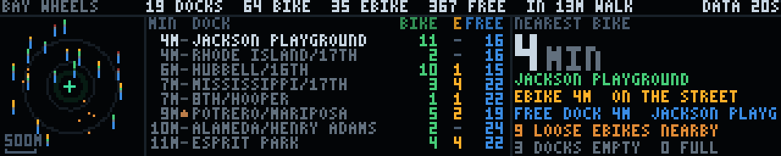

The Bay Wheels docks within a walk of the front door: how many minutes to the
nearest bike, whether it is electric, and whether there is anywhere near here to
leave one. It is the only panel on this wall that can change what somebody does
in the next sixty seconds, and that is the whole justification for the space it
takes. On the left, a map of the walking radius with the building at the centre.
In the middle, the eight nearest docks **by name**, with walk times. On the
right, the headline: `4 MIN`, and what and where.

**It is the companion to `bikes`, not a second version of it.** That panel is
the city — twelve kilometres of commute axis, half a day replayed, net flow
*inferred* from how dock counts changed between snapshots. This one is one
kilometre, right now, *counted*. They are deliberately drawn nothing like each
other: `bikes` is a dark landscape with comets crossing it and is meant to be
arresting; this is three panes of instrument, still except for one breathing
mark and a slow ring, and is meant to be read by somebody standing at the door
with a bag over their shoulder.

**A map is right here for exactly the reason it is wrong in `bikes`.** San
Francisco's 383 docks are a blob 11.8 by 11.3 km — square, 0.96:1 — so a
citywide map on a 5:1 letterbox spends three hundred columns saying the city is
square, which is why `bikes` uses distance-from-downtown as its axis instead. A
*local* map does not have that problem, because a local map does not have to
fill the panel: 58 × 57 pixels of it is a fifth of the width, at 39 m to the
pixel, and the other four fifths carry the words. The projection is
equirectangular with the same metres per pixel on both axes — isotropic, unlike
either of `quake`'s tiles — because at this size the rings have to be rings or
no distance can be read off it at all. There is no basemap under it: no streets,
no shoreline. At 39 m to the pixel a street grid is lit pixels edge to edge and
every one of them competes with a dock. What locates the eye is a green cross on
the building, rings at five and ten minutes' walk, and a 500 m bar.

**Every dock is a two-ended bar chart, and the mnemonic is up and down.** The
bright pixel is the dock. What grows *upward* is bikes you can take — green for
pedal, amber for electric, one to three pixels for 1–2, 3–6, 7+ — and what grows
*downward* is free docks you can leave one in, in blue, on the same scale. A
dock with nothing above it has no bikes and gets a red pip; a dock with nothing
below it is jammed full and gets one too, and it is **the same red**, because
they are the same disappointment from opposite directions. That symmetry is the
design. A station that is full is exactly as useless to somebody arriving as an
empty one is to somebody leaving, and a panel that drew only bike counts would
answer half the question and look complete doing it. Three steps rather than a
linear scale, because the map is not where you read a number off — the list is,
and the list prints it. What the map has to say from across a workshop is none /
a couple / a handful / plenty.

**The electric count is a field trap and it is half the point of the panel.**
GBFS 2.x defines `num_bikes_available_types`, which is the obvious place to look
for docked ebikes and which Lyft's San Francisco feed **does not publish at
all** — the key is absent from every one of the 634 stations, so code that reads
it finds zero everywhere and confidently reports a city with no docked electric
bikes. It has plenty: 79 of the 237 docked bikes within 1.5 km on the Monday
evening this was written, a third of the fleet. The field that works is
`num_ebikes_available`, and it is a *subset* of `num_bikes_available`, so the
pedal count is the difference. The panel splits them into two disjoint columns
that add to the total, in one place (`Station`), so that no two parts of the
panel can disagree about it. This matters because Potrero Hill is a hill, and an
ebike is a different proposition from a pedal bike on the way home.

**The free-floating ebikes are on the map too, as bare amber dots with no dock
pixel under them.** One of them is regularly closer than any dock — 321 m
against Jackson Playground's 292 on the evening this was written — and a panel
that preferred a dock for being a dock would be answering the wrong question.
The headline picks the nearest bike over *both* fleets and says `ON THE STREET`
when it is a loose one.

**Names, because a dot on a map is not something you can say out loud.**
"Jackson Playground" and "Rhode Island and 17th" are how people in this
neighbourhood actually refer to these, so the list is names and the shortener is
the transformation a person makes out loud: `Rhode Island St at 17th St` becomes
`RHODE ISLAND/17TH`, `22nd St at Potrero Ave` becomes `22ND/POTRERO`, and
anything that is not a junction — `Jackson Playground`, `Esprit Park` — is
already what people call it and is left exactly alone. Only a *trailing* street
type is dropped and never the only word in a part, so `St Mary's Square` keeps
its saint.

**Walk minutes, not metres.** 75 m/min is an ordinary adult pace, applied to the
straight-line distance, which in a grid like Dogpatch is close and in general is
a floor. It is the unit somebody standing at the door thinks in, and it
reproduces a hand-measured table of the neighbourhood exactly: 292 m → 4 min,
682 m → 9, 838 m → 11. The metres are in the record for anybody who wants them.

**Elevation is in the list because uphill and downhill are different walks.**
The heights are `bikes-terrain.npz`, the committed USGS 3DEP bake that `bikes`
uses, and the mark before each name is a caret up, a caret down or a dash at ±8
metres against the shop floor — warm for up, cool for down, so it survives being
seen from an angle where three pixels do not resolve into a shape. Potrero Ave
at Mariposa is 14 m above this room; Hubbell St is further away and 2 m below.
The shop's own height is the nearest baked dock's, because the bake is dock
locations and not a DEM, and the payload calls it `approx`.

**The wall's own coordinates, and a discrepancy worth knowing about.** This
product carries 37.7624929274026, −122.39969356310202, surveyed to the building.
`adsb.py`, `quake.py` and ftdata's `QUAKE_LAT`/`QUAKE_LON` carry
(37.7627, −122.3966), which is **273 m north-east of it**. At a 50-nautical-mile
radar picture or a 300 km earthquake map that is a fifth of a pixel and not
worth touching three products for; at 39 m to the pixel it is seven pixels, and
the difference between the nearest dock being Jackson Playground and being Rhode
Island St. So this one carries its own constant deliberately, and the two should
be reconciled on purpose rather than by one of them drifting.

**The data.** A new ftdata product, `docks-nearby`, off the same three keyless
GBFS feeds `baywheels` uses — `station_information`, `station_status`,
`free_bike_status` — but asking a different question of them, so it is a
separate product rather than more fields on that one. `baywheels` must not be
sampled faster than its ten-minute history bucket and must never be volatile,
because the accumulated half day is the only thing in it that cannot be
re-fetched; this one wants two minutes and is worth nothing after a reboot. The
crop is a *circle*, 1.5 km, sorted by distance: 45 docks and about 25 loose
bikes, stored against the panel's default 1.0 km of drawing so `--radius` can be
turned up on the wall without the fetcher having to agree. TTL ten minutes,
interval two — under `FAST_INTERVAL`, so the fast timer takes it — and the
record is volatile, so it lives in tmpfs and does not write the SD card 720
times a day.

**One piece of caching, and it is the only one in `ftdata.py`.** The three feeds
are 795 kB: information 348, status 243, free bikes 204. Taking all three every
two minutes would be 6.6 kB/s sustained, five times what `baywheels` costs and
more than this panel is worth. But `station_information` is near-static — names,
coordinates and capacities — so the *trimmed* version of it, the forty-odd
stations inside the radius at about 4 kB, is kept in the record and reused for
an hour. Steady state is 447 kB every two minutes, **3.7 kB/s**, with one 348 kB
request an hour on top. What that costs is that a station installed inside the
radius can take up to an hour to appear, which for a thing that happens a few
times a year is the right trade, and the cache is refused outright if it is from
a different radius or a different site rather than being paired with this pass's
counts. The record is 10.1 kB, of which 5.7 is what the panel draws and 4.2 is
that cache.

**No identifier of any kind is read out of `free_bike_status` here.** `bikes`
hashes the printed bike number because it has to match one snapshot to the next
to observe a journey; this product never compares two snapshots, so it has no
use for identity and takes none.

**Three honest failures.** Past the ten-minute TTL the panel draws with `OLD`
and the age in the header. Past thirty minutes the counts are **not drawn at
all** — the map furniture, the rings and the building stay, and the panel says
`COUNTS 45M OLD — NOT DRAWN` and, in the list pane, *a dock count this old is
not late, it is wrong about which dock is dry*. That is a sharper rule than most
panels here need and it is the right one: a tide table half an hour late is a
stale reading of a slow quantity, and a dock count half an hour late on a Friday
evening is a specific claim about which dock has two bikes in it that has been
false for twenty minutes. No record at all gets the card and the command that
fixes it. A record whose columns disagree in length is refused rather than
indexed into, because that draws perfectly and pairs one station's name with
another's counts.

**Motion, deliberately almost none.** One dim ring walks outward from the
building every seven seconds — which is not decoration, it is the radius being
paced out, and it is what the numbers on the right are counting — the nearest
bike's marker breathes at half a hertz, and a heartbeat blinks in the corner.
Everything else is baked once in `build()`. `render()` is a **pure function of
`t`** with `--reload 0`, which the test asserts by comparing a cold render at
t = 3.7 s against t = 3.7 s reached frame by frame from zero; with the default
`--reload 120` it consults `time.time()` only to decide whether to `os.stat` the
record, and re-parses only when the mtime has actually changed.

Measured over 400 sequential frames on the development desktop: **mean 0.019 ms,
p95 0.031 ms, max 0.050 ms**, about nine numpy calls a frame on arrays no bigger
than the 58 × 57 map pane. At the 20–115× this project keeps measuring between
here and the wall's Pi, call it 0.4–2.2 ms — comfortably inside the 20 ms budget
at 20 fps, with the rebake (a full re-read and redraw, once every two minutes at
worst) the only thing in it worth watching.

`python3 scripts/test-docks.py` is 104 checks: the projection against
hand-measured distances (the nearest dock **must** be Jackson Playground at
292 m, or the origin is wrong and the map still looks fine), up-versus-down read
back in pixels, the electric subset clamped so the pedal count cannot go
negative, a shut station's bikes not counted as available, the name shortener,
purity in `t`, and fresh/aging/stale/absent each in a process of its own with
`FT_DATA_CACHE` and `FT_DATA_BLOBS` set — the second of those because a volatile
product is looked for in the blob directory *first*, and seven checks in that
file passed against the live cache once before anybody noticed.

### bgp


The internet's routing table, churning, as San Francisco's own exchange hears
it. Fifteen minutes of the global default-free zone across 320 columns, second
by second, with a ticker of the actual prefixes scrolling underneath. The number
in the corner is how many prefixes a second are being announced or withdrawn to
the RouteViews collector at SFMIX — which is a couple of miles from the wall and
is where the makerspace's own ISP hands its traffic off. The routes on this
panel are the ones the room's packets are steered by, which is not a claim any
other vantage point could make.

BGP never stops. Somewhere on earth a network announces or withdraws a prefix a
few thousand times a second, most of it churn from a handful of unstable origins
and occasionally something that matters, and the shape of that noise is the only
thing this panel is trying to say: **a constant hiss with structure in it.** A
quarter of an hour of it is a floor of a hundred-odd prefixes a second with
spikes an order of magnitude above it, and every spike is a real event — a
session that reset and re-sent its whole table, a network that flapped,
somebody's maintenance window.

**This is the one panel on the wall showing infrastructure its audience
operates, and that makes the honesty load-bearing.** There are already five
demos here in the green-on-black terminal register — `wardial`, `ansi`, `wopr`,
`defcon`, `sneakers` — and every one of them is a prop with invented numbers in
a hacker-movie typeface. This one deliberately borrows the same visual language
and then has to earn its way back out of it. So the prefixes in the ticker are
literal strings out of the MRT dump, the AS numbers are real and lookupable,
IPv6 is in there because the real table is half IPv6, and the awkward numbers
are left on the screen rather than smoothed off. Somebody who knows what
`2a14:67c3:ff0::/44` is can check this panel against their own looking glass and
find it correct. That is the test it is built to pass.

**Why the data is a quarter of an hour old, on purpose.** The obvious source is
RIPE's RIS Live, which streams the whole DFZ over plain HTTP as
newline-delimited JSON and would put the panel a second behind the world. It was
tried first and rejected twice over. Unfiltered it delivered **78 MB in 25
seconds**, which is not going near a Pi on shop wifi; and any affordable use of
it is *sampled* — open the socket, read twenty seconds, close it, and be blind
for the other hundred and sixty. A burst lasting a minute would simply not
appear, and a chart that silently omits the interesting parts is worse than a
coarser one that does not. RouteViews has the opposite shape: every collector
writes a complete MRT dump of every update it saw in each fifteen-minute window
and publishes it about a minute after the window closes, bzip2'd. One 1.2 MB
file buys **the entire window** — 75,000 messages, 150,000 prefixes, per-second
resolution, nothing sampled away. Trading fifteen minutes of latency for a chart
with nothing missing from it is the right trade for a panel about texture, and
the age is on the screen in any case.

Two things had to be measured rather than assumed, and both are in `ftdata.py`:
the RIS Live filters go in an `X-RIS-Subscribe` **header** and not in the query
string (the query-string forms are silently ignored — a `host=rrc11` parameter
changes nothing and you get the firehose), and `socketOptions.includeRaw` does
not work on the HTTP streaming endpoint at all, so every message carries its own
hex-encoded wire form whether you want it or not. That is roughly half the
bytes. RIPEstat was also tried and timed out twice at 25 s from this machine
while every other RIPE endpoint answered, so nothing here is built on it.

**MRT is parsed by hand, in `ftdata.py`, and that needs justifying.** The usual
answers are `libbgpstream` and `mrtparse`; the first is a C library with a
build, the second a dependency tree, and neither is going on a Pi to do
something this file already does for the Port's cruise PDF. The wire format is
RFC 6396 for the framing and RFC 4271 plus RFC 4760 for the UPDATE inside it,
and the part a churn counter needs is small: walk the record frames, find the
BGP UPDATEs, count the prefixes in the withdrawn block, the NLRI block and the
two multiprotocol attributes, and read the AS_PATH. What is deliberately *not*
implemented is everything else — communities, MED, aggregators, the two-byte-ASN
subtypes nobody has emitted this decade. An attribute the parser does not
understand is stepped over by its own length field, which is why an unknown one
cannot desynchronise the walk.

It is also where all the plausible wrong answers live, so it is the part with
the most tests. `scripts/test-bgp.py` builds MRT byte by byte and asserts
against arithmetic, because every one of these failures draws a panel that looks
completely fine:

  * **A miscounted prefix block.** NLRI is a length-in-*bits* byte followed by
    that many bits rounded up to whole octets, with the trailing zero octets
    left off the wire entirely. Get the rounding wrong and the walk
    desynchronises, the rest of the record is garbage, and the chart is just a
    different height. There are `/22` and `/25` cases in the tests for exactly
    this: a `/25` is on the wire as four octets and a `/22` as three.
  * **IPv6 silently missing.** v6 routes are not in the NLRI field at all; they
    ride inside `MP_REACH_NLRI`, which is an *optional* attribute. A parser that
    skips attributes it does not recognise — which is what a parser must do —
    drops half the real table and reports a perfectly plausible rate.
  * **The AS path read off the wrong end.** The origin is the last ASN of the
    last segment. Reading the first gives the peer, and the ticker then
    confidently prints the collector's own neighbours as the origin of
    everything on the internet.
  * **The ET record variant.** Real RouteViews files are 100% type 17, which is
    type 16 with four extra bytes of microseconds ahead of the body. Four bytes
    of offset error lands the parser in the middle of a peer address.

**The axis is square root, and it says so.** This was the one real design
problem. BGP churn is a floor around 150 prefixes a second with spikes twenty
times that, and a linear axis fitted to the spikes draws the floor — the panel's
entire subject — as one row of green along the bottom with no texture in it at
all. The first version did exactly that and was unreadable. Fitting the axis to
the floor instead clips every spike flat, and the spikes are the events. Log
would be the usual answer for a rate and cannot be used here, because a stacked
area cannot be drawn on a log axis: a zero has nowhere to go, and half the
columns have no withdrawals in them. Square root splits the difference the way
this data wants — the floor lands around a fifth of the height with its texture
intact and a twentyfold spike still reaches the top.

A non-linear axis that does not admit it is a lie, so there are **two** numbers
down the left edge instead of one: the full scale and the value at half height.
Under this transform the half-height number is a *quarter* of the full scale,
not a half, and anybody who reads both discovers the axis in about a second —
which is exactly the audience this panel has. The ladder the full scale rounds
onto has 1.5, 3 and 7 on it as well as the usual 1, 2 and 5, which is not
decoration either: a 1/2/5 ladder rounds a 2760/s peak up to 5000, and on a
square-root axis that leaves the tallest event of the quarter hour at three
quarters of the height with a quarter of the chart permanently empty above it.

**Withdrawals get their own colour and the bottom of the stack.** They are about
five per cent of prefix churn and they are far more likely than an announcement
to be somebody's outage, so folding them into one line would hide the only part
of this number that is unambiguously bad news. They are underneath rather than
on top because they are the smaller quantity and a two-pixel band floating on a
moving surface cannot be read, whereas one sitting on the floor has a straight
edge to be measured against. Their band has a **one-row minimum** wherever there
were any at all: a single withdrawn prefix in a 900-second window is four
ten-thousandths of a row, and an outage that vanishes from the chart because it
was small is precisely the failure this panel must not have.

**The ticker is a reservoir sample, and that is a real distortion worth naming.**
Its 48 lines are drawn from across the whole fifteen minutes rather than off the
front, because the front of a window is regularly one router dumping its table
and forty-eight lines of the same peer is not what the routing table looks like.
Announcements and withdrawals go into the *same* reservoir at their true
proportions, which means most windows have one or two amber lines in the loop
and some have none — that is correct, and the chart is what carries the real
ratio. What the ticker cannot show is a prefix's second announcement: only the
first prefix of each UPDATE becomes a line, so a message announcing six prefixes
contributes one. The chart counts all six.

A withdrawal line names the **peer** that sent it and says `WDR BY`, because a
withdrawal genuinely has no origin — an UPDATE that withdraws a prefix carries
no AS_PATH, there being no longer a path to describe. Inventing one from a
previous announcement would be the exact kind of plausible lie this panel exists
not to tell. AS path prepending is collapsed on the way to the screen: a path
like `[16582]×9` is one network saying one thing nine times and costs 36 pixels
of a ticker line to say nothing.

One detail worth knowing, since it looks like a bug and is not: **Monkeybrains'
own prefixes never appear on this panel.** AS32329 did not show up once in a
sampled window's 2,261 distinct ASNs, and that is the system working — a stable
route generates no churn, and the whole panel is a picture of instability.
Everything on it is, by construction, somebody having a worse day than the
makerspace's ISP.

**Frame budget.** Everything is baked in `build()`: the header, the chart, the
legend and the entire ticker are rasterised once into a static frame and one
tall strip, which is what makes the scroll two slice copies a frame rather than
a re-render. `render()` does one copy of the top of the panel, one window into
the strip, and three short writes for the pulse — five or six numpy calls, and
the cost model on the wall is calls and not pixels. Measured over a full 1200
frame (60 s) loop on the desktop this was written on: **mean 0.004 ms, p50
0.004, p95 0.004, p99 0.006**, worst frame 0.022 ms. `build()` is about 4 ms.
Even at two hundred times slower this is under a millisecond a frame against a
50 ms budget, and the only thing that could change that is the ticker strip
growing, which it cannot — it is 48 lines by construction.

`render()` is a **pure function of `t`** and is asserted to be: a cold
`render(7.3)` is byte-identical to the same moment reached by driving from zero.
The scroll and the pulse are both driven by the segment's own `t` and never by
the wall clock, which is what makes them the same animation on the wall and
under a preview baker rendering a hundred frames in a millisecond. The only
clock read is the periodic cache re-read, same as `caiso`.

**Three states.** Fresh is the panel above. A record past its 45-minute TTL
still draws — a picture of the routing table from an hour ago is still a picture
of the routing table — with `STALE` and the age in red in the header, because
the one thing this panel must never do is imply that a flat stretch is happening
now. No record at all gets a no-data card. All three are rendered in separate
processes by the test script, since `ftdata.CACHE_DIR` binds at import and
reloading the module in one process does not test what it looks like it tests.

The fetcher pulls one file every 15 minutes on the collector's own cadence,
turning 1.2 MB of bzip2 (12.5 MB of MRT, 75,000 records) into an 11 kB record.
Both ends are capped — `BGP_MAX_BZ2`, `BGP_MAX_MRT`, `BGP_MAX_RECORDS` — at
roughly five times normal, so they never fire in ordinary operation and do fire
on the day a collector emits a pathological window; a capped parse says so in
the record and its rates are computed against the span actually parsed rather
than the fifteen minutes it was supposed to be. `FT_BGP_COLLECTOR` and
`FT_BGP_SITE` move the vantage point, since every RouteViews collector publishes
the identical layout and somebody forking this wall for another city should not
have to edit code.

    $ python3 ftdata.py --once --only bgp-sfmix
    $ python3 bgp.py --host 127.0.0.1
    $ FT_DATA_CACHE=/tmp/empty python3 bgp.py      # the no-data card
    $ python3 scripts/test-bgp.py
### sfmix


A NOC weathermap for the San Francisco Metropolitan Internet Exchange: the
oldest picture in network operations, drawn for the exchange this wall's owner
helps run. The fibre goes where the fibre actually goes, each span is coloured
by how much traffic is on it, and light runs along it at a speed proportional
to that traffic, so the map is alive rather than a diagram. Five metros from
San Francisco down to San Jose, the five inter-metro trunks between them, and
on the right the number an exchange is judged by — how many bits are crossing
it right now, today's curve, and where the peak was.

**The data is the exchange's own, from three keyless endpoints.**
`portal.sfmix.org/statistics/map/map.json` is the public structure: twelve
sites, five metros, twenty-two cables, and — the part that matters here —
`metro_cables`, pre-aggregated inter-metro trunks carrying their real coarse
fibre routes as lon/lat polylines. `/statistics/map/traffic` is live bits per
second per opaque cable id. `/statistics/metrics/?panel=ix_total&range=24h` is
the aggregate, ingress and egress summed over every member port at 300 s
resolution. Nothing needs a key and nothing here is private: the precise
carrier geometry and the cable-id-to-circuit mapping live in files the portal
never serves, and this panel never asks for them.

Both map.json and the traffic feed carry a `generation` string, and the fetcher
treats it as a **safety interlock rather than a version number**. The cable ids
are opaque *per generation* — rebuilt from scratch every time the portal re-runs
its NetBox build — so traffic joined onto the wrong generation does not fail
loudly, it quietly colours trunks with numbers belonging to other trunks. The
two are fetched, compared, and the structure refetched once if they disagree
(the ordinary race: the builder republished between the two GETs). A second
disagreement raises, and `fetch()` keeps the last good record.

About 135 KB of JSON becomes a 7 KB record. The twelve sites collapse to five
metros, because at this scale — eighty kilometres across two hundred columns,
so a third of a kilometre a pixel — the six Santa Clara facilities are the same
pixel and the six intra-metro cables between them are zero pixels long. The per
link 24-hour series and per-member breakdowns go entirely. The routes are
Douglas–Peucker simplified from 846 vertices to 153 at a tolerance of a third
of a pixel. The aggregate curve is bucketed from 289 points to 97 taking each
bucket's **maximum**, and the true peak and its timestamp are carried
separately, because the peak is the whole point of the curve and a decimation
that shaved it would be the one lie this record could tell.

**The map is turned forty-five degrees, and that decides the entire layout.**
SFMIX's footprint is a corridor — San Francisco and Oakland at the top, then
Fremont, Santa Clara and San Jose strung down the south bay. North up, that
cloud is 56 × 64 km: very nearly square, and a square on a 5:1 letterbox wastes
three quarters of the wall. Turned 45°, it is 82 × 23 km, an aspect of 3.62
against the map pane's 3.6, and it fits **at true scale in both axes with
nothing stretched**. The rotation is not a stylistic choice, it is the only way
this geography is a letterbox. So the arrow bottom-right says where north is
and the bar bottom-left says how far ten kilometres is, and it stays a real
map: anisotropic scaling would have filled the box exactly and would silently
have been a lie about distance, so the slack went into margin instead.

The alternative was the schematic subway diagram the portal itself draws when
zoomed out, which is more legible in the abstract and throws away the one thing
this particular audience already knows by heart — the shape of their own bay.
The coastline is the label that needs no text, and it is why the Dumbarton
crossing on the San Francisco–Fremont trunk reads as a bridge rather than as a
line that happens to bend.

**Two strands per trunk, because in and out are different numbers.** A
weathermap has split every link into two half-arrows since MRTG, and the reason
is that a link is not one quantity: San Jose–Fremont was carrying 118 Gb/s one
way and 67 the other while this was written, 19.6% and 11.2% of the same 600
Gb/s of fibre. So each trunk is two parallel one-pixel tracks either side of its
route, each coloured by *its own* direction's load, with light running along it
in that direction. The counter-flow reads from across the room, and the busier
half is both the warmer one and the faster one.

**The colour ramp is the portal's own, compressed four-fold, and the legend
says so.** SFMIX's map colours 0–80% blue-green-yellow-orange-red, which is the
right scale for a map you lean into and can spot a link about to melt. An
exchange deliberately overbuilds its backbone, so on that scale every trunk
here is blue, all day, forever — a dead panel that is also uninformative. This
one keeps the five hues and runs them **0 to 30 per cent**, which is where the
traffic actually lives: on a normal evening the quiet Santa Clara–San Jose
trunk is blue at 2.5%, San Francisco–Santa Clara is a yellow-green 11.9%, and
San Francisco–Fremont is orange at 24.3%. The ramp is drawn bottom right with
its numbers on it, because a colour scale without its numbers is decoration.
The compression is honest in the direction that matters: nothing on this panel
can look calmer than it is, and 30% or more clamps to red rather than wrapping.
The scale is fixed and not derived from the day's own maximum — a traffic light
whose boundaries move with the traffic is not a traffic light.

**Three things are deliberately not the ramp.** A `planned` trunk — San
Francisco–Oakland, in the structure and not yet lit — is dashed in the portal's
own slate blue, outside the ramp entirely, and carries no light; colouring an
unlit fibre "0%, healthy blue" would be the easiest lie available here. A trunk
whose members reported nothing at all is grey, which is a different statement
from zero. And a direction genuinely measured at zero *is* drawn at the bottom
of the ramp, because zero is a fact — but it gets no comets, since running
light along it would say bits are moving when the measurement says they are not.

**The right third is the aggregate.** Total exchanged right now, at 2x, large
enough to read from the far bench; today's 24-hour curve under it with the peak
marked as a dotted rule and labelled with its clock time; the time axis
captioned inside the chart at both ends because 64 rows had exactly one row
spare and the legend needed it. Ingress and egress across the whole exchange
agree to two parts in ten thousand — which is what an exchange *is* — so it is
one curve and the word is "exchanged" rather than a side picked arbitrarily.
The curve is zero-based: a traffic curve zoomed onto its own top few per cent is
the classic way to make a flat day look like an event.

**What was hard.** Captions. Five three-letter metro codes on an 80 × 23 km map
collide with each other and land on top of the trunks, and five-pixel white type
over a yellow cable is unreadable in a way a screenshot at 3x hides completely.
Two things fixed it: every caption gets a one-pixel dark halo around each
stroke, and each one is placed at whichever of four fixed offsets has the fewest
lit pixels already under it — scored against the half-drawn frame, so San Jose's
caption steps off the orange trunk that terminates on it. It scores once and
does not iterate, so a given metro's caption is in the same place every build.

The other one was the flow direction, and it is exactly why `test-sfmix.py`
exists. `render()` lights a pixel where `(s + speed·t) mod period` is near zero,
so the lit position along a strand is `s = −speed·t` and the sign that sends a
comet from a to z is a *negative* speed. The first version negated both the
phase and the speed for the reverse strand — which looks like the symmetric
thing to do, is a no-op on direction, and sent both tracks of every trunk the
same way. It is undetectable in a still frame and very hard to see in motion.
The test builds a synthetic trunk carrying traffic in one direction only,
identifies the comet pixels as exactly the pixels where the rendered frame
differs from the baked one, and measures a **circular** mean of their positions
modulo the comet period — a plain centroid jitters backwards at random as the
leading comet leaves the end while the next enters, and a test built on one
passes or fails by luck.

**Frame budget.** Everything is baked in `build()`: the sea, the shoreline, all
ten strands, the nodes, the captions, the header, the chart and the legend go
into one uint8 frame. `render()` does a full-frame copy, six arithmetic passes
over a flat array of the 1170 pixels that carry flowing light, one fancy-indexed
write of those pixels, and a one-pixel dot on the chart — ten numpy calls, all
into preallocated buffers, nothing that formats a string or allocates, and
nothing that depends on how many comets happen to be lit. Over 1200 frames on
the development machine: mean 0.027 ms, p50 0.026, p95 0.029, p99 0.039, worst
0.057. `build()` is 4–5 ms, once, on the scheduler's worker thread, most of it
resampling the coastline.

`render` is a **pure function of `t`**, which is unusual for a data panel here
and is asserted rather than assumed: a cold `render(4.35)` is byte-identical to
the same instant reached by stepping from zero.

**The coastline** is `sfmix-map.npz`, 4.5 KB: a 768 × 768 bit-packed land/sea
mask over lon −122.80..−121.60, lat 37.05..38.00, rasterised by an even-odd
scanline fill from the exchange's own committed, public, coarse basemap water
rings (`portal/mapbuild/data/basemap-water.json`, OSM-derived). It is
deliberately not `adsb-coast.npz`, which stops at 37.4 N and therefore has no
south bay — which is most of this map.

Product `sfmix-ix`, TTL 30 minutes, fetched every 5 minutes (the resolution of
the underlying counters; asking faster returns the same numbers and costs the
portal a Prometheus burst). Past its TTL the panel still draws, with the age and
STALE in red where the age goes, because the routes and the day's curve are
still true and only "now" has gone soft. With no record at all, a no-data card.

    python3 ftdata.py --once --only sfmix-ix
    python3 sfmix.py --host 127.0.0.1
    python3 sfmix.py --util-full 15        # a tighter ramp on a quiet day
    FT_DATA_CACHE=/tmp/empty python3 sfmix.py     # the no-data card
    python3 scripts/test-sfmix.py

### sun

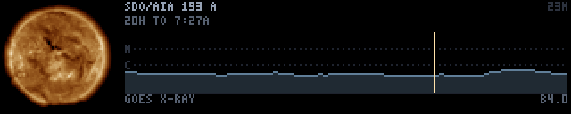

The last day of the Sun's corona, in the 193 Å channel of SDO/AIA, on a
fourteen-second loop that has no seam in it. Forty-eight half-hourly frames
from NASA's Solar Dynamics Observatory play left to right while a playhead
sweeps the last twenty-four hours of GOES X-ray flux beside them, so the
picture and the number are the same day at the same instant. It is the only
panel on the wall that is a photograph of another object in space —
`propagation` and `sats` are numbers and geometry about space, which is not the
same thing — and it is there because a picture of the star is legible to
somebody who knows nothing about any of the rest of it.

**Why 193 Å.** AIA takes the Sun in ten channels and they are pictures of ten
different things, not ten filters on one picture. 193 Å is Fe XII/XXIV at about
1.2 million kelvin, which puts the *corona* on screen instead of the surface,
and it is the channel where the magnetic field becomes visible: active regions
as bright knots, the loops arcing between them, and coronal holes as the black
bays where the field opens and the solar wind gets out. 4500 Å — the bland
yellow disk everyone pictures — has nothing happening in it at 60 pixels.
`FT_SDO_WAVE` will fetch 0171 or 0304 instead; the stored colour ramp is 193's
and would want re-measuring for another channel.

**The loop is the hard part, and it is measured rather than eyeballed.** A day
does not join up. The Sun turns 13.2° in it, so cutting from now back to
yesterday is a jerk once a cycle — the kind of fault a passer-by registers as
"that looks cheap" without being able to say why. Holding on the newest frame,
which is what `goes.py` does and is right for weather, is wrong here: the point
of this panel is the turning, and a hold puts a stutter exactly where the motion
should be. So the loop **overlaps itself**. The last six frames are
cross-dissolved into the first six and the period is shortened by exactly that
overlap, which puts the seam in the middle of a dissolve where there is nothing
to see.

That it works is a number, not an opinion. Taking the mean absolute difference
between consecutive loop frames, the step across the wrap is **14.7× a typical
interior step with the overlap off, and 2.16× with it on** — 1.7 levels out of
255, which is under what the panel can show. `scripts/test-sun.py` asserts both,
including the control: a test that only checked the blended loop would pass
against a broken implementation that blended nothing.

The honest cost is that the dissolve is a genuine double exposure of two moments
three hours apart. At 13.2° a day they are close enough that it reads as a soft
blur rather than a ghost. The other cost is subtler and was a bug before it was
a feature: the overlap **consumes** the newest frames, so the loop's last
unblended frame is three hours short of the ring's newest. The axis originally
ran to the newest frame anyway, and the playhead stopped a thirteenth short of
the right edge every cycle. The trace and the window label now describe exactly
the interval the playhead sweeps; how stale the imagery is stays a separate
claim, made separately in the corner.

**The X-ray trace is the same day, not a second instrument.** GOES' 1–8 Å flux
is already fetched for `propagation`, so it costs no network at all, and drawn
on the *same* time axis as the time lapse it stops being a second panel and
becomes a caption for the first: the playhead crossing a spike is the same
instant the disk flares. The scale is logarithmic from **B to X rather than the
conventional A to X**, because most days are quiet — the Sun was B4 the day this
was written — and four decades flattens a quiet day onto the floor where it
reads as no data at all. Three and a half decades keeps a quiet day a visible
ripple and still leaves an X-flare at the ceiling. The C and M rules are named,
because otherwise the empty two thirds above the trace is just black when what
it actually says is "there is room here for a flare two hundred times bigger and
there has not been one". Sub-C columns are drawn cold blue-grey rather than
`propagation`'s green: the disk is the only warm thing on this panel by design,
so heat should be the thing that *appears* when a flare does. The trace is a
garnish and never a dependency — with no flux record the Sun draws alone.

**One channel is stored, not three, and that is lossless here.** The browse JPEG
is already false colour: 193 Å is drawn through a fixed one-dimensional bronze
colormap, so G and B are functions of R rather than independent information.
Binning a real frame confirms it — at a given intensity the spread in the other
two channels is one to five levels, which is JPEG ringing. So the fetcher keeps a
single 8-bit intensity plane and the demo maps it back through its own copy of
that ramp, measured off a real frame rather than guessed. That thirds the
sidecar and, more usefully, puts the contrast curve under the panel's control
instead of NASA's, which matters on an LED wall whose dark end is compressed.
The index is `(R+G+B)/3` and not R alone because R saturates first, and the
pixels where it saturates are exactly the flare cores worth keeping apart from
merely bright.

**The limb was found, not assumed.** On the 512 px browse image the Sun is
centred on (255.5, 255.5) with a photospheric radius of about 203 px, measured
off the radial profile — which peaks sharply at r=200 where the limb brightens
and has fallen to a tenth by r=250. Cropping tight to that gets the biggest
possible disk and looks wrong, because the corona is still bright where the
square ends: the Sun ends up in a luminous box, bright at the middle of each
edge and black only in the corners. The crop is 248 px of half-width instead and
the demo fades the last of the corona to black with a vignette that starts at
the limb, so **no photospheric pixel is touched** and the disk sits in a halo
rather than a border. It costs disk diameter — 52 px rather than 60 — and buys a
star instead of a photograph of one. The crop also throws away the caption GSFC
burns into the bottom of every browse frame, which would otherwise arrive as
unreadable smeared type along the panel.

**Fetching is a ring, and the expensive endpoint is only used to repair.** This
is where most of the work went. Frames live in a per-day Apache directory index
which is **1.2 MB of HTML, served uncompressed** — no gzip, and `Range` requests
are ignored outright, returning all 1.2 MB with a 200. The filenames cannot be
predicted either, which is what makes the listing necessary at all: `goes.py`
gets away with naming tomorrow's files because its scans are exactly on a
five-minute grid, but AIA's wander (00:07, 00:17, 00:27, 00:37, 00:48, 00:57)
with seconds only ever on a twelve-second grid, and there are holes. Pulling the
listing every pass would cost **57 MB a day** to learn the name of one new file.

What saves it is that `latest_512_0193.jpg` is the newest frame at a fixed URL,
44 kB, with a `Last-Modified` that dates publication rather than the fetch. So
the ring is topped up from `latest` and nothing else in the ordinary case, and
the listing is fetched only when there is a hole older than an hour — a cold
start, or a fetcher that has been down. **Steady state is about 2 MB a day**
against 57. `Last-Modified` is not the observation time and the difference is
stored rather than ignored: a frame shot at 17:38:05 UT appeared with
`Last-Modified` 17:43:06, so publication trails the shutter by very close to
five minutes and `SDO_PUBLISH_LAG` backs that out. Backfilled frames get their
exact time from the filename, so the two paths agree to a few minutes on a
twenty-four hour axis — under a pixel.

Half-hourly is as fine as the panel can resolve, which is why the ring is 48 and
not 144: half an hour of rotation moves a feature about a tenth of a pixel on a
52-pixel disk, so a ten-minute ring would triple the fetching to show the same
picture. What half-hourly still catches is what actually moves at this scale —
an active region brightening, a flare, a coronal hole changing shape. The record
is 436 bytes and the sidecar about 150 kB.

**Playback is an index and one blend.** Everything — the resample, the vignette,
the colour ramp, the loop overlap, the flux trace, the type — is baked in
`build()`, which takes 3.8 ms. A frame on the wall copies a prepared background,
blends two tiles into the disk box with the integer blend `goes.py` uses, and
moves a playhead: about eight numpy calls, **0.014 ms mean and 0.017 ms p95** on
a desktop over a full loop. It is deliberately the cheapest thing it can be,
because the corona is doing the work.

**Missing, partial and stale are three different things and it says which.** No
cache, no sidecar or an unreadable one gets the no-data card with the fetcher's
command on it. A ring shorter than a day plays anyway and says how much of a day
it has — a cold start is a short ring by definition, and eight hours of the Sun
turning beats a card that says wait. A ring whose newest frame has gone stale
keeps playing with the age in red, because yesterday's corona is still worth
looking at as long as nobody can mistake it for now.

### air

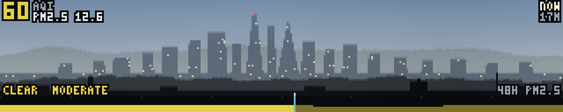

What is in the air outside, drawn as how far you can see through it. The wall
already had the weather, the fog, the wind and a satellite's view of the cloud
over the Bay, and not one of them said anything about particulates — which in
this city is the most visible environmental fact of the year. The difference
between a clear September afternoon and a smoke day is the thing everybody in
the shop notices, talks about and changes their plans for, and until this panel
it was the one thing the wall could not tell them.

So it is not a gauge. It is the view north from the roof, redrawn at the
visibility the current PM2.5 implies: the Marin hills behind, the downtown
towers, Potrero and the near warehouses, and a rooftop in the foreground with a
chimney and a water tank on it. On a clean day the whole depth of it stands out
crisp against a blue sky and the tower windows are lit. As the number climbs
the far layers dissolve into the airlight one after another and the panel goes
warm — tan, then amber, then the orange-brown that anybody who was here in 2020
recognises before they have read a single character. Somebody walking past
reads *the air is bad today* off the colour and off how much of the city is
missing, which is how they read it out of a real window.

**The extinction is arithmetic, not a mood.** Two lines do all of it:

    b_pm = 3 * PM2.5 + 10        extinction from particles, Mm^-1
    T(d) = exp(-b * d)           contrast a target keeps at d kilometres

The first is the IMPROVE mass scattering efficiency for fine particles — the
number every regulatory visibility calculation in the US is built on — plus a
Rayleigh floor for the air itself, which is why a perfectly clean day has a
visual range of 391 km and not infinity. The second is Beer's law; inverting it
through Koschmieder's 3912/b is where the meteorologists' "visual range" comes
from. Each depth plane sits at its real-ish distance and is drawn as `body*T +
airlight*(1-T)`, and that is the entire renderer. At 8 µg/m³ the Marin ridge
keeps 39% of its contrast and the towers 83%; at 150 the ridge is gone, the
towers are at 8% and the rooftop is still at 89%. None of that was tuned to
look right. It looks right because it is what the atmosphere does.

The four distances are the one place where a free parameter was spent
deliberately: 28 km, 5.5 km, 1.6 km and 250 m are roughly a factor of four
apart so that each plane drops out at a different, useful concentration. The
ridge goes at about 25 µg/m³, the towers at 137, Potrero at 477 and the rooftop
never. That gives four steps of legible bad instead of one binary, and it
guarantees the panel is never an empty rectangle.

**Fog is not smoke, and this is the panel where that had to hold.** `karl`
already owns fog, and a 6 µg/m³ foggy morning drawn orange would be the wall
claiming a fire, twice a week in July. Water scatters neutrally and looks white
and cool; smoke absorbs blue and looks orange and warm. So the fetcher stores
the model's own visibility diagnostic and the relative humidity beside the
particulates, and the demo splits the extinction in two: `b_fog = 3912/vis_km −
b_pm`, whatever is stopping the light that the particles cannot account for.
The airlight colour is then mixed between a cool grey and a PM2.5-driven ramp
in proportion, and the caption says FOG, SMOKE, HAZE or CLEAR. A foggy morning
and a smoke afternoon can hide the towers equally well and are 135 levels apart
in red-minus-blue, which is not a distinction anybody has to squint at.

Two things had to be done to the fog term to make it usable. It is **capped**,
at about 4 km of visual range from water alone: the model emits isolated hours
of 100 m visibility, which as extinction is 39 000 Mm⁻¹ and renders a uniform
white rectangle. And it is **smoothed over three hours and gated on humidity**,
because those isolated hours flashing past mid-sweep read as a rendering fault,
and because a 200 m visibility at 52% relative humidity is the diagnostic
having an opinion rather than fog. Both are compromises and both are in the
code with the reasoning next to them.

**It sweeps, because the trend is the point.** A number tells you the air is
bad; the shape tells you whether it is arriving or leaving. The panel dwells on
the present moment, runs back to 24 hours ago, sweeps forward through now into
tomorrow's forecast, and returns — and the headline follows the cursor,
labelled `-8H`, `NOW`, `+13H`. A big number over a picture of another hour
would be the worst thing this panel could do, so the label is drawn above the
age rather than below it and the sweep starts and ends on the present, which
means a segment cut short has still shown somebody today's number. The strip
along the bottom is the whole 48 hours at once: bar heights are hourly PM2.5,
colours are the six official US AQI categories, the forecast half is drawn
dimmer than the measured half, and the present moment is a bright rule.

**The AQI lags the PM2.5 and that is not a bug in either.** The US index is
defined on a 24-hour average, so the service's hourly `us_aqi` column is a
running quantity. Over a real day here it moved 54 to 60 while the hourly PM2.5
moved 8 to 16 — correlation 0.15 against the hourly figure and 0.90 against a
24-hour trailing mean of it. Both the headline and the strip's colour are
driven by the index so that they agree with each other and with every other air
quality map anybody has seen; the bar *heights* are the hourly mass, because
that is the thing with an hourly shape. When a plume arrives the bars rise
before the colour does. That is the index, not the panel.

**No day and night.** The scene is lit as daytime at 3 am as much as at 3 pm.
Adding a diurnal cycle would put a second and much stronger brightness signal
on the one axis the panel exists to carry, and "dark" would be read as "bad" by
everybody who did not stop to think about it. This is a diagram of visibility,
not a webcam.

**The data.** Open-Meteo, free and keyless, two endpoints an hour: the
air-quality API for `pm2_5, pm10, us_aqi, aerosol_optical_depth` and the
ordinary forecast API for `relative_humidity_2m, visibility`. One request each
gets the past and the forecast together, so the whole 49-hour window is two
round trips. `past_days` and `forecast_days` snap to whole days, so the request
covers five and the fetcher throws away everything outside now±24 h: about 6 kB
over the wire becomes a 2.2 kB record of roughly 250 numbers. Times are asked
for in UTC explicitly — the documented default is GMT but a default is not a
promise, and `timezone=` also decides where the day boundaries fall. The
coordinate comes from `ftsite`, never from the source. TTL three hours,
interval one hour; the model is revised hourly at best and a curve fetched two
hours ago is still very nearly the curve.

A surprise worth writing down: the two endpoints answer for **different grid
cells**. The chemistry model is CAMS at about 11 km and answered for 37.80,
−122.40 — Fisherman's Wharf, 4 km north of the building — while the forecast
model answered for 37.763, −122.413, half a mile away. Both are stored, because
"modelled for a cell containing most of the northeast quadrant of the city" is
the honest description of this number.

There is already a `wx-air-<site>` product a thousand lines up in `ftdata.py`
and this is deliberately not it. That one asks for `current=`: one instant,
five species, a number for `wx` to print in a corner. This one wants one
species and forty-nine hours of it, half in the future, because the panel is
about a trend arriving. Bolting `hourly=` onto the wx product would have made
every `wx` fetch forty times bigger for a series `wx` does not draw.

**Frame budget.** Every pixel's colour depends only on which depth plane is
visible there, which row it is on, and how its edge is antialiased — so
`build()` bakes one int32 index image and `render()` builds a small
(bodies × bodies × coverage × rows) colour table for the current extinction and
pulls the entire panel out of it with a single `np.take`. The table is 32 k
floats and a dozen numpy calls on tiny arrays; the frame is the gather, one add
of the drifting murk and the dither, and one store. Five whole-panel passes,
about twenty numpy calls. Quantising the edge coverage to four steps is what
collapsed two gathers and a blend into one; four steps on a one-pixel silhouette
is finer than the panel's own gamma can show. The tower lights and the aviation
beacon cost nothing per frame at all, because they are simply two more rows of
the same table at the towers' own distance — which is why they are swallowed by
the smoke along with the towers, rather than shining through it.

Measured over a full sweep on the desktop: **mean 0.27 ms, p95 0.46 ms, worst
frame 0.55 ms**, with `build()` at 3 ms. Against the calibration figure in this
tree — a demo at 0.3 ms here measuring 44 ms on the Pi while it was throttled to
600 MHz, call it 20 ms now that the clock is fixed — that scales to roughly
**18 ms mean on the wall's Pi 3**, inside the 20 ms target at 20 fps but not by
much. The p95 tracks the mean, so there is no periodic spike to be surprised
by. If it turns out marginal, the first thing to give up is the four-step edge
antialiasing, which halves the table and costs one silhouette pixel of
smoothness.

The murk drifts across at 23 columns a second and its amplitude follows the
extinction, so a clean day is still and crisp and a smoke day visibly moves.
The floor under that amplitude is not decoration: the drift is what guarantees
no two consecutive frames are identical while the sweep is dwelling on the
present, and a panel that holds one frame for half a second on a wall between
two animated demos reads as a crash. `caiso` learned the same lesson the same
way.

Records past the three-hour TTL still draw — a curve from breakfast is still
breakfast's curve — with the age and `STALE` on the panel. A record whose
window has *ended* is refused outright and says so, because a 49-hour picture
of the wrong 49 hours is worse than an empty rectangle. No record at all gets
the no-data card and the command that fixes it.

    python3 ftdata.py --once --only air
    python3 air.py --host 127.0.0.1
    python3 air.py --sweep 8              # hurry the sweep along
    python3 scripts/test-air.py           # 83 checks
    python3 scripts/test-air.py --shot-smoke /tmp/smoke.png   # a day to come

That last one matters. A panel whose entire point is what it looks like when
the air is bad cannot be reviewed on a clear afternoon, so the test script will
fabricate a plausible smoke day, a fog morning or a clean day into a scratch
cache and screenshot the panel reading it. The demo is not told; it reads the
cache it always reads.

### wateryear

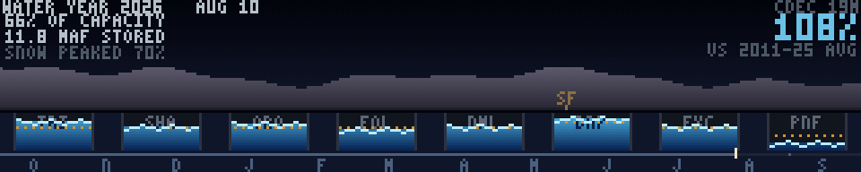

California's water year, played in about twenty seconds and landing on today. A
mountain range across the top is the Sierra snowpack; eight vessels underneath
it are the state's major reservoirs, north to south; and the panel sweeps from
1 October to the latest day CDEC has, so you watch the snow build down the
mountain through winter, watch the snowline climb back up in April with
meltwater running off it into the lakes below, and watch the lakes rise while
it happens. Percent of capacity and percent of average for the date are the two
numbers on it, the second one big.

The wall already had the ocean — `tide`, `swell`, `ships` — and none of that is
the water anybody in this state argues about. The water that matters is stored
water, and it arrives on an annual clock: essentially everything California
gets falls between October and April, most of it lands as snow, and the
snowpack is a second reservoir — in a good year larger than every concrete one
put together — that releases itself over the following three months. That is
why this is not a row of bar charts. **The melt has to visibly become the
storage**, and that connection is the panel.

**Left to right is latitude.** Trinity, Shasta, Oroville, Folsom, New Melones,
Don Pedro, McClure, Pine Flat: 17.9 million acre-feet of the state's forty-odd,
running 40.8°N to 36.8°N in monotonic order, so the horizontal axis of the
picture is the map. The snow above them is in the same order — the Cooperative
Snow Surveys' North, Central and South Sierra indices, blended across the width
rather than drawn as three blocks, because a hard vertical seam between two
survey regions is a boundary that does not exist on the ground. The coupling is
**by latitude and not by watershed**, and that is worth saying plainly: Shasta
and Trinity are fed by the Trinity Alps and the southern Cascades and not by
the Sierra at all. What is true is that the mountains melt into the lakes and
that both are ordered north to south, which is enough for the picture to be
honest at a glance and is why the streams fall straight down. San Luis is
deliberately absent from the eight: it is off-stream, filled by pumping, and
its curve is a delivery schedule rather than a watershed.

A small `SF` tick on the valley floor is this wall's own latitude, read from
`ftsite.py` and interpolated between the two reservoirs it falls between (Don
Pedro and New Melones, as it happens). It is a position on the transect, not a
claim that anything about Sequoia Fabrica is in the Sierra.

**The amber dashes are the reference, and they move with the sweep.** Each
vessel carries its own normal storage *for the day being drawn*. Water above
the dashes is a surplus and water below them is a deficit, and eight of those
read at once with no arithmetic. On the screenshot Pine Flat is the one lake
visibly under its line while the other seven are over — the southern Sierra had
its own drought inside a statewide good year, which no single statewide
percentage would ever show you. That is the whole argument for drawing eight
vessels instead of one bar.

**Percent of average is derived here, and the panel says what the baseline
is.** CDEC's `RES` report does publish its own "% of historical average", but
against an unstated period of record, and only for today — there is no way to
ask it what average storage on the 3rd of February looks like, which is exactly
what a panel that animates the year needs. So fifteen complete water years,
2011 through 2025, are fetched once by hand and baked into
`wateryear-normals.npz`:

    $ python3 -c "import ftdata; ftdata.wateryear_bake_normals()"

Thirty-odd requests, about a hundred megabytes, a couple of minutes, run once a
year and committed. Nothing on the fetch timer ever touches history. The
resulting figure runs a few points *above* CDEC's, because 2011–2025 contains
two historic droughts and is a drier baseline than the longer one they use — so
the panel prints `VS 2011-25 AVG` under the number rather than the word
"average". A percentage whose baseline is a secret is not a number.

Averaging is by calendar date on a leap template rather than by "days since 1
October", which sounds like pedantry and is not: a leap water year is 366 days
long and a common one is 365, so indexing by day offset smears every normal
after February by a day, and 29 February ends up averaged against 1 March in
eleven years out of fifteen. The template puts 29 February in a slot of its
own; common years leave it empty and the mean skips it. `wateryear_doy()` is
that mapping and the test asserts every date in the year lands somewhere
distinct.

**Snow is measured, not scraped.** CDEC's `DLYSWEQ` summary has exactly the
numbers you want — stations reporting, average snow water equivalent, percent
of normal for the date, by region — and it is useless here, because it only
serves dates inside the snow season and freezes on the last one. Asked in
August it will cheerfully hand you June's numbers with today's date on the
page. So the index is computed instead: six snow pillows per region, sensor 82
(revised daily snow water equivalent), the mean of whichever of the six
answered that day, and a floor of three — two pillows out of six is not a
regional index, it is two mountains, and in a melt-out week the two that still
report are the two that are highest. The eighteen stations were picked for a
spread of basins and elevations and then checked one at a time against the
servlet for a continuous record back to 2011.

The mountain is white at 28 inches of index, which is set to a *normal* April
rather than to the record: the mean 1 April index across the fifteen baked
years is 29, 35 and 26 inches for the three regions, and in a normal April the
Sierra genuinely is white from the crest to the foothills. 2017 clips, which is
the right failure — the mountain is already as white as it can be drawn and the
caption is what separates a big year from a huge one.

**Everything CDEC gives you is a trap somewhere.** Missing data is `-9999`, not
null, so a fetcher that only checks for null writes minus nine thousand
acre-feet into the record. The date field is `2026-8-11 00:00` — unpadded — so
anything slicing fixed columns works for ten days a month. Rows for days a
station never reported are simply absent, so the response length is not the
number of days asked for and the series has to be assembled by date. And the
service is a state service on a state budget: it times out, and one dead
station here costs one vessel, one dead region costs a third of the snow band,
and a failed fetch leaves yesterday's record in place with an honest age on it.

**Reading `[-1]` is the bug this panel was always going to have.** CDEC's daily
values for today land some time in the morning, so for most of every day the
newest slot in every series is empty. Reading it rather than the newest number
reports a state-wide drought at breakfast and recovers by lunch, which is
exactly the kind of failure nobody catches by looking. Nothing in `wateryear.py`
indexes `[-1]`; `last_finite()` does it, per reservoir, and the test asserts
both that the synthetic record really does end in a hole and that the headline
is not it.

**Frame budget.** Everything is baked in `build()`. The sky, the rock, the
vessel shells, their labels, the year axis and the month letters are one uint8
frame; snow and water are two more, drawn through per-step thresholds so that
the entire picture is *two integer comparisons and two masked copies* a frame —
`ROWV >= LEV[j]` is exactly the wet pixels, because `LEV` is 32000 in every
column that is not inside a vessel. The water levels, the normal marks and the
snowline are precomputed as `(steps, 320)` int16 tables, one step per panel
column, which also makes the sweep index and the cursor's column the same
number and removes a class of off-by-one between the picture and the axis. Two
tiny particle systems and a few short writes are the rest.

The one thing that had to be fixed after measuring was the size of those two
comparisons. Done at full panel width they were 0.21 ms a frame here; cut down
to the band each one describes — seventeen rows of mountain, fourteen of vessel
— they are 0.08 ms. Measured over 1500 frames on the desktop: **mean 0.078 ms,
p50 0.073, p95 0.100, p99 0.116**, worst frame 0.162 ms; `build()` is 6 ms.
Against `caiso`'s measured desktop-to-Pi factor that is a few milliseconds a
frame on the wall, well inside 20 ms.

`render` is a pure function of `t` — the sweep, the surface shimmer, the
meltwater and the cursor all come off the segment clock, and the shimmer phase
in particular is derived from `t` and not from the frame counter, because a
demo that animates on `i` is a different animation under the preview baker than
it is on the wall. The test asserts a cold `render(t)` against the same `t`
reached frame by frame.

**Nothing here touches the network.** `build()` calls `ftdata.load()`, reads
one 13 kB JSON file and one 15 kB `.npz` beside the demo, and that is all. The
product is `wateryear`, ttl 30 h, refetched every 6 h against a source that
moves once a day, and deliberately not `volatile` — the payload is the year so
far, so a record that survives a reboot is the difference between coming back
up with the winter on the panel and coming back up with one column of it. Four
requests and 1.4 MB off the wire, trimmed to eleven series of about a hundred
and sixty samples: every second day, counted back from today, with both
of the last two days kept regardless of parity so the leading edge is never a
day older than it has to be.

A record past its TTL still draws — a year-shaped picture that is two days
behind is still that year — with the age and `STALE` in the header. A record
from the *previous* water year is refused outright and says so, because an axis
that runs October to September drawn with last year's numbers is a confident
picture of a season that did not happen. No record at all gets a no-data card.

Because the panel is a whole year, it is genuinely different in February from
how it is in August, which nothing else on the wall does. To see the other
season without waiting for it:

    $ python3 wateryear.py --hold-at 2026-02-15        # freeze on a date
    $ python3 scripts/test-wateryear.py --write-winter /tmp/wy-winter
    $ FT_DATA_CACHE=/tmp/wy-winter python3 wateryear.py --host 127.0.0.1

Run:

    $ python3 ftdata.py --once --only wateryear
    $ python3 wateryear.py --host 127.0.0.1
    $ FT_DATA_CACHE=/tmp/empty python3 wateryear.py   # the no-data card
    $ python3 scripts/test-wateryear.py

### cityline

A whole day of San Francisco asking the city for something, replayed in half a
minute.

Every other city panel here is about vehicles — `stringline` is trains, `bikes`
and `docks` are bikeshare, `ships` is the bay, `adsb` is what is overhead. None
of them is about people. 311 is the other half of a city: the number you call
when the sidewalk is filthy, when somebody has tagged your roll-up door, when
the tree out front has dropped a limb, when the car across the driveway has not
moved in a week. Two and a half thousand of those land in a day and they have a
shape — three requests at four in the morning, three hundred and twenty in the
nine o'clock hour, a long afternoon that does not let up until the light goes.
That shape is the panel.

**Three panes, left to right.** The map is 62×57 pixels of San Francisco at
270 m to the pixel; each request blooms where it was filed, in its category's
colour, and fades to a floor rather than to nothing, so by mid-afternoon you are
looking at the accumulated day with the last hour bright on top of it. The
middle is twenty-four stacked hourly bars in the same seven colours, with a
playhead sweeping it — everything to its left in colour, everything to its right
a dim ghost of itself, so the day ahead is visible as well as the day behind.
The right is the total in the biggest type on the panel and then the legend,
which is also the tally: seven categories, seven colours, seven numbers that add
to the headline. The map and the chart are driven from one phase, so the bloom
and the bar are always the same ten minutes.

The white cross is the building. Nothing else on the panel is white. It gets no
label on the map, because `ftsite.SHORT` is `SF` and beside a map of San
Francisco that reads as the city rather than as this room; the name is spelled
out in the header instead, with the number of requests filed within a kilometre
of it — 45 on the day this was written, which is the number that makes the panel
land in the workshop rather than merely be about a city.

**The data.** DataSF's 311 Cases dataset (`vw6y-z8j6`) over Socrata's SODA API,
keyless. A `$select` of four fields turns a 1 kB row into 130 bytes; a day is
about three thousand of them, 380 kB on the wire, and about 16 kB reaches the
cache.

The dataset advertises itself as changing "multiple times per hour" and is in
fact a **nightly snapshot**: the newest case in it is always around midnight of
the previous day, loaded some time between one and four in the morning. So there
is no honest way to draw "today so far" from it, and the first design — a
rolling 24 hours ending now — would have drawn an empty afternoon every day.
What is there instead is better for this panel: one *complete* calendar day,
midnight to midnight, which is exactly the window a daily rhythm needs. The
fetcher asks for `max(requested_datetime)`, takes the calendar date off it and
fetches that day, so the window comes from the data rather than from the clock
and would still be right if the city ever went hourly. The header names the day
and how long ago its last case was filed; a dim dotted column marked NOW is
where the clock stands today against that curve.

`requested_datetime` is a floating timestamp in local time, which is convenient
— the `$where` bounds are local midnight to local midnight with no conversion —
and is a trap on a machine that is not set to Pacific. The wall is.

**What is not on this panel, and why.** 311 records are public and every one of
them is a record about a specific address. `address`, `service_request_id`,
`status_notes` and often a photograph are all in the response, and none of them
are read. Three reductions happen in `ftdata.py`, before anything is written to
disk:

* **Position is snapped to a 0.002° grid** — 223 m north-south, 176 m
  east-west, about two city blocks. That number was not chosen for privacy
  alone: the map above is 270 m to the pixel, so the quantum is *smaller than a
  drawn pixel* and the quantisation costs the picture nothing. A quantisation
  that is visible is one somebody will eventually be tempted to loosen. The cell
  is stored as a pair of small integers against a fixed origin, so the record is
  structurally incapable of holding a street address back, and the test asserts
  that by unpacking every point and checking it lands exactly on a grid centre.
* **Time is bucketed to ten minutes**, and duplicate (bucket, category, cell)
  triples collapse to one point. The exact counts survive in an hourly
  histogram, which carries no position at all — which is why the chart is drawn
  from the histogram and not from the points, and why the two disagree about
  totals on purpose.
* **Encampment reports are dropped outright** and never reach the cache. Matched
  on a keyword list — `ENCAMPMENT`, `HOMELESS`, `WELLNESS`, `WELFARE`,
  `MENTAL HEALTH`, `CRISIS`, `OVERDOSE`, `SYRINGE`, `NEEDLE` — rather than on
  today's category names, so a category the city adds next year cannot arrive
  through the unlabelled OTHER bucket. Deliberately not `SHELTER`, which would
  take MTA's bus-shelter complaints with it.

Included and named: **cleaning** (street and sidewalk cleaning, litter
receptacles), **parking** (enforcement, blocked street and sidewalk, MTA sign
requests), **graffiti** (public, private, illegal postings), **street** (defects,
sidewalk and curb, streetlights, sewer, water quality), **trees**, **noise**.
Everything else that survives the keyword filter — general requests, RPD, Muni
feedback, residential building, damage to property, taxi and AV complaints, the
administrative tail — lands in **OTHER**, which is drawn in grey and not broken
out, because a category with four requests in it is a label nobody can read and
a hint about who filed them.

Encampment is about 140 requests a day, five per cent of the total, and it is
the largest single thing thrown away here. An encampment report says where
specific unhoused people are sleeping tonight; a labelled, locatable dot for it
on a wall in a room the public walks through is a map of vulnerable people, and
folding it into OTHER would not fix that. So the headline on this panel is the
count of what is *drawn*, and it is about five per cent under the city's own
figure for the day. That is the same call `bikes` made when it hashed away the
per-bike identifiers it could have inferred journeys from, and it is the right
one.

**The map is `sfmix-map.npz`**, the same 768×768 bit-packed land/sea bake
`sfmix.py` draws its bay with. San Francisco occupies about 110 by 115 cells of
it, twice what this pane can show, so baking a second and finer coastline would
have bought nothing but a second asset to keep in step with the first. The
extent is fixed rather than fitted to the day's requests — the city has to be in
the same place every time the panel comes up — and reaches north to the Marin
headlands, because the Golden Gate is what makes the silhouette instantly San
Francisco rather than a generic peninsula. The land sits a dozen levels above
the sea and the shoreline four times that; the first version had land and sea a
few levels apart and the peninsula vanished into the bay from three metres away.

**What was hard.** The stacked bars, twice. Rounding each category's height
independently overshoots the bar by up to seven rows on the busiest hour of the
day, the top of the stack runs off the chart, and the category on top — OTHER,
always — silently vanishes from the one hour it mattered in. A stack missing its
cap looks exactly like a stack, so it was found by reading the nine o'clock bar
back off the panel in `scripts/test-cityline.py` rather than by looking at it.
The fix rounds the bar once and then rounds the *boundaries* off the cumulative
sum, so the segments add up by construction, and lends a row from the largest
segment to any category that has requests but rounded to nothing.

Second, unpacking cell indices in float32 puts the cell centre about half a
metre off its own grid — a latitude of 37.7 spends six of float32's seven digits
before the decimal point matters. Invisible on a 270 m pixel, and it would have
made the mechanical check of the privacy promise fail forever for a reason that
was not the point.

**Frame budget.** Nothing is computed per frame that could be computed once.
`build()` bakes 144 whole map images — one per ten-minute bucket, 1.5 MB of
uint8 — plus a lit and a dim copy of the chart and 144 pre-rendered clock and
running-count strips, because formatting and blitting a string is thirty numpy
calls and copying a baked one is a single `copyto`. The per-bucket state is
(which category last lit each pixel, how many buckets ago) rather than an
accumulated image, so compositing a fade 144 times cannot drift the early
morning to a different colour than it started. `render()` is then four copies,
one multiply and one fancy-indexed write for the current bucket's blooming
points, a playhead column and a heartbeat pixel: **eight numpy calls a frame**,
none of them allocating, and the count does not vary with how busy the day was —
a quiet 4 am and the nine o'clock wave cost exactly the same. Measured over 6000
frames on the development machine: **mean 0.007 ms, p50 0.007, p95 0.008,
p99 0.011**, worst frame 0.052 ms. `build()` is 19–22 ms here, once, on the
scheduler's worker thread, and most of that is the 144 map bakes. The baked
frames are about 2.2 MB of uint8, which is the one thing to know before putting
two copies of this in a rotation.

`render()` is a pure function of `t` and the test asserts it — a cold
`render(7.35)` against the same instant reached by driving 148 frames from zero,
and again after seeking elsewhere and back. Wall clock is read exactly twice,
both in `build()`: the age of the data, and where the NOW column goes.

Past its six-hour TTL the panel says STALE — on a nightly dataset a TTL can only
usefully mean "the fetcher has stopped", since the data is a day old by
construction. Past sixty hours of data age it says OLD, which means the *city*
has stopped, and the panel must not imply San Francisco simply had a quiet
Tuesday. With no record at all it draws the no-data card and the command that
fixes it.

Run:

    $ python3 ftdata.py --once --only sf311-day
    $ python3 cityline.py --host 127.0.0.1
    $ python3 cityline.py --cycle 45
    $ FT_DATA_CACHE=/tmp/empty python3 cityline.py     # the no-data card
    $ python3 scripts/test-cityline.py


### riso

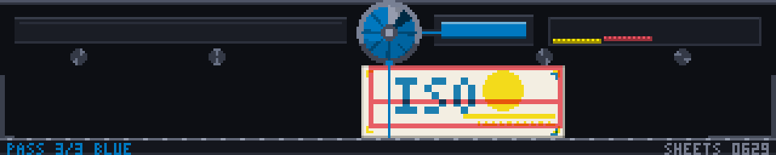

A Risograph duplicator printing, seen along the paper path: feed deck at the
left, ink drum in the middle, catch tray at the right. A sheet slides out of
the deck, passes under the drum, and the ink wipes onto it at the nip. The nip
is a fixed column and the paper is what moves, so the sheet's leading edge —
its right edge — is inked first and the seam between the new colour and the old
sweeps backwards across the sheet, from leading edge to trailing edge, while
the sheet itself slides rightwards. Watch one pass and the new colour appears
out of the drum's contact column and the printed part grows out to the right of
it. It sits in the tray long enough to be looked at,
whips back to the deck, and goes again in the next colour. Between passes the
drum drops out of frame and comes back a different colour, and a new master
burns on the thermal head, because on a real Riso every colour needs both.

The one representation choice: the artwork is never an image, it is **N ink
channels**, one per colour, each a coverage map over the printable area of the
sheet. Rendering is compositing those channels with a per-pass integer offset
and a multiply blend, and everything else falls out of it. Misregistration is
the offset. Overprint colour is the multiply — there is no table anywhere in
the file saying pink over blue is purple, it just is, because Riso inks are
semi-transparent and multiplying two of them is what physically happens.
And the sheet after *k* passes is the *k*-th partial product, so `build()`
bakes the whole cumulative stack once: a frame halfway through laying the third
colour is literally `cum[2]` on the near side of the nip and `cum[3]` on the far
side, the part that has already gone under the drum. Two blits, no arithmetic,
and the wipe boundary is exact — the screenshot above is one of those frames,
with `ISO` printed and the `R` still to come.

The inks are the published Riso colours at their real hex values. Not all of
them work here: multiply is a darkening operator, so the default drawer is
Fluorescent Pink `FF48B0`, Yellow `FFE800`, Orange `FF6C2F`, Bright Red
`F15060`, Green `00A95C`, Blue `0078BF` and Medium Blue `3255A4`, and Federal
Blue `3D5588`, Teal, Purple and Black are left out — two of those over each
other is a black rectangle at three metres, which is authentic and unwatchable.
A job takes at most one dark ink and prints lightest first, which is both what
a print shop does (a light ink cannot cover a dark one) and the only order in
which the last pass still reads as type rather than mud. That ordering is why
the wordmark is always the final colour down.

Every channel goes through a coarse angled dot screen before compositing, each
on its own angle the way a real separation is. Flat coverage stays flat and a
ramp becomes a visible field of dots, which is what makes the sheet read as
printed rather than as a drawn rectangle. The threshold field is squeezed into
(0.02, 0.98) rather than left at (0, 1): coverage of exactly 1.0 has to beat
every threshold in the grid or solids pick up pinholes at the dot centres.

Three built-in artworks, all generated in code — the Flaschen Taschen wordmark
over a graded field with a bottle, a three-colour poster, and a two-ink
landscape whose sun sits deliberately behind a peak so the overlap is
unmissable. Registration marks in every channel at the corners of the plate are
the tell: three passes means three sets of ticks a pixel or two apart, exactly
like the trim edge of a real misregistered print.

What was hard was that same split, twice over, and both times it drew a
perfectly plausible still. The first version split the sheet at `nip - x` in
sheet-local coordinates and clipped that at zero, so once the sheet's left edge
was past the nip the whole thing reverted to the un-inked image: a sheet that
had just been fully printed went blank on its way to the tray. The fix for that
was a guard — if the sheet is entirely past the nip, treat it as fully printed
— and the guard papered over a worse bug underneath, which then shipped. The
two halves were the wrong way round. The paper travels left to right, so the
leading edge is the *right* edge and the fresh ink is on the right, but the
code painted `cum[k+1]` on the left. Every symptom followed: while the sheet was
still approaching, `nip - x` exceeded the sheet width and clipped, so the sheet
arrived already printed; as it advanced it visibly *lost* the new colour; and
then the guard slammed it back to printed in a single frame. The whole thing
read as a stutter rather than as a wipe, and it was only caught by watching it
on the emulator. The right quantity is `(x + ws) - nip`, clipped into `0..ws` —
how much of the sheet has been under the drum — and with the geometry right the
guard is unnecessary, because a sheet fully past the nip clips to `ws` on its
own.

The existing test did not catch it because it compared whole-sheet ink totals
between frames, and a sheet drawn inside out has an entirely reasonable total on
every frame. `scripts/test-riso.py` now drives the module with a stand-in
artwork of two full-coverage separations, which makes every column of the sheet
one of three flat colours and so classifiable by eye and by array, and asserts
the wipe as geometry: at most two ink states across the sheet's width at any
moment, the fresher one entirely on the leading side, the seam between them
pinned to the nip column rather than drifting with the paper, that seam sweeping
the full width monotonically once per pass, no sheet-local column ever losing
ink within a job, and no single frame changing how much is printed by more than
a couple of percent. Reverting the fix fails three of those five. It also still
asserts the overprint pixels against the literal product of the two inks and the
paper.

The travel curve turned out to need no retuning. `path_x` runs the sheet as
three straight segments, and its middle run was already defined as leading-edge-
at-the-nip to trailing-edge-at-the-nip; measured after the fix, the wipe starts
at u = 0.253 and finishes at u = 0.718 of the print phase, so it crosses the
sheet at about 1.8 columns a frame over the middle 47% of the pass, which is
what the easing was designed for all along. It was the blits that were wrong,
not the motion.

```console
$ python3 riso.py --art poster --seed 7
$ python3 riso.py --misreg 4 --screen 7      # sloppy registration, coarse screen
$ python3 riso.py --inks pink,federal,black  # authentic, and much too dark
$ python3 scripts/test-riso.py
```

### cnc

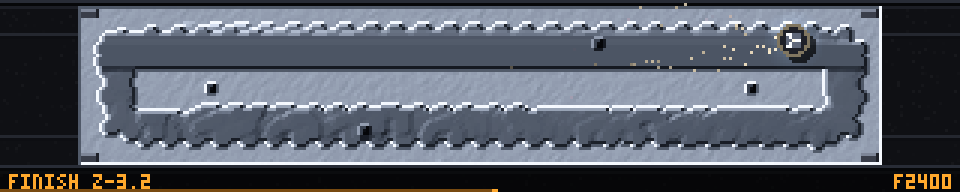

A 3-axis mill cutting a part, seen from straight above: adaptive clearing in
trochoidal loops, drilling, a finishing raster, a contour pass round the walls,
and the shop's name engraved into the island the roughing left behind. Then the
part slides off the pallet and a fresh billet comes in.

This is the deliberate opposite of `printer`, which is additive and side-on.

Everything comes out of one array: **a height Z per panel pixel**, initialised
to the top of the stock. The endmill is a disc, and cutting is

```python
Z[disc footprint] = np.minimum(Z, tool_bottom)
```

which is not a model of milling — a min-composite of the tool swept along the
path *is* the definition of the machined surface. Nothing in the demo draws the
part. The part is whatever is left of the field.

Shading is the **gradient of Z**: a shifted difference in each axis, dotted
with a light direction, on top of a depth term. So the pocket walls, the raised
boss, the through-holes and the individual tool marks are all consequences of
the representation rather than things that had to be drawn. Two terms and their
balance is the whole look: the depth term carries most of the range, because
telling a 3.2 mm pocket floor from the top of the stock at three metres is the
one thing that has to work; the gradient term saturates at about a third of a
millimetre per pixel, so a wall pins bright on one side and dark on the other
while a few hundredths of surface roughness still reads as a tool mark.

The boss is the clearest payoff. It is never drawn and never decided — it is
simply the region the inward spiral does not reach, so it appears at exactly
the top of the stock with a wall the shape of the toolpath. Move the last inset
and it changes size; nothing else has to know.

The adaptive spiral is one traversal. A rounded rectangle is a plain rectangle
Minkowski-summed with a disc, and offsetting it inward only shrinks the disc —
the core rectangle never moves. So walking the core once, carrying an outward
normal, generates the whole family of offset curves as `core + normal * r`, and
a spiral is that walk with `r` decreasing as you go. The trochoidal loops ride
on top of it, a fixed radius rotating about the guide with the phase advanced
per sample, which is what keeps the tool engagement constant and is why modern
roughing looks like this.

The arc from chaos to discipline is one line. Roughing cuts each *loop* a few
hundredths of a millimetre off the others, so the loops stay in the floor as
scallops after the tool has gone; the finishing raster cuts 0.2 mm lower and
erases them, because a lower minimum wins. Halfway through the finish, half the
floor is smooth and half is still a field of loops — that frame is the
screenshot. The offset has to be per loop and not per sample: white noise along
the path is invisible, because the field is a minimum over a five-pixel disc
which takes the deepest of a dozen neighbours and averages it away. Measured, a
per-sample jitter of 0.075 mm left a floor with a standard deviation of 0.011
mm, three levels of brightness. Per loop it survives, because a whole loop's
worth of samples agrees.

`render` is a pure function of `t`, which for a demo that accumulates a height
field takes some care. The whole toolpath — position, tool-bottom Z, feed rate
and operation per sample, plus the cumulative time at each — is generated once
in `build()` from the seed. `render(t)` looks up where the tool is and advances
a cursor, stamping whatever samples it crossed. Because Z only ever decreases
and stamping a sample twice is a no-op, replaying the program from zero gives a
bit-identical field, so a cold `render(t0)` and the same `t0` reached frame by
frame agree exactly, and 8 fps and 30 fps agree exactly. Chips are ballistic
from their birth sample rather than integrated, for the same reason.

A frame is two whole-panel operations — the table copy and the stock blit — and
then only the bounding box the tool actually touched is re-shaded, a couple of
hundred pixels. Desktop mean is 0.10 ms, p95 0.12, max 0.17 over a full cycle.
The one hitch worth knowing about is a cold call at a large `t`, which replays
the whole program in one go: 13 ms on a desktop at the very end of the cycle.
The scheduler starts segments at `t=0`, where the replay is empty, so this
never happens in practice.

The cycle is about 66 seconds and wants 20 fps.

```console
$ python3 cnc.py --speed 1.6 --text 'MADE HERE'
$ python3 cnc.py --stepover 1.0 --trochoid 3.2      # more laps, bigger loops
$ python3 scripts/test-cnc.py --dump /tmp/cnc
```

### plotter

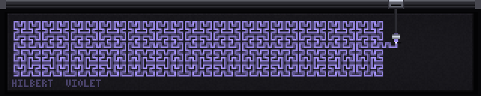

A pen plotter drawing. A carriage rides a rail across the top of the panel, an
arm hangs off it down onto the sheet, and a pen at the end of the arm goes
down, walks a path, comes up, flies to the start of the next one and goes down
again. The line art is not revealed — it is *drawn*, at a feed rate, by a
machine that is visibly in the way of its own work.

A plotter bed is another subject that genuinely is this shape: an X rail
spanning the full width with a sheet under it. The pen crosses the whole 320
columns, and the sheet is a 310x52 rectangle with a footer margin the artwork
never enters, which is where the print gets signed when it comes off.

The representation is **a list of paths, each a polyline in sheet
coordinates**, and the plot is one *tour* over them: travel to the start of a
path with the pen up, drop the pen, walk the polyline, lift the pen, travel to
the next. `build()` flattens that into a single array of moves —
`(x0, y0, x1, y1, kind, t0, t1)`, kind being ink, travel or a servo dwell —
carrying cumulative **times** rather than lengths, so a pen-up dwell sits in the
sequence as a first-class move instead of being special-cased. A frame is then
a lookup: `searchsorted` the current time into `t1` and everything before that
index is finished, the move at that index is in progress, and the pen is
somewhere along it. Everything else — the servo's overshoot, which travel
moves are still ghosting, whether the sheet is coming in or going out — falls
out of the same index.

Ink stays on the paper and travel does not, and that contrast is what the demo
is about. The last few travel moves are drawn as faint dashed lines that decay
over about a second and a half, so you can always see where the pen just came
from. It is also how plotter people think about a file: minimising travel is the
whole optimisation, and every piece with more than a couple of paths gets a
greedy nearest-endpoint reordering at build time — allowed to reverse a path
where that is closer — which takes the flow field's travel from 2500 px down to
500 and turns the ghosts from a cat's cradle into short hops between
neighbours.

**The interesting problem was that an ink buffer is accumulated state, and
`render` may not accumulate.** Anti-aliasing is not optional at 64 rows — a 1 px
diagonal is a staircase — so every stroke is laid into a float coverage buffer
by evaluating the exact distance to the segment over its bounding tile, and a
frame that re-rasterised the two thousand segments already on the paper would
cost a hundred times its budget. The resolution is to define the buffer as a
pure function of one integer: `ink(i)` is "every ink move with index < i,
rasterised", and then *memoise* it rather than accumulate it. The cache holds
`(i, buffer)`. When a frame asks for a larger `i` — the usual case, one to three
moves — the moves in between are added. When it asks for a smaller one, which is
what a cold start, a loop wrap or a preview baker's rewind looks like, the
buffer is restored from the nearest snapshot below it and walked forward;
snapshots are taken every 128 moves as the cache sweeps past them, so they cost
memory and no work at all. Because coverage composites with `maximum`, which is
exact, and the moves are always applied in increasing index order, "restore and
walk forward" is *bit identical* to "walk forward from zero" — which is why the
purity assertion in `scripts/test-plotter.py` compares with `array_equal` and
passes rather than nearly passing. The partially drawn current segment never
enters the buffer at all; it is stroked into a scratch copy each frame, so the
tip of the line is not quantised either.

Five pieces, from the plotter-art tradition, all generated in code:

- **hilbert** — order-4 Hilbert blocks chained across the sheet. The standard
  construction enters at a block's bottom-left cell and leaves at its
  bottom-right, so eight blocks laid side by side join with one ordinary step
  between them and the entire sheet is drawn *without the pen ever lifting*. One
  stroke, no travel, a sheet that gradually fills up rather than being filled
  in. It is the best of the five on the wall and it is the one in the shot.
- **spiro** — hypotrochoids, alternating a large pen offset (the dense woven
  disc) with a small one (an open rosette), because four of the same kind in a
  row is four green blobs. Integer parameters, so each curve provably closes.
- **lissa** — a row of Lissajous figures at rising frequency ratios, which is
  the classic plotter demo sheet and works because the ratio is legible from the
  lobe count at a glance.
- **flow** — streamlines of a smooth vector field; the piece with the most pen
  lifts and therefore the most ghosting.
- **truchet** — Smith tiles, whose quarter arcs all end at cell-edge midpoints
  shared with exactly one arc in the neighbouring cell. Walking that graph
  chains its 138 little arcs into 28 long continuous strokes, which is precisely
  the optimisation a plotter file gets before it is sent, and it takes the piece
  from 138 pen lifts to 28.

Each finishes, holds for a beat so the completed print can be seen, is signed
in the footer margin with its name and pen, and feeds out for a fresh sheet in a
new colour. The whole cycle is a hundred and eighteen seconds at the default
feed rate.

The sheet is dark and the ink glows, which is backwards from paper and right
for the wall — thin bright detail on a dark ground survives being seen at an
angle from three metres and thin dark detail on a lit ground does not.
`--paper light` is the honest white-paper version; it is lovely up close and
much weaker across the room.

Cost is measured in *strokes a frame* rather than pixels, since each stroke is
a dozen numpy calls on a tile of a few dozen pixels and the panel work is
otherwise four passes over a 52x310 sheet: 6.5 strokes a frame on average and
17 in the worst frame, which is 0.35 ms mean and 0.7 ms worst on a desktop. The
dash count on a ghost is capped rather than its length fixed, because a travel
move right across the sheet at a fixed 6 px period is thirty strokes on its
own.

Two bugs worth recording, both of which drew perfectly attractive wrong
pictures. One Truchet arc was written `linspace(pi, -pi/2)` instead of
`linspace(pi, 1.5*pi)` — the same angle, but taken the long way round through
`pi/2`, so a quarter of the arcs bulged out of their cell and off the bottom of
the sheet. It looked like a nice scaly pattern and survived several screenshots;
what caught it was asserting that no ink lands in the sheet's margins. And the
first purity check failed against `round(t*fps)/fps` rather than against `t`,
which on a demo that moves a pen two pixels a frame compares two different
moments and reports a cache bug that does not exist.

```console
$ python3 plotter.py --piece hilbert --pen amber
$ python3 plotter.py --paper light --speed 240 --line 1.4
$ python3 plotter.py --piece flow --no-ghost      # what it loses without them
$ python3 scripts/test-plotter.py
```

### fine

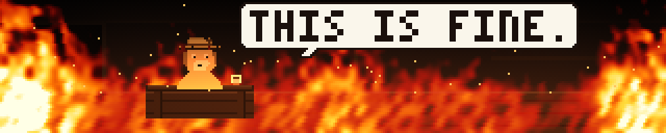

A dog in a hat sits at a small table with a cup of coffee while the room fills
with fire. It blinks. Three times a cycle it lifts the cup, drinks, and puts it
back down. Around it the flame walks from one corner of the room to the whole
of it, the shelf and the picture blacken, the ceiling fills with smoke, and the
hat gets a little singed. Then the line lands, once, and holds.

The whole joke is the calm, so the demo's one hard rule is that the dog does
not react. `scripts/test-fine.py` asserts it in pixels: over nine hundred
frames the dog's own pixels change at most eight times, and every one of those
is the room's baked lighting stepping or the hat catching. The eyes are the
only thing that moves, and they only ever shut.

Everything is drawn in code from a description — the dog, the hat, the table
and the cup are character grids with a palette, as in `mario.py` and
`nyancat.py`, and the room is rectangles. Nothing is traced or downloaded.

**The fire is the interesting part.** The classic effect in `fire.py` is
inherently stateful: each frame takes the heat buffer the previous one left,
shifts it up a row and cools it. That cannot be a pure function of `t`, and on
this wall it has to be — the scheduler builds segments ahead on a worker thread
and starts them at `t=0`, and the preview baker steps at its own rate. Rerunning
sixty simulation steps from a fixed seed every frame would restore purity and
cost sixty whole-panel passes, which is not affordable on a Pi.

So the flame here is a field rather than a simulation:

```
heat(y, x, t) = clip(fuel(x, stage) * turbulence(x, y + scroll(t)) - height(y))
```

`turbulence` is one noise texture baked in `build()` — a low-resolution random
field, upsampled, blurred with wrapping rolls, and leaned by a shift that is
*itself* periodic in the tile height. That last detail is the one that took a
second attempt: the obvious lean is a linear shear, roll row `y` by `y/6`
columns, and over a 264 row tile that totals 44 columns, so at the wrap the
shift snaps back to zero and a 44 pixel step walks up the panel once per loop,
looking exactly like a torn scanline. A sinusoidal shift wraps for free, and a
wandering lean is closer to what a draught does to flame than a constant one.

Because the texture wraps top to bottom, scrolling it is a slice of a doubled
copy at `int(t * scroll) % tile_h` — no modulo arithmetic, no copy, no state.
`fuel(x, stage)` is a baked per-column profile and is what walks the fire from
the far corner to the whole room; `height(y)` is distance above the floor line,
so subtracting it is what gives each column a flame that runs out somewhere.
Six whole-panel numpy calls, pure in `t`, and it reads as fire because the
palette carries it.

The room's light is baked the same way. `build()` paints the room twice, clean
and charred, and renders `--stages` fully lit frames interpolating between them,
each with its own orange bounce and its own ceiling smoke. A frame picks one by
index, so the entire background — including the furniture blackening and the
room going dark around the fire — costs one `np.maximum` against the flame. The
dog and the cup are lit from that same field sampled at the rows they occupy,
which is what puts them *in* the light instead of on top of it.

The punchline is the repo's 3x5 font at scale 3, with a one-pixel dark outline
in every direction — on a panel that is by then entirely orange, white type
without one is unreadable. Its box is measured from the mask that is actually
drawn rather than assumed from the scale, and the test asserts every glyph
pixel including the bottom row is lit, which is the check that would have caught
the bug that once clipped the base off every capital `E` on this wall.

Timing is the joke, so the line lands at 76% of the cycle: long enough after
the room has gone that you have had time to notice the dog is not going to do
anything about it. The last second and a half is a fast collapse back to a
clean room, because a room slowly un-burning is the one shot in the loop that
cannot be sold.

0.19 ms mean a frame on a desktop (p95 0.22, max 0.24), about 45 numpy calls
of which nine touch the whole panel. 46 second cycle at 20 fps.

```console
$ python3 fine.py --cycle 30 --scroll 26
$ python3 fine.py --no-text --stages 40      # just the room, smoother light
$ python3 scripts/test-fine.py
```

**The line is dialogue, so it is drawn as dialogue.** The first cut set the
punchline as centred white type across the top of the panel with a one-pixel
halo around every glyph, and it read as a caption laid over the scene -- the
wall announcing the joke rather than the dog saying it. It is now a speech
bubble: dark ink on a light rounded ground, with a tail that points at him.
That also fixes the legibility problem more honestly than the halo did. By the
time the line appears the room is entirely orange, and white type on orange
needed an outline traced around every letter to survive; a light bubble gives
the type its own ground, so the contrast comes from an object in the scene
rather than from a per-glyph trick.

The bubble is sized from the measured glyph mask rather than a fixed box, so
`--text` and `--text-scale` grow it instead of overrunning it. Placement aims
the *tail's tip* rather than the box, which is what puts the bubble over his
shoulder; and when the text is large enough that the bubble will not fit above
his head, it moves alongside him instead, because the one thing it must never
do is overlap the dog. `bubble_layout()` is module scope so the test checks the
drawn bubble against the same geometry the demo draws from -- the banner's
placement formula had been copied into the test, which is the arrangement that
lets a demo and its test drift apart while both stay green.

### dither

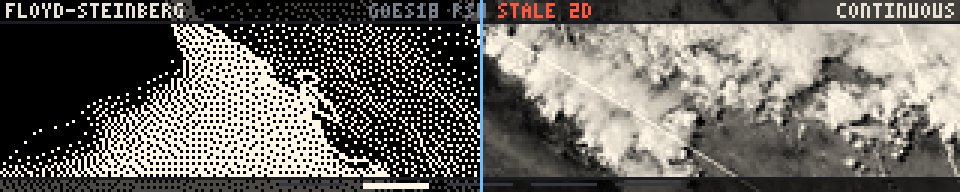

One photograph, quantised five ways, with the boundary sliding across it. An
LED matrix *is* a dithering device — every picture on this wall is a
quantisation of something continuous — so this panel is the wall showing its
own working. A satellite frame is on screen, a wipe travels across it, and on
either side of the wipe the same image is rendered by a different quantiser:
continuous tone, then **Floyd–Steinberg**, then **Atkinson**, then **ordered
Bayer 8x8**, then a hard **threshold**, each named in the strip at the top of
its own half. The ladder is monotone in how much of the quantisation error a
method bothers to account for, which is the argument the panel is making.
Floyd–Steinberg pushes all of it into the pixels it has not visited yet and
reproduces the picture's mean brightness exactly. Atkinson — out of the 1984
Macintosh — pushes six eighths and throws a quarter away, which crushes the
darkest and lightest few percent and in exchange gives that bright, open
MacPaint look. Bayer does not diffuse at all, and its fixed threshold matrix
weaves a crosshatch that is the same everywhere. Threshold accounts for
nothing, and the gradients go to slabs.

The picture comes from `goes-psw`, the same cached GOES-18 GeoColor window
`goes.py` plays as a time lapse, which `ftdata.py` has already cropped to
exactly 320x64 — so there is nothing to resample and no second product to
fetch. Weather from orbit turns out to be close to an ideal dithering subject:
huge smooth gradients of ocean, haze and valley with hard bright cloud on top
of them. One frame out of the seventy-odd is picked and held. The wipe is the
motion here; a time lapse underneath it would be a second idea on a panel that
is allowed one.

**The one representation choice is that every state of the panel is a whole
baked frame.** Error diffusion is strictly sequential — each pixel's decision
depends on the residue left by the one before it — so there is no vectorised
form and no way to do it per frame; a Python loop over 20480 pixels is tens of
milliseconds on a laptop and the better part of a second on the wall's Pi.
So `build()` runs each quantiser once and produces ten finished 320x64 uint8
panels, dot pattern and captions and ladder ticks and all, and `render(t)`
copies the left part of one and the right part of another and writes a single
bright column between them. Three numpy calls a frame, no arithmetic, no
allocation, and a demo that is trivially a pure function of `t` because there
is nothing left in it to have state. The performance design and the purity
requirement turned out to be the same design.

That baking is also why the labels work. Each panel carries its own algorithm's
name at *both* ends, which looks redundant on a panel showing one algorithm and
is exactly what makes the wipe read: composited as the left half, a panel's
right-hand name is hidden under its neighbour's and vice versa, so during a
crossing the incoming name is at the left and the outgoing name at the right,
and when the crossing finishes the label simply stays where it is. No
typesetting per frame, and no pop when a wipe ends. The ladder ticks along the
bottom are baked the same way, so the marker walks across with the boundary.

**Two things had to be found by looking rather than reasoned about.** The first
was tone: the obvious pick for "best frame in the window" is the one with the
most contrast, and the highest-contrast GOES frame is bimodal — black ocean
under white cloud — which quantises to a silhouette that all four methods
render identically. What shows a dither off is *midtone*, so both the frame and
the punch-in window are chosen on how much of them lands in the middle of the
range, and a gamma of 1.25 pulls a bright daylight frame back off the white
clip. The second was that Atkinson and Bayer look the same at 1:1 on a subject
this busy, which is why there is a second act: the panel steps into an 80x16
detail of itself at 2x and then 4x — integer magnifications of the *dithered
output*, so what is on screen is the real dot pattern with each dot four LEDs
across — and runs the wipe again between the two, where Bayer's regular weave
and Atkinson's clumpy organic dots are unmistakable. It steps into the
threshold panel first, which at 4x is a blank white slab, which is the joke.

Everything is one warm ink on black. Dithering to a small colour palette on
half the panel was tempting and is a second idea; what makes these algorithms
legible from three metres is black-and-white dot texture, and the
continuous-tone region uses the same ink at 256 levels so the two sides of the
first wipe differ in exactly one property. The only colour anywhere is the
one-pixel wipe edge, cold blue, which is furniture.

The three cache states are the usual three, except that the absent one does
something better than a card: with no cached imagery at all, `build()` draws a
lit sphere over a graded ground with a linear ramp bar beside it — the classic
thing you dither to show a dithering algorithm off, generated from arithmetic —
and says `TEST IMAGE` where the satellite's name goes. Stale imagery plays as
it is with the age in red, because the subject of this panel is the arithmetic
and two-day-old cloud dithers exactly as well as this morning's.

```console
$ python3 dither.py --stats                 # build timings and per-method error
$ python3 dither.py --source test           # the generated subject
$ python3 dither.py --wipe 6 --no-zoom      # slow, the ladder only
$ python3 dither.py --zoom-factor 2 --gamma 1.5
$ python3 scripts/test-dither.py            # 57 checks incl. all three states
```

The cycle is 28.8 s at 20 fps. Desktop cost is 0.003 ms a frame mean, p95
0.003, max 0.009 — it is two memcpys — and `build()` is 32–80 ms, of which the
two diffusion loops are about 15 ms; on the Pi expect roughly a second of
build and well under a millisecond a frame.

### dvd

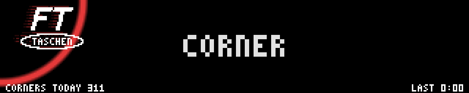

The bouncing screensaver logo, and the wait for it to land exactly in a corner.
Everyone knows the ritual: the logo drifts, changes colour on every bounce, and
the room waits. That wait is the whole demo, so the panel keeps score — corner
hits since local midnight, and how long since the last one, in burn-in grey
along the bottom.

**The wordmark is ours, not the DVD Video mark.** "FT" in a sheared 3px slab
over an ellipse reading TASCHEN, drawn in the file as a character grid and a
conic. The joke lives in the silhouette and the behaviour, and it is funnier
being ours.

**The corner period is chosen, not discovered.** Free travel is `Sx = W - logo
width` and `Sy = H - logo height`, and ideal billiard reflection makes each
axis a triangle wave, so the position is closed form: `x(t) = fold(vx·t, Sx)`
with `fold(u,S) = |((u+S) mod 2S) − S|`. x is against a wall whenever `vx·t` is
a whole multiple of `Sx`, y whenever `vy·t` is a whole multiple of `Sy`, and a
corner is both at once. Rather than pick a velocity and go hunting for corners,
pick the corner period `T` and two **coprime** integers — `q` traverses of the
long axis and `p` of the short one in that period — and read the velocities
off: `vx = Sx·q/T`, `vy = Sy·p/T`. Coprimality is what makes the two
wall-contact sets meet only at multiples of `T`, so a hit is exactly every `T`
and never a second early. That single choice is the demo.

**What T should be is the real design decision.** `T = 180 s, q = 31, p = 83`
(both prime, so coprime by inspection) gives 47.7 and 16.1 px/s, a 19-degree
drift, a bounce off the top or bottom every 2.2 seconds and a full traverse of
the long axis every 5.8. A rotation slot is 30–45 s, so roughly one slot in
five contains a hit: rare enough that catching one is an event, common enough
that standing and watching pays off within three minutes. Twenty seconds would
kill the joke; twenty minutes would make the panel a dud that nobody ever sees
pay off. Both `p` and `q` are odd, which makes successive hits alternate
between diagonally opposite corners. The near misses — closest is 1.1 px — are
frequent and are the point.

**It is driven by the wall clock**, anchored to an absolute epoch captured in
`build()` rather than to the segment's `t = 0`. With segment time the panel
would replay the same three minutes on every appearance: either every slot has
a hit at the same second or no slot ever does, and both are fatal. Anchored to
the clock, the logo is where it would be if the screensaver had genuinely been
running since before you walked up, the counter is real, and walking past twice
shows two different states. `--epoch` pins it for tests and screenshots.
`render()` is still a pure function of `t` for any one `build()`.

**Two things went wrong and are worth recording.** The ellipse was 9 rows tall
first, and at ±2 rows off centre it has already pinched in to less than TASCHEN
needs, so the ring ate the outer letters and the logo read IASCHEI; the fit is
now asserted at build with a one-pixel clearance, and it fails loudly rather
than shaving the type. And the counter first computed midnight against the
segment's own epoch instead of the trajectory clock, which put nine million
corners on the panel — plausible-looking, wrong by a constant, and invisible in
a thumbnail, so the count is now read back off the pixels in the test.

A frame is a copy of black, three small masked blits (two of them dim,
scanline-combed phosphor ghosts that follow the same closed form and so bend
round a bounce by themselves) and two short strings: 0.03 ms on a desktop, and
the only whole-panel arithmetic is the shockwave ring, which runs for 1.6 s in
every 180.

```console
$ python3 dvd.py --corner-period 60           # impatient
$ python3 dvd.py --sweeps 17 --bounces 44     # a different billiard
$ python3 scripts/test-dvd.py --bench
```

### wiki

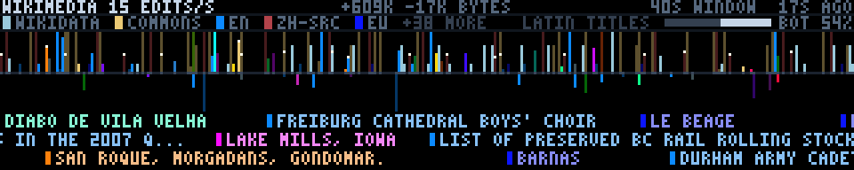

Forty seconds of Wikipedia being written, played back at the speed it happened.
Every change to every Wikimedia wiki — nine hundred of them, three hundred
languages — goes out on one public event stream in real time, tens of edits a
second, continuously. This panel is one stroke per edit, arriving right to left,
rising above the line for bytes added and falling below it for bytes taken away,
with the titles of the articles crawling underneath in three lanes.

The titles are the point. LA MANO CHE NUTRE LA MORTE. FREIBURG CATHEDRAL BOYS'
CHOIR. LIST OF PRESERVED BC RAIL ROLLING STOCK. SAN ROQUE, MORGADANS, GONDOMAR.
2026 UNITED STATES GUBERNATORIAL ELECTIONS. LAKE MILLS, IOWA. They are absurd
and human and never the same twice, and everything else on the panel is arranged
so that somebody walking past reads two or three of them and understands,
without being told, that this is an encyclopedia being written right now by
people they will never meet.

**It is the only panel here that draws events rather than a state.** Tides, grid
mix, air quality, aircraft, the routing table — every other data demo on this
wall is a picture of how things are at a moment. A firehose is not that, and the
one thing it has that a snapshot does not is *burstiness*, so nothing here is
averaged into a rate. The horizontal axis is time and a stroke's column is when
its edit actually happened, to the millisecond. Where four edits land inside a
tenth of a second the strokes pile into a picket; where the stream draws breath
there is a gap. A chart of edits-per-second would have been much easier and
would have thrown the whole subject away.

**One representation choice made everything else fall out: the window is a
strip.** Lay the forty seconds out along its own time axis at twenty pixels a
second, draw every stroke and every title into that 790-pixel image once, then
scroll it at twenty pixels a second. Playback is then exactly 1:1 with reality
for free, the burstiness is preserved by construction rather than by any code
that thinks about it, a title can crawl along underneath the stroke it belongs
to because they are the same object at the same x, and `render()` is two slice
copies. At twenty frames a second the strip advances exactly one pixel a frame,
which is the smoothest a crawl can be, and it is why twenty is the default for
both numbers.

**Three encodings, and only one of them needs a key.**

  * **Up or down** is added or removed. Nothing else uses the vertical axis, so
    there is nothing to disambiguate at three metres: a panel leaning upwards is
    an encyclopedia growing, which most minutes it is — a typical window adds
    about 600 kB and removes about 20 kB. Both directions use the same
    bytes-per-pixel scale, so a deletion is never made to look bigger than the
    addition that undid it, and the lower half of the panel being nearly empty
    is a true statement and not wasted space. When a rare deep one does arrive —
    a blanking, a revert of a big paste — it punches a long spike downwards and
    it is the most conspicuous thing on the wall.
  * **Height** is the size of the edit, square root against a 900-byte full
    scale. A typo fix is two pixels, a paragraph is six, somebody pasting a
    filmography hits the top. Square root because the median edit is thirty
    bytes and the largest in a window is twenty thousand: linear draws the
    median — which is most of the panel — as nothing at all.
  * **Colour** is the project: hue from the language, saturation and value from
    the family. The English, Spanish and Basque Wikipedias are three different
    colours; `fr.wikipedia` and `fr.wiktionary` are two shades of one violet.
    Commons and Wikidata have no language and get colours nothing else uses — a
    dusty gold and a pale steel — and being the two least saturated things on
    the panel is deliberate, because between them they are usually half the
    traffic and the language projects are the interesting minority.

Two colour schemes were tried and thrown away first. A hue straight off a hash
of the wiki name gives forty unrelated colours: confetti, pretty for one second
and unreadable after that, and it puts `enwiki` and `enwiktionary` in unrelated
places. A hue by family alone — all Wikipedias blue, all Wiktionaries green —
reads beautifully and discards the language, which is the more interesting axis.

**Brightness is the bot share, and that is the fact the panel most wants to get
across.** Somewhere between half and two thirds of all edits are made by
software: category maintenance, interwiki links, Commons file housekeeping,
Wikidata bots grinding through a database import. They are drawn at 40% of a
human edit's brightness, so the panel is a dim churning mass with bright human
strokes standing out of it, which is the true shape of the thing. The number is
printed anyway, with a two-segment bar beside it, because "more than half the
edits to Wikipedia are made by robots" is worth stating outright.

**The titles are Latin-script only, and the panel says so.** The font is
`defcon.py`'s 3x5 bitmap — A-Z, digits, and a dozen punctuation marks added here
because article titles are full of apostrophes, commas and parentheses and
ST. MICHAEL'S ABBEY (ORANGE COUNTY, CALIFORNIA) with those silently dropped is a
different title. Roughly 44% of main-space titles in any window are Cyrillic,
CJK, Devanagari, Arabic or Hebrew, and a wall of tofu boxes is a failure rather
than a compromise. So the two channels split: **colour carries every project,
including the ones whose script cannot be drawn; type carries only the ones that
can.** The strokes from `ruwiki` and `zhwikisource` are up there in their own
colours doing their share of the work, their titles simply never enter the
crawl, and the key says LATIN TITLES so that nobody concludes the encyclopedia
is written in English. Accented Latin is folded rather than rejected — NFD, drop
the combining marks, plus a short table for ß, æ, ø, ł, þ and the rest that do
not decompose — which is what keeps Spanish, French, Czech, Portuguese and
Basque in the crawl instead of only English.

**Privacy, which is why this source needed care.** Every message on the stream
carries `user`: a username for a registered editor, and a bare IP address for an
anonymous one. It never reaches the cache, because `ftdata.py` never reads it
into anything — there is no field for it, no hash of it, and no count keyed on
it. Nor is there any handle that could be turned back into it: the edit
summaries go (free text written by a person, routinely naming people), and so do
the revision ids and notify URLs, because a revision id is a one-call lookup
back to its author and keeping one would be keeping `user` in a costume. Titles
are kept only from namespace 0, which is both the privacy rule and the quality
rule in one line: `User:Someone/sandbox` is a person's name in the title field,
and main-space article titles were the only ones this panel wanted. What is
stored is the public shape of the encyclopedia and nothing about who wrote it —
article titles, database names, byte deltas, the bot flag, the millisecond.
`scripts/test-wiki.py` asserts all of that against the *live* record rather than
a synthetic one, including a sweep for anything shaped like an IPv4 or IPv6
address anywhere in the JSON.

**Why it is a recording.** The wall cannot hold a socket open — `ftsched` builds
segments on a worker thread, and a `build()` blocked on a network read stops the
render loop getting the interpreter back — so the fetcher opens the stream,
listens for forty seconds, aggregates, and hangs up. What is on the panel is
therefore the last window Wikipedia published, and the age is in the top right
corner like every other data panel here. Forty seconds of firehose is about
1.7 MB off the wire, because every message carries the full rendered HTML of its
edit summary whether you want it or not and there is no server-side filter to
ask for less; that is the largest per-fetch number in `ftdata.py` and is why the
interval is fifteen minutes and not five. It becomes a 13 kB record: 560 events
as three parallel integer lists, sixty candidate titles, and a dozen aggregates.

Slightly over half of what arrives is thrown away before any of that. The stream
is 36 messages a second, but more than half are `categorize` — MediaWiki emitting
one message per category as a page's categories change, machine bookkeeping about
an edit that already has its own message — and `log` is account creations, blocks
and deletions, which is the identity-adjacent part of the stream and nothing this
panel wants. What is left is `edit` and `new`: about 15 a second, and that is the
number on the wall.

The `new` ones — an article that did not exist a second ago — get a white pip at
the tip of their stroke. There are a few dozen a window and they are the single
most interesting event in the stream.

```console
$ python3 ftdata.py --once --only wiki-stream     # 40 s of listening
$ python3 wiki.py --host 127.0.0.1
$ python3 wiki.py --speed 32 --lanes 2            # faster crawl, fewer titles
$ python3 wiki.py --full 3000                     # only big edits get tall
$ FT_DATA_CACHE=/tmp/empty python3 wiki.py        # the no-data card
$ python3 scripts/test-wiki.py
```

### solarwind

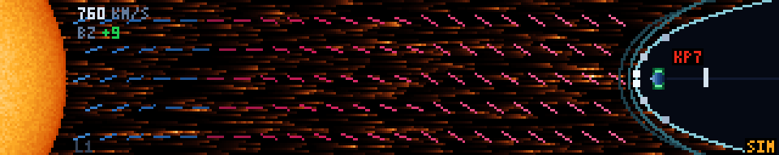

The Sun on the left, the Earth's magnetosphere on the right, and the hour of
solar wind that is in flight between them drawn in the middle — with the
interplanetary field it is carrying, and what that field is doing to the Earth
when it arrives. Three small numbers: wind speed, Bz with its sign, Kp.
Everything else on the panel is a picture.

`propagation.py` already reads these same NOAA numbers and lays them out as an
instrument panel for a ham choosing a band. This is deliberately not that. The
numbers cannot say *where* the plasma is, which way the field in it points, or
that the thing about to make Kp bad is already halfway here — and those are
exactly the things a 320x64 letterbox is the right shape to show.

**The one representation choice, from which everything else falls out: x is
distance, and distance is also time.** SWPC publishes
`products/geospace/propagated-solar-wind-1-hour.json` — one row a minute for
the last hour, measured at L1, each carrying a `propagated_time_tag` saying
when that plasma reaches the bow shock. At ordinary wind speeds the trip takes
about fifty minutes and the file holds sixty, so the file is, near enough, an
inventory of the plasma currently between the spacecraft and us. Draw the
oldest row on the right and the newest on the left and the result is not a
chart with a time axis pretending to be a picture; it is a picture, with the
plasma in the right places. The stream flows rightward because the plasma does.
A southward patch of field sits at the x where that patch actually is. And the
magnetosphere is squeezed by the *rightmost* sample — the one arriving now —
not by the headline figure at the left, which will not get here for another
three quarters of an hour.

**Scale, honestly.** The corridor covers one hour of travel, about 0.01 AU. The
other 99% of the way to the Sun is simply not drawn: the limb at the left edge
is an emblem of where the wind came from, and at true scale the Sun would be a
hundred panels further left and the Earth would be one pixel. Inside the
magnetosphere the scale is real and consistent — 1.55 panel pixels per Earth
radius — with only the planet itself drawn about four times oversized, because
otherwise an aurora is half a pixel. So the compression is a true compression
even though the corridor is not to scale, and that is the trade the panel
makes.

**The magnetopause is the Shue model, not a doodle.** Shue et al. (1997) fit
the standoff distance and the flaring of the boundary to two inputs, Bz and the
dynamic pressure `1.6726e-6 n v²`:

    r0    = (10.22 + 1.29 tanh(0.184 (Bz + 8.14))) · Dp^(-1/6.6)
    alpha = (0.58 - 0.007 Bz) (1 + 0.024 ln Dp)
    r(θ)  = r0 (2 / (1 + cos θ))^alpha

A quiet day puts the nose at about 10.9 Earth radii; 22 protons per cc at 800
km/s with Bz at -18 puts it at 5.6, and the cavity on the panel visibly caves
in. The bow shock is drawn at 1.3 r0, which is a rule of thumb rather than a
model, and the magnetosheath between the two is the brightest plasma on the
panel because that is where shocked plasma piles up. When the nose has come in
by more than a couple of radii, a dotted ghost of the quiet-day boundary stays
behind, so that the compression reads in a single frame instead of needing
somebody to remember yesterday.

**Why the field is a comb and not field lines.** The first version integrated
honest field lines across the panel, and they were beautiful for eighty columns
and then left through the floor — which is not a bug, it is what a sustained
southward Bz *means*. So the field is drawn the way a wind field is drawn on a
chart: short dashes on a staggered grid, each tilted by the local clock angle.
A uniform field lines them up into what reads as continuous lines; a rotation
passing through visibly turns the comb over. Colour is binary and carries the
message — cool blue for northward, hot magenta for southward — and brightness
within each band is |Bz|/|B|, so a field that is strongly one way shouts and a
flat one recedes. The staggering matters: aligned, the dashes read as diagonal
hatching over the whole panel and fight the stream underneath them.

**The chain the panel exists to teach.** When the field arriving at the nose is
southward, reconnection knots appear at the subsolar magnetopause and slide
back along both flanks, the tail's X-line flashes a beat later, and the poles
light up. When it is northward, none of that happens and the aurora is a dim
smudge. Southward Bz → coupling → aurora is the one idea here, and it is drawn
as a cause and an effect rather than written down.

**What it costs.** The whole panel is a uint8 *index* image through a single
256-entry palette cut into bands — plasma 0..63, north field 64..95, south
field 96..127, shock, aurora, sun, sparks, cavity, type — so every layer
composites in integers and colour happens exactly once, in one `np.take`. The
streaming plasma is a seeded streak texture baked in `build()`, made periodic
in the panel width and stored twice side by side, so scrolling it is a *slice*:
no roll, no take, no cost. Everything static is baked into one overlay and
stamped in with a single `np.copyto(where=)`. That leaves five whole-panel
numpy calls a frame plus a dozen writes of a handful of pixels for the sparks
and the poles: 0.06 ms a frame on a desktop, and on the wall's Pi 3 it is the
cheapest data panel here after `propagation`. Greying out a stale panel is done
to the palette in `build()`, so `render()` never learns that anything changed.

**Fresh, stale, absent.** The age is in the bottom-right corner always. Past
the TTL the whole palette desaturates and the age turns amber; past three TTLs
it greys out hard and the numbers become `--`, because a confident picture of
an hour of solar wind that is in fact six hours old is worse than no picture.
With no record at all it draws a no-data card naming the fetcher. And anything
drawn from `--storm` or an override says `SIM` where the age goes, because a
synthetic severe storm labelled "0s" is a panel claiming a G4 is happening
right now.

Data: `swpc_l1_wind` in `ftdata.py` — the propagated L1 wind (6.6 kB of JSON
trimmed to about 1.9 kB of four parallel arrays) plus the Ovation hemispheric
power in gigawatts from `text/aurora-nowcast-hemi-power.txt`. TTL an hour,
fetched every ten minutes. Kp is read from the existing `swpc_kp` product
rather than fetched again, so this panel and `propagation` can never disagree
about whether there is a storm.

```console
$ python3 ftdata.py --once --only swpc_l1_wind    # the fetcher
$ python3 solarwind.py --host ft.local
$ python3 solarwind.py --storm                    # a G4, which is rare
$ python3 solarwind.py --bz -18 --speed 750 --kp 7
$ FT_DATA_CACHE=/tmp/empty python3 solarwind.py   # the no-data card
$ python3 scripts/test-solarwind.py               # 51 checks, incl. the Shue fit
```


### solar

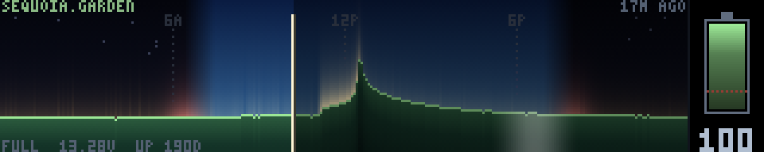

Will our own website survive the night? sequoia.garden is Sequoia Fabrica's
website — this makerspace's website, on a machine in this building, on a 12 V
battery behind a solar panel — and its front page says so itself: *"This is a
solar powered website. It may go offline!"* Nothing else on this wall is ours in
that way. `sfmix` and `bgp` are infrastructure we happen to sit near, `caiso` is
the whole state's grid seen from orbit; this is one battery, one panel, one
small computer, and it can actually lose. The panel draws its last twenty-four
hours as a landscape: terrain that rises and falls with the battery voltage, a
sky lit by the sun and glowing where charge actually went in, a cursor at the
present moment, and a battery in the right-hand margin with the state of charge
in it.

**One column per five minutes, and every other decision falls out of that.**
The endpoint publishes `sparklines`: seven parallel arrays of 288 buckets, with
`sparkline_meta` giving `bucket_ms` 300000 and `window_ms` 86400000 — exactly
one day at five-minute resolution. The panel is 320 columns wide. 288 of them
are the day at native resolution with no resampling, no interpolation and no
decimation, and the remaining 32 are the readout. It is the rare case where the
source and the display already agree about how wide a moment is, and the whole
design is just refusing to spoil that.

**x is time of day, not "the last twenty-four hours".** Those are the same 288
buckets either way, but binning them by *local time of day* rather than by age
nails dawn and dusk to fixed columns — midnight at the left edge, noon at column
144, midnight again at the right — so the lit band sits in the middle of the
panel every single day and the overnight trough is always the two dark ends.
Somebody who walks past this wall twice a week is then looking at the same
picture, differently lit, which is worth a great deal more than an axis whose
landmarks slide a column every five minutes. The cost is that the columns to
the right of the cursor are *yesterday's* tail rather than empty space. They
are drawn at six tenths brightness to say so — and six tenths is the second
number that went there. The first was a third, which looked correct in the
abstract and was wrong in practice: at nine in the morning, when a makerspace
fills up, the cursor is a third of the way across and *the entire solar event is
on the yesterday side*, so a third threw away the best part of the picture for
most of the hours anybody is standing in front of it.

**The battery turned out not to be the interesting variable, and finding that
out changed the panel.** The bank sits at 99.7–100 % state of charge essentially
all summer; a "battery fills and drains" chart of that is a flat line and there
is no picture in it. What is *not* flat is the terminal voltage: it sags all
night to about 13.24, lifts at first light, spikes to the charge controller's
absorb voltage — 14.32 V was observed at noon in August — and decays through the
afternoon. So the terrain is voltage, scaled to the day's own range with a floor
under the span so that a becalmed day is not amplified into a mountain range out
of sensor noise. The needle at midday is real and it is that sharp: it is the
controller hitting its absorb limit for two buckets and then backing off.

**The sky is two different things at once, and the gap between them is the
point.** Its blue comes from the *computed* solar elevation for this latitude
and this date — astronomy, what light was theoretically available — mixed
between a night gradient and a day gradient over the first twelve degrees of
elevation. The warm glow hugging the ridge comes from the *measured* charge
current, which runs 5–15 mA in the dark and past 300 mA at solar noon, and it
falls off exponentially above each column's own terrain so it moves up and down
with the hill under it. On a clear day the two agree and there is a white-hot
band over the hill at midday. On a foggy San Francisco week the sky is bright
blue and the ridge stays dark, and that difference — *the sun was up, and we got
nothing* — is the case this whole panel exists to be ready for. Both gradients
are darkest at the top, which is also how a real sky works and, more usefully,
means the header type sits on the deepest colour on the panel at every hour.

**Three states, because the demo is about fragility.** Fresh and full is serene,
and it is most of the time; that is allowed to be the boring case. Draining
tenses up — the ridge goes amber and then red, the ground turns from garden
green to something dry, and the state of charge blinks once it is under the
reserve mark drawn dashed across the battery. That mark is the reason the case
is worth 44 rows: without it the empty space above the level is just dark.
Silent is the funny one. If the record has aged past three TTLs — ninety minutes
of nobody answering — the panel stops pretending, dims the last day it *did* see
to two fifths as a ghost behind the words, and prints `NO ANSWER`,
`SEQUOIA.GARDEN LAST SPOKE 3H AGO` and `IT DID SAY IT MIGHT`. It does not claim
the site is down, because from the wall a dead server and a dead fetcher are
identical silences; it quotes the site's own warning back at it, which is true
either way. The site's separate `data_stale` flag — the web server answering
while the battery monitor behind it has gone quiet — is a different failure and
reads `QUIET` on a panel that still draws.

**Politeness is a design constraint here, which is new.** The fetch interval is
fifteen minutes, deliberately slower than the five-minute publication cadence,
because every request costs *that* battery a little radio and a little CPU and
it is the battery on the panel. Three extra columns at the right-hand edge are
not worth it from three metres away. The server is also, unsurprisingly,
sometimes slow to answer, so the timeout is thirty seconds and a failure simply
leaves the last record in place with an honest age on it. About 6 kB lands in
the cache: three of the seven published series rounded to the precision that
survives being drawn on a 64 row panel, plus a dozen scalars. `powerUsage` is
reconstructible from the other two and goes; `load_W`, `p_in_W` and
`powerUsage` all read exactly 0 for long stretches while the current is plainly
nonzero, so none of the three is trusted for anything the panel prints.

**Frame budget.** Everything is baked in `build()` — the sky field, the terrain,
the stars, the battery and every string — including both degraded cards, which
in an earlier draft re-rasterised three strings every frame and cost five times
what the panel with data on it cost. `render()` does one full-frame copy, two
ops for a sweep that only touches the ground, and writes a handful of short
columns: seven or eight numpy calls, none of them scaling with anything a knob
controls. Measured over 1500 frames: **mean 0.021 ms, p95 0.030 ms**, worst
frame 0.35 ms; the silent card is 0.014 ms and the no-data card 0.002 ms.
`build()` is about 3 ms, most of it a Python loop over 288 buckets doing a
`localtime()` and a solar-elevation series apiece — call it a third of a second
on the Pi, once, on the worker thread.

The one thing worth knowing about the sweep is why it is masked to the ground.
`caiso` lifts everything lit towards white and that works because its panel is
mostly black. This one has a lit sky across most of its width, and an unmasked
sweep was a travelling white bar. Baking the delta as zero everywhere except
the terrain costs nothing per frame and fixes it.

```console
$ python3 ftdata.py --once --only solar-garden
$ python3 solar.py --host 127.0.0.1
$ python3 solar.py --soc 24            # a foggy week, simulated — stamps SIM
$ python3 solar.py --off               # the website is not answering
$ python3 solar.py --quiet-sensor      # the site answers, its monitor does not
$ FT_DATA_CACHE=/tmp/empty python3 solar.py
$ python3 scripts/test-solar.py
```

### muni

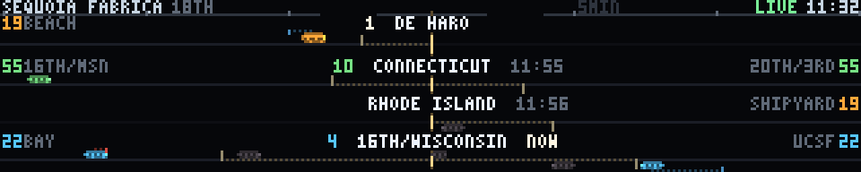

The 19, 22 and 55 — the three buses the makerspace wiki names as ours —
approaching our own front door, drawn against the walk you still have to do to
meet them. It answers one question, the one somebody walking past the wall
actually has: **do I need to leave now?**

That question has two halves and every departure board in the world shows one
of them. "22 in 4 minutes" is useless on its own, because the 22's stop is
413 m away and that is seven minutes of Potrero Hill. The bus is not early; you
are late. So the panel draws the other half **on the same axis, to the same
scale**. The left edge is the door. Rightwards is twenty minutes of time, and
because you walk at a roughly constant speed, rightwards is also distance — one
pixel is about four seconds either way. The dotted stretch running out of the
door is the walk to that route's stop, ending in a post. Buses slide left along
the street and reach the post at the moment they reach the stop.

Everything then reads without a legend, because the geometry *is* the answer.
You leave the door and walk right; the bus comes left. **While a bus is still
right of the post you can make it. Once it is inside the dotted stretch it is
gone** — it will reach the stop before you can — and it goes grey to say so.
The number printed just inside the door is minutes until you have to start
walking, and NOW means put your shoes on.

**Putting the walk and the bus on one axis instead of two is the one choice
everything else falls out of.** The posts land in different places by
themselves: the 19's stop is 140 m away so its post is close to the door, the
55's is 187 m, and the 22's is a third of the way across the panel. That
staircase of posts is the panel's real content — three routes that a timetable
would list as equivalent are visibly not, and the frequent 22 is frequently the
one you cannot reach. It is also why this is not a departure board and not a
map: the only distance plotted is the distance *you* have to cover.

Deliberately not a fourth dot-on-a-map, and deliberately not `stringline`,
which is the nearest neighbour and also has time on one axis and distance on
the other. A stringline is about the trains — their speed, their headway, where
they pass each other — and carries no map on purpose. This is about the viewer,
and the buses get exactly as much detail as it takes to say whether you have
missed one.

**The bar under the street is lateness, drawn to that same scale.** 511 hands
back both what the timetable promised (`AimedArrivalTime`) and what is going to
happen (`ExpectedArrivalTime`), so the gap between them is a *length* on this
axis rather than a number to read: a faint dotted rule from the bus back to a
bright cap at the time it was due. Warm and trailing left means running late.
Cool and reaching right means running early, which sounds harmless and is not —
an early 22 is a 22 you will miss. On the morning in the screenshot the 22 was
running four minutes early and the 55 four minutes late, both visible at a
glance, and no other panel on this wall has that number at all.

**It says what it is.** The header goes green and says LIVE when it is drawing
511 predictions of tracked vehicles. When 511 marks a visit `Monitored: false`
it is quoting its own timetable back rather than watching a bus, and that bus
is drawn as a hollow outline instead of a solid, so a scheduled bus never wears
a tracked one's clothes. With no key, no fetch, or a record past its TTL, the
whole panel falls back to SFMTA's published timetable, the header turns amber
and says SCHEDULE, and every bus on it is hollow — which is the honest picture
and, pleasingly, came for free from the same rule.

**Two products, because the two questions are different.** `muni-18th` is
SFMTA's static GTFS off San Francisco's open data portal, keyless, fetched
daily, and it supplies the *geometry*: which stop is nearest for each route in
each direction, how far it is, how long that is to walk, and the fallback
timetable. `muni-live` is 511.org SIRI StopMonitoring and supplies the
*predictions*; it needs a free token in `$FT_511_KEY` and there is no default,
so a checkout that has never heard of one still draws a real panel.

**The stops are derived, not listed, and that matters more than it sounds.**
The fetcher takes every stop within 800 m of `ftsite.LAT`/`LON` and keeps the
nearest one *per route per direction*. The obvious alternative — nearest N
stops, or a quarter-mile radius — finds four stops of the 19 and 55 within
250 m and never reaches the 22 at all, and then draws a confident panel naming
three routes and showing two. A script already running on the Pi had exactly
that bug. `scripts/test-muni.py` asserts all three route numbers are present in
both directions, against the real fetched record.

**The rate limit is the design.** 511 allows sixty requests an hour per key and
StopMonitoring filters to exactly one stop per request — a comma-separated pair
returns zero visits, not two stops. Six stops is therefore six requests a pass,
and fifteen minutes between passes is 24 an hour, which leaves most of the key
for whatever else the space points at 511 later. Unfiltered the same endpoint
returns 35,573 visits, 32 MB decoded, which is sixty times this whole cache;
the filter is not an optimisation. Fifteen-minute-old predictions sound fatal
for a panel about the next four minutes and are not, because what is cached is
**absolute arrival timestamps**: 17:34:54 is still 17:34:54 a quarter of an
hour later, and the countdown on the wall is recomputed every frame. What ages
is the revision, not the clock, and the header carries the age when it matters.

```console
$ python3 ftdata.py --once --only muni-18th          # geometry + timetable
$ FT_511_KEY=... python3 ftdata.py --once --only muni-live
$ python3 muni.py --now 1786556684                   # pin the clock
$ python3 muni.py --source schedule                  # ignore 511, draw the timetable
$ python3 muni.py --horizon 30                       # half an hour of street
$ python3 scripts/test-muni.py --cache-dir ~/.cache/ftdata
```

Two things were harder than expected. The response from 511 is gzipped whether
or not you ask and carries a UTF-8 byte order mark, so the naive read dies on
byte one with a `UnicodeDecodeError` that says nothing useful. And 16th &
Wisconsin is the 22's stop *and* a 55 stop, so its record carries both lines —
but the 55 has its own stop 200 m closer, and a Wisconsin 55 drawn in the 55's
lane would sit at completely the wrong walk distance. Folding the 55 onto the
22's stop would have saved two requests a pass and was not done for the same
reason: the walk is the one thing this panel exists to get right.

It is a **wall-clock** panel — it reads `time.time()` once in `build()` and
every frame is a pure function of `t` from there, so segments animate and
previews bake reproducibly. `--now` pins that moment, which is how the tests
and the screenshot above get a fixed picture.

### pipes

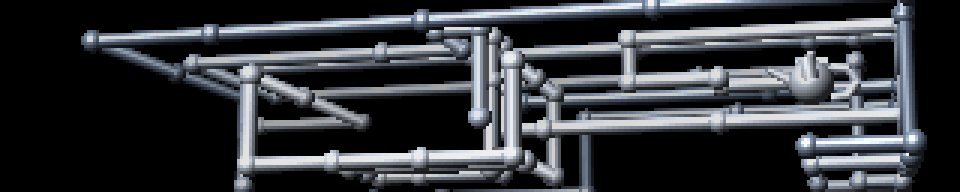

The Windows 3D Pipes screensaver. Pipes grow through an invisible lattice,
turning at right angles, joined by a gleaming ball at every elbow; when the
volume is full enough the panel holds for a beat, an eraser bar sweeps it black,
and a new run starts in a new colour scheme. The wall already has the bouncing
logo (`dvd`) and the flying toasters (`toasters`); this is the third pillar of
the genre and the only one of the three with *depth*.

The representation is **a self-avoiding walk on an integer lattice, flattened
into a list of primitives with timestamps**. The head sits in a cell, picks a
direction, runs a few cells, turns ninety degrees, repeats, and never revisits
an occupied cell; a pipe that paints itself into a corner dies and another is
born somewhere else, which is the original's behaviour and most of its
character. That leaves exactly two things to draw — a straight *run* between two
lattice nodes and a *joint* ball at each turn — and everything else is
bookkeeping. `build()` walks the whole lattice for each of the three schemes up
front and emits `(kind, p0, p1, colour, t0, t1)` in view-space coordinates,
sorted by finish time; `render(t)` only reveals more of a list that already
exists. That is what makes it a pure function of `t`, and it is also why the
walk can be *guaranteed* to fill the panel nicely rather than hoped to.

**There is no mesh and no triangle anywhere.** A run is rasterised as a
screen-space capsule: over the segment's bounding tile, `perp` is the signed
perpendicular distance to the projected axis and `u = perp / radius` runs −1..1
across the tube. Everything falls out of `u` alone — `w = sqrt(1 − u²)` is the
component facing the viewer, the depth is the axis depth minus `w·R`, and the
surface normal is `u·p + w·v` for the segment's screen perpendicular `p` and the
view direction `v`. A ball is the same idea in two dimensions. That is what
makes the chrome affordable: both the Lambert term and the tight specular are a
function of `u` and of the *angle the segment makes on screen* and nothing else,
so both are baked in `build()` into a table indexed by `[colour][angle
bin][u bin]`, and a frame does one `np.take` where it would otherwise do a dozen
vector operations per pixel. The highlight running down the length of a tube —
the whole reason chrome reads as chrome — costs one lookup. Balls get a 2D table
of the same kind indexed by `(nx, ny)`, plus a matching table of the bulge
towards the viewer that doubles as the coverage mask.

Occlusion is the point, so there is a real **z-buffer**: a float depth per panel
pixel, tested per fragment. Pipes crossing in front of one another is most of
what makes a flat panel read as a volume, and no amount of shading substitutes
for it. `scripts/test-pipes.py` asserts it the only way that means anything:
draw the same finished lattice with the primitives shuffled and require
essentially the same pixels back. A z-buffered scene is order independent; a
painter's-algorithm scene is not, and it is otherwise a bug that produces a
perfectly attractive picture.

**Perspective, not isometric, and for a specific reason.** Isometric is cheaper
and was tried first. It fails here because every tube is the same width at every
depth, so two tubes crossing are distinguished *only* by which occludes the
other, and at 64 rows that is a one-pixel cue. A mild perspective — the far
plane one and a half times the distance of the near one — makes near tubes
visibly fatter (6.2 px against 4.1) and, with a little depth fog, brighter. That
is a second and a third depth cue that survive being seen at an angle from three
metres, and the frustum costs one divide per lattice node at build time. The
camera is also yawed 15° and pitched 9°, because with the lattice axes exactly
on the screen axes the whole thing reads as a flat maze.

The lattice is 20 × 4 × 9 cells, which is deliberately not a cube: the panel is
a 5:1 letterbox and a wide, shallow, *short* volume fills it. The focal length
and screen centre are **solved** in `build()` by projecting all 720 nodes rather
than hardcoded, then over-scanned 14% so the near layer runs off the edges the
way it does in the original — which also means changing an angle cannot silently
push half the volume off the panel.

**The interesting problem was that cost scales with how much pipe is on screen,
and `render` may not accumulate.** A frame must not redraw the couple of hundred
primitives already there, but a persistent frame buffer is accumulated state.
The resolution is the one `plotter` uses: the buffer is a pure function of one
integer. `world(i)` is "every primitive with index < i, rasterised into colour
and depth", *memoised* rather than accumulated; a frame asking for a larger `i`
draws the difference, and one asking for a smaller — a cold start, a loop wrap,
a preview baker's rewind — restores from the nearest snapshot below it and walks
forward. Snapshots are taken every 32 primitives as the cache sweeps past them,
so they cost memory (about 140 kB each, five per run) and no work. Because the
z-test is a strict `<` and primitives are always applied in increasing index
order, restore-and-walk-forward is *bit identical* to walk-from-zero, which is
why the purity assertion compares with `array_equal` and passes rather than
nearly passing. The growing tips never enter the buffer at all: they are drawn
into a scratch copy each frame, so a pipe advances smoothly instead of a cell at
a time.

So a frame is two panel copies plus one capsule per growing tip, flat from the
first frame of a run to the last: **0.14 ms mean, 0.22 p95, 0.54 max** on a
desktop, and close to linear in `--pipes` (1 → 0.06, 2 → 0.12, 3 → 0.17, 4 →
0.20 ms while growing). `--pipes` is the knob if the wall wants it cheaper, but
it is also a pacing knob — two pipes take half again as long to fill the same
lattice, so `--pipes 2 --fill 0.22` is the pairing that keeps the cycle the same
length.

**The teapot is in.** The original famously spawns a chrome Utah teapot instead
of an elbow once in a while, and it is the best easter egg available — but a
sprite of one cannot be scaled to whatever depth it lands at without falling
apart, and a fixed-size sprite in a scene with perspective reads as a decal. So
the teapot is *modelled*, in the only two shapes this renderer knows: a fat ball
for the body, a small one for the knob, a squat capsule for the lid, a tapered
one for the spout and a four-piece loop for the handle. Eight draws, in the
pipe's own colour, into the same z-buffer, and it shrinks with distance for
free. It lands about 31 × 20 px against a 6 px tube. Honestly: at three metres it
reads as *something that is not a pipe*, and it resolves into a teapot when you
look at it — which is roughly the right amount of easter egg. It is placed in
the second half of the sequence and the nearer half of the volume, because a
teapot drawn early and far is a teapot buried behind forty pipes; even so, one
run in three puts it somewhere it is half hidden, and that is the walk's luck
rather than a bug. `--teapot 0` turns it off.

Two things worth recording. The live growing tips were first found by scanning a
small window forward from the finished index, which looks safe and is not: the
list is ordered by *finish* time, so a pipe part way through a six-cell run can
sit sixteen entries behind three other pipes turning every cell, and it stalls
for a second at a time. It is now a vectorised test over the whole list — six
numpy calls on a 170-element array, which is nothing — and the test asserts that
the window would have been too small. And the eraser first reached the right
edge exactly at the end of the cycle, so the panel cut from a half-erased frame
straight into the next run; the bar now clears four fifths of the way through
the wipe, leaving a third of a second of black, and that beat is what makes the
clear read as a decision rather than a dropped frame.

Roughly 35 s per cycle at the defaults — 30 s of growth, 3.5 s held, 1.6 s of
wipe — so one rotation slot is about one complete run. 20 fps.

```console
$ python3 pipes.py --scheme enamel --pipes 2 --fill 0.22
$ python3 pipes.py --fill 0.5 --speed 4          # spaghetti, quickly
$ python3 pipes.py --yaw 0 --pitch 0             # why the camera is turned
$ python3 scripts/test-pipes.py --bench
```

### crash

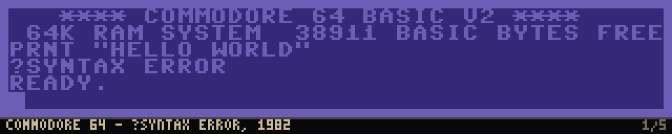

A gallery of famous computer deaths. Five screens a generation learned to
dread, each held for eight and a half seconds and captioned like an exhibit:
the C64's `?SYNTAX ERROR`, the Sad Mac, the Amiga's Guru Meditation, a Windows
blue screen and a Linux kernel panic. The whole loop is 42.8 seconds, which is
one slot, and it is chronological — 1982, 1984, 1985, 2001, 2020.

**The museum label along the bottom is the safety catch, not decoration.** A
convincing blue screen on a wall in a public workshop makes somebody think the
wall has crashed and go looking for whoever runs it. That reaction is half the
joke and it is also a support call. So the bottom eight rows are a plinth: a
hairline rule, near-black, and a caption in a bone colour that belongs to no
specimen — `AMIGA OS 1.3 - GURU MEDITATION, 1985` on the left, `3/5` on the
right — in the same place, in the same face, in every single frame of the loop.
It reads in well under two seconds and it turns the panel from a prank into a
small history exhibit, which is a much better fit for a makerspace than a
prank is. Two more tells come free: the screens visibly change every few
seconds, and a real crash does not become a different crash later; and the
plinth reads as a matte around an object. Of the three the caption is the one
doing the work, and `scripts/test-crash.py` asserts it by reading the words
back off all 855 frames of the loop, because it is the one property here that
is a safety property rather than a taste one.

**Each specimen is rendered at its native column count, and the column count
picks the font.** That one decision settles every layout question in the file.
A C64 is a 40-column machine, so it gets an 8x8 cell — 320 divides by 8 exactly
— and those chunky glyphs are the whole reason anyone recognises it; four
pixels of border each side buys the two-tone frame that makes it a C64 rather
than a blue rectangle, at the cost of one column nobody has ever counted.
Everything else is an 80-column screen and gets a 4 px cell, 78 columns inside
a margin, which is the *same proportion* a 640-wide Amiga or VGA screen gives
80 columns of 8x8 text. That is why the guru box comes out occupying about the
fraction of the width it really did rather than being eyeballed, and why
`*** STOP: 0x000000D1 (0x0000002C,0x00000002,...)` fits on one line, as it must
— that line is the icon of the blue screen and breaking it would be wrong.

**Both fonts are bitmaps written out in the file, not TrueType.** The Pi does
not have the faces this was written on, a fallback face is a different metric,
and at six pixels of cap height an antialiased edge is a smudge. More to the
point, DejaVu Sans Mono at 8 px is not a C64 and no thresholding makes it one.
The 8x8 set is the Commodore ROM shape; the 4 px set is a 3x5 body with real
ascenders and a descender row, because a blue screen set in small capitals is
instantly wrong and the ragged rhythm of mixed case is most of what makes a
wall of 3-pixel-wide text read as English. Every glyph is checked for being
non-empty, for fitting its cell and for being distinct from every other glyph:
a hand-typed hex table's characteristic failure is a typo that silently
duplicates a shape you already have, and eyeballing does not catch it. It
caught `~` and `-`.

**Colours are looked up, and asserted.** VIC-II blue is 0x352879 and light blue
0x6C5EB5 (Pepto's measurements off a real 6569, which is what every emulator
ships). The blue screen ground is VGA attribute 1, 0x0000AA, with attribute 15
white text. The Linux console is VGA attribute 7, 0xAAAAAA — grey, *not* white,
and drawing a panic in white is the commonest mistake in a recreation because
it makes it look like a blue screen that lost its background. The guru is pure
red on black. Getting one of these wrong is the most visible possible failure
for this demo, so the test asserts each against its documented value and
against how much of its panel it covers.

**Only two things move.** The guru's border flashes and the C64's cursor blinks
— a third of a second on, a third off, which is a 60 Hz jiffy counter toggling
every twenty frames. Everything else is dead still, because these screens are
static by nature and the stillness is what makes them read as death rather than
as a screensaver. Between specimens the picture collapses to a bright line and
the next opens back out of it over half a second. The collapse needed an
*additive* white term as well as a gain: the Sad Mac's centre row is black, so
brightening alone collapsed it to nothing and the cut read as a dropped frame
rather than as a CRT.

Everything is baked in `build()` as complete 64x320 frames, blink variants
included, so a held frame is one memcpy — 0.002 ms/frame measured, 0.035 ms
through a collapse, which is the cheapest thing in the show by a wide margin.
The cost is 430 KB of baked frames, which is the right way round on a machine
where an operation costs more than a page of pixels. Nothing reads the clock;
the order and every hex code come from `--seed`.

Two things it does not do. The Sad Mac had a chime — four notes of doom on the
Mac II — and the wall has no speakers, so that half of it is simply missing.
And DOS's `Abort, Retry, Fail?` was cut: grey text on black is the kernel
panic's territory already, and five specimens rendered well beat six rendered
approximately. One honest uncertainty: the C64 error is printed here as
`?SYNTAX ERROR` with one space, which is what the ROM's message-plus-` ERROR`
concatenation gives; the two-space form is widely reproduced and may be what
you remember.

```console
$ python3 crash.py --only guru --hold 30      # sit on one specimen
$ python3 crash.py --shuffle --seed 7         # a different exhibition
$ python3 crash.py --hold 4 --gap 0.2         # the whole gallery in a slot
```


## Group buttons

Sixty-three cards is a lot of switches. The thing people actually want from the
panel during an event is a mode — *just the data ones*, *just the movie ones*,
*just the Sequoia Fabrica ones* — and getting there by hand means working down
the whole list on a phone while the room fills up.

So the panel has a row of group buttons above the cards. Pressing one enables
that group's entries and disables everything else. It is not a view filter: the
wall changes. `All` puts the whole rotation back.

They behave as radio buttons, because the modes are exclusive — but membership
is not, and that distinction is the reason the taxonomy lives where it does.
`tide` is honestly both a data panel and a San Francisco panel; `voxel` is both
a demoscene technique and a flight over the Bay; `scroller` is both a classic
scroller and a sign that says SEQUOIA FABRICA. Each of them is in two groups. A
model that forced every demo into exactly one bucket would have had to pick a
loser in each of those cases, and the wrong answer would then be baked into the
rotation file for good.

#### The file

`rotation-groups.json`, next to the rotation and separate from it:

```json
{"version": 1,
 "groups": [
   {"key": "data", "label": "Data",
    "description": "Live panels reading the outside world",
    "members": ["propagation", "adsb", "goes", "..."]}
 ]}
```

Separate for two reasons. Groups are a presentation concern, and the same
taxonomy should survive a different running order — betelgeuse's rotation is one
installation's, the taxonomy is not. And the rotation file is the one that gets
edited every time a demo is added, by somebody who is thinking about frame
budgets and transitions rather than about the panel; a field on every entry
there would rot.

**Names it does not recognise are skipped.** This is load-bearing, not
defensive programming for its own sake. The file names demos that are not in
every installation, and in practice it is edited days before the demos it names
exist — the six live-data panels went into it while they were still being
written. Resolution happens once at startup against the loaded rotation, and
the startup log says how many names it dropped, in one line rather than one per
name. It is one line because there are usually a few in flight, and a paragraph
of warnings at every restart is how people learn to skip the startup log.

A group that resolves to nothing at all is dropped rather than kept, because a
button that would empty the wall is worse than a button that is not there.
`set_only()` refuses an empty set for the same reason, the way `set_all()`
already refused to switch the last effect off.

`all` is not in the file. It is synthesised, so that an edit to the file cannot
take away the way back.

#### The API

One new op on `/api/command`:

```json
{"op": "select", "group": "data"}
```

The obvious implementation was `all(off)` followed by a `toggle` per member,
entirely from the page. That is N+1 round trips and N+1 frames, and the wall
would visibly play a half-applied group for about a second on its way to the
right one. Every other op in this file lands at the top of one frame, and this
one does too: the whole set changes under the rotation lock, once.

The payload is the group's key rather than a list of names, so the group file
stays the only place membership is written down — a client cannot invent a set
of its own, and editing the file is genuinely enough to change what the buttons
do.

The group list rides on `/api/schema` alongside the option schemas, because it
is fixed for the life of the process and is fetched once per page load. Which
group is *active* rides on `/api/state`, because that changes.

Indices past the playhead are invalidated and the effect on air plays out its
slot, exactly as a single toggle already did. Cutting mid-segment because
somebody chose a mode is a worse answer than the next forty seconds being the
old mode.

#### When it is none of them

The interesting state is the one after somebody presses `Movies` and then flips
a single card. The live set is now no group, and a button still drawn as
pressed would be claiming a mode the wall is not in.

So the scheduler compares the enabled set against each group and answers `null`
when it matches none of them — `"group": null` in the state — and the page
lights no button and shows a quiet `custom mix` next to the row. Flip the card
back and the claim comes back. The comparison is server-side so that every
phone looking at the wall agrees, and it is a handful of frozenset comparisons
once a second against a snapshot that is being rebuilt anyway.

`all` is tested first, so a group that happened to list the entire rotation
loses the tie — that is the same selection under a more specific name than
anyone chose.

#### The taxonomy

Seven groups plus `All`, which is as many as fits across a phone without the
row becoming its own screen. Every one of the rotation's entries is in at least
one; thirteen are in two.

| group | what is in it |
|---|---|
| Data | the live outside-world panels: propagation, adsb, goes, caiso, sats, winds, quake, wx, ships, tide |
| Movies | wopr, defcon, tron, sneakers, trench, fsn, esper, headroom, gibson, wardial, ansi |
| Makerspace | console, knit, sewing, printer, lathe, wheel, laser, scope, splitflap, scroller, sf-tree, sf-tree-bounce |
| San Francisco | goldengate, karl, sunset, grove, voxel, sf-tree, sf-tree-bounce, wardial, tide, ships, quake, caiso, adsb, wx |
| Demoscene | fire, tunnel, starfield, metaballs, rotozoom, twister, water, cycle, floor, voxel, boing, scroller, fireworks, daliclock |
| Games | pacman, pacman-ghosts, space-invaders, mario, nyancat, toasters, boing |
| Algorithms | sort, wireworld, life, maze, slime, fireflies, chladni, scope |

Some of these took a decision rather than a lookup. `console` is in Makerspace
rather than anywhere filmic because it types out Arduino one-liners that people
in the space wrote, and it is the only demo anyone can add to without touching
code. `scope` is in both Makerspace and Algorithms: it is a bench instrument, and
it is also the closest thing here to a live plot of a function. `chladni` sits
in Algorithms rather than Demoscene because it is a physics simulation that
happens to be pretty, not an effect. `wardial` is in San Francisco as well as
Movies — the exchange it works through is a real one.

Bandwidth for a network group was considered and dropped. `bgp` and `sfmix`
would have been the whole of it, both are honestly data panels, and two members
does not earn a button on a phone.

## where the wall is — `site.json` and `ftsite.py`

The installation's own coordinate, in one file, read by everything that needs it.

**What it replaced.** The wall's latitude and longitude used to be written out
seven times: `quake.py`, `adsb.py`, `sats.py`, and three separate constant pairs
in `ftdata.py` (`WX_LAT/WX_LON`, `ADSB_LAT/ADSB_LON`, `QUAKE_LAT/QUAKE_LON`),
plus fixtures in three test scripts. All seven said `37.7627, -122.3966`, and all
seven were wrong by 273 m — a coordinate for somewhere a couple of blocks away,
carried forward from whatever first guess it started as, and described in one
comment as "the Mission" when the wall is in Dogpatch. Seven copies of a fact is
how a fact goes wrong quietly: nothing disagrees with anything, so nothing
complains.

The true position is `37.7624929274026, -122.39969356310202` — Sequoia Fabrica,
1736 18th Street.

**The file.**

```json
{
  "name":  "Sequoia Fabrica",
  "short": "SF",
  "lat":   37.7624929274026,
  "lon":   -122.39969356310202
}
```

`name` is the long form for a label with room; `short` is what `sats.py` puts
next to the tick on the world map, where four characters is the budget. Unknown
keys are kept and ignored, so a file may carry settings a given checkout does not
understand yet.

`FT_SITE` points at another file, the same way `FT_DATA_CACHE`, `FT_GBFS_BASE`
and `FT_PIXELART_DIR` work. `python3 ftsite.py` prints which file was found and
what came out of it, which is the fastest way to answer "why does the wall think
it is in the wrong place".

**Why a file and not just one constant in `ftdata.py`.** Consolidating the seven
literals into one would have fixed the drift, but not the other half of the
problem: this tree has two long-lived branches, one that goes upstream to
FlaschenTaschen and one that is this wall. An address compiled into `adsb.py` is
exactly the sort of fact that makes those two diverge and stay diverged. In a
file, the demo code goes upstream unchanged and the installation carries its own
`site.json`.

The loader is its own module rather than part of `ftdata` because `ftdata` is the
data layer — the fetchers, the cache, the network — and a demo that draws a map
but fetches nothing should be able to ask where it is without importing any of
that. The dependency runs one way: `ftdata` imports `ftsite`, never the reverse.
`ftsite` imports `json`, `os` and `sys` and nothing else.

**Failure is a warning, not an outage.** The defaults compiled into `ftsite.py`
are the real address, so a fresh checkout with no `site.json` draws a real panel.
Every failure mode falls back key by key: absent (silent — that is the normal
upstream case), unparseable, not an object, a latitude that is a string, a
longitude off the globe. A file that gets `lon` right and `lat` wrong still
contributes its longitude and gets one line of complaint on stderr about the
rest. Nothing here raises. The wall coming up in the wrong city is a bug somebody
notices; the wall not coming up is an evening lost.

**What moved on screen: nothing you can see.** 273 m at the scales these panels
draw at is:

| panel | scale | 273 m is |
|---|---|---|
| `adsb` | 50 nm across 320 px | 0.24 px — measured diff over a full loop: **0 pixels** |
| `quake` bay tile | ~1.4 km/px | 0.20 px; the site marker rounds to the same pixel on both tiles |
| `quake` region tile | ~10 km/px | 0.03 px |
| `sats` | world map, 1.125°/px | 0.003 px — measured diff: **0 pixels** |

Rendering each demo for a 60 s loop at both coordinates with the clock frozen
(these panels take "now" from `time.time()`, so an unfrozen A/B compares two
different moments and tells you nothing) gives zero differing pixels for `adsb`
and `sats`, and for `quake` up to 7 pixels in a frame — all of them single-pixel
steps in the anti-aliased 100 km and 300 km range rings, in `C_RING` (22, 30, 40)
against near-black. Invisible at any distance, and invisible up close.

The numbers that do change are the printed ones, and they change by less than
their own rounding: the Berkeley seismometer goes from 17.1 km at 44° to 17.3 km
at 45°, which `helicorder` still draws as `BRK 17KM NE`, and every event distance
in the `quake-usgs` payload shifts by up to 273 m depending on its direction.

**Deploying it: the wx products get renamed.** This is the one consequence that
needs a hand. `ftdata._wx_site()` builds product names out of the coordinate to
four decimals, so moving the site renames two products:

```
wx-model-37.7627_-122.3966   ->   wx-model-37.7625_-122.3997
wx-air-37.7627_-122.3966     ->   wx-air-37.7625_-122.3997
```

Nothing renames the *files*. What happens on the Pi, in order:

1. The moment the new code is in place, `wx` asks for the new names, finds no
   record, and draws its no-data card. It does not throw and it does not go
   blank — this is the "absent" state the panel already knows how to draw.
2. `ftmotd`'s data line counts registered products, not files, so the two new
   names show up as `absent` and are named on the continuation line until the
   fetcher runs. The two old files are no longer registered, so ftmotd cannot see
   them at all: no spurious count, no phantom failure. Nothing reports an error
   anywhere in the gap.
3. The next `ftdata.timer` pass fetches both new products (met.no and Open-Meteo,
   ~600 bytes each) and the panel is back. If you would rather not wait, run one
   pass by hand.
4. The old files sit in the cache directory as orphans forever. `prune_blobs()`
   and `sweep_blobs()` will not touch them: both deal only with `.npz` sidecars
   in the tmpfs blob directory, and `sweep_blobs()` deliberately refuses to run
   against a cache directory at all, because a thing that deletes records by age
   is the exact fault it exists to prevent. So they need deleting by hand. It is
   about 1 KB; it is tidiness, not urgency.

```sh
# on the wall, as the user the fetcher runs as
rm -f ~/.cache/ftdata/wx-model-37.7627_-122.3966.json \
      ~/.cache/ftdata/wx-air-37.7627_-122.3966.json
python3 ~/ft-cpp/demos/ftdata.py --once \
    --only wx-model-37.7625_-122.3997,wx-air-37.7625_-122.3997
python3 ~/ft-cpp/demos/ftdata.py --list | grep wx-      # both should be fresh
```

`wx-obs-SFOC1` is keyed by station id, not by coordinate, and is unaffected. So
are `adsb-bay` and `quake-usgs`, whose names carry no coordinate — their *payload*
distances change on the next fetch and nothing else does.

**What should move into this file next, and did not now.** The tide station
(`tide.py`, 9414290), the swell buoy (`swell.py`, 46026), the NWS observation
station (`WX_STATION`, SFOC1), the ADS-B query radius, the BART line
`stringline.py` follows, and the satellite roster are all installation facts by
the same argument. They were left alone deliberately: this change went in
alongside six other agents editing these same demos, and a diff that touched
every panel at once would have been a merge conflict in six directions. The
schema takes new keys without a version bump, so they can move one at a time.

## demoscene.py

The shared part. Each demo parses the usual options, precomputes what it can,
then hands a `render(t, frame) -> (H, W, 3)` callback to a fixed-rate loop
that pushes frames with `send_array_banded()`.

```python
import demoscene as ds

ap = ds.parser("Bouncing dot")
ap.add_argument("--radius", type=float, default=6.0)
args = ap.parse_args()

def render(t, frame):
    ...

ds.run(render, args)
```

It also carries the colour helpers, which matter more than they look. An
effect that computes one scalar per pixel and maps it through a palette is
both far cheaper than computing RGB directly and much easier to make look
good, since the palette carries the art. `gradient()` builds a lookup table
from colour stops, `rainbow()` sweeps hue, and `fire`, `ice`, `toxic` and
`magma` ship ready to use.

## Writing one that looks right on a wide panel

These effects are usually written for something squarer and taller than a
320x64 wall, and most of them need adjusting for it. Things that caught us:

- Anything with a **rate per row** — fire's cooling, for one — is tuned for a
  screen two or three times taller. Over 64 rows it never finishes, and you
  get a solid sheet of colour.
- **Shading on radius** needs scaling against the display, and on a panel this
  wide almost every pixel counts as near, so the effect flattens out. Shade on
  something in the effect's own units instead, like depth.
- A **tiled texture** must be genuinely seamless or rotation will show hard
  diagonal seams. Sine terms need whole numbers of cycles across the texture,
  and a radial term cannot tile at all.
- **Single-pixel elements** carry no weight. A near star drawn the same size
  as a far one makes a starfield read as static rather than as motion.

The frame-interval trace in [`../tools/ft-emulator`](../tools/ft-emulator) is useful
here: a stall shows up as a spike there long before it moves the average, and
stalls rather than average jitter are what read as visible flicker.

## Older Python demos

`fsa.py`, `grid.py`, `ripple.py` and `sierpinski_rain.py` predate the shared
module and use `flaschen_np.py`, a local numpy client, setting pixels
individually rather than pushing frames.
