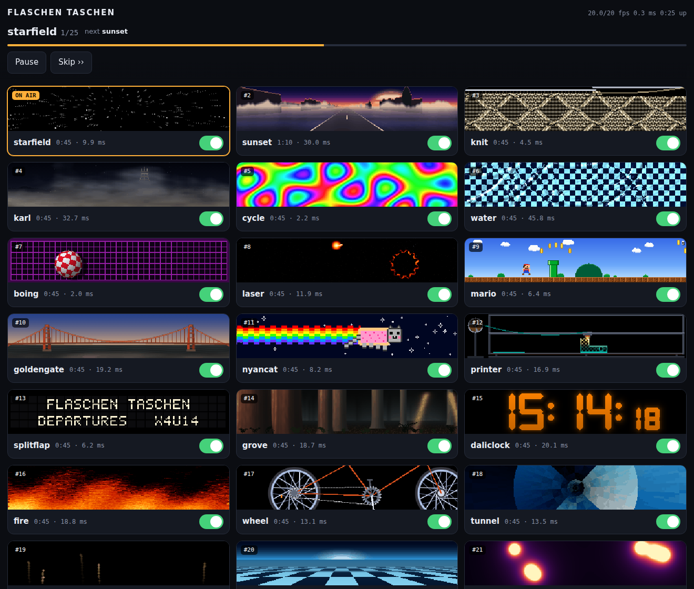
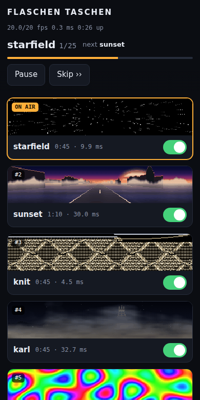
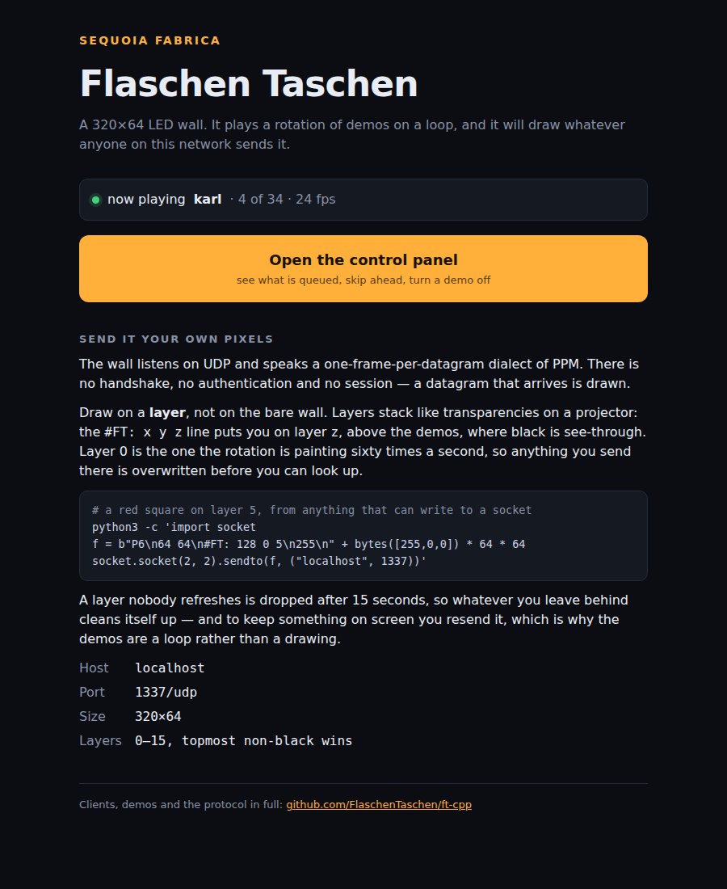
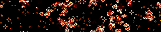
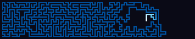
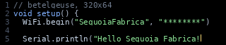

# Demos

Effects for a FlaschenTaschen display. The Python ones here are numpy demos
that push whole frames; the C++ ones live in [`src/`](src/) and are built with
`make`.

```console
$ python3 fire.py --host 127.0.0.1
$ python3 tunnel.py --texture checker --palette magma
$ python3 metaballs.py --balls 8 --palette toxic --contour 6
```

Every demo takes `--host`, `--port`, `--width`, `--height`, `--layer`,
`--band`, `--fps` and `--duration`; `--duration` auto-stops, so a launched
stream can never become a runaway flooder. `--help` lists the rest, and most
take `--palette`.

Requirements: numpy, plus Pillow for `scroller.py`, and the `flaschen` client
from [`../api/python`](../api/python) (`pip install ./api/python`, or just run
from a clone — the demos fall back to the checkout).

No display to hand? [`../tools/ft-web`](../tools/ft-web) is a server that
renders to a browser instead of hardware, which is how the screenshots below
were taken.

## megademo


Plays the effects back to back as one continuous show, with real transitions
instead of hard cuts, and a scrolling banner over the bottom. Both effects are
live during a transition and their frames are blended; the type is chosen per
boundary, because a sparse effect crossfaded under a busy one is invisible and
wants a fade through black instead.

Effects are built on a worker thread a couple of segments ahead. Building
everything up front means a slow black start and every table resident at once;
building at the transition stalls visibly, since `scroller` bakes for seconds.

```console
$ python3 megademo.py --playlist "fire:20,tunnel:15:wipe,water:12+drops=4"
$ python3 megademo.py --no-banner --segment 25 --transition 3
```

## ftsched



The installation's rotation, as a daemon rather than a shell script, with a
control panel you can open from a phone in the room.

```console
$ python3 ftsched.py --host 127.0.0.1 --listen 0.0.0.0:8081
```

The rotation used to be a `bash` loop launching `python3 demo.py --duration
45` per segment, which cost a fresh interpreter and a fresh `import numpy`
every 45 seconds — about 1.4 s of black wall each time on a Pi 3, so roughly
3% of the show was the rotation booting. It also made every segment change a
hard cut, because two effects cannot be alive at once across a process
boundary, and there was nothing to ask what was playing or to skip it.

`ftsched` keeps the modules imported, builds ahead on a worker thread the same
way `megademo` does, blends between segments, and serves a JSON API and the
page above. Three threads: render, build, http. The HTTP side only reads a
snapshot the render loop publishes once a second, and pushes commands onto a
queue drained at the top of the next frame, so a slow client cannot stall the
wall.

**Steering.** Tap a card to jump straight to it, the switch to drop an effect
from the rotation. A jump is implemented as the current segment ending early,
so it rides the ordinary transition rather than cutting. What is switched off
persists across restarts via `--state-file`; the running order itself does
not, since that belongs in the rotation file, where it gets reviewed.

**Frame rate is per segment**, as it was when each demo ran as its own
process: `boing` costs 2 ms and runs at 60, `water` costs 45.8 and runs at 20.
Holding the whole show to one rate would make the cheap effects choppier than
they are today for no gain. Each rate leaves roughly 40% headroom over the
measured cost. The demo is *built* at the rate it will be driven at, because
several of them scale motion per frame off `args.fps`.

**Cost.** Each card shows that effect's measured p95 on the Pi. These matter
in pairs, not singly: a transition renders *both* neighbours into one frame,
so a pair can cost more than either one's own rate allows — `grove` into
`daliclock` is 38.8 ms against the 33.3 ms frame they both run at. The
transition is therefore paced to what the pair actually costs and steps back
up afterwards; two seconds at a lower rate during a crossfade does not read,
whereas frames arriving late do. `pair_check()` reports the ones that get
paced down a long way, since that usually means the running order could be
better. Anything that cannot fit a frame even alone — `slime` at 81.5 ms,
`fireflies` at 61.3 — is marked `solo` and gets a cut on either side instead.

**Building costs the current segment some frame rate.** The builder is a
thread, and Python threads share the GIL, so while an expensive `build()` runs
the effect on screen dips — `nyancat` measured 60.0/60 fps in steady state and
32/60 during the few seconds `printer` was building behind it. That is the
trade being made on purpose: the shell rotation this replaces went *entirely
black* for 1.4 s at every segment change, and a brief rate dip in the middle
of a 45 s slot is a much better failure than a stall at the transition. Moving
builds to a subprocess would remove it, at the cost of shipping the built
tables back across a pipe.

**Previews.** The clips in `previews/` are 16 frames at 8 fps, committed rather
than generated at runtime: baking three dozen of them costs every demo's
`build()` and would steal the CPU the render loop needs. Rebuild after
changing a demo:

```console
$ python3 scripts/make-previews.py --force knit sunset
```

A still cannot show what most of these are — `splitflap` is *entirely* motion,
and `slime` looks like noise until it moves. (Two are stills anyway:
`pacman-ghosts` does not move, and `daliclock` does not change within a two
second window.)

They are **animated WebP**, losslessly encoded, having been GIFs. GIF was
costing about a third more for pixels that were also worse: its compression is
weak enough that the palette had to be cut to 128 colours to keep the files
reasonable, which is real damage on a wall whose whole business is gradients.
Lossless WebP compresses a paletted image so much better that 256 colours in
WebP still come out smaller than 128 in GIF — measured over this rotation, 32%
smaller and strictly closer to what the demo rendered, with `fire`, `slime`,
`metaballs`, `nyancat` and `pacman` landing exact. Lossy WebP was measured too
and is the wrong tool: 320×64 of dithered noise and hard pixel edges is the
worst case for a DCT, and at a quality matching GIF's error it saved nothing.

**Segments** are `py` (a demoscene module, rendered in-process) or `exec` (an
external command that draws on the wall itself, for the C++ tools). The
scheduler stops sending for an `exec` slot and supervises the child, killing
it if it outruns its time. Transitions cannot cross a process boundary, so
those always cut.

```console
$ python3 ftsched.py --dump-rotation > rotation.json   # then edit, and:
$ python3 ftsched.py --rotation rotation.json
```

An `exec` entry names the layers it draws on (`clears`), which are blanked
when its slot ends — the C++ tools set a layer with a timeout of their own, so
a pacman would otherwise sit on top of the next effect for the rest of it. Our
own layer is blanked when the child starts, or the frozen last frame of the
outgoing effect shows through wherever the child's layer is black. `wait`
says whether the child exiting ends the slot: true for the ones that run for
their whole `-t`, false for `send-text`, which sets a layer and returns at
once.

[`rotation-betelgeuse.json`](rotation-betelgeuse.json) is the Sequoia Fabrica
installation's running order: 34 entries, 25 minutes, and **all of them
native**. The segments that predate the numpy demos were ported rather than
shelled out to — the pixel art into [`pixelart.py`](#pixelart), the C
binaries into [`life.py`](#life) and [`maze.py`](#maze), the `send-text` jokes
into [`console.py`](#console) — so every one of them now blends into its
neighbours, has a preview, and runs from a checkout on any machine instead of
from absolute paths on one Pi. `exec` remains as the escape hatch it was
built to be; nothing in this rotation needs it.

Site-specific text lives in that file rather than in `ftsched.py`: the marquee
and the split-flap messages. The running order itself is generated to satisfy
the pairing rule above and currently has **zero** transitions paced down; note
that a `solo` neighbour cuts, so the edges either side of `slime` and
`fireflies` are free and an expensive effect can sit there.

The order is genuinely load-bearing, and it is easy to break by accident:
removing one cheap segment leaves the two expensive ones that were either side
of it adjacent, which is how dropping `full-moon` put `goldengate` next to
`fire` and paced that transition down to 21 fps from 30. The floor is set by
`water`, which at 45.8 ms cannot fit its own 20 fps frame even alone, so its
two edges run at 80% however the rest is arranged; the order is chosen to
bring everything else up to at least that.

An entry's `module` may differ from its `name` — the six pixel-art segments
are one module with six sets of options — and previews are keyed by name.

The API is a handful of verbs — `jump`, `toggle`, `next`, `pause`/`resume`,
`restart` — POSTed as JSON to `/api/command`, with `/api/state` returning
everything the page renders:

```console
$ curl -s localhost:8081/api/state | jq '.now, .health'
$ curl -sX POST localhost:8081/api/command -d '{"op":"jump","index":12}'
```

There is no authentication: it is a wall in a makerspace, and the worst anyone
on the shop wifi can do is change what is on it. Bind it to the LAN or to a
Tailscale address, not to the internet.

Deployment is [`ftsched.service`](ftsched.service), which `Conflicts=` with
the old `ft_demos.service` so the two can never both drive layer 0.



## ftindex



The control panel is on port 8081, which is fine if you already know it and
useless if you do not. Someone standing in front of the wall with a phone
types the hostname and nothing else, gets a connection refused, and gives up.
[`ftindex.py`](ftindex.py) serves that bare hostname: what the wall is, what
is playing right now, a button to the panel, and how to push your own pixels
at it.

```console
$ python3 ftindex.py --listen 0.0.0.0:80
```

It is a **separate daemon** from `ftsched` on purpose. The scheduler is
driving the wall on a frame deadline, and the thing most likely to be hit by a
room full of curious people should not share a process — let alone a GIL —
with the render loop. This one holds no state and can be restarted at any
time. It is also deliberately not `BindsTo=ftsched`: if the scheduler is down,
this page is what says so, and it is what someone reaches for when the wall
looks wrong — exactly when it must not have died alongside it.

No JavaScript, and the page is rendered server-side, because it has to work
first time on whatever phone walks into the room. The one dynamic part is a
`now playing` line fetched from `ftsched` with a 0.6 s timeout: the page is
worth more than the status line on it, so a wedged scheduler costs a blink
rather than a spinner.

Binding `:80` does not need root. [`ftindex.service`](ftindex.service) runs as
`pi` with `AmbientCapabilities=CAP_NET_BIND_SERVICE`, which grants exactly the
one privilege — plus the usual `Protect*` sandbox, since this is the process
most exposed to the room.

**TLS is not handled here.** `tailscale serve` terminates it with a real
`ts.net` certificate, renews it, and exposes it to the tailnet only, which is
three things this would otherwise have to get right by itself:

```console
$ tailscale serve --bg --https=443  http://127.0.0.1:80     # this page
$ tailscale serve --bg --https=8443 http://127.0.0.1:8081   # the panel
```

Those persist across reboots on their own. They need HTTPS Certificates
enabled for the tailnet (admin console → DNS → HTTPS Certificates); until then
`tailscale cert` answers *your Tailscale account does not support getting TLS
certs* and only the plain HTTP side works.

A link from an `https` page to an `http` one is not blocked the way a
subresource would be, but it drops the reader out of TLS without saying so —
so when the page is reached through the proxy (`X-Forwarded-Proto: https`) it
points at the panel's tailnet port instead of its LAN one. `/panel` is a
redirect rather than a hard-coded link, so exactly one place knows which port
the panel is on.

## The effects

### fire


Doom-style fire: a row of burning fuel along the bottom, and every frame each
cell takes the heat of the cell below it, shifted sideways at random and
cooled a little. The randomness is what turns a smooth gradient into flames.
Done as one vectorized step over the whole buffer.

```console
$ python3 fire.py --palette ice --wind -0.4 --cool 4
```

### tunnel


For every pixel, the angle around the centre and a depth that grows as you
approach it, used as texture coordinates. Scrolling the depth flies you
forward; scrolling the angle rolls the tunnel. Both depend only on the pixel,
so they are computed once and each frame is two integer adds, a mask and a
gather.

```console
$ python3 tunnel.py --texture rings --speed 120 --roll -0.3
```

### starfield


Stars drift towards the camera and are divided by their depth, so one crawls
while it is far away and then sweeps past. Each is drawn several times along
the distance it covered during the frame, which is what makes the streaks.

```console
$ python3 starfield.py --stars 800 --speed 1.6 --warp 6 --tint ice
```

### metaballs


Each ball contributes a field that falls off with distance; the fields are
summed and coloured through a palette. Because the sum is smooth, two balls
approaching each other bulge and merge into one shape rather than overlapping
— which is the point, and something you cannot get by drawing circles.

```console
$ python3 metaballs.py --balls 8 --palette toxic --contour 6
```

### rotozoom


Rotate and scale a tiled texture by working backwards: for each pixel on
screen, apply the inverse transform to find where it lands in the texture.
Every pixel then gets exactly one sample with no gaps to fill, which is why
the effect was cheap enough for hardware that could not multiply quickly.

```console
$ python3 rotozoom.py --texture xor --spin 0.35 --zoom-min 0.4
```

### laser


A laser cutter working through a job: a searing head tracing a vector path,
the kerf cooling behind it, and the piece dropping out when the outline
closes.

One scalar heat field carries all of it — the head writes 1.0 along the arc it
covered this frame, the field decays, and a black→red→orange→white ramp turns
it into kerf, trail and head bloom together. Cooling is a half-life in
*seconds* rather than a per-frame factor, so the trail is the same length in
wall time whether the demo runs at 8 fps or 30.

Paths are generated — gears, finger-jointed panels, filigree, slot lettering —
cut holes first, outline last, with dark rapid moves between contours and the
head stepping in arc length so corners do not speed up.

Heat alone cannot tell what belongs to the part, since lettering cut ten
seconds ago has already decayed out of the ramp, so a per-job cut mask relights
the whole piece for the second it takes to fall.

```console
$ python3 laser.py --cool 2.0 --shapes gear,filigree
```

### printer


A 3D printer seen side-on: gantry climbing a row per layer, nozzle glowing,
part rising with visible infill — and sometimes failing into spaghetti.

Silhouettes are functions of normalised coordinates rather than sprites, so
they rasterise to whatever height the panel gives. Each layer is classified
into perimeter, skin and infill, and only the infill stencil is drawn, which is
why the cross-section is a lattice rather than a filled outline.

Failure is two independent draws per print — whether, and then independently
where, anywhere from 8% to 94% of the way up. Over 148 prints that gave 29.7%
failures spread evenly across the height; an early failure leaves nothing but
nest, a late one leaves a near-complete part with strands draped over it.

The spaghetti took three attempts. The coil phase has to come off one clock
shared by the whole strand: sampled per point it is confetti, and tied to
emission rate it is a smooth rope. Only the shared clock gives loose curling
filament.

```console
$ python3 printer.py --fail-rate 0.15 --speed 1.4
```

### knit


An Aran cable sweater worked stitch by stitch. A knitting chart is already a
pixel grid — colourwork and cable charts are low-resolution raster art — so
stitches are 5x5 sprites blitted from source data, never drawn as curves.

What sells it is that the work is visibly *happening*: the row advances a
stitch at a time with jitter and hesitations, needles meet at the live stitch
with loops hanging from them, and rows alternate direction the way hand
knitting actually does. Cable crossings animate as the cable-needle move — the
front pair lifts clear leaving a shadowed hole, the other pair slides through,
the held pair drops into the vacated columns.

The chart is generated: counting cable ropes to the left of a stitch identifies
its rhombus, and the parity of that count is a checkerboard over the lattice,
which is what alternates seed-filled diamonds with reverse stockinette.

```console
$ python3 knit.py --diamond 14 --stitch-rate 9
```

### wheel


A bicycle drivetrain: three-cross laced wheel, chainring and cranks, chain
tracking both sprockets. Gear ratio is derived rather than tuned — both
sprockets share a chain pitch, so pitch radii follow from tooth counts and the
ratio falls out.

All spokes of a flange are tangent to one circle about the hub, so the tangent
angle for a pixel at `(r, a)` is `a ∓ arccos(d/r)`. That is baked once; a frame
reduces it modulo the spoke spacing, with no loop over spokes.

The moiré is the point, not an artifact. Thin spokes crossing a discrete pixel
grid genuinely strobe, and `--sweep` walks the rotation rate through the speeds
where the pattern stalls, crawls and reverses. The rim reflector cannot alias,
so it keeps sweeping while the spokes stand still — which is what makes the
illusion read as an illusion rather than a paused demo.

```console
$ python3 wheel.py --speed 5.0 --sweep 0 --spokes 32
```

### sunset


Driving west into a San Francisco sunset: sliced sun low over the Pacific,
glitter on the water, road running to the vanishing point, Sutro Tower on a
headland, Karl rolling in.

The sun is sliced with horizontal gaps that widen downward — the retro
treatment, and also the right call for a panel that bands in the dark end,
since deliberate horizontal structure reads as intentional where accidental
contouring does not.

Two things that only showed up by looking: distance haze on a gentle ramp
smeared the sky's reflection over the whole plane and the ocean read as wet
tarmac, fixed by confining it to a hard band a few rows deep at the horizon;
and a depth-scrolled water texture cannot win at this size — tight enough for
foreground crests, it aliases to hash across the mid field — so the swell is
one sine of each row's depth instead.

```console
$ python3 sunset.py --sun 0.8 --fog 0.4 --no-tower
```

### grove


Drifting through a sequoia grove: trunks running off the top of the frame,
warm shafts angling between them, fog in the gaps. You see a slice, not whole
trees, which is what standing in a grove actually looks like.

Bark is sampled at `arcsin(x/half)` — the true angle around the cylinder — so
fibres crowd toward the silhouette and the trunk reads as round rather than as
a flat bar. Depths are spaced geometrically, because linear spacing puts
everything in the middle distance where the parallax rates are indistinguishable.

Shafts carry a depth too, so occlusion is free: a nearer trunk blitted
afterwards interrupts the beam, and that interruption is what makes the light
feel three-dimensional. Nothing is blurred at run time — softness is baked into
the sprites.

```console
$ python3 grove.py --speed 6 --shafts 3 --fog 1.4
```

### goldengate


The bridge standing out of the fog. Geometry comes from the real thing in feet
— 4200 ft main span, 526 ft of tower over a 220 ft deck — at one pixels-per-foot
scale that happens to serve both axes of a 320x64 panel.

The detail that stops it reading as a generic suspension bridge is that the
main cable's vertex sits *on* the deck at midspan. Stepped Art Deco setbacks,
portal braces whose openings shorten going up, and single-pixel suspenders
every 6 px do the rest.

Fog is two tileable noise tiles scrolled across each other, windowed by a
rolling edge and a travelling bank envelope, with density tied to bank height
so a high bank is a thick one. The level clamps at both ends rather than
wandering mid-range — otherwise you get permanent haze instead of weather, and
never the frame where only the tower tops show.

```console
$ python3 goldengate.py --time-of-day 6 --day-cycle 0 --fog 0.8
```

### karl


Karl the Fog over the Twin Peaks ridgeline, swallowing Sutro Tower and letting
it go again. The calmest thing here — a full cycle from clear to buried takes
minutes.

Two noise textures scrolled at different rates and weighted differently by row,
with the detail layer's sample position displaced by the coarse layer. That
domain warping is what makes it curl rather than slide, and it costs a gather
rather than a simulation.

Density comes off the clock as three sines at incommensurate periods, saturated
at the ends so it *dwells* buried and then dwells clear instead of passing
through both.

Worth knowing if you touch the compositing: on this hardware, broadcasting an
`(H,W,1)` against an `(H,W,3)` is about four times slower than doing the same
arithmetic three times on contiguous planes.

```console
$ python3 karl.py --density 1.3 --speed 0.6 --no-tower
```

### slime


A Physarum transport network. Sixteen thousand agents each sense the trail
ahead of them at three angles, turn toward the strongest, move, and deposit;
the trail map is blurred and decayed each step. Nothing draws the network — the
filaments, junctions and loops are what those rules settle into.

Three departures from the textbook rule, each fixing a specific failure:

*Capping* the trail map stops it being winner-take-all. Uncapped, the busiest
strand reads brightest, out-attracts its neighbours, and within a minute two
fat strands hold the entire population.

*Food* — weak, slowly drifting attractant sources — is the one that matters
most. Even capped and well tuned, the network **relaxes**: strands merge, bends
straighten, and after a few minutes all that is left is motionless vertical
lines, which are the shortest closed paths a wrapping 64-row canvas admits. No
decay value fixes that; it is the end state of the tuning rather than a failure
of it. Foraging forces junctions that relaxation cannot remove, and moving
sources keep it re-solving.

*Spore batches* nucleate new colonies that grow and fuse while starved branches
prune. They have to be a batch in one place and facing outward — scattered
agents just join the nearest strand, and random headings give a trapped orbit
that shows as permanent confetti.

`--deposit` is expressed as the resulting equilibrium mean trail value, with
the per-agent amount derived from it, so changing agent count or decay does not
move the brightness — only the sharpness of pruning. Decay 0.94 is about
sixteen steps of memory; 0.98 floods to a uniform lit field in twenty seconds
and 0.85 never organises at all.

The trail is seeded with blurred noise and given a few hundred warmup steps
inside `build()`, so frame zero is already a network rather than something you
wait for.

```console
$ python3 slime.py --agents 24000 --sensor-dist 5 --palette ice
```

### fireflies


A field of oscillators that spontaneously synchronise. Each firefly has its own
natural rate and flashes when its phase wraps; coupling pulls it toward its
neighbours, and out of that come waves of synchrony that sweep across the panel
and collide.

Coupling is deliberately **local**, not mean-field. Mean-field is cheaper, but
the whole field then snaps into unison at once, which is far duller to watch —
local coupling is what produces travelling waves, and a 5:1 panel is the right
shape to see them cross. Each phase is splatted as a unit vector into a coarse
grid, the grid is blurred, and the result sampled back at each position: O(N)
plus a small blur, with the blur radius acting as the coupling range.
Normalising by the blurred *count* makes the pull depend on how much a
neighbourhood agrees rather than how crowded it is, so a synchronised patch
recruits its border.

Two things keep it from going static, which is the real design problem — a
fully locked field is as boring as a scattered one. The frequency spread is
wide enough that full lock is unreachable, and the natural frequencies
themselves drift, so there is no fixed consensus to converge on: leaders change
and every truce eventually breaks. Measured over five minutes the global order
parameter roams 0.08 to 0.84 indefinitely, reaching 0.8 within twenty seconds
from a cold start, so a short slot still shows the arc. With `--coupling 0` it
sits at 0.05 and never organises, which is the control worth keeping in mind.

```console
$ python3 fireflies.py --coupling 2.5 --range 40 --no-grass
```

### mario


A self-playing side-scrolling platformer: a little plumber runs right through
an endlessly generated level, jumping pipes and gaps, collecting coins and
stomping the odd goomba, over three layers of parallax.

Uses 8 px tiles with a two-tile character rather than classic 16 px ones. At
16 the panel is four tiles: ground plus character leaves under a tile of
headroom and there is no jump arc at all. At 8 it is eight tiles — one ground,
two character, five of air — which is what makes a three-tile pipe clearable.
`--scale 2` gives real 16 px tiles and demonstrates the problem: no pipe
height passes the clearance test, so the generator emits only gaps.

The level generator is bounded by the physics rather than tuned by hand.
`build()` derives the airtime and horizontal reach of a jump, then admits an
obstacle only if the actual trajectory clears it at *both* edges of its span —
the apex is over the middle, so the edges are the tight part — and leaves more
than one jump's reach of flat ground between obstacles. That is what stops it
ever generating something unclearable, which on an unattended wall would strand
the character hours later.

```console
$ python3 mario.py --density 0.6 --speed 70 --run-fps 14
```

### nyancat


The pop-tart cat, trailing a rainbow through twinkling stars. The sprite lives
in the source as rows of characters with a palette per character, so it can be
edited in a diff rather than shipped as an image; moving parts (four tail
poses, the paws) are separate grids composed into the six loop frames at
startup and scaled with `np.repeat`.

The sprite animates on its own clock (`--cat-fps`, default 10) rather than the
display rate — the original is much slower than a display refresh, and tying
the two together makes it look wrong at any frame rate but one. The trail is
baked a whole square-wave period wider than the panel, so scrolling it is a
slice at an offset.

A 320x64 panel is close to the ideal shape for this: the cat sits right of
centre and the rainbow reaches the far edge.

```console
$ python3 nyancat.py --cat-x 0.4 --speed 40 --no-stars
```

### floor


A Mode-7 perspective plane: gradient sky with a sun, a horizon, and textured
ground receding to it, with forward motion and a slow steer. Each screen row
below the horizon is at a constant distance, so per-row depth, texture step,
mip level and fog are all precomputed and a frame costs an add, a truncate and
one gather. An anisotropic mip chain kills the fish-scale moire that otherwise
covers the mid field, since a row near the horizon spans hundreds of texels of
depth while stepping a fraction of one across.

```console
$ python3 floor.py --texture road --palette magma --speed 90
```

### cycle


Colour-cycled plasma. The image is computed exactly once and the animation is
entirely the palette rotating under it — the classic technique, and about ten
times cheaper per frame than anything else here at 0.05 ms. The palette must
be *cyclic* or every wrap shows as a seam sweeping across the panel, so the
non-cyclic ramps are mirrored to close the loop.

```console
$ python3 cycle.py --pattern spiral --palette rainbow --bands 3
```

### water


A damped wave equation with drops falling on it, rendered by refraction rather
than by colouring height: the local slope offsets a lookup into a background,
so the surface bends what is beneath it. Uses a nine-point isotropic Laplacian
— the usual four-neighbour stencil makes ripples spread as diamonds and sits
right on the stability limit. Boundaries are fixed rather than wrapping, so
ripples reflect instead of reappearing on the far edge.

```console
$ python3 water.py --background grid --drops 5 --refract 34
```

### fireworks


Shells launch, arc up and burst into sparks that fall and fade. One fixed-size
particle pool in flat arrays, updated with whole-array operations and recycled
through dead slots, so every frame costs the same. Trails come from a decay
buffer. Spark speed is the load-bearing parameter: below about a pixel per
frame the sparks creep and the decay buffer paints a solid disc instead of
rays, so speed and drag have to be raised together.

```console
$ python3 fireworks.py --rate 3 --types willow,crackle --palette ice
```

### boing


The Amiga Boing Ball: a red and white checkered sphere spinning about a tilted
axis, bouncing in a purple wireframe room. The silhouette and the surface
coordinates of every pixel are precomputed once, so a frame is an add, an xor
and a masked blit. Checker counts derive from the radius and are forced even,
so the equator lands on a cell boundary and the pattern stays consistent
across the longitude wrap.

```console
$ python3 boing.py --radius 24 --segments 16 --bands 8
```

### daliclock


A clock whose digits melt into each other. Seven-segment glyphs are generated
rather than loaded from a font, and the morph interpolates their signed
distance fields and re-thresholds — so the outline moves and you get one solid
deforming figure, where a crossfade would give two superimposed glyphs at half
brightness. Time is read from the system clock inside the frame callback, so
the melt stays locked to the second rather than drifting with frame rate.

```console
$ python3 daliclock.py --12h --palette green --morph 0.6
```

### splitflap


A split-flap departures board. Changing a letter riffles through *every*
intervening card in a fixed stack order, so blank→Z takes 26 flips and blank→B
takes two — that staggering, plus per-cell rate jitter and start delay, is what
makes the board ripple instead of switching in unison.

The flip is a real mechanism, not a crossfade: the outgoing glyph's top half
squashes toward the seam while the incoming glyph's top arrives above it, so
mid-flip a cell legitimately shows two different characters with a hard dark
seam between them. Past ninety degrees you see the card's back, which is the
incoming bottom half unfolding downward. Foreshortening is a nearest-neighbour
row resample rather than a blur, which at 64 rows would turn to mush.

Every squashed step of every card is baked at startup, so a frame is a handful
of small blits and settled cells are never touched — it is the cheapest demo
here by a wide margin. Glyphs are a 5x7 bitmap font in the source, no font file.

`{TIME}` and `{DATE}` are substituted live, so it can be a clock as well as a
sign.

```console
$ python3 splitflap.py --messages "SEQUOIA FABRICA|OPEN HOUSE {TIME};MAKE THINGS|ASK ANYONE" --hold 12
```

### pixelart


The sprite sheets in [`pixelart/`](pixelart) — a sequoia, space invaders,
pacman and his ghosts, an eight-frame sewing machine — which have been on the
Sequoia Fabrica wall for years, played until now by an external C binary
reading JSON files of hex strings.

Sprites are either joined side by side into one strip and moved as a unit
(four invaders in a row, seven sequoias marching past) or played in place as
frames of an animation (the sewing machine, pacman's chomp), and placed
centred, bouncing or scrolling. `--art` takes ranges, so `sew1..8` and
`sf-tree*7` mean what they look like.

`--poses` is both at once: it names alternative sheets of the same slots, so a
strip can hold four different sprites and still animate, all of them changing
pose together. That is how an arcade cabinet did it, and it is the difference
between a row of invaders and a printed banner of invaders. The second pose is
baked from the first by
[`scripts/make-invader-poses.py`](scripts/make-invader-poses.py), which moves
the limbs rather than redrawing them — the bodies stay byte-identical, so
nothing in the outline flickers when the pose changes.

A scroll needs `--travel` pointed whichever way the artwork faces, or pacman
chomps his way backwards across the wall.

Half the set is greyscale line art and half is full colour, so `--render auto`
checks for chroma: the ghosts are drawn as they are, and the tree and the
invaders are painted from a palette. The palette is laid **across** the strip
rather than mapped from brightness — brightness to hue turns every antialiased
edge into a different colour and the shape into confetti, which is exactly what
the first attempt at this looked like.

```console
$ python3 pixelart.py --art sf-tree --mode center
$ python3 pixelart.py --art pacman-32x32-1..6 --sequence-ms 50 \
      --mode scroll --travel right
$ python3 pixelart.py --art space-invaders-1..4 --poses ,b --sequence-ms 500 \
      --mode bounce
```

### life



Conway, one cell per pixel, which at 320x64 is 20,480 cells — enough for
gliders to travel and for still lifes to settle out all over the board.

The rule is four lines of numpy. Everything else is about making a black and
white automaton worth looking at on an LED wall: cells are coloured by how
long they have been alive, so a fresh birth is bright and a block that has sat
there a minute has faded to an ember, and dead cells leave a decaying trail so
a glider draws its own wake. Life always dies down, so when the population
stops changing — allowing for period-2 oscillators, which change forever
without going anywhere — a fresh patch is seeded somewhere and the board gets
reinvaded rather than reset.

Neighbour counting is eight slices of one padded scratch board. `np.roll`
would build sixteen full-size temporaries per generation, which on a Pi is
most of the cost of the rule.

### maze



A maze carved, flooded and solved, on a loop. The old C version drew a
finished maze and left it there, but a finished maze is a texture; the making
of it is the part worth watching. A depth-first walk knocks down walls with
the head glowing at the frontier, visibly backtracking when it paints itself
into a corner; then a breadth-first flood pours down every dead end at once;
then the route lights up end to end and holds.

The carve order and the route are baked into grids rather than kept as lists,
so each frame is one comparison against a rising playhead instead of a Python
loop over a few thousand cells.

### console



Code typing itself out, with a cursor and syntax colouring — the three Arduino
one-liners that used to appear as static text for five seconds each.

The typing is deliberately uneven: a constant interval reads as a machine
printing, while a little jitter and a longer beat after a semicolon reads as
someone at a keyboard. Every character's arrival time is worked out up front,
which is what lets `render()` stay a pure function of `t` — the demo can be
started at any moment, seeked, or run at any frame rate and look the same. The
cursor blinks only while idle; blinking through the typing looks like a fault.

Lines are just an argument, so this is the one demo anyone in the space can
add to without touching code.

### scroller


Rainbow glow text bouncing over a plasma field. The plasma is baked as a
seamless loop and replayed, and the text, its tint and its glow are baked once
into one wide strip, so each frame is a couple of slices. The bounce is
applied in *screen* space, not text space — a text-space wave travels with the
letters and just slides rigidly.

Expect a few seconds of black at startup while it bakes; `--plasma-frames`
trades loop length for startup time.

```console
$ python3 scroller.py --text "GREETZ  " --amp 16 --no-plasma
```

## demoscene.py

The shared part. Each demo parses the usual options, precomputes what it can,
then hands a `render(t, frame) -> (H, W, 3)` callback to a fixed-rate loop
that pushes frames with `send_array_banded()`.

```python
import demoscene as ds

ap = ds.parser("Bouncing dot")
ap.add_argument("--radius", type=float, default=6.0)
args = ap.parse_args()

def render(t, frame):
    ...

ds.run(render, args)
```

It also carries the colour helpers, which matter more than they look. An
effect that computes one scalar per pixel and maps it through a palette is
both far cheaper than computing RGB directly and much easier to make look
good, since the palette carries the art. `gradient()` builds a lookup table
from colour stops, `rainbow()` sweeps hue, and `fire`, `ice`, `toxic` and
`magma` ship ready to use.

## Writing one that looks right on a wide panel

These effects are usually written for something squarer and taller than a
320x64 wall, and most of them need adjusting for it. Things that caught us:

- Anything with a **rate per row** — fire's cooling, for one — is tuned for a
  screen two or three times taller. Over 64 rows it never finishes, and you
  get a solid sheet of colour.
- **Shading on radius** needs scaling against the display, and on a panel this
  wide almost every pixel counts as near, so the effect flattens out. Shade on
  something in the effect's own units instead, like depth.
- A **tiled texture** must be genuinely seamless or rotation will show hard
  diagonal seams. Sine terms need whole numbers of cycles across the texture,
  and a radial term cannot tile at all.
- **Single-pixel elements** carry no weight. A near star drawn the same size
  as a far one makes a starfield read as static rather than as motion.

The frame-interval trace in [`../tools/ft-web`](../tools/ft-web) is useful
here: a stall shows up as a spike there long before it moves the average, and
stalls rather than average jitter are what read as visible flicker.

## Older Python demos

`fsa.py`, `grid.py`, `ripple.py` and `sierpinski_rain.py` predate the shared
module and use `flaschen_np.py`, a local numpy client, setting pixels
individually rather than pushing frames.
