# Demos

Effects for a FlaschenTaschen display. The Python ones here are numpy demos
that push whole frames; the C++ ones live in [`src/`](src/) and are built with
`make`.

```console
$ python3 fire.py --host 127.0.0.1
$ python3 tunnel.py --texture checker --palette magma
$ python3 metaballs.py --balls 8 --palette toxic --contour 6
```

Every demo takes `--host`, `--port`, `--width`, `--height`, `--layer`,
`--band`, `--fps` and `--duration`; `--duration` auto-stops, so a launched
stream can never become a runaway flooder. `--help` lists the rest, and most
take `--palette`.

Requirements: numpy, plus Pillow for `scroller.py`, and the `flaschen` client
from [`../api/python`](../api/python) (`pip install ./api/python`, or just run
from a clone — the demos fall back to the checkout).

No display to hand? [`../tools/ft-emulator`](../tools/ft-emulator) is a server that
renders to a browser instead of hardware, which is how the screenshots below
were taken.

## megademo

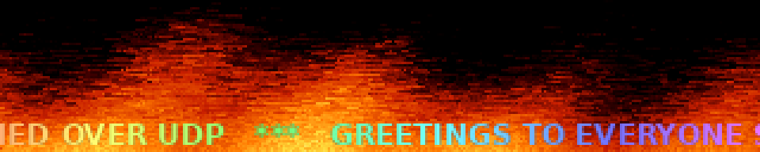

Plays the effects back to back as one continuous show, with real transitions
instead of hard cuts, and a scrolling banner over the bottom. Both effects are
live during a transition and their frames are blended; the type is chosen per
boundary, because a sparse effect crossfaded under a busy one is invisible and
wants a fade through black instead.

Effects are built on a worker thread a couple of segments ahead. Building
everything up front means a slow black start and every table resident at once;
building at the transition stalls visibly, since `scroller` bakes for seconds.

```console
$ python3 megademo.py --playlist "fire:20,tunnel:15:wipe,water:12+drops=4"
$ python3 megademo.py --no-banner --segment 25 --transition 3
```

## The effects

### fire


Doom-style fire: a row of burning fuel along the bottom, and every frame each
cell takes the heat of the cell below it, shifted sideways at random and
cooled a little. The randomness is what turns a smooth gradient into flames.
Done as one vectorized step over the whole buffer.

```console
$ python3 fire.py --palette ice --wind -0.4 --cool 4
```

### tunnel

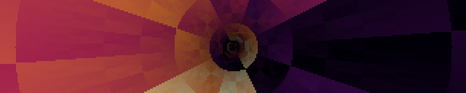

For every pixel, the angle around the centre and a depth that grows as you
approach it, used as texture coordinates. Scrolling the depth flies you
forward; scrolling the angle rolls the tunnel. Both depend only on the pixel,
so they are computed once and each frame is two integer adds, a mask and a
gather.

```console
$ python3 tunnel.py --texture rings --speed 120 --roll -0.3
```

### starfield

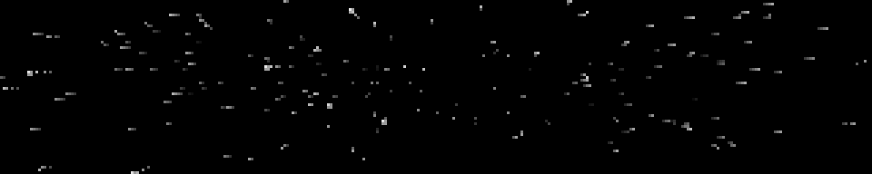

Stars drift towards the camera and are divided by their depth, so one crawls
while it is far away and then sweeps past. Each is drawn several times along
the distance it covered during the frame, which is what makes the streaks.

```console
$ python3 starfield.py --stars 800 --speed 1.6 --warp 6 --tint ice
```

### metaballs


Each ball contributes a field that falls off with distance; the fields are
summed and coloured through a palette. Because the sum is smooth, two balls
approaching each other bulge and merge into one shape rather than overlapping
— which is the point, and something you cannot get by drawing circles.

```console
$ python3 metaballs.py --balls 8 --palette toxic --contour 6
```

### rotozoom

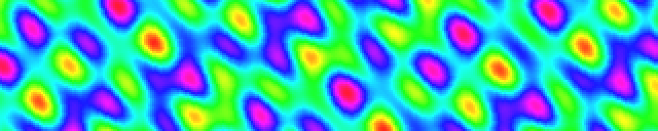

Rotate and scale a tiled texture by working backwards: for each pixel on
screen, apply the inverse transform to find where it lands in the texture.
Every pixel then gets exactly one sample with no gaps to fill, which is why
the effect was cheap enough for hardware that could not multiply quickly.

```console
$ python3 rotozoom.py --texture xor --spin 0.35 --zoom-min 0.4
```

### laser

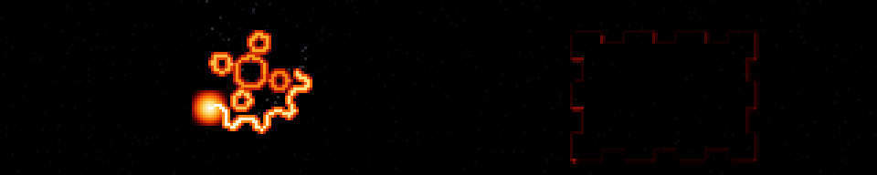

A laser cutter working through a job: a searing head tracing a vector path,
the kerf cooling behind it, and the piece dropping out when the outline
closes.

One scalar heat field carries all of it — the head writes 1.0 along the arc it
covered this frame, the field decays, and a black→red→orange→white ramp turns
it into kerf, trail and head bloom together. Cooling is a half-life in
*seconds* rather than a per-frame factor, so the trail is the same length in
wall time whether the demo runs at 8 fps or 30.

Paths are generated — gears, finger-jointed panels, filigree, slot lettering —
cut holes first, outline last, with dark rapid moves between contours and the
head stepping in arc length so corners do not speed up.

Heat alone cannot tell what belongs to the part, since lettering cut ten
seconds ago has already decayed out of the ramp, so a per-job cut mask relights
the whole piece for the second it takes to fall.

```console
$ python3 laser.py --cool 2.0 --shapes gear,filigree
```

### printer

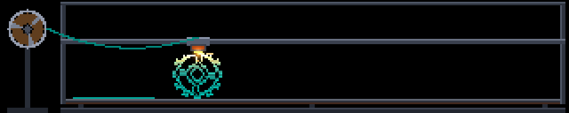

A 3D printer seen side-on: gantry climbing a row per layer, nozzle glowing,
part rising with visible infill — and sometimes failing into spaghetti.

Silhouettes are functions of normalised coordinates rather than sprites, so
they rasterise to whatever height the panel gives. Each layer is classified
into perimeter, skin and infill, and only the infill stencil is drawn, which is
why the cross-section is a lattice rather than a filled outline.

Failure is two independent draws per print — whether, and then independently
where, anywhere from 8% to 94% of the way up. Over 148 prints that gave 29.7%
failures spread evenly across the height; an early failure leaves nothing but
nest, a late one leaves a near-complete part with strands draped over it.

The spaghetti took three attempts. The coil phase has to come off one clock
shared by the whole strand: sampled per point it is confetti, and tied to
emission rate it is a smooth rope. Only the shared clock gives loose curling
filament.

```console
$ python3 printer.py --fail-rate 0.15 --speed 1.4
```

### lathe

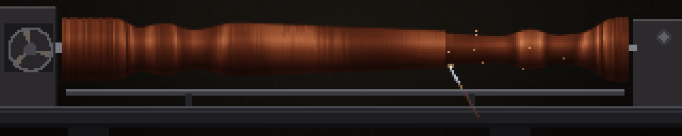

A woodturning lathe: a blank spinning between centres, a gouge walking the
length of it on the tool rest, shavings arcing off the cut, and a turned shape
appearing pass by pass.

A lathe bed is the rare subject that genuinely *is* this shape — headstock at
one end, tailstock at the other, and a long thin thing spanning the gap — so a
5:1 panel is not a constraint to design around here but the natural framing.
The work fills nearly the whole width and there is still room under it for the
rest and the tool.

Everything comes out of one array: **a radius per column** along the axis. The
silhouette is that profile mirrored about the axis, so drawing the blank is a
column fill. Cutting is the gouge writing a shallower radius into the columns
it crossed this frame. Shading is `sqrt(1 - (dy/r)^2)`, the actual cylinder
normal, which buys the round form for a lookup. Nothing is a sprite, and no
part of the drawing knows what shape is being turned — change the control
points and the silhouette, the cut and the shading all follow.

The growth rings are the reason to build it this way rather than as a
silhouette plus a texture. Rings live in the log's cross section, indexed by
distance from the pith, and every visible point on a solid of revolution at
column x sits at exactly radius `r[x]` from the axis — so the ring texture is a
**1-D lookup on the radius**, and taking radius off *reveals inner rings*.
Bands crowd where the profile falls away steeply and spread out along a taper,
which is what real turned work does, and they move as the cut deepens. Getting
that for free is the payoff for the representation; a texture painted onto the
silhouette would have had to be animated by hand and would still have been
wrong.

Spin is sold three ways, none of them a blur. The pith is a little off the
axis, so the ring radius is `r - e·cos(α - β)` with α the material angle at
that pixel — which expands onto `s` and `c`, the two shading terms already in
hand, and needs no per-pixel trigonometry at all. That makes the bands breathe
once a revolution. The specular band sits at a fixed angle and stays put while
the surface moves under it, which is what a highlight on a spinning cylinder
does. And the headstock pulley turns on the same phase, so there is one
unambiguous rotating object on screen.

Roughing creeps up on the shape over several passes, alternating direction the
way a turner does, each pass aimed at an interpolated version of the target and
leaving a little chatter; the finish pass lands on the target exactly and a
sanding pass takes the ripple out and raises a sheen. Then the lathe spins
down, the work lifts off — as a snapshot of the last frame, rising and fading,
so the fresh blank is already turning underneath and the machine is never
empty — and it starts again. That whole arc is about forty-two seconds.

Cost is a tight window of rows around the axis, deliberately not padded for the
once-a-cycle lift: within it a frame is one divide, four gathers and a blend
over roughly nine thousand pixels. The ring table, the shading and specular
ramps against position across the cylinder, the wood palettes and the whole
static shop — bed, headstock, tailstock, tool rest — are all baked in `build()`.
Rates are per second rather than per frame (feed in px/s, the fresh-cut glow as
a half-life in seconds), so it looks the same at 8 fps and at 30.

```console
$ python3 lathe.py --profile baluster --species walnut --feed 24
$ python3 lathe.py --profile beads --passes 6 --no-chips
```

### knit


An Aran cable sweater worked stitch by stitch. A knitting chart is already a
pixel grid — colourwork and cable charts are low-resolution raster art — so
stitches are 5x5 sprites blitted from source data, never drawn as curves.

What sells it is that the work is visibly *happening*: the row advances a
stitch at a time with jitter and hesitations, needles meet at the live stitch
with loops hanging from them, and rows alternate direction the way hand
knitting actually does. Cable crossings animate as the cable-needle move — the
front pair lifts clear leaving a shadowed hole, the other pair slides through,
the held pair drops into the vacated columns.

The chart is generated: counting cable ropes to the left of a stitch identifies
its rhombus, and the parity of that count is a checkerboard over the lattice,
which is what alternates seed-filled diamonds with reverse stockinette.

```console
$ python3 knit.py --diamond 14 --stitch-rate 9
```

### wheel


A bicycle drivetrain: three-cross laced wheel, chainring and cranks, chain
tracking both sprockets. Gear ratio is derived rather than tuned — both
sprockets share a chain pitch, so pitch radii follow from tooth counts and the
ratio falls out.

All spokes of a flange are tangent to one circle about the hub, so the tangent
angle for a pixel at `(r, a)` is `a ∓ arccos(d/r)`. That is baked once; a frame
reduces it modulo the spoke spacing, with no loop over spokes.

The moiré is the point, not an artifact. Thin spokes crossing a discrete pixel
grid genuinely strobe, and `--sweep` walks the rotation rate through the speeds
where the pattern stalls, crawls and reverses. The rim reflector cannot alias,
so it keeps sweeping while the spokes stand still — which is what makes the
illusion read as an illusion rather than a paused demo.

```console
$ python3 wheel.py --speed 5.0 --sweep 0 --spokes 32
```

### sunset

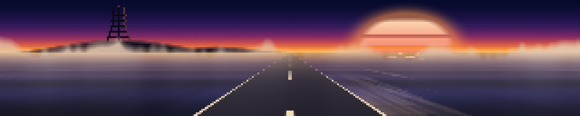

Driving west into a San Francisco sunset: sliced sun low over the Pacific,
glitter on the water, road running to the vanishing point, Sutro Tower on a
headland, Karl rolling in.

The sun is sliced with horizontal gaps that widen downward — the retro
treatment, and also the right call for a panel that bands in the dark end,
since deliberate horizontal structure reads as intentional where accidental
contouring does not.

Two things that only showed up by looking: distance haze on a gentle ramp
smeared the sky's reflection over the whole plane and the ocean read as wet
tarmac, fixed by confining it to a hard band a few rows deep at the horizon;
and a depth-scrolled water texture cannot win at this size — tight enough for
foreground crests, it aliases to hash across the mid field — so the swell is
one sine of each row's depth instead.

```console
$ python3 sunset.py --sun 0.8 --fog 0.4 --no-tower
```

### grove


Drifting through a sequoia grove: trunks running off the top of the frame,
warm shafts angling between them, fog in the gaps. You see a slice, not whole
trees, which is what standing in a grove actually looks like.

Bark is sampled at `arcsin(x/half)` — the true angle around the cylinder — so
fibres crowd toward the silhouette and the trunk reads as round rather than as
a flat bar. Depths are spaced geometrically, because linear spacing puts
everything in the middle distance where the parallax rates are indistinguishable.

Shafts carry a depth too, so occlusion is free: a nearer trunk blitted
afterwards interrupts the beam, and that interruption is what makes the light
feel three-dimensional. Nothing is blurred at run time — softness is baked into
the sprites.

```console
$ python3 grove.py --speed 6 --shafts 3 --fog 1.4
```

### goldengate


The bridge standing out of the fog. Geometry comes from the real thing in feet
— 4200 ft main span, 526 ft of tower over a 220 ft deck — at one pixels-per-foot
scale that happens to serve both axes of a 320x64 panel.

The detail that stops it reading as a generic suspension bridge is that the
main cable's vertex sits *on* the deck at midspan. Stepped Art Deco setbacks,
portal braces whose openings shorten going up, and single-pixel suspenders
every 6 px do the rest.

Fog is two tileable noise tiles scrolled across each other, windowed by a
rolling edge and a travelling bank envelope, with density tied to bank height
so a high bank is a thick one. The level clamps at both ends rather than
wandering mid-range — otherwise you get permanent haze instead of weather, and
never the frame where only the tower tops show.

```console
$ python3 goldengate.py --time-of-day 6 --day-cycle 0 --fog 0.8
```

### karl


Karl the Fog over the Twin Peaks ridgeline, swallowing Sutro Tower and letting
it go again. The calmest thing here — a full cycle from clear to buried takes
minutes.

Two noise textures scrolled at different rates and weighted differently by row,
with the detail layer's sample position displaced by the coarse layer. That
domain warping is what makes it curl rather than slide, and it costs a gather
rather than a simulation.

Density comes off the clock as three sines at incommensurate periods, saturated
at the ends so it *dwells* buried and then dwells clear instead of passing
through both.

Worth knowing if you touch the compositing: on this hardware, broadcasting an
`(H,W,1)` against an `(H,W,3)` is about four times slower than doing the same
arithmetic three times on contiguous planes.

```console
$ python3 karl.py --density 1.3 --speed 0.6 --no-tower
```

### slime

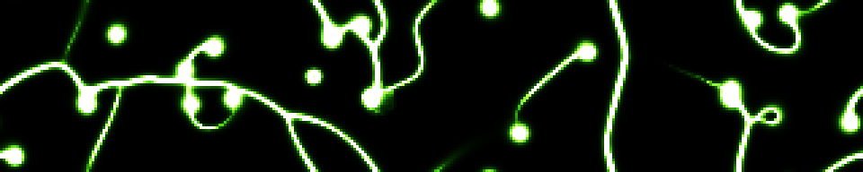

A Physarum transport network. Sixteen thousand agents each sense the trail
ahead of them at three angles, turn toward the strongest, move, and deposit;
the trail map is blurred and decayed each step. Nothing draws the network — the
filaments, junctions and loops are what those rules settle into.

Three departures from the textbook rule, each fixing a specific failure:

*Capping* the trail map stops it being winner-take-all. Uncapped, the busiest
strand reads brightest, out-attracts its neighbours, and within a minute two
fat strands hold the entire population.

*Food* — weak, slowly drifting attractant sources — is the one that matters
most. Even capped and well tuned, the network **relaxes**: strands merge, bends
straighten, and after a few minutes all that is left is motionless vertical
lines, which are the shortest closed paths a wrapping 64-row canvas admits. No
decay value fixes that; it is the end state of the tuning rather than a failure
of it. Foraging forces junctions that relaxation cannot remove, and moving
sources keep it re-solving.

*Spore batches* nucleate new colonies that grow and fuse while starved branches
prune. They have to be a batch in one place and facing outward — scattered
agents just join the nearest strand, and random headings give a trapped orbit
that shows as permanent confetti.

`--deposit` is expressed as the resulting equilibrium mean trail value, with
the per-agent amount derived from it, so changing agent count or decay does not
move the brightness — only the sharpness of pruning. Decay 0.94 is about
sixteen steps of memory; 0.98 floods to a uniform lit field in twenty seconds
and 0.85 never organises at all.

The trail is seeded with blurred noise and given a few hundred warmup steps
inside `build()`, so frame zero is already a network rather than something you
wait for.

```console
$ python3 slime.py --agents 24000 --sensor-dist 5 --palette ice
```

### fireflies


A field of oscillators that spontaneously synchronise. Each firefly has its own
natural rate and flashes when its phase wraps; coupling pulls it toward its
neighbours, and out of that come waves of synchrony that sweep across the panel
and collide.

Coupling is deliberately **local**, not mean-field. Mean-field is cheaper, but
the whole field then snaps into unison at once, which is far duller to watch —
local coupling is what produces travelling waves, and a 5:1 panel is the right
shape to see them cross. Each phase is splatted as a unit vector into a coarse
grid, the grid is blurred, and the result sampled back at each position: O(N)
plus a small blur, with the blur radius acting as the coupling range.
Normalising by the blurred *count* makes the pull depend on how much a
neighbourhood agrees rather than how crowded it is, so a synchronised patch
recruits its border.

Two things keep it from going static, which is the real design problem — a
fully locked field is as boring as a scattered one. The frequency spread is
wide enough that full lock is unreachable, and the natural frequencies
themselves drift, so there is no fixed consensus to converge on: leaders change
and every truce eventually breaks. Measured over five minutes the global order
parameter roams 0.08 to 0.84 indefinitely, reaching 0.8 within twenty seconds
from a cold start, so a short slot still shows the arc. With `--coupling 0` it
sits at 0.05 and never organises, which is the control worth keeping in mind.

```console
$ python3 fireflies.py --coupling 2.5 --range 40 --no-grass
```

### mario


A self-playing side-scrolling platformer: a little plumber runs right through
an endlessly generated level, jumping pipes and gaps, collecting coins and
stomping the odd goomba, over three layers of parallax.

The background is a sequoia grove rather than the round two-lobed bushes the
genre expects — cinnamon trunks bare for two thirds of their height, the
nearest of them running off the top of the panel. They are the only scenery at
the character's own scale, so they are what the scene reads as; the level in
front of them stays eight-bit. Trees are stamped into one wide strip at two
depths, the far ones shorter and blended toward the sky, and the strip is
scrolled by slicing, so the whole grove costs one wrapped blit a frame.

Uses 8 px tiles with a two-tile character rather than classic 16 px ones. At
16 the panel is four tiles: ground plus character leaves under a tile of
headroom and there is no jump arc at all. At 8 it is eight tiles — one ground,
two character, five of air — which is what makes a three-tile pipe clearable.
`--scale 2` gives real 16 px tiles and demonstrates the problem: no pipe
height passes the clearance test, so the generator emits only gaps.

The level generator is bounded by the physics rather than tuned by hand.
`build()` derives the airtime and horizontal reach of a jump, then admits an
obstacle only if the actual trajectory clears it at *both* edges of its span —
the apex is over the middle, so the edges are the tight part — and leaves more
than one jump's reach of flat ground between obstacles. That is what stops it
ever generating something unclearable, which on an unattended wall would strand
the character hours later.

```console
$ python3 mario.py --density 0.6 --speed 70 --run-fps 14
```

### nyancat


The pop-tart cat, trailing a rainbow through twinkling stars. The sprite lives
in the source as rows of characters with a palette per character, so it can be
edited in a diff rather than shipped as an image; moving parts (four tail
poses, the paws) are separate grids composed into the six loop frames at
startup and scaled with `np.repeat`.

The sprite animates on its own clock (`--cat-fps`, default 10) rather than the
display rate — the original is much slower than a display refresh, and tying
the two together makes it look wrong at any frame rate but one. The trail is
baked a whole square-wave period wider than the panel, so scrolling it is a
slice at an offset.

A 320x64 panel is close to the ideal shape for this: the cat sits right of
centre and the rainbow reaches the far edge.

```console
$ python3 nyancat.py --cat-x 0.4 --speed 40 --no-stars
```

### floor


A Mode-7 perspective plane: gradient sky with a sun, a horizon, and textured
ground receding to it, with forward motion and a slow steer. Each screen row
below the horizon is at a constant distance, so per-row depth, texture step,
mip level and fog are all precomputed and a frame costs an add, a truncate and
one gather. An anisotropic mip chain kills the fish-scale moire that otherwise
covers the mid field, since a row near the horizon spans hundreds of texels of
depth while stepping a fraction of one across.

```console
$ python3 floor.py --texture road --palette magma --speed 90
```

### cycle

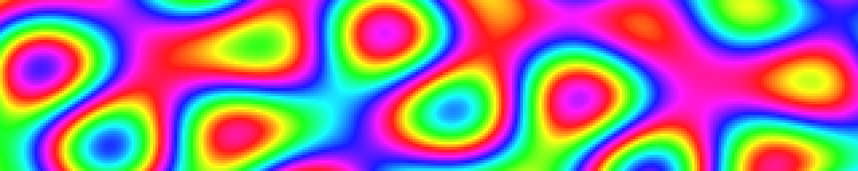

Colour-cycled plasma. The image is computed exactly once and the animation is
entirely the palette rotating under it — the classic technique, and about ten
times cheaper per frame than anything else here at 0.05 ms. The palette must
be *cyclic* or every wrap shows as a seam sweeping across the panel, so the
non-cyclic ramps are mirrored to close the loop.

```console
$ python3 cycle.py --pattern spiral --palette rainbow --bands 3
```

### water

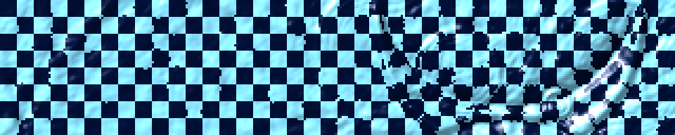

A damped wave equation with drops falling on it, rendered by refraction rather
than by colouring height: the local slope offsets a lookup into a background,
so the surface bends what is beneath it. Uses a nine-point isotropic Laplacian
— the usual four-neighbour stencil makes ripples spread as diamonds and sits
right on the stability limit. Boundaries are fixed rather than wrapping, so
ripples reflect instead of reappearing on the far edge.

```console
$ python3 water.py --background grid --drops 5 --refract 34
```

### fireworks


Shells launch, arc up and burst into sparks that fall and fade. One fixed-size
particle pool in flat arrays, updated with whole-array operations and recycled
through dead slots, so every frame costs the same. Trails come from a decay
buffer. Spark speed is the load-bearing parameter: below about a pixel per
frame the sparks creep and the decay buffer paints a solid disc instead of
rays, so speed and drag have to be raised together.

```console
$ python3 fireworks.py --rate 3 --types willow,crackle --palette ice
```

### boing

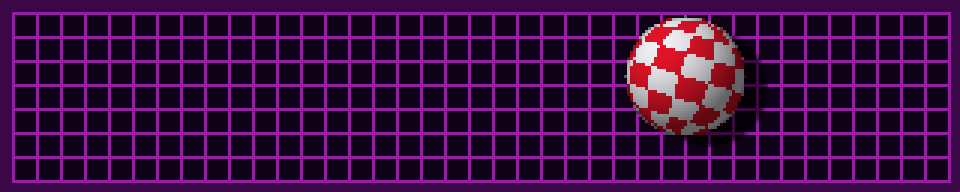

The Amiga Boing Ball: a red and white checkered sphere spinning about a tilted
axis, bouncing in a purple wireframe room. The silhouette and the surface
coordinates of every pixel are precomputed once, so a frame is an add, an xor
and a masked blit. Checker counts derive from the radius and are forced even,
so the equator lands on a cell boundary and the pattern stays consistent
across the longitude wrap.

```console
$ python3 boing.py --radius 24 --segments 16 --bands 8
```

### daliclock


A clock whose digits melt into each other. Seven-segment glyphs are generated
rather than loaded from a font, and the morph interpolates their signed
distance fields and re-thresholds — so the outline moves and you get one solid
deforming figure, where a crossfade would give two superimposed glyphs at half
brightness. Time is read from the system clock inside the frame callback, so
the melt stays locked to the second rather than drifting with frame rate.

```console
$ python3 daliclock.py --12h --palette green --morph 0.6
```

### splitflap


A split-flap departures board. Changing a letter riffles through *every*
intervening card in a fixed stack order, so blank→Z takes 26 flips and blank→B
takes two — that staggering, plus per-cell rate jitter and start delay, is what
makes the board ripple instead of switching in unison.

The flip is a real mechanism, not a crossfade: the outgoing glyph's top half
squashes toward the seam while the incoming glyph's top arrives above it, so
mid-flip a cell legitimately shows two different characters with a hard dark
seam between them. Past ninety degrees you see the card's back, which is the
incoming bottom half unfolding downward. Foreshortening is a nearest-neighbour
row resample rather than a blur, which at 64 rows would turn to mush.

Every squashed step of every card is baked at startup, so a frame is a handful
of small blits and settled cells are never touched — it is the cheapest demo
here by a wide margin. Glyphs are a 5x7 bitmap font in the source, no font file.

`{TIME}` and `{DATE}` are substituted live, so it can be a clock as well as a
sign.

```console
$ python3 splitflap.py --messages "SEQUOIA FABRICA|OPEN HOUSE {TIME};MAKE THINGS|ASK ANYONE" --hold 12
```

### scroller


Rainbow glow text bouncing over a plasma field. The plasma is baked as a
seamless loop and replayed, and the text, its tint and its glow are baked once
into one wide strip, so each frame is a couple of slices. The bounce is
applied in *screen* space, not text space — a text-space wave travels with the
letters and just slides rigidly.

Expect a few seconds of black at startup while it bakes; `--plasma-frames`
trades loop length for startup time.

```console
$ python3 scroller.py --text "GREETZ  " --amp 16 --no-plasma
```

### headroom


Max Headroom: a plasticky head in dark glasses stuttering in front of a
backdrop of neon stripes that rotates and recedes. The stutter is the
character, not a defect — holds, one-frame repeats, jumps back to an earlier
pose and the occasional freeze, all of them the artefacts of video that keeps
skipping, with a horizontal tear and an RGB split arriving on the glitch frames.

The room is one `np.take` from a table that packs the angle around the
vanishing point, 1/radius, the radial fade and the row parity into a single
index, so a frame is one gather rather than four trig evaluations over 20480
pixels. What that buys is also what it costs: the vanishing point cannot wander
continuously, because moving it means re-deriving `atan2` and `1/r` every
frame, so it cuts between three baked positions instead. On this material the
cuts read as deliberate camera jumps.

The head is a union of eight ellipsoids solved in closed form — the ray-ellipsoid
quadratic has an analytic nearest root, so there is no marching — baked into 20
yaw poses over about 100°, then blitted. Three of its features are painted as
bands in head space rather than built as geometry: the glasses, the hairline,
and the lit crest of the hair. That last one is what stops the hair reading as a
polished gold helmet — a single material shades smoothly however it is lit,
whereas splitting it into a lit front and an unlit swept-back mass gives the
silhouette a direction at 64 rows.

Getting it to read as plastic rather than as a mannequin took a pale, nearly
unpigmented base with the room's magenta arriving through the fill and a hard
specular carrying the surface; an earlier pass with the colour in the base
instead came out as meat.

The caption says MAX TAILSPACE, which is what a head and a room become when you
take the opposite of both halves — the sort of joke the character would have
made about himself, and it keeps the wall from claiming to be someone it is
not. `--say` takes anything; the stutter is derived from whatever it is given.

```console
$ python3 headroom.py --room acid --spin -1.5 --glitch 1
$ python3 headroom.py --say "" --side left --no-scanlines
$ python3 headroom.py --say BLIPVERT --room ice
```

### wopr

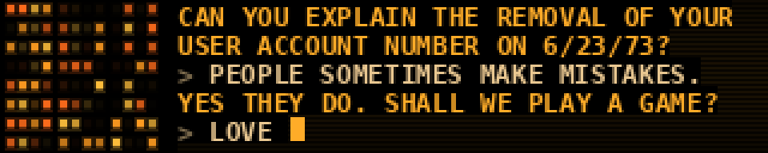

WOPR from *WarGames*: the lamp banks thinking on the left, the Falken exchange
printing itself out on the right. Two things made the 1983 prop memorable and
neither is a graphic — the monolith's rows of amber lamps blinking against each
other with a sweep occasionally crossing a bank, and chunky phosphor capitals
arriving one at a time.

The two speakers differ by colour *and* by rhythm, which is what lets you tell
who is talking from across the room without reading a word. WOPR prints
steadily with a few percent of jitter, because it is a computer; the human's
replies are paler, sit behind a `>` prompt, run at about half the speed, and
carry real hesitation — a wide spread per keystroke and an occasional quarter
second of nothing at a word boundary. A constant interval never reads as a
person.

The lamps are 112 numbers, not 4600 pixels: each gets a baked rate, phase and
duty, so its brightness is `((t*rate + phase) % 1) < duty`, and painting the
bank is a single gather through an index map with the glow already folded into
a weight map. The chase is a gaussian in lamp-column space, one per bank, with
incommensurate speeds so the banks never line up. Two things that did *not*
work: dimming the gaps between lamp rows for the grille, since those are
already black, and letting the chase push brightness past 1.0 — the store into
uint8 is unsafe, so a lamp at 1.2 wrapped round to dark green confetti.

The script is an argument, so anyone can retype it: `;` between lines, a
leading `>` for the human. The whole exchange lands in about 35 s and then
holds, so it finishes on FINE rather than being cut off mid-sentence.

```console
$ python3 wopr.py --layout lights --colour green
$ python3 wopr.py --script 'SHALL WE PLAY A GAME?;>LOVE TO.' --cps 14
```

### defcon

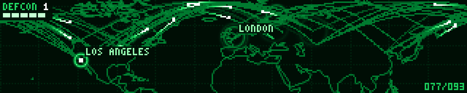

The big board from the same film, playing out an exchange: coastline in thin
glowing vector, missile tracks arcing over it, warheads blooming as expanding
rings, and a DEFCON readout stepping down while it all goes wrong. 320x64 is a
letterbox, and a letterbox is what a wall map wants to be.

**The map is real geography baked into the file** — Natural Earth 1:110m
coastline, public domain, simplified offline with Douglas-Peucker and encoded
as 81 polylines and 897 points in about 2 kB of source. Nothing is read at
runtime and nothing needs the network, which matters on a Pi that boots into
the rotation with no guarantee that anything else is reachable.

The projection is forced by the panel rather than chosen: 320 square pixels
across 360° of longitude is 1.125° a pixel, so 64 rows buy exactly 72° of
latitude. Taking that as 8°N–80°N turns out to be a gift rather than a
compromise, because that band *is* where the film's war happens — North
America, the Atlantic, Europe, Russia, China, Japan.

The map never moves, so it is rasterised once at 2x and box-filtered down; that
supersample is the whole reason the coast reads as a line rather than as a rash
of lit pixels, since a 1x Bresenham line on a 320-wide panel is either dashes
or, thickened, a blob. Per frame the demo composites into one float32
accumulator and maps it through a palette — about five whole-array passes and
no allocation. Each trajectory's pixel path is baked as a flat index array, so
a live track is six numpy calls over fifty-odd elements, and the spent tracks
that accumulate into the finale are drawn in eight pre-concatenated groups
rather than as ninety separate scatters.

It opens with tracks already in the air, because an effect that starts empty
spends its first seconds looking broken. From there the interval between
launches shrinks geometrically over the whole 80 s cycle — about one launch
every five seconds at the start, six to eight a second by the end — and flight
times shorten on the same curve, which compounds. DEFCON is derived from that
schedule rather than run off its own clock: the level drops as cumulative
launches cross fixed fractions of the total, so the countdown is a consequence
of the exchange instead of a caption over it.

Then it ends the way the film does. The impacts pile into a rising glare —
baked as one float per 1/60 s, an exponential pulse per detonation summed and
clipped, so it costs a scalar add — the board whites out, and everything goes
dark. After a beat of nothing, a block caret appears and types the line out a
character at a time:

> THE ONLY WINNING MOVE IS NOT TO PLAY

It reads as the machine at the other end composing it rather than as a caption
being switched on. The rhythm is a machine's — one interval wobbled five per
cent, because dead-constant timing at this size reads as a progress bar filling
and anything more uneven reads as a person at the keyboard, which is the wrong
character — with a beat where a terminal would return the carriage and a longer
one before the last word. The caret is solid while it writes and blinks only
once the line is finished; a caret that blinks *through* the typing looks like a
fault. The whole performance is capped at 55% of the phase and scales down
uniformly if it will not fit, so a long `--message` or a short `--cycle` types
faster rather than being cut off mid-word.

It is set in the same baked 3x5 pixel font as the readouts, scaled up and
wrapped to whatever fits, so there is no font file to be missing on the Pi. Then
the map fades back at DEFCON 5 and it starts again. The whiteout draws the board *under*
an additive white that dies as `(1-k)⁴`; a flat filled panel read as a fault
rather than as a detonation.

```console
$ python3 defcon.py --colour amber --arcs 10
$ python3 defcon.py --cycle 30 --speed 1.5      # hurry the war along
$ python3 defcon.py --message ""                # no epigram, longer war
```

### tron


Light cycles, seen from above. Of everything in this directory this is the one
whose source material was already the right shape: the game grid in the film is
a wide rectangle viewed from overhead, which is what the wall is.

Two bikes leave solid ribbons behind them and turn only at right angles, on a
faint grid inside a lit border. The bike is hotter than its trail and carries a
lead spark, so the eye can find the live end of a line that is otherwise
uniform. When one is boxed in it **derezzes**: the panel flashes, the bike
bursts into blocks that scatter and fade over about 0.4 s, and then its ribbon
dissolves from the far end with a bright front running along it, like a fuse
burning backwards. Four rounds fit in the cycle.

The arena is a small integer array — at the default `--grid 2` it is 160x32
cells — scaled up with `np.repeat`, so a frame is a couple of array ops rather
than any drawing. Sim state is a pure function of the step index, which is what
keeps `render()` a pure function of `t`: a forward jump is just extra steps, and
a backward jump reseeds and replays. That matters because ftsched starts a demo
at t=0 having built it earlier, and the preview baker steps it at its own rate.

Two things worth saying plainly. **The riders rarely trap themselves.** On a
5120-cell board, two bikes with a 20-cell lookahead can dodge almost forever, so
most rounds end at a deadline where the steering comes off the rider with the
shortest way out and it is pointed at a wall. It is a real collision with a
visible obstacle, but the timing is scheduled rather than emergent. And **more
riders is not the fix on this hardware**: `--riders 3` and `--riders 4` are
genuinely better to watch, but they measure 44 and 40 ms a frame on a Pi 3
against the 33.3 that 30 fps allows, so they will not hold frame rate on the
wall. They are there for a faster host.

```console
$ python3 tron.py --riders 4 --colour neon      # better, but not on a Pi 3
$ python3 tron.py --grid 4 --speed 18           # chunkier, legible further away
$ python3 tron.py --rounds 2 --derez 2
```

### sneakers


SETEC ASTRONOMY, rearranging itself into TOO MANY SECRETS. Both are the same
fourteen letters — A C E E M N O O R S S T T Y — and the demo is that fact,
animated: every letter is a tile that lifts off the line, flies to its position
in the other phrase along a staggered arc, overshoots and settles.

A single line of large type is the best possible use of a 5:1 panel. Fourteen
glyphs across 320 px is 18 px of advance each, which at the default scale is
15 px of ink and 27 px tall — big enough to read from across a room, which is
the entire point. If both phrases are not legible the joke does not exist.

It opens the way the film's box does, with the letters churning through garbage
before they lock, and it holds each phrase long enough to actually be read. The
palette is amber phosphor with a scanline texture, deliberately unlike `wopr`
and `console`, which already own green.

**The anagram is checked at build time.** A supplied `--words` pair that is not
actually an anagram is refused with the difference spelled out, because the
failure mode otherwise is letters quietly appearing and vanishing mid-flight,
which looks like a rendering bug rather than a typo. The glyphs come from a 6x9
bitmap font in this file, baked at 16 brightness levels and two scanline
phases; a frame is a background copy and at most 28 tile blits, and there is no
font file to be missing on the Pi.

Honest about one thing: through the middle half-second of a crossing, fourteen
letters permuting inside a 64 px band do clump near the centre. In motion it
reads as objects crossing each other; a still frame makes it look worse than it
is. `--arc 1.5` buys more vertical separation if you want it.

```console
$ python3 sneakers.py --colour green --arc 1.5
$ python3 sneakers.py --words 'ELVIS|LIVES;DORMITORY|DIRTY ROOM'
$ python3 sneakers.py --hold 3 --speed 1.6       # impatient version
```

### trench

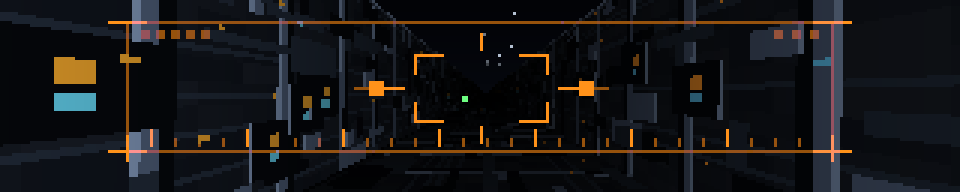

The Death Star trench, and the targeting computer that swings down over it.

Two walls, a floor and a strip of sky converging on a vanishing point, studded
with panel lines, hatches and lit greebles rushing past. The panel's shape does
the work: a 5:1 letterbox with the vanishing point centred puts the four
convergence lines in an X across the frame and leaves the near walls as big
slabs sweeping the outer thirds, which is what sells the speed.

Then the computer comes down — a dim amber bezel with hot orange reticle
brackets, the trench still visible through the middle — the two blips close on
the centre over about fifteen seconds, the lock verticals blink, and it swings
back up and out of frame. The run finishes without it, the torpedoes go in, and
the exhaust port blooms the whole panel white-amber before it all resets.

The geometry is a baked per-pixel inverse map, the rectangular cousin of what
`tunnel.py` does with a circle: `build()` resolves every pixel's ray against
four planes and stores one flat texture index plus a fog scalar, each surface is
written into the atlas twice back to back, and flying forward is `idx + off*W`
followed by a single `np.take`. Roll is thirteen baked angles picked per frame
and camera shake is a slice offset into padded maps, so neither costs anything.
Three passes over the frame in total.

It is deliberately dark. The far field falls off steeply because a gentler
curve left an aliased speckle cloud crawling around the vanishing point; the
price is that the middle third of the panel is nearly black for most of the run,
which on an LED wall reads as depth rather than as absence.

```console
$ python3 trench.py --no-computer --speed 1.4
$ python3 trench.py --greebles 2 --shake 1.5
$ python3 trench.py --cycle 30                  # one quick run
```

### fsn


"It's a UNIX system. I know this." The 3D file system navigator from Jurassic
Park — real software, SGI's `fsn` — as a flythrough over a dark plane of
extruded boxes.

Directories are gateways you fly *through*, with their path name above them and
ranks of small file blocks on plinths either side; walkways and a converging
ground grid tie the level together. The camera runs forward, banks, and passes
through one gateway after another, and the moment the pillars swell past the
edges of the panel with the next level visible through the opening is the best
thing in it. Labels are what make it say *filesystem* — the geometry alone reads
as structure but not as a directory tree, so `/HOME`, `/ETC`, `/PROC` and the
rest are doing real work rather than decorating.

The camera only translates, never rotates, so every box stays axis-aligned in
camera space and each visible face is a quad with straight screen-space edges;
bank is a shear folded into the projection. Boxes are pre-sorted by centre z and
tiled over three periods, so painter's order is a `bisect` slice with no
per-frame sort, and the ground, sky and clear are baked per bank angle so the
background is a memcpy.

**This one is where the Pi stopped being an abstraction.** It first measured
65 ms a frame there against 1.1 ms on a desktop, and the fix was not fewer
pixels but fewer numpy calls: on this hardware a numpy call inside real code
costs about 80 µs almost regardless of array size. Reducing the drawn content
was worth about 1.5 ms; restructuring was worth 30. Three traps, all worth
knowing before writing another of these:

- `np.clip` under numpy 1.19 costs **0.4 ms per call at any size** — a
  deprecation shim. Eight a frame is 3 ms of nothing.
- A **`float32` scalar** costs 50 µs per arithmetic operation against 1.6 µs
  for a plain Python float. All scalar maths here is `math`, not numpy.
- `int_array + 0.5` silently promotes to float64, so a scanline pass written
  the obvious way runs in double precision.

Even so it lands around 45 ms p95 on the wall's Pi rather than the 20 that was
wanted, so it runs at 20 fps in the rotation rather than 30. It is a slow camera
move over a mostly static landscape and it does not miss the extra frames;
dropping them unpredictably would have looked worse than not asking for them.

Worth knowing when reading any of these numbers: betelgeuse currently reports
`throttled=0x50005` with its ARM clock pinned at 600 MHz instead of 1200, which
is under-voltage, not heat. Every timing here was taken in that state, so they
are all roughly a factor of two pessimistic against a Pi 3 on a healthy supply.

```console
$ python3 fsn.py --caption --density 1.2
$ python3 fsn.py --depth 6 --speed 1.5
$ python3 fsn.py --no-labels --no-grid       # just the landscape
```

### esper

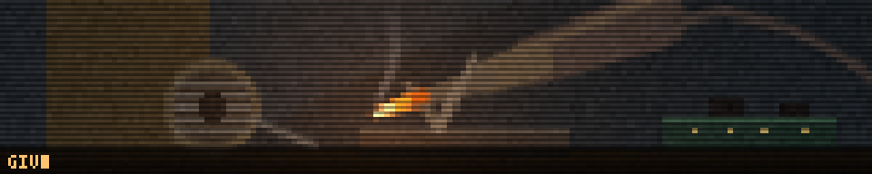

The Esper machine from Blade Runner: a photograph, enhanced to death. Deckard
talks to a screen — ENHANCE 224 176, PAN RIGHT, STOP, TRACK 45 LEFT — and the
machine walks a reticle over a still and dives into it, until a detail that was
never visible in the original fills the frame.

That sequence is almost the only thing in cinema built for a 5:1 letterbox. The
picture is a wide still, the commands run along the bottom in one thin line, and
the whole drama is a crop rectangle moving. **The blockiness is the aesthetic
rather than a compromise** — every move lands frankly pixelated and resolves in
three visible steps, 8x8 blocks to 4x4 to 2x2 to full detail, which is what the
film's enhancements do and what a 320 px panel does anyway.

**The photograph is generated, not baked.** `build()` draws a 1280x256 room in
numpy: deep shadow, a sodium lamp, venetian blind bars across the left wall, a
doorway with a figure in it, a chair, and a mirror on the far wall reflecting a
workbench. It is detailed at several scales on purpose, because a source with
detail at only one scale gives you one good zoom and then nothing — the
wallpaper stripes are 8 px, the chair slats 3 px.

On that bench is a soldering iron, 48 px end to end with a tip two pixels
across, and it is the payoff. At the opening framing the whole bench is a smudge
and the tip is a single warm pixel indistinguishable from a highlight on the
glass; at the last enhance the tip is the brightest thing on the panel and the
thing it is attached to is unmistakable. The cord trailing off the handle and
the tapered hot tip are what carry the read. The V-cradle it rests in is at the
edge of what survives at this size — what comes across is that the iron is
propped in *something*, which is enough; a coiled-wire holder was tried first
and read as nothing at all, because at five pixels a turn a helix is not a
shape.

A zoom is one gather. The source and its three mosaic levels are stored flat as
(N, 3) uint8, and a frame computes 320 column and 64 row indices from the
current crop and does a single `np.take`. No resampling, no PIL, no float in the
per-frame path. Scanlines are free: the source is stored twice, once dimmed, and
odd rows index the second copy.

Eight moves, about 60 s, so it wants a `seconds: 70` slot — a cut before the
mirror is a cycle with no ending in it.

```console
$ python3 esper.py --colour amber               # monochrome Esper CRT
$ python3 esper.py --cycle 40 --speed 1.2       # the short version
$ python3 esper.py --no-commands                # just the photograph moving
```

### wardial

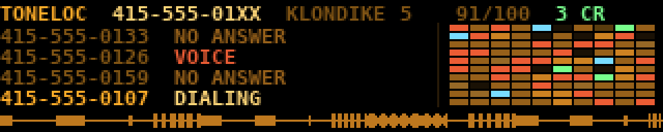

A war dialer working through a San Francisco exchange: a log of what each
number did, a map of the exchange filling in as it goes, and the call progress
audio along the bottom. WarGames put one on screen in 1983 without naming it;
by the time ToneLoc was being passed around on floppies it had a config file
and a scan log, and this is that screen.

**Every number is the reserved fictional block, and that is also the joke.**
The scan runs 555-0100 to 555-0199, the range the numbering plan sets aside so
that films can put a number on screen without ringing a stranger — which is
exactly one hundred numbers, which is exactly a 10x10 map. And 555 was not
chosen arbitrarily by the film industry either: in the days of two-letter
exchange names it was KLondike 5, which is what the panel calls it. On a wall
in a public workshop the safe choice and the authentic one turned out to be the
same choice. The area code is 415, with `--area 628` for the overlay.

**The whole scan is a schedule.** `build()` draws every attempt's outcome and
duration from a seeded generator and sorts them into one list; `render()`
binary searches it and carries no state between frames. The log is four baked
strips copied into place and the map is one `np.take` through a baked index
image, the way `wopr` paints its lamp banks.

**The trace is call progress, not audio.** 320 columns cannot represent 1600 Hz
and pretending otherwise draws noise, so it is an envelope — signal level
against about a second and a half of history. What that does carry honestly is
cadence, which is the part anyone recognises: the stutter of the dial, two-on
four-off ringing, the half-second chop of a busy signal, and the flat unbroken
wall of a carrier.

Outcome timings differ, so the loop is seed-dependent: measured over 39 seeds
it runs 41.2 to 44.9 s including the hold, which fits a 45 s slot with the
exchange swept and totted up rather than cut off half way down the map.

```console
$ python3 wardial.py --area 628 --cps 3.5
$ python3 wardial.py --seed 7 --order serial --no-trace
```

### ansi

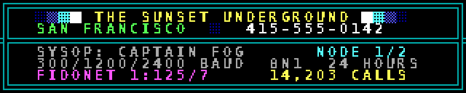

A BBS answering, and drawing its welcome screen one character at a time. Before
a page arrived all at once, a screen arrived at the speed of the line and you
watched it happen — the box border creeping across the top, the sysop's name
appearing letter by letter. That reveal is the demo; everything else exists to
give it something worth revealing.

**The panel is a text screen, exactly.** 320x64 divides into 40 columns and 8
rows of 8x8 cells with nothing left over. Glyphs are 1-bit the way a CP437 ROM
font was, thresholded after rendering, because an antialiased edge on an LED
wall is a smudge and was not something a character generator could produce. The
font size is *measured* rather than assumed — a nominal 10 px face is not 10 px
of capital, and it differs between DejaVu, Liberation and Pillow's fallback, so
sizes are walked down until the capitals actually fit the cell. Picking a
number instead shaved the bottom row off every E on one machine.

**Box-drawing and shading characters are computed, not rendered.** A font may
not have a double-line corner and the fallback certainly does not, so asking
Pillow for one is a working panel here and a screen of empty rectangles on the
Pi. But those glyphs are geometry — two rails at rows 2 and 5, two at columns 2
and 5, and which directions the junction opens into — so they are built from
that description and are identical everywhere.

**Foreground colour only.** Real ANSI art leans on background colours; on an
LED wall a lit background is expensive light that washes out the type sitting
on it, so the shading is done with block characters in colour on black. The
palette is the sixteen CGA colours at their real values, including a blue too
dark to read, which is why nobody put text in it.

**The reveal is two slice copies.** Cells arrive in reading order, so what has
been sent is always "every row above this one, plus a prefix of this row" — two
rectangles, no mask and no compositing. 300 baud is a deliberate lie: at the
1200 and 2400 these boards ran, a 40-column screen paints in under two seconds
and the reveal is over before you look up.

```console
$ python3 ansi.py --cps 80        # 1200 baud, if you want the truth
$ python3 ansi.py --no-cursor --ring 0.5
```

### gibson

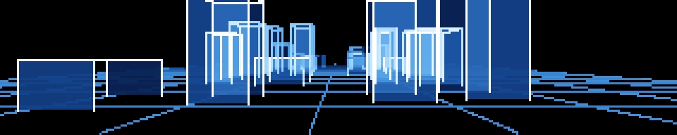

Flying through the Gibson: glowing wireframe towers rushing past on both sides,
a grid floor running to a vanishing point, no horizon to speak of. Hackers
(1995) had to show what being inside a mainframe looks like and chose a night
flight over a city — a completely fictional depiction of a computer, and the
most durable image the genre produced, because it has speed in it.

A 5:1 letterbox has a vertical field of view of about 25 degrees, which would
ruin a tunnel or a landscape and is exactly what you see through a windscreen.

**The towers are translucent glass, and that is the whole trick.** One light
blue, semi-transparent, with wireframe rims lighter than the faces — so a box in
front tints the box behind it rather than hiding it, and where two overlap the
pair goes paler than either. Nothing composites and nothing sorts by depth:
everything is drawn as *density* into a scalar buffer and coloured once at the
end through a single black→blue→white ramp. Two panes of the same blue stacked
are simply a larger number than one, which is what glass does anyway, and it is
order-independent.

**A box face fills without a polygon rasteriser.** The camera looks straight
down +z with no rotation, so a face at constant z — the front and back of an
axis-aligned box — projects to an axis-aligned *rectangle*; and a whole batch of
rectangles fills with no loop at all, by writing ±d at their corners into a
difference image and running a cumulative sum down and then across. That is two
cumsums over the panel however many towers are in shot. The four side faces are
trapezoids and are left unfilled — perspective offsets the front and back
rectangles from each other and the wireframe joins their corners, which is
enough to read as a box.

**The floor is behind the glass rather than added to it**, in its own buffer and
attenuated where a box covers it. That attenuation has to be driven by
*coverage*, not density — a pane of glass is faint but completely covers what is
behind it, so scaling by density dimmed the grid by about a tenth and the lines
went on marching across the towers as though painted there. It is deliberately
not total: the grid staying faintly visible through a tower is most of what
makes the tower read as glass.

**Every line is drawn in one operation.** The obvious way to draw a few hundred
wireframe edges is a loop with a couple of numpy calls each, which on the Pi 3
is several hundred calls at 55–80 µs of overhead — 20 ms before a pixel is
written. Instead all edges are projected as arrays, clipped to the frame with a
vectorised Liang-Barsky, sorted into four length classes, sampled into one flat
point cloud and written in a single indexed assignment. Cost is set by the size
of the cloud, not by how many objects are in the scene.

The length classes matter: one fixed sample count cannot serve both a twelve
pixel tower edge and a floor line running the width of the panel, and the first
version drew the floor as a dotted grid because of it. Clipping first is what
bounds the longest class by the panel rather than by the geometry.

**The shape of this file is what the Pi measured, not what read well**, and
three plausible ideas were wrong in ways a desktop hides. It began accumulating
with `np.bincount`, which sums where points coincide and makes crossing lines
glow for free — on the Pi that is 8.5–10 ms for three calls *however few points
go in*, because the price is the 20480-bin output and the float64 it insists
on; three indexed assignments over the same data are 1–2 ms. Making the length
classes finer halved the point cloud and changed the frame time by nothing,
because each class costs ~15 array operations whatever is in it and the two
effects cancelled exactly. And `np.linspace` was being called once per class per
frame to produce a fixed array of numbers, at 3.9 ms of a 45 ms frame.

Together those took it from 44 ms to 23 on the wall's own hardware; the glass
added the two cumsums and put it back to 30 mean / 36 p95, which is where it
sits — though the worst frame *improved*, 74 ms to 54, because filling costs the
same every frame whereas the wireframe spiked whenever a tower swept the panel.
What is given up is the summing: where two lines cross the pixel is whichever
was written last. Depth is the only shading — weight falls off with distance and
fades to nothing before the near plane, so nothing ever pops, and edges too
faint to see are dropped before any work is done on them, which halved the worst
frame because those are also the longest ones on screen.

Filled towers make this one of the *densest* things in the rotation, so unlike
the other three here it is deliberately not in megademo's `SPARSE` set.

**It loops exactly.** The tower field repeats every 112 units, the camera covers
that in a fixed time, and the sway that keeps it off rails is given exactly half
that frequency so the two come back into phase together.

```console
$ python3 gibson.py --speed 26 --fov 130
$ python3 gibson.py --fill 0                    # bare wireframe, as it started
$ python3 gibson.py --fill 0.22 --occlude 1.0   # heavier glass, opaque to the grid
```

### toasters

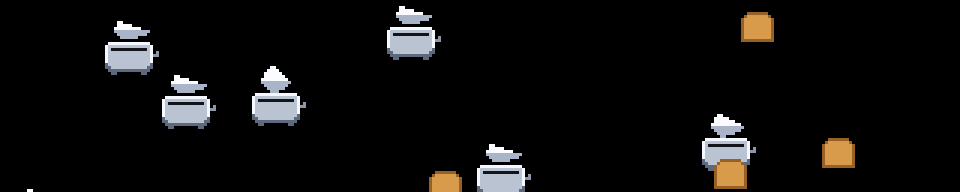

After Dark's flying toasters, 1989. Not from a hacker film — from the machines
the films were about — and on a wall in a workshop it is the most immediately
recognised thing in the rotation.

**The angle is changed on purpose.** The original flies at roughly 45 degrees,
which on a 320x64 panel puts a toaster on screen for a second and a half and
reads as rain. The slope here is exactly (H + sprite height) / (W + sprite
width) — the panel's own diagonal, about 1 in 4 — so a toaster enters at the top
right, crosses the whole panel and leaves at the bottom left. That is the shape
of the original gesture even though it is not the original angle.

**That slope is also what makes it loop.** A sprite covers one panel-width
horizontally in the same time it covers one panel-height vertically, so both
wrap together and the field returns to its starting arrangement every
`--period` seconds; speeds are whole multiples of one crossing per period and
the flap rate is a whole number of beats in it, so the loop point is invisible.

**The art is text**, a character grid with a palette beside it, so it diffs
legibly and a row of the wrong length is caught by an assertion at build rather
than by a smear on the wall. Four wing drawings are played 0-1-2-3-2-1, so the
downstroke and upstroke are the same art seen twice. A frame is a black fill and
one masked copy per sprite — nothing is scaled or rotated at run time.

Two things were drawn wrong first and are worth recording: rounding both ends of
the toast turns a slice of bread into a circle, which on black reads as an
orange; and seating the body high enough to hide the wing shoulder also hides
the whole downstroke, so the wings disappear for two frames in six.

```console
$ python3 toasters.py --toasters 10 --toast 6 --period 22
$ python3 toasters.py --flaps 2
```

### chladni

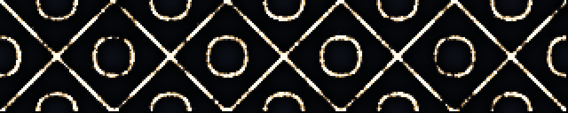

Cymatics: sand on a vibrating plate. Drive a metal plate at one of its
resonances and the sand does not scatter, it migrates — grains sitting on an
antinode are thrown up and land somewhere else, grains that happen to land on a
nodal line, where the plate is not moving, stay put — and within a few seconds
the sand has drawn the mode shape. Then the drive frequency sweeps to the next
resonance, the figure comes apart and reassembles into a different one, and
that reorganisation is the part worth watching.

**The panel's shape is the reason to do this rather than a compromise to work
around.** The Chladni figures everyone has seen are square-plate ones, where
the two modes that superpose are `(n,m)` and `(m,n)` — degenerate because the
plate is symmetric, which is where the familiar `cos(nπx)cos(mπy) −
cos(mπx)cos(nπy)` comes from. On a 5:1 plate that symmetry is gone: swapping
the indices no longer gives the same frequency, so a mode cannot be paired with
its own transpose. What you can do instead is solve for the pairs that *are*
degenerate — with `a` half-waves along the long axis and `b` across, the
frequency goes as `(a/5)² + b²`, so `(a,b)` and `(c,d)` are degenerate exactly
when `a² + 25b² = c² + 25d²`. Whole families fall out of that: (10,1)/(5,2),
(20,2)/(10,4), (25,4)/(20,5). Because the two members of a pair can have wildly
different aspect — one term fine along the plate and coarse across it, the
other the reverse — the figures are far more varied than the square-plate ones,
and the six in the rotation were chosen by rendering every exactly-degenerate
pair up to 30 half-waves and looking at them. The rejects were mostly too fine:
six half-waves across 64 rows is a 10 px feature that turns to hash the moment
grains land on it.

Everything per mode is precomputed, and that is what makes it affordable. Each
term is an outer product of two 1-D cosine tables, so a whole field is two
outer products and a subtract; `build()` bakes the field, `|s|` and both
components of its gradient for all six modes as flat arrays. A frame during a
hold — about two thirds of the run — is then two gathers and a `bincount` over
a few thousand grains, a decay and a palette lookup, with no trigonometry in it
at all. Only during a sweep is a field derived, and even then it is a dozen
whole-array passes over 20480 pixels.

Two details carry the look. The random kick a grain gets is **proportional to
the local amplitude**, so a grain on a node is in dead air and stops while a
grain on an antinode is being thrown around; a constant jitter blurs every
nodal line into a band and nothing ever settles. But amplitude-proportional
noise alone goes to *zero* on a node, so a grain that arrives stops dead in the
pixel it landed in, forever — legible, but the lines come out dotted with the
gaps frozen in place for the whole hold, which reads as a dashed line somebody
drew. A small amplitude-independent `--creep` keeps settled grains shuffling
*along* the trough they are in (across it they are pushed straight back), and
that is the difference between the two; `--creep 0` is the control, and it
drops the lit fraction of the panel by more than half.

The sweep interpolates the two mode *fields* and takes the gradient of the
blend, rather than blending the two precomputed gradient fields. The nodal set
of a superposition is a real curve that moves continuously from one figure to
the other and the grains can follow it; averaging two gradients instead gives
every grain two places to go at once and it splits the difference into a smear.
Jitter is boosted through the middle of a sweep, since a plate driven between
two resonances is mostly just shaking — which is what makes a transition read
as the sand coming apart and re-settling rather than as a crossfade between two
pictures.

Grains land in a deposit buffer with a half-life in *seconds*, so a nodal line
builds up bright instead of flickering as a few loose pixels, and the amount
deposited is derived from the decay rather than given — `--gain` means "grains
per pixel that read as white" and stays true whatever `--grains` and
`--persist` are set to. Under the sand, `--plate` paints the vibration itself
very dimly, so an antinode is dark steel rather than dead black and the figure
sits on something.

It costs **0.20 ms a frame on a desktop** (p95, 320x64, 5000 grains, 30 fps),
of which the sweep frames are the expensive ones; `build()` is 21 ms. It has
**not** been measured on a Pi 3, and that is the number that decides what frame
rate it should run at. The whole cycle is six modes at 5.5 s held plus 2.5 s
sweeping, so 48 s, which fits a normal slot with the wrap landing on a mode
change like any other. `build()` settles the sand for a hundred steps before
returning, so frame zero is a figure rather than a cloud.

The mode set is picked for a 5:1 plate; it renders correctly at any
`--width`/`--height`, but on a squarer canvas the same six figures are simply
squashed rather than replaced by ones suited to that aspect.

```console
$ python3 chladni.py --palette copper --grains 8000
$ python3 chladni.py --hold 3 --sweep 4         # more sweeping, less sitting
$ python3 chladni.py --creep 0 --plate 0        # the frozen, dotted control
```

### sort

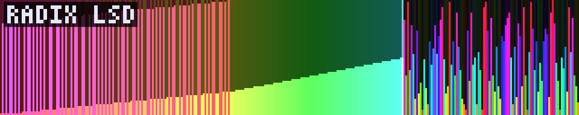

Sorting algorithms racing, one array element per column. Quicksort, radix,
bubble and heapsort take it in turns on the same 320 values, each announced by
a small label, each ending in the classic ascending confirmation sweep.

**The panel is the array.** 320 columns is a 320-element array with a pixel to
spare, so nothing is aggregated, scaled or sampled away — every comparison the
algorithm makes is a column you can point at, and a wide letterbox is the
shape an array wants to be anyway. Value is carried twice, by bar height and
by hue, because 64 rows is only six bits of height and from across a room a
field of one-pixel bars is a texture rather than a signal. Hue is what
actually reads at this size: a shuffled array is confetti, a nearly-sorted one
is visibly a rainbow with a few wrong stripes in it, and a partition settling
appears as a smooth ramp inside a region of noise. `--style band` drops the
bars for a full-height colour field, which carries further down a big room but
lights every pixel flat out and loses the contrast that makes the working
region stand out; the bars are the default for that reason.

**The steps had to be decoupled from the frames.** Bubble sort on 320 elements
is 50,830 steps, quicksort 4,580 and radix 960; one step per frame would run
bubble for half an hour and be done with radix in half a minute, and there is
no single rate that suits both. So each algorithm is run to completion in
`build()` and recorded as a flat trace — at most two writes and a highlight
state per step — and `render()` plays back as many steps as its segment's
clock says have happened. Each algorithm then takes the same wall time
whatever it costs, and the visible *rate* is what tells you how much work it
is doing: quicksort strolls, bubble sort tears along and still only just gets
there. Recording rather than stepping live is also what keeps `render()` a
function of `t`, since the trace is replayed from a per-segment snapshot: a
restart at t=0, a seek or a different frame rate all land on the same picture.

Without the working state drawn there is nothing here but bars moving, so the
pivot and partition bounds, radix's write cursor with the sorted prefix
growing behind it, bubble's pair and its shrinking unsorted region and
heapsort's sift path are all lit — two cursor columns full height, the active
region lifted out of the dim. Between algorithms the array is thrown back in
the air by an animated Fisher-Yates rather than cut to a fresh permutation.

Cheap, and structurally so: a frame builds one index image and does one
`np.take` through a table holding six tiers of the palette, which is where the
highlighting comes from as well. **0.07 ms a frame measured on a desktop** —
the Pi figure has not been taken yet, but the per-frame work is a handful of
whole-array passes over 20,480 pixels and nothing else.

The trace does cost memory rather than time: bubble's 50,830 steps are eight
`int16` per step, about 800 kB, and the whole default set is a little over a
megabyte of index-and-value pairs. Storing frames instead of steps would be
two orders of magnitude worse.

```console
$ python3 sort.py --algorithms quicksort,merge,insertion --style band
$ python3 sort.py --algorithms bubble --cycle 90        # just the slow one
$ python3 sort.py --element-px 2 --palette magma --no-labels
```

### voxel

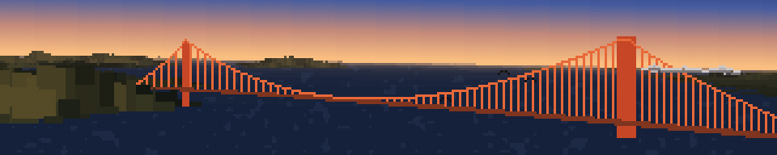

A hang glider's tour of San Francisco Bay: in off the Pacific, through the
Golden Gate *between the towers*, across the front of the city with Alcatraz
opening to port, north up the bay past Treasure Island and the Bay Bridge,
round Angel Island, back west over Sausalito and up over Hawk Hill with
Tamalpais on the horizon, then out past Point Bonita to the open sea and round.
Comanche-style voxel space: for every screen column, march a ray out along the
ground, look up the height under it, and work out how far up the screen that
lands. The nearest thing wins. It is the oldest trick for drawing landscape in
real time and it is still the right one here, because the cost is set by the
number of columns and the depth budget rather than by any amount of geometry.

**The terrain is real, and it is in the file.** 768x768 cells of USGS 3DEP
elevation at 45.8 x 57.6 m a cell, covering 37.635–38.035 N and 122.28–122.68 W
— Mount Tamalpais in the north-west, the Marin Headlands over the strait, the
Golden Gate, San Francisco out to Twin Peaks and San Bruno Mountain, Angel
Island, Alcatraz, Yerba Buena, the Berkeley hills. 3DEP is public domain;
`scripts/make-voxel-dem.py` is the one-off bake that downloads it, fills the
voids where the survey stops at the continental shelf, works out which of it is
water and writes `voxel-dem.npz`, and the provenance is written down at the top
of that script. The demo itself reads only the committed asset and needs
nothing but numpy — no network, no GDAL. It comes to 201 kB because the heights
are quantised to whole metres and stored as the horizontal *difference*:
terrain is smooth, so the differences are small numbers around zero and DEFLATE
eats them, four or five times better than it manages on the raw heights. Sea
level is stored as exactly zero, so the Bay and the Pacific are a comparison
rather than a second map.

**The map was labelled with the wrong box, and nothing looked wrong.** The bake
asked the National Map's ImageServer for 0.4° of longitude by 0.31° of latitude
as a square image. That service will not letterbox: when the bbox aspect and
the image aspect disagree it silently widens the bbox until they match and
returns *that*, with nothing in the response to say so. So the grid held 0.4° of
latitude — 44 km of California — while the file said 34, and everything scaled
from that header was wrong in proportion to how far it sat from the middle of
the map. Alcatraz was 200 m out and looked fine. Mount Tamalpais was three
kilometres south of where it is. The Bay Bridge got built a kilometre clear of
Yerba Buena Island, in open water, which is the sort of thing you only catch by
knowing where the bridge is meant to touch down. It is fixed in the header and
in the script, and `fetch()` now refuses a bbox whose aspect does not match the
image it is asking for, because that is the only check that would have caught
it.

**The depth march never loops over depth.** The obvious implementation walks
the ray one step at a time per column, and that is a few thousand numpy calls a
frame; on a Pi 3 a numpy call costs about 80 µs whatever size the array is, so
it is over budget before it has drawn anything. Instead the whole (steps ×
columns) grid of sample heights is built in one go and the painter's ordering
falls out of a running minimum: down the depth axis the projected row of the
highest-thing-so-far only ever decreases, so *the number of steps whose ceiling
is still below a screen row is exactly the index of the first step that covers
it*. That count, for every row at once, is a histogram of the ceilings followed
by a cumulative sum — `np.bincount` and `np.cumsum` — and it is the whole
reason the effect fits in a frame.

**Everything on screen is one integer.** The palette is a flat table laid out
as `(class × shade) × haze band`, so a pixel's colour is one gather at the very
end and nothing in the frame computes RGB. Distance haze is free, because the
depth step chooses a band and the band is already the right colour. The chop
and the sun's glitter on the water are an integer *add* on the pixels that are
water — a brighter shade is `+NFOG` — and they pick up the correct haze for
their distance without knowing anything about it. A bridge is a class like any
other, so painting it is writing class numbers into that index image before the
gather.

**The bridges have to be objects.** A heightmap cannot have sky under a road
deck. Each column's ray is intersected with the vertical plane of the deck, a
2x2 solve vectorised across the whole width, which gives that column's position
along the span and its distance from the eye together; and since the raycast
has already left a depth per pixel, hiding it behind Lime Point is one compare.
There are two of them, and that is why the geometry is a table rather than
code: a name, a latitude, a bearing, a list of span lengths in feet and three
colours, from which the same compositor draws either. The Golden Gate is the
real thing in the units `goldengate` uses — 4200 ft of main span, 526 ft of
tower over a deck 220 ft above the water — with the detail that carries the
silhouette, the main cable's vertex sitting *on* the deck at midspan. The Bay
Bridge is the western crossing, 2310 ft of main span either side of the central
anchorage, in silver-grey steel rather than International Orange; at the three
to eleven kilometres the tour sees it from, what survives is a pale line low on
the haze with two nubs on it where the towers are, and the temptation to scale
it up is the temptation to draw something that is not there. Its eastern span
is left out because Yerba Buena Island is in front of it.

**The Gate transit is the shot the route is built around.** The flight crosses
the plane of the bridge 267 m from midspan — the main span runs 640 m either
side of that — at 161 m above the water, which is between the deck at 67 m and
the tower tops at 227 m. So it genuinely passes between the towers and under
the cables, and for two seconds the deck is overhead and the suspenders are
sliding past on both sides. Everything else about the waypoints was arranged
around making that happen on the right heading.

**Sutro Tower is there and it is five pixels.** 298 m of tower on a 255 m
ridge, which makes it the only part of San Francisco legible from across the
bay, so it is drawn: sunset.py's sprite unchanged, three prongs on a lattice
body stepping out to a splayed tripod base, scaled by nearest neighbour into a
table of silhouettes at every whole pixel height and depth-tested as a
billboard against the raycast, so Twin Peaks in front of it hides it. The
downtown skyline was tried and left out — from six kilometres it is four rows of
very slightly lighter grey against a hazy hill, which is to say it is nothing.
The one thing worth knowing about the size table is why its lower bound is
where it is: the tower crosses the threshold *during* a pass, and set one pixel
higher — at the size where it still reads as a trident — it dropped out for a
single frame on the way past. A landmark slightly too small beats one that
blinks.

**The route is a Fourier series, and that is not a flourish.** A closed flight
path has to be three things at once. Exactly periodic, so a segment that
overruns the loop lands back where it started rather than drifting off the map
— measured at 2 × 10⁻¹⁰ m of drift after thirty-seven loops. Smooth to the
second derivative, because that is what the bank is built out of. And uniform in
arc length, because otherwise the glider surges and stalls between waypoints, a
lurch this file has already been fixed for once. A harmonic series is the first
two for free, and its derivatives are closed-form rather than divided
differences. An interpolating spline would have passed exactly through the
waypoints and put a discontinuity in that second derivative at every one of
them — eleven places a loop where the wing snaps from one bank to another.

Two things it took two attempts to get right. The corners are rounded by
rolling the coefficients off with a *Gaussian* rather than by cutting them off
at the last one: a rectangular window rings, and since curvature carries a
factor of k² a ripple far too small to see in the flight path is a wobble you
cannot miss in the horizon. And the arc-length parameterisation is a separate
pass that does *not* re-smooth — evaluate the curve densely, resample it at even
spacing along itself, refit, twelve times. Smoothing again on every pass is a
heat flow, and a heat flow shrinks a closed curve: it took a 26 km tour down to
7 km, which looked entirely plausible until somebody measured it. Done properly
the ground speed varies by 2.3% over the whole loop.

**Height goes with what is beside you, and the instinct was backwards.**
Parallax is the only thing that says you are moving, and it goes as one over the
distance to what you pass, so the obvious move is to fly as low as possible.
That was tried at 130–200 m the whole way round and it is wrong twice over.
First, an eye at 150 m over a bay 10 km wide puts every far shore inside two
pixels of the horizon: the picture becomes a flat line with water under it and
there is nothing to have parallax *against*. Second, and this is the one that
is easy to miss, a 320x64 panel at this focal length has a **25 degree vertical
field** — so anything closer than about four and a half times your height is
below the bottom of the frame. Alcatraz was routed past at 200 m, and at 800 m
abeam it was not subtle, it was *invisible*. So the Gate is flown at 145 m
between deck and tower tops, the open crossings at 235–265 where you look down
on the bay and Alcatraz, Angel Island and the Berkeley hills are separately
visible instead of stacked on one line, Hawk Hill at 350 with 80 m of air over
it, and the landmarks are passed at one to two kilometres rather than at three
hundred metres.

**A hang glider cannot tour the bay in three minutes.** The circuit is 28.9 km
and the loop is 210 seconds, which is 138 m/s — 496 km/h, about eleven times
what a wing actually does. A real one at 13 m/s would need thirty-seven
minutes. That is a deliberate trade and it is the right one: the alternative is
either a tour nobody watches to the end, or a demo that circles one thermal and
reads as rotation rather than travel, which is what this was before. Flying
lower makes a given speed read faster, so a good part of the apparent motion is
bought with height rather than with speed; and `--loop` is one flag away if you
want it slower.

**The wing is off by default, and that is a change of mind.** In a coordinated
turn the pilot and the wing keep the same relationship and it is the world that
tilts, so the two spars can be a static overlay costing one composite while the
horizon rolls behind them — a cheap way to frame the shot, and `--wing` still
does it. But they were drawn for a demo that circled one point. The tour changes
heading far more often, and against a picture whose whole subject is the
landscape going past, two fixed diagonals across the sky stop reading as
structure overhead and start reading as scaffolding over the view. The frame is
better without them.

The bank is independent of that, and is scaled well down from
true: at this speed the turns really are banked most of the way over, and on a
panel five times wider than it is tall the horizon rises about five pixels per
degree of roll and leaves through the corner before you reach ten.

**The bank was a square wave once, and the flight path was the reason.** The
bank comes from the curvature of the path, and the path used to carry a wobble
at three times the circuit rate; curvature comes out of the second derivative,
where a harmonic at k times the fundamental picks up a factor of k², so at nine
times the weight the wobble contributed more curvature than the circle it
decorated. The signal arriving at the roll clamp was forty to sixty times the
clamp, 99% of the loop sat pinned hard over at one limit or the other, and the
horizon flipped between them in a couple of frames. It was not a display
problem. The glider was genuinely lurching, and no smoothing applied after the
clamp could have helped.

The gain onto the roll was measured rather than guessed, at the value that puts
the 95th percentile of the turn rate on the limiter's knee, and the limiter is
`limit · tanh(x/limit)` rather than a clamp, because a clamp has a corner in it
and a corner in the roll is the horizon stopping dead. On the tour the same
gain gives a roll running −5.6° to +2.6°, changing at a median of 0.19°/s and
never faster than 1.3°/s, with the soft limiter engaged for 6% of the loop —
against 0.13 to 0.71°/s on the old thermal circuit, which is the price of
actually turning corners instead of circling, and still nothing like a snap.
A real wing has roll inertia and takes about a second to roll in, so the bank is
read off the curve a second behind where the glider is. Doing that with an
integrator would have put state in `render()`, which has to stay a pure function
of `t` or the demo cannot be seeked; evaluating the same closed curve at
`t − lag` is the same thing analytically, shifts every harmonic by its own share
of the delay, and stays exactly periodic.

Two things that only showed up by looking at frames. The sky ramp is indexed in
*thirds* of a row rather than whole ones — with whole rows, the sheared horizon
steps the index by one somewhere along the width and draws a vertical seam
straight down a gradient this smooth. And the haze colour is deliberately
darker and greyer than the sky above it: matched to the sky, which is the honest
thing for thick haze, the skyline stops existing and the whole picture collapses
into one diagonal gradient.

The far plane is 17 km rather than 13, which is what it takes to have Mount
Tamalpais on the horizon at all — from the Sausalito leg it is 13.4 km off, and
at 784 m it is the highest thing in the model. That costs about 0.04 ms a frame,
because the depth schedule is geometric and stretching it only makes the steps
slightly coarser rather than adding any. On this desktop the whole frame is
0.51 ms mean and 0.69 ms at the 95th percentile at `--steps 96`.

**The Pi 3 is the only number that matters, and betelgeuse is running at half
its clock.** `vcgencmd get_throttled` reports `0x50005` — under-voltage, not
heat — and the ARM clock sits at 600 MHz against a rated 1200 whatever the
governor believes. Everything below is at 600 MHz, on the system numpy 1.19.5,
as CPU time over a whole 210-second loop. Restoring the power supply roughly
halves all of it.

| | p50 | p95 | fits, at 40% headroom |
|---|---|---|---|
| first version of this file | 63 ms | 78 ms | 7 fps |
| after the first optimisation pass, `--steps 96` | 47 ms | 61 ms | 9 fps |
| after the second, `--steps 96` | 45 ms | 56 ms | 10 fps |
| **the default now** (`--steps 64`) | **39 ms** | **51 ms** | **11 fps** |
| `--coarse` | 30 ms | 42 ms | 14 fps |

Three things the desktop hid, and one that the first pass got wrong.

`--steps` is **not** the cost knob it looks like — 96 to 32 saves only a
quarter of the frame, because half the work is per output *pixel* and does not
care how many depth samples there were. It is now 64 by default, which is the
setting where the difference from 96 is a slight coarsening of the nearest
hillsides and nothing else; 48 and below is visibly blocky in the foreground
and is not worth having.

**The 95th percentile is one shot.** Not the average frame at all: for the ten
seconds either side of the Gate transit the bridge is the whole width and most
of the height of the panel, and it was costing 25 ms of a 65 ms frame while
the rest of the loop paid 5. Almost all of that was the compositor's fault
rather than the bridge's. `np.putmask` cannot write through a non-contiguous
array — it silently copies, puts, and copies back — so painting four parts
into a sub-rectangle of the frame was eight copies of that rectangle, and the
box is now gathered into a contiguous scratch once. And the mask that decides
which rows each part covers was asking `row >= top` of *floats*, which on this
machine is four times what the same question costs of shorts; a row is inside
a part exactly when it is at or below `ceil(top)`, so that is what it asks.

**The dtype is the lever, and int16 is a real one.** A float32 pass is 21 ns an
element here and an int32 pass is 5, so it pays to cast early rather than
late; and the two running scans — the painter's-order minimum down the depth
axis and the prefix sum over the histogram — cannot be vectorised down the
axis they run along, which makes them the frame's longest serial stretches and
the most sensitive to width. `np.minimum.accumulate` over the depth grid is
1.37 ms in float32, 1.88 in int32 and **0.64 in int16**. Everything that is a
screen row, a bin number or a step index is a short now, and the ceiling, the
clamp and the narrowing all happen *before* the scan rather than after, which
is free to do because every one of them is monotonic and so commutes with a
running minimum.

**`--coarse` marches the landscape at half width and doubles it back**, which
is nearly two thirds of the frame halved and is what gets the demo to 15 fps.
The bridges, Sutro Tower, the birds, the sun and the palette are still drawn at
full width afterwards, so what coarsens is the terrain and nothing that has an
edge you were looking at: side by side the shoreline and the hillsides step in
twos and the water's glitter is chunkier, and the Golden Gate is pixel for
pixel the same. It is off by default because it is a visible change and the
default should be the honest picture.

**And the numpy the wall runs on is worth as much as the inner loop.** 1.19.5
is what Raspberry Pi OS ships and it is from 2020. Measured beside it in a
throwaway `pip install --target` — the system numpy untouched, because
`ftsched` runs against it — the *unmodified* file was 17% quicker under 2.0.2
(52→43 ms median, 65→53 at the 95th) and only 6% quicker under 1.26.4, so it
is 2.x's rebuilt ufunc loops doing it rather than the cheaper
`__array_function__` dispatch that 1.26 also has. Against the file as it is
now, which has less dispatch left to save, 2.0.2 is 6 to 8%: 35 ms median and
45 at the 95th by default, and 26 and 37 with `--coarse`, which is 16 fps. It
is a free win for every demo in the rotation and not only this one — and the
only reason it has not been taken here is that changing the numpy the wall
runs against is not a decision to make as a side effect of tuning one demo.
2.0.2 is the last release that supports the Pi's Python 3.9.

```console
$ python3 voxel.py --light dusk --fog 1.4
$ python3 voxel.py --loop 420 --altitude -60    # half speed, and lower
$ python3 voxel.py --bank 1.6 --roll-lag 0      # steeper, and no roll inertia
$ python3 voxel.py --coarse                     # half-width landscape, 15 fps
$ python3 voxel.py --no-wing --no-tower --birds 0 --steps 96
$ python3 scripts/make-voxel-dem.py     # re-bake the terrain (needs Pillow)
```

### twister

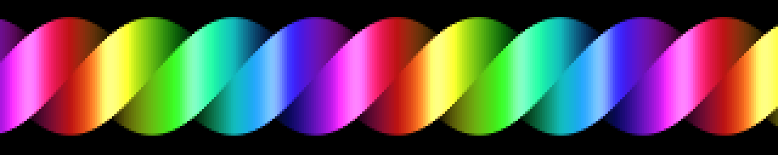

The Amiga twister: a bar whose cross section rotates as you travel along it, so
a slice taken anywhere is the same square as the last one, turned a little
further. The 1990 version ran vertically because a 320x256 screen is taller
than it is wide, and a bar down the middle of it is what fits.

**Turning it through ninety degrees is the whole reason it is here.** The
twist is a thing you read *along* the object, and this panel has exactly one
axis long enough to read anything along: laid horizontally there are 320 pixels
of length to spend on eight or ten waists, 64 rows are more than enough for a
bar half that thick, and the ribbon runs off both edges so nothing is left
over. Stood upright the same effect gets 64 px of length, room for about one
turn, and two thirds of the wall stays black.

Per column the cross section is at phase `k·x + ω·t`; its `n` corners project
to `y` offsets of `r·cos(θ + i·2π/n)`, so a column is the handful of vertical
spans stacked between consecutive corners, one per face. A face is towards you
when the sine of its normal angle is positive, and its brightness is that same
`|sin|` — which is *also*, exactly, how tall it projects. That coupling is what
makes it read as one solid object being twisted rather than as coloured
stripes: the bright face is always the wide one, and a face has dimmed to
nothing by the time it turns edge on and vanishes. Worth checking numerically
rather than by eye, because a twister whose faces never quite go edge on still
looks plausible: at a fixed column through one rotation the two visible faces
trade an 8-row span at brightness 80 for a 33-row span at 232 and back, four
times, and the silhouette breathes between 50 rows and 36 — which is
`√2/2` of it, as a square seen corner-on should be.

**What makes it cheap is that all of that depends on the row and the phase and
on nothing else.** So the whole demo is one baked table — 1024 phase steps by
the panel's rows, in RGB — and a frame is an add over 320 elements and a single
`np.take` through it. Two numpy calls, and no arithmetic over the frame's
20,480 pixels at all. **0.04 ms a frame on a desktop, which puts it next to
`cycle`, and p50 2.4 / p95 2.9 ms on the wall's Pi 3** — measured there, on the
600 MHz throttled clock, with `--breathe` on. That is 60 fps with the whole
budget still in hand, which is the job: the rotation is short of cheap segments
and the scheduler wants one to put beside an expensive one.

Two slow modulations keep it from being merely a texture scrolling sideways,
and they were chosen for costing nothing. `--sway` drifts the ribbon up and
down the panel, which is a *row offset into the table*; the table is baked at
four sub-pixel positions of the ribbon as well, since 3 px of sway over 17 s
stepping a whole row at a time is a visible tick every few seconds. `--breathe`
varies the twist rate about the middle of the panel, so the ribbon winds up
tight and slackens off again — 8 waists across the panel at rest, 10 at one end
of the breath and 6 at the other — and that one does cost three more numpy
calls, over 320 elements. Their periods are deliberately unrelated to the
rotation period and to each other, so the loop is long.

Face spans are antialiased against the row grid rather than filled to the
nearest pixel: the silhouette moves slowly, and a hard edge on something slow
crawls. That is a bake-time cost, not a frame-time one. The palette has to be
*cyclic* for the same reason `cycle`'s does — colour is indexed by the phase,
and the phase wraps once a rotation — so the ramps that run dark to bright are
mirrored to close the loop, and their black end is dropped first, since a face
carrying near-black is a dead length of ribbon that no amount of lighting
brings back.

`build()` takes about 0.8 s on the Pi, nearly all of it rasterising the four
sub-pixel tables; `--sway 0` bakes one table and takes 0.2 s.

```console
$ python3 twister.py --faces 3 --turns 1.5 --palette magma
$ python3 twister.py --palette ice --specular 0.6   # one hue shows the shading plainest
$ python3 twister.py --speed -0.35 --sway 0 --breathe 0    # the plain 1990 version
$ python3 twister.py --faces 8 --radius 0.45        # nearly a cylinder
```

### scope

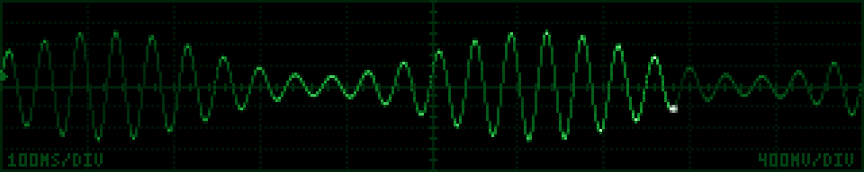

A bench oscilloscope: the 10x8 graticule, a trace sweeping across in a second
and fading behind itself, a trigger that mostly holds, and every half minute
the timebase drops out and it flips to X-Y for Lissajous figures. 320x64 is
very nearly a scope screen with its graticule stretched out, which is the
whole reason this works on the wall.

**The detail that sells it is that the beam moves at constant speed along the
trace, so a pixel's brightness is inversely proportional to how fast the spot
crossed it.** Peaks and flat tops glow; steep edges go thin and dim. It costs
nothing, because it is not a shading pass at all: the path is cut into
equal-*time* segments each carrying the same charge, and each segment's charge
is split between the pixels it crosses and accumulated with `bincount`. Three
sub-samples a pixel land on top of each other at a crest and spread over ten
rows at a fast zero crossing. Measured on the AM carrier at columns of
identical phosphor age, a crest reaches 213 of 255 and a crossing 114 — the
histogram *is* the physics, and nothing anywhere computes dy/dx. A trace of
even brightness is what this looks like when it silently is not working.

Persistence is one float32 buffer decayed as a half-life in *seconds*
(`--persist`, default 0.42), so the tail is the same length in wall time at 8
fps as at 30 — the rule `laser.py` follows and for the same reason. At the
default the trace has faded to about a fifth by the time the beam has crossed,
which is what makes a sweep read as a sweep rather than as a plotted curve.
The buffer is carried in palette-index units rather than 0..1 and mapped
through a P31 green, P3 amber or P11 storage-blue ramp; the graticule is a
baked static layer composited in that same index space, so it costs one uint8
maximum a frame and never changes.

Signals are baked once as 16k-sample tables, each rolled so that column zero
is a rising crossing of the trigger level. That roll *is* the trigger, and it
is why a repetitive waveform stands dead still with no state kept anywhere.
Not everything locks. The decaying exponential creeps right about ten pixels a
second, the way a bench scope does when the trigger is a hair off, and the
previous sweep is still fading a few pixels behind it; noise has nothing to
lock onto and jumps somewhere new every sweep. Dwells are quantised to whole
sweeps, so the waveform never changes half way across a trace.

X-Y is the moment worth pacing around, so it comes round twice in the 70 s
cycle and takes a different quarter of the ratio list each time. X runs at a
wider volts/division than Y, which is a real setting and the only way a
Lissajous figure uses a panel five times wider than it is tall. Each ratio is
detuned by a few hundredths so the figure precesses instead of standing still,
and the detuning has to *shrink* as the ratio gets busier: a 5:4 precessing as
fast as a 1:1 sweeps its whole envelope inside one phosphor half-life and
fills the panel with solid green. Every mode change is preceded by one dead
sweep with the beam off — cutting straight from a trace to a Lissajous with
both still lit reads as a fault rather than as a knob being turned.

The furniture is deliberately thin: s/div and V/div in the same baked 3x5
pixel font the readouts elsewhere use, along the strip between the last
division line and the border, plus a three pixel trigger-level arrowhead on
the left edge. Both are drawn only where the trace provably cannot reach them,
so below 60 rows they disappear rather than printing type through the signal.
A mode caption and a trigger-state legend were both tried and cut: 64 rows do
not have the room, and the left-hand readout already says `X-Y` when it is in
X-Y.

It runs in about 5.8 ms a frame on the wall's Pi 3, which is under-voltage
throttled to 600 MHz. Almost all of what is left is the palette gather, and
that is done as one packed 32-bit word a pixel into an RGBA frame whose first
three channels are handed back — half the cost of a row gather out of a
(256, 3) palette on that machine. The other half of the saving is that
sampling three points a pixel makes nearly every segment shorter than a row,
so the machinery for walking a vertical edge only runs on the frames that
contain one.

```console
$ python3 scope.py --phosphor amber --timebase 0.05
$ python3 scope.py --phosphor blue --persist 1.6        # long-persistence tube
$ python3 scope.py --signals square,burst --dwell 12
$ python3 scope.py --xy-dwell 40 --dwell 3              # mostly Lissajous
$ python3 scope.py --no-readout --beam 0.7              # just the trace
```

### wireworld

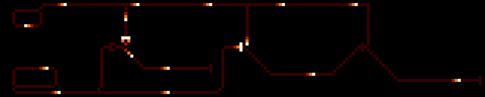

The Wireworld cellular automaton, running a circuit that actually computes.
Four states — empty, conductor, electron head, electron tail — and one rule
that matters: **a conductor becomes a head if exactly one or two of its eight
neighbours are heads.** Head becomes tail, tail becomes conductor, empty stays
empty.

**"One or two" is what makes it wire rather than fire.** A head always has its
tail immediately behind it, so the cell it came from is a tail and cannot fire
again — the pulse cannot run backwards, and a signal has a direction. Ahead of
it the next cell sees exactly one head and lights. And a cell with three heads
around it — a junction being driven from several sides at once — does nothing
at all, which sounds like an edge case and is in fact the entire logic family
below. Life's rule floods; this one propagates.

**What is on the panel.** Two clocks, at the left and bottom-left: a closed
loop of N conductor cells carries a single electron round forever and taps off
a pulse every N generations, so the loop's circumference *is* the period. One
loop is 24 cells, the other 36; they coincide every 72, and 72 generations is
the whole board's cycle. Clock A's pulses run east along the top bus, clock B's
along the bottom, and three gates in the middle read them:

- **OR** is a merge — the two inputs arrive at one cell, which fires on either.
- **AND-NOT** (`A and not B`) is the same nine cells with the control input
  forked into three that all touch the centre. A control pulse then puts three
  heads around the centre and it stays dark, while a signal pulse alone is one
  head and gets through. Two extra cells between OR and AND-NOT; that is the
  whole difference.
- **AND** is `A and not (A and not B)`, so it is the AND-NOT gate fed back into
  another one: the second gate's output rail runs east across the panel and
  climbs into the third gate as its control line.

So the three rails carry three rhythms you can read against each other. Over
one 72-generation cycle clock A fires three times and clock B twice, landing
together exactly once. The OR fires on all four of those events, the AND-NOT on
the two that clock A has to itself, and the AND on the single coincidence. That
is the truth table, drawn as timing.

**Diodes, and why there are exactly two.** The standard one-way junction: a gap
in the wire bridged by two pairs of prongs. Forwards, the near side lights the
first pair, the first pair lights the second, and the far side sees two heads
and fires. Backwards, the far side lights both pairs at once and they put three
heads around the near side — one too many — and it stops dead. Only the merge
needs them, and it needs them badly: when either input fires the centre cell,
the centre's head is a neighbour of the *other* input's last cell, which fires
and runs away backwards up the wire. Left to itself it meets the next real
pulse coming the other way and the two annihilate, which silently deletes a
quarter of the circuit's events while leaving a picture that still looks
perfectly busy. Both diodes therefore sit hard against the gate, because the
reverse pulse has to be dead before the forward one arrives and here they are
only ten generations apart. `scripts/wireworld-check.py` removes them and
asserts that the OR gate's rate drops.

**Cells are 2x2 pixels.** The circuit is a hand-laid 160x32, which at `--cell
2` fills a 320x64 wall exactly. `--cell 1` was rendered and looked at rather
than reasoned about: the same circuit then occupies the middle quarter of the
panel inside a black border, and single-pixel wire with single-pixel electrons
on it is a texture rather than a diagram from more than a couple of metres
away. Two is the default for that reason; a panel of another shape gets the
circuit centred, and cropped if it will not fit.

**The step rate is per second, not per frame** (`--rate`, default 14), so the
circuit runs at the same speed whatever `--fps` it is driven at. That makes the
automaton's state a function of elapsed time, which for a cellular automaton
usually means giving up on `render()` being a pure function of `t`. Here it
does not have to be: the board repeats every 72 generations, so `build()`
settles the transient and stores the whole cycle as 72 grids — 370 kB — and
`render()` indexes into it. A restart, a seek, or a different frame rate all
land on the same picture. Electrons get a few generations of afterglow behind
them (`--glow`), because a one-cell-per-generation head is otherwise a blink
rather than a movement and the direction of travel is what you want to read.

Measured on betelgeuse (Pi 3, undervolt-throttled to 600 MHz): **0.05 ms p50 /
0.08 ms p95 on a frame that lands on the same generation as the last one** —
it returns the same buffer untouched — and **3.6 ms p50 / 4.0 ms p95 on a frame
that steps**, which at 30 fps and 14 generations a second is a little under
half of them. `build()` costs 0.65 s once. Storing the cycle as finished RGB
frames instead would make even the stepping frames free, at 4.4 MB and at the
cost of pinning the palette and the panel size into the precompute; 4 ms
against a 20 ms budget did not justify it.

**A mis-laid Wireworld circuit still animates convincingly while computing
nothing**, which is a nastier failure than usual, so
`scripts/wireworld-check.py` drives every piece and reads the answer off rather
than trusting a look at it: the rule for all four states against all nine
neighbour counts, three loop lengths against their periods, the diode passing
one pulse forwards and none backwards and leaving nothing behind either way,
both gates over their whole truth table, and then the assembled circuit for its
firing rates, its 72-generation period, and the two ways this dies quietly —
every electron consumed, leaving a static picture that is still a valid frame,
or the 1-or-2 rule wrong and conductor lighting everywhere.

```console
$ python3 wireworld.py --host 127.0.0.1
$ python3 wireworld.py --rate 6 --palette ice      # slow enough to follow
$ python3 wireworld.py --cell 1 --glow 0.7
$ python3 wireworld.py --palette magma --rate 24   # hard to keep up with
$ python3 scripts/wireworld-check.py               # the assertions
```

### propagation

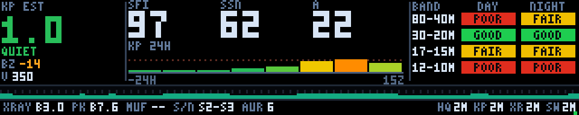

Live HF space weather, laid out as an instrument panel rather than as an
effect. Somebody walks past the wall, looks at it for two seconds, and either
goes and turns the radio on or does not — so every quantity has one place, the
same place every time, with its units and its age beside it.

**Why these numbers.** SFI is the 10.7 cm solar flux, the proxy for how hard
the sun is ionising the F layer, and it is what decides whether 15 m and 10 m
are open at all. SSN is the sunspot number, saying the same thing more slowly.
A and K are geomagnetic: K measures how disturbed the field is over three
hours, A flattens a day of K into one linear number. K is the one that ruins an
afternoon — flux can be splendid and a K of 6 will still have shut the high
bands and laid an aurora hiss across the low ones — so it gets the biggest type
on the panel and the whole left tile. Bz and solar wind speed sit underneath it
because southward Bz is *why* K will be bad, several hours before K knows.

**One K is not enough.** A single number cannot tell you whether a storm is
arriving or leaving, and those call for opposite decisions, so the middle
column carries the published 3-hourly planetary Kp for the last day as a bar
strip on the conventional colour scale, with the G1 threshold ruled across it.
Bars rather than a line: each Kp is an interval, not an instant. The right-hand
end is labelled with the last bar's own UTC hour rather than "now", because on
a stale cache it is emphatically not now. `--hours 72` widens it to the three
days the cache holds.

**The band ladder is the part people actually read.** Four band pairs, day and
night, green/amber/red. That judgement is N0NBH's and it is *quoted* rather
than recomputed, because reproducing somebody's editorial call badly is worse
than citing it. The chips carry the word as well as the colour, so a
photograph of the panel — or a colour-blind reader — is not left guessing.

Across the bottom is 24 hours of GOES 1–8 Å X-ray flux as a filled log
sparkline over four decades, A at the floor to X at the ceiling, each column
coloured by its own class. A quiet day is a flat teal band; an M-flare is an
orange spike you see before you read anything. The status line names the
current class and the day's peak, and an M or X event in progress blinks — a
D-layer blackout is the one thing here that has earned the right to move.

**The data comes off a disk cache, not a socket.** `build()` and `render()`
call `ftdata.load()`, which reads one JSON file and nothing else. That is not a
workaround, it is the point: the scheduler builds the next segment on a worker
thread sharing the GIL with the render loop, so a `build()` that blocks on a
socket does not merely wait — it stops the wall for everybody, and a hung
server means the segment never builds at all. See the docstring in
[`ftdata.py`](ftdata.py). **The fetcher has to be running for the panel to have
anything to show:**

```console
$ python3 ftdata.py --once            # one pass, to see it work
$ python3 ftdata.py --loop 900 &      # every fifteen minutes, its own process
$ python3 ftdata.py --list            # what is cached, and how old
```

It adds three SWPC products alongside the hamqsl one that was already there,
and all of them are trimmed in the fetcher rather than in the demo, because the cache
lives on a Pi on shop wifi: `swpc_kp` is 1.4 kB of 3-hourly Kp plus the
1-minute estimate, `swpc_xray` is 1.4 kB — 656 kB of GOES samples bucketed to
15 minutes, keeping each bucket's *maximum*, since a flare is a spike a few
minutes wide and averaging one into a quarter hour of quiet sun is how a panel
misses an M-class event — and `swpc_solarwind` is 230 bytes from the two
summary endpoints, the `/products/solar-wind/mag-1-day.json` path every older
script uses having quietly started 404ing.

**Staleness is shown in three stages, and this is the part that matters.**
Every source's age is in the status bar, always. Past its TTL a source's
numbers drop to half brightness and its age turns amber with an AGING flag.
Past three times its TTL the numbers are not drawn at all — the Kp tile reads
`--`, the strip says KP HISTORY TOO OLD, and a red STALE flag blinks — because
a stale K is the specific lie that matters: 5 shown when the truth is 2 sends
somebody to the wrong band. Absent, null and `NoRpt` fields print `--` and
never `None`; a gap in the Kp series is drawn as a gap and never as zero. If
the cache is empty the whole panel becomes a NO DATA card naming the fetcher,
the command and the cache path, rather than a blank rectangle or a tidy row of
plausible zeros. A propagation panel that admits it has nothing is strictly
better than one that is confidently wrong.

It is all baked. The layout, the glyphs, the bars and the sparkline are
rasterised once in `build()`; `render()` copies that frame and repaints three
small rectangles — the flare flag, the stale flag, and a two-pixel heartbeat
that exists because a frozen render loop and a very quiet sun look identical on
a panel made entirely of static type. That is **0.12 ms p50 and 0.21 ms p95 on
the wall's Pi** at 320x64, against an 8 ms budget; `build()` costs about 130 ms,
once, on the worker thread. The type is defcon.py's baked 3x5 font extended by
four glyphs, so there is no font file to be missing on the Pi.

So there are exactly **two distinct frames**, and that is the intent. The blink
is a square wave; on a fresh quiet cache the two differ by four pixels — the
heartbeat — rising to eighty-odd during a storm with an M-flare, when both flags
are blinking as well. An instrument may be still, but it may not be
*accidentally* still, which is the whole reason the heartbeat exists. It is
also why this one runs at 10 fps standalone rather than 30: the other twenty
frames a second are byte-identical.

```console
$ python3 propagation.py --host 127.0.0.1
$ python3 propagation.py --hours 72              # three days of Kp
$ python3 propagation.py --no-xray-strip         # more rows for the columns
$ python3 propagation.py --blink-hz 0            # hold the flags, for a photo
$ FT_DATA_CACHE=/tmp/nothing python3 propagation.py   # the no-data card
```

### tide

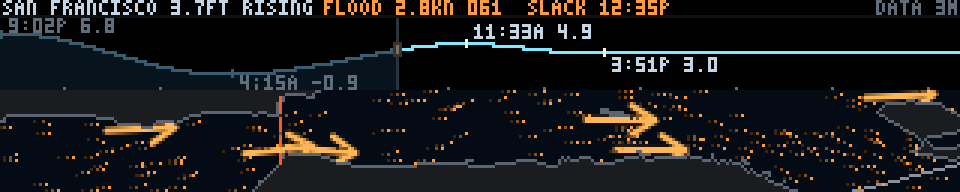

The San Francisco tide, live, with the water drawn moving the way it is
actually moving. Across the top, the predicted curve for a day and a bit with
now marked, the highs and lows labelled with time and height, and the present
height and trend called out — the part somebody checks in three seconds on the
way past. Underneath, the Golden Gate corridor as a map, with barbs that
lengthen with the predicted current and reverse between flood and ebb, and
drifters streaking along the channels. Both come out of NOAA CO-OPS: station
**9414290** for the water level and **SFB1201**, mid-channel at the Bay
entrance, for the current.

**Nothing here touches the network.** `ftdata.py` fetches on a timer in a
process of its own and leaves JSON in a cache; the demo reads that and does not
import a HTTP library. It has to be that way round — the scheduler builds the
next segment on a worker thread, Python threads share the GIL, and a `build()`
blocked on a socket does not merely wait, it stops the render loop getting the
interpreter back. Run the fetcher, or the panel says so:

```console
$ python3 ftdata.py --loop 900
```

**The flow field is a schematic, and it is worth being blunt about that**,
because a map with arrows on it looks like a model and this is not one. The
honest article is SFBOFS, a gridded ocean model served as netCDF over THREDDS,
which a Pi 3 at 600 MHz has no business downloading let alone interpolating. So
the picture is two much cheaper pieces glued together. The **pattern** comes
from geometry: solve Laplace's equation for a stream function over the sea
mask, north shore held at one and south shore at zero, and the velocity that
falls out is divergence-free by construction, exactly tangent to every
shoreline — the shore *is* a contour of ψ — and fast wherever the contours
crowd, which is the constrictions. The **amplitude and the sign** come from one
number, the CO-OPS prediction at the Gate: flood runs the field along
`meanFloodDir`, ebb runs it the other way, and the whole thing scales with the
predicted knots. The Bay's circulation really is dominated by fixed bathymetry,
so a fixed pattern with a varying sign and gain is not a bad first order. What
it cannot know is anything a point prediction does not: eddies, the wind, the
outflow after a wet week, or that one side of the channel turns before the
other. It is a picture of the phase over real geography, not a forecast of the
water in front of you.

Islands are the only subtlety in the solve. A hole in the domain carries an
*unknown* constant rather than a known one, so Alcatraz and Yerba Buena get
their ψ reset to the mean of the water around them as the relaxation proceeds,
which is the condition that no net flow circulates round them. It relaxes with
red-black SOR up a three-level ladder, coarse first. Plain Jacobi
over-relaxation diverges — the whole point of over-relaxation is that a cell
sees its neighbours' *new* values — and it took a screenful of overflow
warnings to remember that.

**The crop is a corridor, and the corridor is stretched.** The Bay is long
north to south, which is exactly the wrong way round for a panel five times
wider than it is tall; the whole thing squashed into 320x64 would put San Pablo
Bay and the South Bay on screen at a scale where every arrow is two pixels and
means nothing. The Golden Gate → Alcatraz → Bay Bridge line runs roughly
east-west, fits the panel, and is where the current is fastest and most worth
looking at, so that is the slice: 37.794–37.836 N, 122.365–122.525 W, about
15 km by 4.7 km. Drawn across 320 columns and 34 rows that is roughly a
three-fold horizontal stretch, and there is no version of this that is not: at
true scale a strip 15 km wide fitted to 34 rows would be 1.6 km tall and would
cut Alcatraz off the top. So it is stretched on purpose, `--extent` moves it,
and the two bridges are drawn in as landmarks — the Gate in international
orange — because two lines do more for recognising the place than any amount of
coastline. The solve itself happens on a grid that is *square in metres*, not
in pixels, and the squash is applied afterwards when the field is mapped to
screen; an affine squash preserves tangency, so a field that hugs the true
shoreline still hugs the drawn one.

The geography is `voxel-dem.npz` — the same DEM the voxel demo flies over,
reused rather than sourced again. It is committed, its bounding box has already
been fitted against four known summits, and it already carries a sea mask.

**Slack has to look like slack.** The barbs are baked once per direction at six
lengths, so the shortest bucket is *empty* rather than short and the map falls
quiet at the turn instead of showing stubs pointing nowhere. The drifters thin
out and dim with the predicted speed too, down to a floor — a map with nothing
at all on it reads as a demo that has crashed rather than as water that has
stopped. Each drifter is a three-sample streak rather than a lit pixel, because
single pixels on a dark map read as stars and a short comet reads as a
direction even in a still frame.

**Age is part of the data, and predictions do not rot the way observations
do.** A record fetched yesterday morning is still telling the truth if its span
covers now, so the test is both: the fetch age is shown in the corner via
`ftdata.describe_age()`, and separately the payload's span is checked against
the present moment. A three-day-old file whose predictions still reach forward
draws normally with `STALE` in the corner. A file whose span has run out, a
file with fields missing, a file that is not JSON, or no file at all, all get
the same answer — the words `NO TIDE DATA` and the command that fixes it, and
no curve. If only the current is missing the curve still draws and the map says
`NO CURRENT DATA` with no arrows on it. A tide clock showing yesterday's phase
is worse than a blank one: it is confidently wrong and the wall gives no hint.

**This one can be plausibly wrong, so it is asserted rather than eyeballed.**
`scripts/test-tide.py` checks the phase against the fetched JSON at real
timestamps — the six-minute curve must agree with the separately fetched hi/lo
list at every extreme and must actually turn over there; the velocity series
must be near zero at every labelled slack and must peak, with the right sign,
at every labelled max flood and ebb; halfway from a slack to the next peak the
water must be flooding and not yet at full strength. And it checks the
direction against `meanFloodDir` rather than against how the arrows look,
because a field running backwards is entirely plausible on screen and entirely
wrong: the field's bearing at the current station comes out 20° off NOAA's 61°,
and the drifters, measured by stepping the render and taking the median
displacement, run within 30° of the published flood and ebb directions. High
water at the gauge is *not* slack water at the Gate — the Bay is not a standing
wave and the current runs on for the best part of an hour — so the assertion is
that the nearest slack is close, not that the current is zero. It measures 61
minutes, which is the real lag and is visible on the panel: the curve turns
over while the barbs are still pointing in.

Times are shown in the *display's* local zone, not the station's. For a wall in
the same city as the gauge those are the same thing, and where they are not,
the time somebody standing in front of the panel can act on is the one on their
own watch.

**The cost is all in `build()`, which is the point.** The stream function, the
coastline raster, the barb sprites and the curve layout are baked once; the
frame loop advances drifters and redraws a marker. The barbs went into the
static raster too once it was clear their length is quantised and the tide
takes ten minutes to move a bucket — compositing them thirty times a second was
paying a per-frame price for a picture that changes twice an hour. On the Pi 3
at 600 MHz, pinned to the strongest current in the record so every drifter is
on screen, that is **p50 5.7–6.1 ms and p95 7.4–8.3 ms** across five runs of
900 frames on a loaded machine, against a 10 ms budget, with no frame over
11 ms; build is 1.2 s cold, next to voxel's 8.2 s.
Two changes did most of that. The relaxation used to index with a boolean mask,
which is a gather and a scatter and three times the price of a whole-array
pass; multiplying by a float mask instead gives an identical answer — land is
multiplied by zero and keeps its Dirichlet value — and took the solve from 253
to 13 ms on the desktop. And the drifters live in one `(2, N)` array rather
than two of length N, so every per-particle operation is one numpy call instead
of two, which on this machine is most of the cost whatever the size.

```console
$ python3 tide.py                                  # needs the fetcher running
$ python3 tide.py --anchor now --span 18           # sliding window, 18 hours
$ python3 tide.py --metric --24h
$ python3 tide.py --tide-station 8443970 --current-station BOS1111  # Boston
$ python3 tide.py --extent 37.79,37.87,-122.53,-122.30   # more of the bay
$ python3 tide.py --at '2026-08-10 09:27' --rate 900     # a cycle in a minute
$ python3 scripts/test-tide.py                     # the checks, against the cache
```

New stations need fetching before they can be drawn; `FT_TIDE_STATIONS` and
`FT_CURRENT_STATIONS` are comma-separated lists the fetcher adds to its
defaults, so `FT_CURRENT_STATIONS=BOS1111 python3 ftdata.py --once` registers
and fills one. The **curve** will follow any gauge in the country. The **map**
will not: it is this bay, because this bay is the DEM that ships. Each current
record carries its station's coordinates, and a station outside the crop gets
its curve drawn and the words `BOS1111 IS OFF THIS MAP` where the arrows would
have been — scaling the Golden Gate's channels by Boston Harbor's prediction
would be a plausible-looking lie, and drawing nothing is the only honest
option short of a second DEM.

### swell

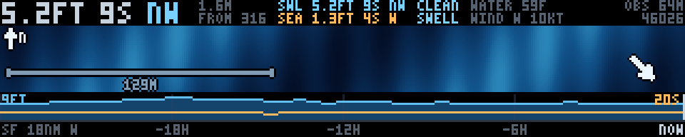

What the Pacific is actually doing, moving at the speed it is actually doing
it. `tide` next door draws a *prediction* — a harmonic fit computed years ago
that would print the same curve this afternoon if every buoy in the ocean were
switched off. This is a *measurement*. Eighteen nautical miles west of the
Golden Gate there is a three-metre discus hull, **NDBC station 46026**, which
every ten minutes reports how high the sea around it is, how long between
crests, and which way they are running; the middle band of the panel is that
sea, drawn from above with north up.

**The wave train is the data, and that is the whole idea.** The crests cross
the panel at the measured heading, spaced at the wavelength the measured period
implies, moving at the speed that follows from it. Deep water gives the rest
for free — L = gT²/2π, c = L/T — so nine seconds of dominant period means a
crest passes any point on the wall every nine seconds, and nine seconds is a
rhythm somebody walking past can feel without reading a digit. A twenty-second
groundswell draws as wide slow bands; a four-second local chop draws as fine
fast texture. Neither of those is a stylistic choice.

**Two trains, because that is what the sea is.** The `.spec` sidecar carries
the directional spectral summary, which splits the same sea state into a swell
part and a windsea part with a height, a period and a direction each, and both
are drawn, superposed, at their own wavelengths and their own headings. A clean
groundswell day is long smooth bands with a faint texture on them; a blown-out
day is the same bands broken up by chop crossing them at forty degrees. That
distinction — is this swell, or is it slop — is the single most useful thing
the data says, and it is why the second file is fetched at all.

Drawing it as *interference* rather than as an energy-versus-period plot is
deliberate, and it is the design decision this panel turns on. A spectrum at
this size is four bars and a squint; two superposed sinusoids are simply what
the water looks like, and they cost the same to draw as one. The numbers behind
it are in the header anyway (`SWL 5.2FT 9S NW` over `SEA 1.3FT 4S W`) with a
one-word verdict beside them — CLEAN, MIXED or CHOPPY, on the ratio of the two
heights — so nothing the plot would have said is missing.

**Height is contrast, not amplitude.** In plan view there is no third dimension
to put a metre and a half of swell into, so significant height drives how far
the surface swings through the palette instead: a small sea stays in the middle
of the blue ramp and reads as flat, a big one reaches the dark trough and the
white foam at either end. Three metres is full scale, which is a proper storm
here. The scale is fixed rather than fitted to the day, because a panel whose
contrast normalises itself cannot be compared with yesterday's, and comparing
is most of what anybody wants from it.

**The zoom is fixed in wavelengths, not in metres**, at 2.6 swell wavelengths
across the panel, and the scale bar in the corner says what that came out as —
129 m on the day of the screenshot. A fixed patch of ocean would draw a
twenty-second groundswell as one vast crest filling the wall and pulsing, which
is honest and useless; fixing the number of wavelengths keeps the picture
legible at every period and keeps the thing that matters exactly right, since a
crest still passes any given point once every T seconds either way. The arrow
on the water points the way the waves are going; the header says where they are
coming *from*, which is the convention every forecast uses, and the compass in
the top-left corner is there so the two can be reconciled.

**The strip along the bottom is twenty-four hours of trend**, significant height
as a filled area with the dominant period dotted over it on a fixed 4–20 s
scale, because "1.9 m" says nothing about whether that is a swell building for
tomorrow or the end of one. The right edge is the newest *sample*, not the wall
clock. Holes are the interesting part: the buoy drops samples constantly — on
the day this was written it reported a wave height on 87 of 156 ten-minute
slots and a dominant period on 42 — and drawn faithfully that is not a trend
line, it is a comb. So holes up to half an hour are bridged and longer ones are
left as holes, which keeps the property that matters: an outage still looks
like an outage.

**Two different things can be stale, and the panel says which.** The fetch age
says whether the fetcher is alive; the observation age says whether the *buoy*
is. Station 46237 on the San Francisco bar was serving a week-old file
throughout the writing of this, perfectly parseable, and a panel that trusted
the fetch age would have animated it without a murmur. So `OBS 64M` sits in the
corner next to the fetch age, goes to warning colour past ninety minutes — NDBC's
own pipeline runs half an hour behind the buoy on a good day, and a panel that
cries stale every afternoon is one nobody believes on the day it matters — and
past twelve hours the wave train is not drawn at all, replaced by
`BUOY 46026 SILENT 5D`. Animating a sea state at a rhythm the ocean is no longer
keeping is the one lie this panel could tell.

**600 kB of text becomes 2.7 kB of JSON, and most of it is never downloaded.**
The realtime2 files are newest-row-first, which is the piece of luck the fetcher
is built on: the last day of a buoy's life is the first sixteen kilobytes of a
file that runs to six hundred, so it issues a ranged GET and NDBC's CloudFront
answers 206 with the top of the file. A server that ignored the header would
answer 200 with the lot and the parser would still be right, just dearer. `MM`
means missing and it is everywhere, so nothing assumes a row is complete: each
headline value is taken from the newest row that actually has it and carries the
time of *that* row, because a buoy with a dead wave sensor keeps reporting wind
and water temperature for months. Both files are parsed off their own
`#YY MM DD ...` header line rather than a hardcoded column order. TTL is an
hour, fetch interval ten minutes, which is the buoy's own cadence and no faster.

**Frame budget.** Everything is baked in `build()`: the header, the strip, the
compass and — the part that makes this cheap — one integer *phase image* per
wave train, the distance along that train's direction of travel at every pixel.
A frame is then two table lookups, an add, one palette lookup and one scatter
for the overlay: seven numpy calls, none of which allocate, into a buffer whose
header and strip rows are never touched at all because they cannot change
between fetches. Measured over 4000 frames on the desktop: **mean 0.038 ms, p95
0.042 ms, worst frame 0.063 ms**, with `build()` at 1.2 ms. Numpy costs tens of
microseconds a call on the wall's Pi whatever the array size, so the call count
is the budget and not the pixel count; at a hundred times the desktop figure
this is still under 5 ms against a 50 ms frame.

`render` is a pure function of `t` — asserted in `scripts/test-swell.py` by
comparing a cold `render(3.7)` against the same instant driven frame by frame
from zero — and the wall clock is read only to decide when to re-read the cache.

**It can draw a beautiful, confident, wrong picture, so it is asserted in
pixels rather than eyeballed.** `scripts/test-swell.py` measures the crest rate
off the rendered frames by counting zero crossings at one pixel and asserts it
against the reported period (7, 12 and 18 s all come back within 0.01 s); it
measures the crest *spacing* down a tall panel and asserts it against the
geometry; and it cross-correlates successive frames to assert that a swell from
the north travels south, which is the sign error that looks perfect on screen
and puts a northwest swell running back out to sea. It also checks that a long
outage stays a hole, that a silent buoy blames the buoy, and that the three
data states each render in a process of their own — `ftdata.CACHE_DIR` binds at
import, so reloading the module does not test what it looks like it tests.

```console
$ python3 ftdata.py --once --only ndbc-46026
$ python3 swell.py --host 127.0.0.1
$ python3 swell.py --waves 4 --hours 48        # wider ocean, two days of trend
$ python3 swell.py --no-windsea                # the groundswell alone
$ python3 swell.py --rate 6                    # a minute of ocean in ten seconds
$ FT_DATA_CACHE=/tmp/empty python3 swell.py    # the no-data card
$ python3 scripts/test-swell.py
```

`FT_BUOYS` is a comma-separated list the fetcher adds to its default, so
`FT_BUOYS=46013 python3 ftdata.py --once` registers and fills Bodega Bay and
`swell.py --station 46013` draws it. Any NDBC station with a wave sensor works;
one without publishes no `.spec` and gets a single wave train, which is the
fallback path and is drawn from the standard file's dominant period and mean
direction. Station 46237 is closer in, on the bar itself, and would be the
better buoy for what the water is doing *at* the Gate — it just has not
reported since the third of August.

### goes

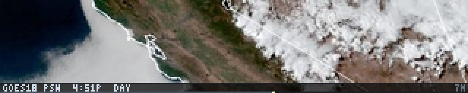

The last six hours of weather over California, from orbit, on a twelve-second
loop. GOES-18 hangs over the equator at 137° W and rescans the Pacific
Southwest every five minutes; this plays the most recent seventy-odd of those
frames as a time lapse. The marine layer slides in and out of the Gate,
thunderheads go up over the Sierra through the afternoon and spread into
anvils, a front walks down the coast. It is the only thing on the wall that is
a photograph of right now rather than a drawing of it, and the loop is short
enough that somebody walking past sees the weather actually move.

**The band, and what it costs.** The panel is five times wider than it is tall
and nothing NESDIS publishes is that shape, so this needed a decision rather
than a resize, and the candidates were rendered at 320x64 and looked at rather
than reasoned about. Two obvious ones died on sight. GOES-18's `CONUS` product
is **not** the continental United States — from 137° W the "CONUS" scan is the
eastern Pacific with the West Coast down the right-hand edge, four fifths open
ocean, and a latitude band of it is a band of sea. GOES-19's CONUS is the real
country, and a 5:3 frame squashed to 5:1 turns Florida into a stub and the Gulf
into a smear; the undistorted 5:1 crop of it reads better than expected but
puts the whole United States across 320 pixels, twelve kilometres each, at
which scale a thunderstorm complex is a blob and the Bay Area is four pixels.

What works is a **crop with no squash at all**: 500 by 100 pixels out of the
600x600 `psw` sector image is exactly 5:1, so it goes to 320x64 with nothing
stretched. That band runs from about 350 km west of the Farallones to central
Utah — 1127 km by 301 km — centred so San Francisco Bay lands a third of the
way in from the left and vertically dead centre. **What it costs is the two
ends of the state**: the band is roughly 36.4° to 39.6° N, so Eureka is off the
top and Los Angeles, San Diego and the Salton Sea are off the bottom. For a
wall in a San Francisco workshop that is the right trade. The Bay is the part
people look for, the ocean to the west of it is where the weather comes from,
and at 3.5 km a pixel the fog bank has shape instead of being three pixels of
grey. `--product` and the fetcher's `FT_GOES_SECTOR` will point it somewhere
else; the crop is a constant in `ftdata.py` because the sector grid is fixed
and never moves.

The picture is the **satellite's own view and not a map**, which is worth
saying because it looks enough like one to be mistaken for one. A geostationary
grid is not north-up and it foreshortens north-south at this latitude, so the
band is slightly skewed — its centre line runs from 37.7° N at the left edge to
38.1° N at the right — and one panel pixel is 3.5 km across but 4.7 km down.
Nothing here does that. It is what looking at 37° N from over the equator does,
and it is the same picture NOAA puts on its own website.

**The geography was checked rather than assumed**, because an off-by-one in a
crop gives a perfectly plausible picture of the wrong place. The sector images
carry NESDIS's own state borders drawn on them in white, and taking a pixelwise
minimum over frames hours apart leaves those lines and throws the clouds away —
a clean vector map, for free. Fitting the ABI fixed-grid projection (a
geostationary perspective from 137.0° W) to three surveyed points on it — the
Oregon/California/Nevada corner at 42° N 120° W, Nevada's north-east corner,
and the Nevada/Utah/Arizona corner — lands with sub-pixel residuals and a scale
of **56.1 µrad a pixel, which is the instrument's own 2 km grid**; a wrong fit
would not have found that number. Landmarks held out of the fit then check it:
Lake Tahoe, the Great Salt Lake, Lake Mead, the Salton Sea and San Francisco
Bay all land within about three pixels of where the imagery puts them, and
crosses drawn at the computed positions of the Bay, the Farallones, Monterey
Bay, Sacramento and Tahoe sit on the right features in the finished 320x64
frame.

**GeoColor is two different products and the label says which.** In daylight it
is true colour — white cloud, brown Central Valley, green Coast Range. After
dark there is no visible light to work with, so it becomes infrared cloud over
a static night map with city lights in orange: the Bay Area, Sacramento, the 99
corridor, Reno over the hill. A window that straddles sunset therefore changes
character completely partway through, which is the best thing about it and
would look like a fault if it were not announced. Each frame carries `DAY`,
`DUSK`, `SUNSET`, `DAWN`, `SUNRISE` or `NIGHT IR`, worked out from the sun's
elevation — at *both ends of the band*, not the middle, because the band is
fifty minutes of solar time wide and for the best part of an hour twice a day
one end genuinely is dark and the other is not. The thresholds are GeoColor's
rather than the almanac's: the product starts fading to its night rendering at
a solar zenith of 80°, which is the better part of an hour before sunset, and
that is why the east end of the picture goes murky while the clock still says
afternoon.

**Only cooked pixels are cached.** The source is a 240 kB JPEG every five
minutes and a window of them is sixteen megabytes, which is not something to
keep on a Pi's SD card or to hand to a demo that would then have to decode it.
So `ftdata.py` decodes, crops and resizes each frame to the panel's exact
geometry in the fetcher process and stores **only the 61 kB result**, as one
`(N, 64, 320, 3)` uint8 array in a compressed `.npz` sidecar beside the JSON
record. Seventy-two frames is **3.5 MB**, and it is worth saying that the
compression is nearly pointless — 5.8 MB raw down to 3.5, nineteen per cent,
because satellite imagery at 3.5 km a pixel is mostly texture. It stays
compressed anyway: `np.load` of the whole thing is 18 ms on the desktop and it
is read once per build.

**And they are not cached on the SD card.** Sixty-one kilobytes a frame is a
good number; rewriting all seventy-two of them every pass to add three is not.
That is 3.5 MB a pass, 336 MB a day onto the card a Pi boots from, and by a wide
margin the heaviest writer on the machine — everything else in the cache is a
few hundred bytes to a few kilobytes of JSON. SD cards die of writes. So the
record and its sidecar go to different filesystems: the JSON stays in
`~/.cache/ftdata` on the card, where it is cheap and worth keeping across a
reboot, and the sidecar goes to `FT_DATA_BLOBS`, which defaults to
`/run/ftdata` and is tmpfs on Linux. Arranging for that directory to exist and
be writable is the one deployment detail — a line of unit file if the fetcher
is run under systemd, a `mkdir` if it is not — and it is optional, because a
sidecar that cannot be written there is written beside the records instead.
Measured over two consecutive passes against a populated cache on betelgeuse:
**1,636 bytes to the card per pass, down from 3,365,556** — 157 kB a day
against 323 MB, a two-thousandfold cut, and the 3.4 MB that moves is now 2% of
a 182 MB tmpfs on a machine with 670 MB of RAM free. The fetcher's whole run
peaks at 53 MiB including those pages.

Splitting the frames into seventy-two files would have cut the writes too, and
this is better: the pixels are pure cache with a half-hour TTL, so the right
answer is not to write them more cleverly but not to write them to a card at
all. What it costs is the window across a reboot — one honest `NO IMAGERY` card
until the first fetch after it lands — and the records, which are the part
worth keeping, still survive. It costs the demo nothing either way: a sandbox
that leaves `/run` readable is enough, since the demo only ever reads the
sidecar (verified on the Pi: it loads the array and gets `EROFS` if it tries to
write there). And a checkout that has no `/run/ftdata` and cannot make one puts
sidecars beside the records with no setup at all, so `python3 ftdata.py --once`
followed by `python3 goes.py` works out of the box; `FT_DATA_BLOBS` overrides
both.

**The fetch is incremental, and it never asks for a directory listing.** The
record lists the frame timestamps it already holds; a pass keeps the ones still
inside the window, downloads only the slots that are new, and drops what has
aged out. Frame names are *predicted* rather than discovered: GOES-18's psw
scans start on a minute ending 1, 6, 11 … — ten days of the directory index,
2888 files, without one exception — so the fetcher can name the file it wants.
That matters, because the index itself is **3.1 MB** (349 kB gzipped) of every
frame since last week, which would be a large download to learn three names.
Cold start is the whole window: 66 frames, about 16 MB, 35 s. **Steady state at
a fifteen-minute timer is three frames, about 735 kB a tick — 2.9 MB an hour**,
plus one or two 404s at 150 bytes when the newest slot is not posted yet, which
is normal and not an error.

The sidecar is written under a fresh random name each pass —
`goes-psw-fb9e2e0a.npz` — and the JSON record renamed over the old one
afterwards. Write-then-rename makes each of two files atomic but says nothing
about the *pair*, and a reader landing between the renames would otherwise get
the new record with the old array and never know. Naming the array after its
contents means every record ever visible points at a file that exists and holds
exactly what it describes; the previous sidecars are swept the next pass — in
both the tmpfs directory and the cache directory, which is how the move to
`/run` cleans up after itself: the first pass after the change writes the window
to RAM and deletes the 3.4 MB that had been sitting on the card, with no
migration step to remember.

**Missing, partial and stale are three different things and it says which.** No
cache, no sidecar, a sidecar that will not open, a truncated one, or a record
pointing outside the cache directory all get the same answer: the `NO IMAGERY`
card with the fetcher's command and the cache path on it. A window shorter than
asked for plays anyway and prints `12/72` beside the age — a cold start *is* a
partial window, and half an hour of weather moving beats a card that says wait
— though one or two slots missing out of seventy is the CDN having an ordinary
day and is not worth a number on the wall. And a window whose newest frame has
gone past its half-hour TTL keeps playing with `STALE` and the age in red,
because six hours of real weather from this morning is still worth watching so
long as nobody can mistake it for now.

**Playback is an index and one blend, which is the whole point.** Every frame
in the cache is already the right size and the right crop, so `render()` picks
one, dissolves it into the next, and scatters two precomputed text masks. Each
frame's timestamp belongs to the frame and not to the clock, so all seventy-odd
labels are typeset in `build()`; the caption strip is smoked into the imagery
there too, once, so it rides through the dissolve for free instead of being
composited every frame. The blend is integer — `a + ((b - a) * k >> 7)` through
an int16 scratch, five whole-frame passes — rather than demoscene's float
crossfade, because integer is about three times cheaper on the wall's Pi and
this runs thirty times a second forever. Sevenths and not eighths so it stays
inside int16: 255 × 127 is 32385, with three hundred to spare.

On betelgeuse's Pi 3 at 600 MHz, on a loaded machine, three runs of 1200 frames
at 320x64: **p50 3.2 ms, p95 3.9–4.1 ms**, max 5.6, against a 6 ms budget —
0.7/1.0 with `--no-blend`, 0.09/0.14 for the no-data card. Build is 0.59 s, and
it is the array load and the label typesetting. The no-data card was 6.2/7.7 ms
before it was baked once and copied, which is the same mistake in miniature as
everything else on this wall: laying out four lines of type thirty times a
second to draw the same picture. A non-default `--width`/`--height` resamples
the whole stack in `build()` and that is not free — 3.2 s at 512x96 — so the
geometry the fetcher stores should be the geometry the wall wants. Moving the
sidecar into tmpfs changed neither: three runs each of the old code, the new
code reading from the card, and the new code reading from `/run` came out at p50
2.9–3.0 ms, p95 4.0–4.3, build 0.38–0.52 s on a 71-frame window, and all nine
runs hashed to the same digest — the picture is identical byte for byte, which
is the only thing a caching change is allowed to leave alone.

**The fetcher has to be running.** Nothing in `goes.py` touches the network — it
imports numpy and nothing else, no Pillow, no HTTP library, no JPEG decoder —
and `ftdata.load()` and `load_blob()` open no transport either; the only thing
either pulls in beyond the interpreter's baseline is `urllib.parse`, which
`np.load` drags in through `zipfile` to parse nothing at all.

```console
$ python3 ftdata.py --loop 900                    # the fetcher, its own process
$ python3 ftdata.py --once --only goes-psw        # one pass, top up the window
$ python3 goes.py                                 # needs the fetcher running
$ python3 goes.py --frame-rate 3 --hold 3         # slower, longer look at now
$ python3 goes.py --no-blend                      # cut instead of dissolve
$ python3 goes.py --bar 0                         # no caption, all picture
$ python3 goes.py --at '2026-08-09 09:00'         # the STALE path, on demand
$ FT_DATA_CACHE=/tmp/nothing python3 goes.py      # the no-data card
$ FT_GOES_FRAMES=24 python3 ftdata.py --once --only goes-psw   # two hours, 1.2 MB
```

`FT_GOES_FRAMES` sets the window length and `FT_GOES_SECTOR` the sector;
`FT_GOES_MAX_FETCH` caps how much one pass will pull, so a cold start on bad
wifi fills in over several ticks rather than blocking on sixteen megabytes.

### winds

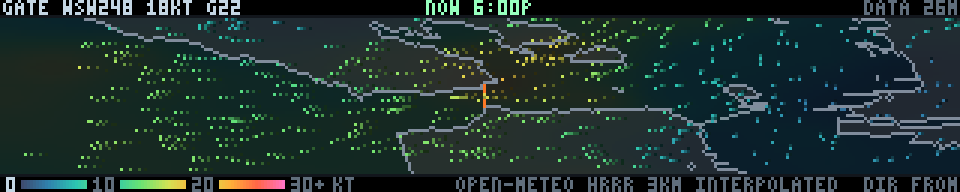

The wind over San Francisco Bay, drawn the way Windy draws it: a coastline,
and a few hundred particles blown across it by the forecast field, streaking
longer and warmer as the air speeds up and collapsing to slow embers where it
goes calm. The speed scale runs along the bottom, the numbers at the Golden
Gate along the top. A wind map with no scale is decoration.

**The panel exists to show one thing, which is the sea-breeze jet.** The coast
range runs unbroken from Bodega to Big Sur except in one place, and that place
is the Golden Gate — a sea-level gap three kilometres wide with a metropolitan
bay behind it. The Central Valley heats, the gradient tips inland, and the
marine layer accelerates through the gap and spreads out over the water. It
runs roughly east-west, which is the one thing this bay does that suits a
panel five times wider than it is tall, and it is the reason this demo exists
rather than a thermometer.

**The crop: 37.74–37.90 N, 122.28–122.68 W.** Nine kilometres of open Pacific
on the left, the Gate dead centre, the East Bay shoreline hard against the
right-hand edge — 35.2 km by 17.8 km across 320 columns and 52 rows, so a
column is 110 m, a row is 342 m, and the picture is stretched **3.1×
horizontally**. Same deal `tide.py` makes and stated as plainly: at true scale
a strip 35 km wide fitted to 52 rows would be 5.7 km tall and would have
neither the ocean nor Berkeley on it, which would leave a slot through the
Gate with no gradient in it — the one thing the map is for. The east edge is
not a choice at all; `voxel-dem.npz` stops at 122.28 W, so downtown Oakland is
a few hundred metres off the panel. North and south are: San Pablo Bay and the
South Bay are outside, and the fan-out north past Angel Island is clipped.

What the width buys is the whole length of the jet at once, and the jet does
not run the way you would guess. The fastest air is not out over the ocean, it
is **in the gap**, and it gives most of that back within ten kilometres. One
real evening off this panel — six o'clock on a Sunday in August — 12.6 kt ten
kilometres offshore, 17.9 at the bridge, 13.8 over Alcatraz, 6.5 at the Bay
Bridge, 4.9 off Berkeley. A crop that stopped at the Gate would show the 17.9
and none of the rest of that sentence.

**The field is an interpolation of a coarse model grid. It is not a
simulation, and the difference matters.** Open-Meteo is free, keyless, and
takes comma-separated coordinate lists, so a whole grid is *one* request: 7×11
points, snapped by the API to its own model cells — it tells you where each
one landed — which come back about 3 km apart and are NOAA's HRRR. Seventy-
seven cells over an area this size is a real mesoscale model at its real
resolution, so it does know about the gap. But between those cells there is
nothing here except inverse distance weighting. The panel can tell you the
Gate is blowing and Berkeley is not; it cannot tell you about the wind shadow
behind Angel Island, the lift off Yellow Bluff, or the convergence line that
parks off Crissy Field on a good day, because none of those are in the numbers
it was handed. Nothing here solves anything. The coastline is drawn on top of
the field, not into it — the air does not know the shoreline is there.

The interpolation runs on a 48×24 lattice and is upsampled bilinearly to the
panel, because doing the weighting per pixel would be a 16 640×77 matrix and
forty times the arithmetic for a field whose shortest real wavelength is 3 km.
East and north components are interpolated separately, never speed and
bearing: the mean of 350° and 10° is 180°, which is the wrong way up the map.
The smoothing length was not guessed either — interpolate, then read the field
back at each station's own coordinates, and the soft settings this started
with (1/d², 2.4 km) came back 2.4 kt RMS low and turned a 20 kt jet into a
14 kt one. Smoothing away the exact peak the panel exists to show is not a
cosmetic failure, it is the map lying about the number. At 1/(d²+1.2²)^1.5 it
reproduces the stations to 0.4 kt RMS and still falls off smoothly between
them.

**Direction is the bug that would have looked fine.** Meteorological wind
direction is the bearing the wind comes *from* — 270° is a westerly, blowing
*towards* the east — so `u = -speed·sin(dir)`, `v = -speed·cos(dir)`, and a
field drawn without those two minus signs runs backwards, is entirely
plausible on a wall, and is entirely wrong. Nobody catches that by looking. So
`scripts/test-winds.py` asserts it three ways: against a synthetic cache of
uniform 20 kt wind from each cardinal point, where a westerly must move the
drifters right (+0.50 px/frame) and a southerly must move them up (−0.16);
against the fetched JSON at each real station, stepping the render and taking
the median drifter displacement, which comes back within **1.8° at worst
across eight stations**; and — the one that cannot be fooled by a bug living
between the particle array and the screen — by cross-correlating two rendered
frames six apart in a window over the Gate and asking which way the *picture*
went. With the header quoting 15.7 kt from 256°, the picture shifted (+0,+2)
px in six frames: a bearing of 090 against the 076 the data demands, which is
as close as a two-pixel integer shift can get. Pixel motion is not a
bearing until the 3.1× stretch is undone, and the test undoes it with the same
metres per pixel the demo used to apply it.

**It animates the forecast, and says so in words.** Standing still on the
current hour throws away the best thing in this data, which is that the sea
breeze has a daily cycle you can watch: filling after noon, howling at six,
easing overnight, dead by dawn. So the panel sweeps from now through the next
twenty-four hours and loops, one model hour at a time — no invented in-between
fields, every frame is a forecast hour that exists. The first frame of each
sweep is *now*, interpolated between the two model hours either side of it,
labelled `NOW 6:00P` in green; every other frame is labelled `FCST +7H 2:00A`
in amber. A forecast mistaken for an observation would be worse than no panel
at all. `--hours 0` pins it to now, `--hour 7` pins it to a chosen one.

Gusts ride along because they are the one extra number that changes what
somebody does about the answer: eighteen knots steady and eighteen gusting
thirty are different afternoons on the water. They are drawn as a number and
not as a picture, which is about the right weight for them.

**Being polite to a free service is arithmetic, not vibes.** Open-Meteo counts
a multi-location request as one call per location, so 77 points four times an
hour is 7 392 location-calls a day against a 10 000/day fair-use budget and
308/hour against a 5 000/hour one. That, and not aesthetics, is why the grid
is 77 points and not 200 — and asking for points closer together than 3 km
just returns the same model cell twice, which the fetcher deduplicates and
stores under its snapped coordinates: the honest statement of where these
numbers actually live.

**Staleness, as everywhere else here.** A forecast keeps telling the truth for
a while after it was fetched, so both questions get asked: the fetch age is in
the corner via `ftdata.describe_age()`, and separately the payload's hours are
checked against the present moment. Five hours old but still covering now
draws normally with `STALE` in the corner. No file, a half-written file, some
other product's payload, or a record whose hours have run out from under it
all get the same answer — `NO WIND DATA`, the command that fixes it, and no
wind. Stations the model declined to answer for are dropped and counted;
a station with a hole in one hour keeps its good hours and is weighted out of
the bad one, because `w @ nan` poisons an entire field.

**The cost is in `build()`.** The coastline raster, the interpolation weights,
every hour's field, its speed wash and its colour table are all baked once —
25 hours of them, about 10 MB — and the frame loop advances drifters and
composites. On the Pi 3 at 600 MHz, pinned to the windiest hour in the record
so every drifter is moving, that is **p50 6.6–6.8 ms and p95 7.8–8.3 ms**
across runs of 900 frames on a machine already at load 3.8, against a 9 ms
budget; build is 1.2–1.6 s, next to tide's 1.2 and voxel's 8.2. Two things
bought most of it. The streak colours are baked per hour as a `(4, pixels, 3)`
table, so drawing a sample is one gather instead of two — a gather is three
times the price of a whole-array pass on this machine and the loop does four
of them. And "has this drifter left the frame?" is asked as "does clipping
move it?", which is three numpy calls where four comparisons and three ors
would be seven. Re-reading the cache re-bakes two dozen fields, which is a
third of a second and four dropped frames if it happens inside `render()`, so
it happens one hour per frame into a shadow list and the old fields stay on
the wall until the new ones are all there.

The font, the DEM crop, the sea mask and the clock are `tide.py`'s, imported
rather than copied, the same way `propagation.py` borrows `defcon.py`'s
glyphs. That is deliberate beyond saving lines: the two demos are looking at
the same bay, and if they ever disagreed about where the coast is, one of them
would be lying.

The fetcher must be running, or the panel says so:

```console
$ python3 ftdata.py --loop 900                     # or --once --only wind-bay
$ python3 winds.py                                 # sweeps 24 h in 52 s
$ python3 winds.py --hours 0                       # just now, no animation
$ python3 winds.py --hour 18 --units mph           # pinned, in mph
$ python3 winds.py --cycle 20 --particles 700      # busier, faster sweep
$ python3 winds.py --extent 37.70,37.94,-122.60,-122.30   # tighter on the bay
$ python3 winds.py --at '2026-08-09 18:00' --hours 0      # a chosen evening
$ python3 scripts/test-winds.py                    # the checks, against the cache
```

`FT_WIND_GRID=9x13 python3 ftdata.py --once --only wind-bay` asks for a denser
grid if you are feeling less polite; anything finer than about 3 km spacing
buys nothing but duplicate cells.

### wx

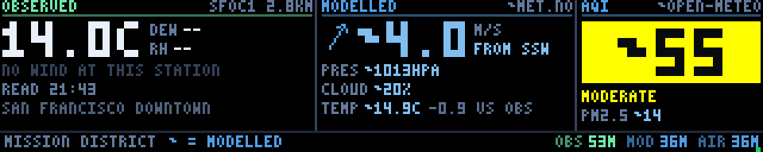

The weather outside *one building* — a street address, not a city — and an
honest account of where each number came from. The default address is in the
Mission in San Francisco, in the same spirit as `tide`'s default station, and
`FT_WX_SITES` and `FT_WX_STATIONS` move it. Somebody walks past, looks for two
seconds, and
decides whether to roll the door up. What they must not be able to do is
mistake a computed number for a measured one, and that turns out to be the
whole design problem, because almost none of this can be measured near here.

**Why it is a composite.** There is exactly one real instrument anywhere near
the space. Unioning the station lists across a 7×7 block of NWS gridpoints
around the address turns up 52 stations and precisely one inside San Francisco:
**SFOC1, "San Francisco Downtown", 2.8 km away**. The next nearest is Oakland
Museum at 12.3 km, across the Bay and in a different climate; KSFO is 16 km
south and in another one again. And SFOC1 reports temperature, dewpoint and
humidity and **nothing else** — no wind, no pressure. Not "sometimes": the
fields are in the JSON, `null`, every hour, with a `Z` quality flag. Every
dedicated personal-weather-station network that would have filled the gap now
needs a key — Weather Underground PWS 401s, PurpleAir 403s, Synoptic 401s,
AirNow 401s — which is exactly why this is a composite of three services rather
than one tidy feed.

So: temperature, dewpoint and humidity are **observed**, 2.8 km away. Wind,
pressure and cloud are **modelled** at the exact address by met.no. Air quality
is **modelled** by CAMS through Open-Meteo, for a grid cell a few kilometres
wide. Blending those into one authoritative-looking readout would be worse than
not building the panel, so the distinction is carried four ways at once,
because any one of them fails on somebody:

1. **Position.** Measured things live left of the first hairline; modelled
   things live right of it. Nothing crosses.
2. **A word.** Each zone is headed OBSERVED or MODELLED, with the instrument
   and *how far away it is*, or the model and whose it is.
3. **Colour.** Observed values are near-white, modelled values blue — two
   hues, not two brightnesses, since brightness is already spoken for by the
   aging state and would be destroyed exactly when provenance matters most.
4. **A mark on every number.** A modelled value is printed `~5.4`, the way one
   writes an approximation by hand. Crop the panel, photograph it, read it
   colour-blind: the tilde is still there.

The zone title, the hue and the mark are all *derived from the product's own
provenance* rather than from where the zone happens to sit, so pointing the
panel at the wrong kind of product makes it say so rather than quietly relabel
the data.

**Both temperatures are on the wall on purpose**, observed at the station and
modelled here, with the difference printed beside the modelled one. When they
disagree that is not an error to be hidden, it is the sea breeze — the gradient
across a couple of kilometres of this city, which is the most interesting thing
this panel knows. The wind is the model's alone and gets the arrow and the big
type, since nobody within 12 km measures it; the arrow flies *downwind* and the
label says FROM, because arrow conventions split the room and neither half is
wrong. If the compass point will not fit it is dropped rather than truncated:
shortening "FROM WSW" to "FROM W" does not abbreviate a label, it moves the
wind two points and says so with a straight face.

**The AQI is the number people actually cross the room for.** In this city, in
fire season, it decides whether the roll-up door opens. So it gets a block of
the EPA's own colour scale — ≤50 green, 51–100 yellow, 101–150 orange, 151–200
red, 201–300 purple, 301+ maroon — with the category word beneath it, and the
ink on the block flips from black to white when the block goes dark enough to
need it. Those six colours are not adjusted for the panel: everybody here has
spent a fire season learning to read exactly them, and a nicer green would only
be a slower one to recognise. And it still says `~55`, because a chemistry model
over the Mission is not a sensor on the roof. A bright confident block is the
easiest thing on the wall to mistake for a measurement, which is precisely why
the mark matters most there.

**The data comes off a disk cache, not a socket.** `build()` calls
`ftdata.load()`, which reads one JSON file and nothing else, for the reason in
[`ftdata.py`](ftdata.py)'s docstring: the scheduler builds the next segment on a
worker thread sharing the GIL with the render loop, so a `build()` that blocks
on a socket stops the wall for everybody. **The fetcher has to be running:**

```console
$ python3 ftdata.py --once                  # one pass, to see it work
$ python3 ftdata.py --loop 900 &            # its own process, every 15 min
$ python3 ftdata.py --list                  # what is cached, and how old
$ python3 wx.py --host 127.0.0.1
$ python3 wx.py --station KSFO --lat 37.6188 --lon -122.3750 --site "SFO"
$ python3 wx.py --blink-hz 0                # hold the flags, for a photo
$ FT_DATA_CACHE=/tmp/nothing python3 wx.py  # the no-data card
```

It adds three products, all trimmed in the fetcher rather than in the demo,
because the cache lives on a Pi on shop wifi: `wx-obs-<station>` is 450 bytes of
NWS observation (ttl 5400 s), `wx-model-<lat>_<lon>` is 540 bytes — one instant
out of 44 kB of hourly forecast, since a 64-row panel has no room for a forecast
strip — and `wx-air-<lat>_<lon>` is 500 bytes of CAMS (both ttl 7200 s). Nothing
assumes a field is present: every NWS value goes through a converter that
returns absent unless there is a number *and* the unit code is the one being
converted from, because windSpeed arrives as km/h from most stations and m/s
from a few, and applying one conversion to the other turns a 5 m/s breeze into
an 18 m/s gale.

**met.no's terms are honoured in the fetcher, and they are not decorative.**
The User-Agent identifies the project and carries a contact address (`FT_CONTACT`
overrides it); the response's `Expires` and `Last-Modified` are stored in the
payload; a fetch inside the Expires window makes **no request at all**, and one
outside it is conditional on `If-Modified-Since` and takes the 304 — which
api.met.no does return. A `--loop 900` fetcher therefore touches met.no about
twice an hour, which is roughly how often the model changes. One consequence
needs saying: a skipped or revalidated fetch rewrites the record with a new
`fetched_at` and unchanged contents. So every payload carries `t`, the epoch the
numbers *describe*, and the panel ages them by that instead. Age is part of the
data, and the part that matters is the data's, not the socket's.

**Staleness is propagation.py's three stages, in propagation.py's vocabulary**,
since anything showing both panels shows them to the same person and a second
vocabulary would be a second thing to learn. Fresh: full brightness. Past TTL: half brightness, amber ages,
AGING. Past three TTLs: the numbers are withdrawn — `--`, never a plausible
zero — the zone says OBSERVATION TOO OLD or MODEL RUN TOO OLD, and a red flag
blinks. A product nobody has ever fetched is MISSING rather than STALE; calling
an empty cache stale would imply there is something behind it. An entirely
empty cache is a NO DATA card naming the fetcher, the command and the cache
path. **The provenance survives every one of those states** — a stale zone
keeps its header, its hue and every tilde. It has nothing to say and says so in
the right voice.

**Two upgrades are already on the table, and they slot in as products.** The
panel does not know where a number came from; it knows what its *product* is
called, and `--obs-product`, `--model-product` and `--aqi-product` each name
one. A product whose name matches a prefix in `OBSERVED_PREFIXES` is drawn as
observed — no tilde, near-white, OBSERVED in the header — and anything else is
treated as modelled, because the failure that matters is claiming a measurement
nobody made.

* **PurpleAir**, if a key is obtained: add a `register_purpleair()` alongside
  the other products in `ftdata.py` writing `wx-pa-<sensor>` with `us_aqi`,
  `pm2_5`, `t` and a `label` such as `PURPLEAIR 0.4KM`, then run
  `wx.py --aqi-product wx-pa-<sensor>`. The tile relabels itself, turns mint,
  and the tilde comes off the big number, because a sensor a few hundred metres
  away *is* an observation.
* **A roof sensor over MQTT**: nothing about this needs a demo change either.
  A subscriber that
  writes `wx-local.json` into the same cache directory — same envelope,
  `fetched_at` and a payload carrying `t`, `temp_c`, `dewpoint_c`, `rh_pct`,
  optionally `wind_ms`/`wind_dir`, and `label: "ROOF"` — turns the observed
  half from 2.8 km away into the building's own roof with
  `wx.py --obs-product wx-local`. The wind line stops saying NO WIND AT THIS
  STATION and starts printing a measured wind, unmarked, on its own.

Both were tested with hand-written cache records before either service existed;
neither needs a line of this panel changed.

It is all baked. The layout, the type, the compass arrow and the AQI block are
rasterised once in `build()`; `render()` copies that frame and repaints two
small rectangles — the state flag and a heartbeat, which is there because a
frozen render loop and a calm evening look identical on a panel made of static
type. On the wall's Pi 3, throttled to 600 MHz, that is **0.11 ms p50 and 0.18
ms p95** against a 6 ms budget, with `build()` costing 26 ms once on the worker
thread — a quarter of what propagation's costs on the same machine. There are
exactly two distinct frames over a full cycle, which is why the standalone
default is 10 fps: the other twenty a second would be identical datagrams.

### adsb

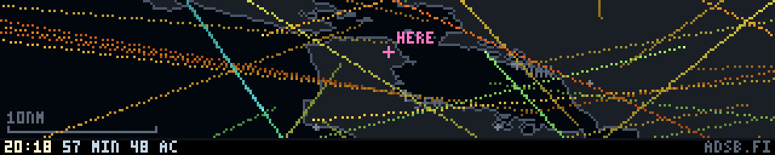

Aircraft over the Bay, live. Everything airborne within fifty nautical miles of
the wall, drawn on a map of the Bay Area as a short comet — the head is where
it is, the tail is where it came from, the length is how fast it is going and
the colour is how high it is, warm on the deck through to cold and pale in the
flight levels. Two of them are named: the one nearest the building, and the
lowest, which at almost any hour of the day is somebody on short final into
SFO. Along the bottom, the counts, the altitude ramp the colours come off, and
how old the data is. The SFO approach and departure corridors are the show —
the string of warm marks coming down the peninsula and the cooler ones climbing
out north over the Bay.

**Sixty-second-old data that does not look sixty seconds old.** The fetcher
asks once a minute; sixty stationary dots that jumped every minute would look
broken, and would also be a *worse* picture than the truth, because ADS-B
carries a groundspeed and a track and those are enough to say where an aircraft
is now. So `render()` dead-reckons — each aircraft advances along its own track
at its own groundspeed, and the picture moves continuously between fetches.
Two details make that honest rather than decorative. The clock each aircraft is
advanced from is **its own**: `seen_pos` says how long ago that particular
aircraft was last heard, and a jet over the Gate updates twice a second while
something over the Diablo range may not have been heard for half a minute, so
one timestamp for the whole record would draw the quiet ones behind where they
are. And when a new record lands the correction does not snap; it is eased in
over about a second with a smoothstep, so a fix that has moved a plane three
pixels looks like a plane moving three pixels. Without that the panel visibly
twitches once a minute and reads as a bug. A correction bigger than 24 px is
not eased at all but taken instantly — that is not a correction, it is an
aircraft that was lost and re-acquired somewhere else, and sliding it across
the panel would draw a line through places it never was.

**Dead reckoning is extrapolation, so it has a shelf life**, and that is what
the TTL is for. At 500 knots a minute of extrapolation is 8 nm, roughly the
error the fix already carries; five minutes is 40 nm, which is fiction. Past
300 seconds the aircraft stop being drawn and the panel says `ADS-B DATA STALE`
with the age on it. The age is measured from the *fixes*, against the demo's
own clock, not from when the socket was read — the two differ under `--rate`,
and it is the first one that says whether the picture is true. No cache at all
gets `NO ADS-B DATA` and the command that fixes it; a good record with an empty
sky says `NO AIRCRAFT AIRBORNE WITHIN 50 NM`, which is not an error and is
drawn as a statement rather than as an alarm. In every one of those cases the
map is still drawn underneath, because the coastline is not data and does not
go stale — a blanked panel reads as a crash.

**The feed is `api.airplanes.live`, and the obvious first choice does not
work.** All three keyless aggregators publish the same readsb-descended JSON
and all three were tried against this exact query: `api.adsb.lol` answers 200
OK in a second with `{"ac": [], "total": 0}`, which is not an error and would
have given a permanently, honestly empty sky; `opendata.adsb.fi` and
`api.airplanes.live` both answer in about 250 ms with sixty-odd aircraft.
airplanes.live is what ships, adsb.fi is a one-line swap, and the User-Agent
carries a real contact address because this is a volunteer-run receiver network
being asked for something 1440 times a day. **Half of what comes back is on the
ground** — 47 of 76 on a Sunday morning, reported as the *string* `"ground"` in
`alt_baro` — and none of it can be dead-reckoned, so the fetcher drops it and
stores the count instead. The panel says "29 airborne, 47 on the ground" and
means it.

The product is `adsb-bay`: ttl 300 s, `interval=60`, `volatile=True`. It is
rewritten 1440 times a day and is worthless two minutes later, so the record
lives in tmpfs rather than on the flash card the Pi boots from; what that costs
is one honest no-data card after a reboot. The payload is columnar — one list
per field rather than one dict per aircraft, which is 40% of the bytes at this
size and is also exactly the shape `build()` wants, since every column becomes
a numpy array. Rounding is chosen against what a pixel is worth: one panel
column is 300 m, so four decimals of latitude is already three hundred times
finer than anything visible, and whole degrees of track put a 500 kt aircraft
0.7 km out after five minutes, a fifth of the error the fix itself carries.
Thirty-one aircraft come to 3.0 kB; the 120 cap is about 11 kB.

```console
$ python3 ftdata.py --loop 60 --due --fast &     # this one wants a minute
```

**The crop is stretched three times, deliberately, and the marks know it.**
37.47–37.93 N, 122.94–121.86 W is 95 km by 51 km, with SFO, Oakland, Hayward,
San Carlos and Half Moon Bay on it, the Golden Gate at the top and the wall's
own address in the middle. Across 320 columns and 57 rows that is a three-fold
horizontal stretch — the same one `tide` applies to the Gate corridor, for the
same reason: the Bay Area is roughly square and the panel is five times wider
than it is tall. San Jose is off the bottom on purpose; reaching it costs
another quarter of stretch for an airport whose traffic mostly never comes near
this building. The stretch is applied to the **velocities** as well as to the
positions, so a mark points along the direction it is really travelling across
*this* map. It is not a compass rose and does not pretend to be one, and the
tests read bearings back off the pixels by undoing the same metres per pixel.

**It needed a second coastline, and that is the one interesting thing in the
geography.** `voxel-dem.npz` — which `voxel` flies over and `tide` takes its
sea mask from — stops at 37.635 N. **SFO is at 37.619**, a mile and a half
south of its bottom edge, and its east edge is Berkeley when half the arrivals
come over the Diablo range. A traffic panel whose map stops just short of the
airport every one of its aircraft is going to or coming from is not worth
drawing. So `scripts/make-adsb-coast.py` bakes `adsb-coast.npz` off the same
USGS 3DEP service with the same threshold-and-connectivity trick: three times
the area, an eighth of the resolution, no elevation at all, one bit a cell —
1024×512 over 37.40–38.00 N, 123.00–121.80 W, at 103×130 m cells, **5 kB**
against the voxel DEM's 206. Two files, each honest about what it is for, beat
one file that is wrong for both. Inland reservoirs come out as land, which at
300 m to the pixel is the right answer: Crystal Springs would be three pixels
of water in the hills and would read as noise in the coastline.

**The cost is all in `build()`, which is the point.** The coastline crop, the
airports, the scale bar, the status strip, and — the part that matters — every
aircraft's altitude colour, unit vector and comet length are computed once when
a record lands. A frame is one full-frame copy, two array operations to advance
every aircraft at once, and four scatters to draw them: **about thirty numpy
calls whether there is one aircraft or a hundred and twenty**, which is the
number that counts on a machine where a bare numpy call costs 55–80 µs
regardless of array size. The comets are drawn the way `tide`'s drifters are,
as flat-index scatters into the reshaped map, with a per-aircraft `(N, 3)`
colour array so the altitude ramp costs a scatter rather than a loop. Marks
that have flown off the crop are discarded by clipping the streak and comparing
it against the unclipped copy — one call for every sample of every aircraft at
once, instead of four comparisons each. On this desktop, 600 sequential frames:
**p95 0.054 ms with 31 aircraft and 0.096 ms with the full 120**, `build()` 3 ms
cold. At the 76–114× this project keeps measuring against the wall's throttled
Pi 3 that is 7–11 ms, and the floor set by the call count alone — thirty calls
at 80 µs — is 2.4 ms, so the two agree and neither is near the 50 ms a 20 fps
segment gets. The standalone default is 20 fps rather than 30 because nothing
here moves faster than three pixels a second.

**A traffic map has one failure mode that beats every other: marks moving the
wrong way look completely plausible.** A track is a bearing clockwise from true
north, the screen is rows-down and columns-right, and the map is stretched on
one axis only; get any one of those wrong and you have a beautiful, confident
panel full of aircraft flying backwards over a coastline that is still
perfectly correct. So `scripts/test-adsb.py` asserts it off the rendered pixels
— the mark's centroid over a window of open Pacific, thirty seconds apart,
converted back to a bearing *and* a groundspeed — at six tracks, with a control
that negates the velocities and must be rejected. It also checks the ease
(biggest single-frame step under 2 px, landing within 2 px of the new fix,
against a control with `--ease 0` that must jump), that eight aircraft outside
the crop draw *exactly nothing* — asserted as pixel equality against the same
frame without them, which is the only way to catch a clip that smears them onto
the border — and that a stale record draws no aircraft, asserted the same way
against an empty record rather than by looking for bright pixels, because the
stale card's own type is the brightest thing on the panel. The demo is
stateful, so every check renders a *sequence* from a fresh `build()` and drives
the demo's clock itself; fresh, stale and absent each run in a separate
interpreter, because `ftdata.CACHE_DIR` binds at import. 70 checks.

```console
$ python3 adsb.py                                  # needs the fetcher running
$ python3 adsb.py --rate 20                        # twenty minutes a minute
$ python3 adsb.py --extent 37.3,38.0,-123.0,-121.8 # a wider crop
$ python3 adsb.py --labels 0 --trail 0             # bare heads, nobody named
$ FT_DATA_CACHE=/tmp/empty python3 adsb.py         # the no-data card
$ python3 scripts/test-adsb.py                     # the checks
$ python3 scripts/make-adsb-coast.py               # re-bake the coastline
```

`ADSB_LAT`/`ADSB_LON` in `ftdata.py` and `HOME` in `adsb.py` are the wall's own
address; `--extent` moves the map. The coastline will follow anywhere in the
United States that 3DEP covers, but only after a re-bake — the committed mask
is this bay, because this bay is what the wall is in.

### stringline

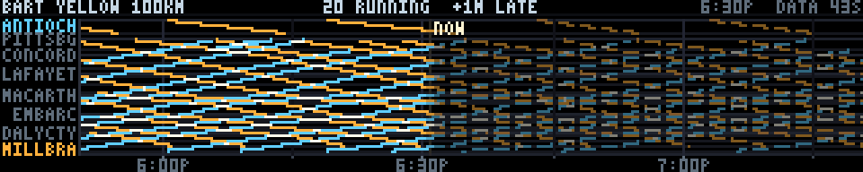

Every BART train on one line, drawn the way railways have drawn them since the
1880s: a **Marey diagram**, distance down, time across, one diagonal per train.
The picture reads without a legend once you know what the axes are. The
**slope** of a line is the train's speed, so the run through the Berkeley hills
is visibly steeper than the crawl down Market Street, and a train standing at a
platform is flat. Trains going the **other way** lean the other way. Where two
lines **cross**, two trains passed each other, and those crossings are drawn in
white because "where do they meet" is the question the notation was invented to
answer. **Headway** is the horizontal gap between parallel lines, so bunching —
two lines converging — is visible half an hour before anybody on a platform
could know about it. The bright vertical is now, and the dots standing on it
are where the trains are at this instant.

Deliberately **not** another dot-on-a-map panel; the wall already has `adsb`,
`quake` and `sats`. There is no route map here on purpose. A map of BART tells
you where the stations are, which has not changed since 2018. A stringline tells
you what the trains are doing.

**Distance is real track kilometres, and that is the whole design.** Stations
are horizontal gridlines spaced by how far apart they actually are, not evenly:
the eight stations between Embarcadero and Balboa Park share seven rows because
they share seven kilometres, and Orinda to Rockridge gets more rows than all of
them because the tunnel under the hills is longer than the whole of downtown
San Francisco. An evenly spaced axis is tidier and is a diagram of a railway
where every train travels at a constant speed, which throws away the one thing
the notation is for. The kilometres come out of BART's own GTFS shape
polylines — each station projected onto the line's alignment and the cumulative
arc length taken, every station landing within 69 m of the shape — so the
Transbay Tube is as long here as it is under the bay.

**The Yellow line, because it is the one that crosses the whole picture.** It
is the busiest of the five (26 of the 83 trains BART had running the evening
this was written), the longest at 100 km, and the only one that touches
Antioch, the hills, the tube, Market Street and SFO. A hundred kilometres in
ninety minutes against ninety minutes of panel width means an end-to-end run is
very nearly the diagonal of the screen, which is exactly the scale a Marey
diagram wants. `--line` takes `orange`, `green`, `red` or `blue` as well; they
are shorter, and Red in particular is a beautiful sparse picture with the
crossings very clear, but they leave more of the panel empty.

**Past and future are drawn differently, because they are different.** Left of
the now-line the trains are solid; right of it they are dashed and knocked back
to half brightness. That is not decoration and it is not a guess about which is
which: a GTFS-Realtime TripUpdate contains only the stops a train has **not**
reached yet, and a stop drops out of the feed behind the train as it passes it.
So the solid half is composed of times BART published for stops within sixty
seconds of the train actually being there — an observation in every sense that
matters here — and the dashed half is BART's prediction, still being revised.
The right-hand edge thins out honestly too: a train that has not been dispatched
from Antioch yet is not in the feed at all, so nothing is drawn for it rather
than a timetable pretending to be a forecast.

The **colours are directions**, warm one way and cool the other, the same pair
`tide` uses for flood and ebb. Slope already says direction, but at this scale a
stringline leans about seventeen degrees off horizontal and telling +17 from −17
on a one-pixel line across a room is not something anybody should have to do.
The two terminals in the gutter are labelled in the colour of the trains heading
towards them, which is the entire legend.

**BART, because BART needs no key.** `https://api.bart.gov/gtfsrt/tripupdate.aspx`
answers 200 with about 39 kB of protobuf to anybody who asks — no signup, no
token, no terms beyond politeness. The obvious first choice for a wall in the
Mission is Muni, and 511.org's GTFS-RT returns **401 without a free-but-
registered key**, which was verified before any of this was written.

**The protobuf is decoded by hand, in about sixty lines**, rather than dragging
`gtfs-realtime-bindings` and therefore `protobuf` — a C extension, a wheel and a
version skew — onto a Raspberry Pi that has enough of those already. The wire
format is self-describing: every field is a tag varint carrying a number and a
type, and the four types that appear are a varint, a length-delimited block and
two fixed widths that can be skipped without understanding them. What is
actually needed is five field numbers. The honest cost of no schema is that a
field which *changed meaning* would be read as the old meaning; against that,
the reader cannot be broken by a field being **added**, which is the thing that
actually happens to these feeds. The test file encodes its own FeedMessage and
asserts the reader against it, including the two cases the live feed rarely
shows: a negative delay (protobuf writes a negative int32 as a 64-bit two's
complement varint, and reading it naively gives 1.8×10¹⁹) and a `SKIPPED` stop.

**The fetcher keeps the other half of the diagram.** Because a TripUpdate is
only the future, the past has to be remembered: each pass merges the new
predictions into what the previous record held for that trip, and a stop that
has fallen out of the feed keeps the last time it was given. `bart-stringline`
is therefore the only product in `ftdata.py` whose new record is a function of
its old one — it is registered with the same `["blob"] = True` marker `goes`
uses, purely to be handed the cache directory so it can read itself. It carries
ninety minutes, which is one end-to-end run of the Yellow line, and comes to
16 kB on a cold start and about 23 kB once the history has filled — a hundred
trips and sixteen hundred stop times, for all five lines. The cold-start consequence
is visible and worth knowing about: for the first forty minutes after the
fetcher is started, the left of the panel fills in from the now-line outwards,
because there is no history yet to draw.

**Trips have to be matched to a line, and the feed does not say.** BART's
TripDescriptor carries a trip_id and nothing else — no route, no direction, no
headsign. Two things recover it. First, a `trip_id → line` table baked out of
the static schedule; trip ids are regenerated whenever BART publishes a new
timetable, so this is only ever a *hint*, accepted when the live stop list is
consistent with it (all stations on that line, running the right way round,
ending at or before the scheduled terminal) and ignored otherwise. That check
had to be loosened once: BART's feed drops a trip's **final stop a station
early** — a Millbrae train's last update is SFO — and requiring an exact
terminal match threw away a quarter of the feed. Second, failing the hint, the
set of stations the trip calls at: a trip whose stops all lie on exactly one
line is on that line. Run against the whole static schedule that is right for
2384 trips, wrong for none, and undecidable for 346 — the SFO–Millbrae and
Warm Springs–Berryessa shuttles, which really are on two lines at once. A trip
neither method resolves is counted and dropped, never guessed at. Guessing
would put a Red train on the Yellow diagram, which on a stringline is not a
small error: it invents a headway that does not exist.

**Station order and distance are baked**, in `stringline-lines.npz` (16 kB, all
five lines, 105 platform ids and the trip hint table), because the static GTFS
is an 892 kB zip that must never be on a fetch timer. The baker lives in the
demo itself so that the asset and the code that reads it cannot drift apart:

```console
$ python3 stringline.py --bake-lines https://www.bart.gov/dev/schedules/google_transit.zip
$ python3 ftdata.py --loop 60 --due --fast &     # this one wants a minute
```

Re-bake it when BART publishes a new schedule. Nothing breaks if you forget —
the trip hints stop matching and the station-set fallback carries it — but a
station that moves or opens will be missing until you do.

**The panel is a sliding strip, which is the whole performance story.** A
stringline is a picture in *absolute time*: a train that passed MacArthur at
5:42 passed it at 5:42 no matter when you look at the panel. So the picture is
never redrawn as the clock advances — it is **slid**. Everything, gridlines and
clock ruler included, is rasterised once into a strip seven minutes wider than
the panel, and a frame is two slices out of it: solid up to the now column and
dashed after it, which works out to a fixed split because the now column never
moves. That comes to **about ten numpy calls a frame regardless of how many
trains are running**, against the several hundred line segments a naive redraw
would need, and it also removes any possibility of the picture jittering — it
translates by whole columns and by nothing else. One column is eighteen seconds,
so it steps left three times a minute, which is the honest speed of the thing
being drawn.

The dots on the now-line are read straight out of the same rasterised field at
the now column, rather than computed separately, so a dot **is** the place a
string crosses the present moment and the two cannot disagree.

The rebuild is one `np.interp` per train — a train is a *function* of time, in
one place at any moment, so its whole diagonal falls out of a single
interpolation onto the strip's columns instead of a segment-by-segment
rasteriser. Thirty trains rebuild in 1.2 ms on a desktop; it happens once a
minute, when a new record lands. Steady-state frames are 0.017 ms mean, 0.019
p95, on the same machine.

Three degraded states, all deliberate. No record at all draws `NO BART DATA`
and the command that fixes it. A record older than its five-minute TTL still
draws its trains — the geometry is still a true account of what was happening
then — with `STALE` and the age on the header. And **BART is shut for six hours
every night**, which is not an error: an empty record draws the grid, the
station names and the time ruler with `NO TRAINS RUNNING` across the top, so
the panel looks like a railway at three in the morning rather than like a
crashed demo.

Like `tide` and `adsb`, `render()` takes the present moment from the wall clock
rather than from `t`, so it is not a pure function of its argument. `--at` and
`--rate` move and scale its idea of now, which is how the contact sheets and
the tests are made.

### caiso

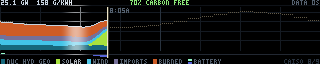

What California is running on, right now, and what it has run on all day. The
wall is in a makerspace full of people drawing amps off this grid, and this is
the panel that says where those amps came from. A stacked area across 320
columns is midnight to midnight in the ISO's own zone at five-minute
resolution, filled in as far as the data goes and empty after that; three
numbers across the top say how much the state is drawing in gigawatts, what
fraction of it is carbon-free, and what a kilowatt-hour of it costs in grams of
CO2 at this minute. The shape it draws is the duck: solar comes up over the
Central Valley around six, gets to a third of the state's supply by noon, and
falls away in three hours at teatime while everybody gets home and turns things
on. Something has to fill that hole, and watching what fills it is the whole
point — on most evenings the answer is the orange band at the top.

**The source, since the old paths are gone.** CAISO's "Today's Outlook" is
backed by three keyless CSVs rewritten every five minutes. Every script older
than about a year fetches `/outlook/SP/fuelsource.csv`; that 404s. What answers
today is `/outlook/current/fuelsource.csv`, `.../demand.csv` and `.../co2.csv`,
with `/outlook/history/<YYYYMMDD>/` alongside for finished days — all four
checked by hand before this was written. No key, no registration. The
alternative is EIA-930, which is the same picture an hour later and **does**
need an API key, and OASIS, which needs a client certificate and speaks zipped
XML. The `Time` column is a bare `HH:MM` on Pacific wall clock with no offset
attached, so `ftdata.py` resolves it against `America/Los_Angeles` explicitly
rather than against `localtime` — a fetcher run from a laptop in another zone
would otherwise write a record whose midnight is somebody else's, and the panel
would draw the whole day shifted with nothing to say it had. The two DST days
are resolved row by row for the same reason: one of them is 276 rows long and
one is 300, and a uniform 288×300 s grid puts the evening peak an hour out.

**The real problem is legibility, and the answer is five bands and a lane.**
CAISO publishes thirteen columns and six of them are smaller than one row of
LED at this scale — geothermal is 1.4 rows, small hydro is half a row, biogas a
third, coal and "other" have been flat zero all year. Drawn faithfully they are
a strip of dither noise between two real bands, and each one costs a boundary
the eye has to resolve. So they are grouped by the only two questions worth
asking from across a room, *is it clean* and *does it move*:

| band | what is in it | why |
|---|---|---|
| **NUC HYD GEO** | nuclear, geothermal, large and small hydro | carbon-free and near enough flat over a day, so it is the floor everything else stacks on |
| **SOLAR** | solar | its own band, always: it is the story |
| **WIND** | wind | its own band because it runs on a different clock — often strongest overnight — and a merged "renewables" band would hide exactly that |
| **IMPORTS** | imports | deliberately a colourless slate, because nobody knows what it is: whatever the Northwest and the Southwest happened to be selling |
| **BURNED** | natural gas, coal, biomass, biogas, other | everything on fire, warm against four cool bands, and on top because it is the swing |
| **BATTERY** | batteries | a signed lane of its own under the chart, since it is the only quantity here that goes negative |

Colour does the work before any number is read: four cool bands and one warm
one, so "how much of this is combustion" is answered from the doorway. The
battery lane is the part that has aged best — California now soaks up several
gigawatts of midday solar and hands it back at the peak, and that shows up as
two lobes either side of the afternoon, charging below the line in indigo and
discharging above it in mint. It is scaled to its own extreme rather than the
chart's, because six gigawatts against a thirty-five gigawatt axis is two rows
and two rows cannot show a shape; that is exactly why it is a separate lane
with its own rule through the middle and not a band in the stack.

**Carbon-free** is solar + wind + geothermal + hydro + nuclear over everything
supplying the state. Imports are in the denominator and never the numerator,
which makes the figure a floor rather than a guess, and biomass and biogas are
renewable but not carbon-free and are not counted either. Battery *discharge*
is in the denominator too — the electricity in it came from somewhere, and that
somewhere was hours ago. Carbon intensity is not modelled at all: CAISO
publishes the emissions themselves in tons an hour by source, so grams per
kilowatt-hour is a division. The two numbers move in opposite directions, which
is a useful thing for two numbers on a wall to do.

**The now-line is the edge of the data, not the wall clock**, and it carries
its own time label — which doubles as the only calibration on the horizontal
axis, since a legend and hour labels will not both fit under a 320 px chart. If
the fetcher stopped an hour ago the line stops an hour short of where the clock
says, the gap is visible, and the header says `STALE`. Ahead of it the panel is
not dead: the day-ahead demand forecast is drawn dotted right across the day,
because it is the only thing in any of this that knows what the evening looks
like. Note that the top of the stack is *supply* and the forecast is *demand*,
and on a sunny afternoon supply runs several gigawatts above it — the gap is
what is going into the batteries, and it is the lane underneath that explains
it.

**It has to move.** A day chart is a still picture by nature and a still
picture between two animated demos reads as a crashed one. Three things, none
of them decorative: the day reveals left to right over a couple of seconds when
the segment starts, which is the day replayed; a sheen sweeps across every six
seconds; and the now-line breathes with a pulse running up it. The sheen was a
multiply first, which is cheaper and looks right in the arithmetic — black
stays black, lit pixels brighten — except that four of the five band colours
are already saturated in a channel, so it clipped and was invisible over
exactly the part of the panel it exists to animate. Lifting towards white
instead moves a saturated orange as far as it moves a dim teal. The pulse is
there because the sheen spends half a second off the right-hand edge between
passes and the breath is an integer that rounds the same way several frames
running: without it the panel holds one frame for four hundred milliseconds
twice a minute, which the test catches and an eye would too.

**Nothing here touches the network.** `build()` calls `ftdata.load()` and reads
one JSON file; the product is `caiso-mix`, ttl 3600 s, refetched every 600 s
against a five-minute source, and deliberately **not** `volatile` — the payload
is the day *so far*, so a record that survives a reboot is the difference
between coming back up with the whole morning's curve and coming back up with
one sample on a blank chart. It is the largest non-pixel record in the cache at
about 55 kB by midnight, which is 8 MB of SD card a day against `goes`' 336.

**Age is part of the data, and one failure here is worse than the others.** A
record past its hour still draws with `STALE` and its age in the corner: this
morning's curve is still this morning's curve. A record of *yesterday* does
not, and that is the one that matters — it parses, it has 288 rows, it is a
lovely duck, and drawn under today's clock it puts the evening peak where the
morning goes. So the payload's own midnight-to-midnight span is checked against
now, and a record that fails it gets `NO GRID DATA` and `RECORD IS FROM
2026-08-08` instead of a chart. Missing, corrupt and wrong-shaped records get
the same card and the command that fixes it.

**Asserted in pixels, not eyeballed**, because five coloured bands upside down
are exactly as pretty as five the right way up. `scripts/test-caiso.py` builds a
synthetic day whose answers cannot be argued with — a known solar bell, a known
evening gas peak, a battery charging at noon and discharging at seven — and
then reads the panel back: the bands must run firm, solar, wind, imports,
burned from the bottom; there must be no solar band at two in the morning; the
burned band must be thicker at eight than at one; the stack height must be the
total generation to within a row; every published column must land in exactly
one band; and the battery lane must draw below the line at noon and above it at
seven and nothing at all between the lobes. The demo is not a pure function of
`t`, so every check renders frames **sequentially from a fresh `build()`**, and
because `ftdata.CACHE_DIR` binds at import, the fresh, stale and absent cases
each run in a **separate process** with `FT_DATA_CACHE` set. One trap worth
recording: the `contains_text()` helper the tide and wind tests use only asks
whether a glyph's strokes are lit, which is fine on their mostly-black panels
and useless on this one — inside a solid band every pixel is lit and every
string in the language matches. It cost four false passes before it was
noticed; this version checks that the counters are dark too. 57 checks, 0
failed.

**The cost is all in `build()`.** The stack, the lane, the gridlines, the
legend, the forecast trace, the now-line's label and the header are rasterised
once into two uint8 frames plus a float sheen table. `render()` does one
full-frame copy, a multiply and an add over a 34-column window, and writes
three short columns — six or seven numpy calls, which on the Pi is the budget,
since a call there is 55-80 µs whatever the array size. Over two thousand
frames on this desktop: **p50 0.022 ms, p95 0.026 ms, p99 0.032 ms**, worst
frame 0.062 ms; at the measured 114× that is p95 **3.0 ms on the Pi** against
50 ms for a 20 fps segment. `build()` is 1.8–3.7 ms here, so under half a
second there, once, on the worker thread. The one thing that had to move out of
the frame loop was the header: every number on it comes out of the record, but
*finding out* whether it changed means formatting four strings and walking the
ladder of shorter forms, and doing that twenty times a second to learn nothing
had changed was the most expensive thing in the file.

```console
$ python3 ftdata.py --once --only caiso-mix        # the fetcher, first
$ python3 caiso.py --host 127.0.0.1
$ python3 caiso.py --24h --peak 40                 # fixed 40 GW axis
$ python3 caiso.py --sweep 0 --reveal 0            # hold still, for a photo
$ FT_DATA_CACHE=/tmp/empty python3 caiso.py        # the no-data card
$ python3 scripts/test-caiso.py                    # the checks
```

### quake

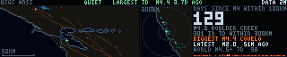

A week of earthquakes around San Francisco, at two scales, from the USGS ANSS
catalogue. On the left the greater Bay Area at 1.4 km to the pixel, with the
water filled, the eight strands of the plate boundary that run through it and
every located event of the last seven days on top. In the middle the same week
out to 300 km, which is where Parkfield, the Mendocino triple junction and the
rest of the ground that shakes this city but has none of its address live. On
the right the number the room actually wants — **how many days since the last
M4 within 100 km** — and underneath it the week's count, its largest, its
latest, and a strip of the planet's M4.5+.

**Most days it is nearly empty, and that is the answer.** Which is the hard
part, because an empty map is also what a projection bug, a bad date filter, a
dropped event list and a dead fetcher all produce. So the empty state is the
designed one rather than the default one: the coast and the faults are drawn
whether or not anything happened on them, the count of days is in the largest
type on the panel *because a large number there is good news*, the most recent
event breathes once a second however small it was, the header says `QUIET`
rather than nothing, and a heartbeat blinks in the corner. There is no state in
which this demo shows nothing. There is only the state in which the ground has
done nothing, which looks quite different from a panel that has stopped.

**And it has to become loud.** An M4+ in the last six hours, an M5+ in a day or
an M6+ in three days takes the panel over: the header turns into a blinking red
bar, the right-hand column becomes that one earthquake — magnitude in the
biggest type on the wall, place, distance and bearing *from this building*,
depth, how long ago, how many since — the epicentre gets a crosshair, and rings
expand out of it across whichever map it landed on. Among qualifying events the
biggest wins rather than the newest, because during a sequence the newest event
is a small aftershock and the M5.8 forty minutes ago is still the news.

**Magnitude is logarithmic, so the marker is not scaled by it.** Scaling a
marker by magnitude gives an M6 twice the radius of an M3 for thirty thousand
times the energy, which flatters the small ones; scaling by energy gives an M2
a radius of 10⁻⁸ pixels, which is worse. So the marker is not a symbol for the
number at all — it is drawn at **the size of the ground that broke**. Wells &
Coppersmith put strike-slip subsurface rupture length at
log₁₀(L) = 0.59 M − 2.44, so the radius is L/2 in kilometres, projected like
everything else on the map. Loma Prieta comes out at 21 km of radius against a
real rupture about 40 km long, which is right to within a pixel, and an M7
would take a third of the tile — also right. Below about M4.5 the rupture is
smaller than a pixel, so those are floored at one pixel and their magnitude is
carried by **colour**, a blue-through-red ramp, and their age by
**brightness**, fading to about a quarter over the week with a white core on
anything in the last hour. Three quantities, three channels, and the one that
is genuinely enormous is the one drawn to scale.

**The Bay map is stretched, and no version of it is not.** A tile's squash is
arithmetic: the region's height-to-width ratio times the tile's
width-to-height. On 155 by 57 pixels a square region is squashed 2.7 times
whatever you do, and the only real choices are how much ground to cover and
where the distortion goes. The tile covers 37.20–38.85 N, 121.15–123.55 W — 210
km across, 183 down — and lands at 2.4 times, 1.36 km per pixel across against
3.2 down. Everything is squashed equally, including the rupture discs, which is
why a large event draws as a flat ellipse: on this projection the ellipse *is*
the circle. The extent is a trade too. A tight crop of the Bay is a
better-looking map and, most weeks, an empty one — the busiest ground in
northern California is the Geysers geothermal field at 38.79 N, 60 km north of
any crop that keeps the Bay looking like the Bay, and it alone supplies half
the week's local events. Reaching up to it costs half a unit of squash and buys
the map its earthquakes. The 300 km tile is the opposite: 57 by 57 over a
620 km box, within 4% of true scale, with range rings at 100 and 300 km.

The geography is baked into the file. **Water is a mask, not a coastline**, and
that was the second attempt: drawn as polylines the Bay, Suisun Bay and the
Delta are a horizontal scribble of thin strokes with no inside and no outside,
and the eye cannot tell a channel from a fault. So each tile carries a 1-bit
ocean mask, rasterised offline from Natural Earth 1:10m at 8×8 supersampling
and base64'd — 1105 bytes and 407 bytes, about thirty lines of source — and the
shoreline falls out of a dilation for free. The faults are the eight principal
strands of the USGS 2014 National Seismic Hazard Model fault sections: San
Andreas, Hayward, Calaveras, Rodgers Creek–Maacama, Concord–Green Valley,
Greenville, San Gregorio, West Napa. There are 74 sections in that box; all of
them is a grey smear and these eight are a plate boundary, and being nearly
straight they cost 42 points between them.

**One feed, two scales, and one request that is not a feed.**
`ftdata.py` fetches `quake-usgs` from `all_week.geojson` — every event ANSS
located anywhere on Earth in seven days, which answers both halves at once.
Taking one file rather than composing `all_day` with `2.5_week` avoids the
whole class of bug where two feeds hold two versions of the same earthquake,
which happens constantly: USGS revises magnitudes for hours after an origin. It
is 1.4 MB, which at a ten-minute interval averages 2.4 kB/s, and the record
kept from it is about forty times smaller — every event within 300 km with
distance and bearing precomputed, the M4.5+ of the week as time-and-magnitude
pairs, and the single largest in full. Quarry blasts are dropped: the `type`
field distinguishes them and the East Bay quarries put several a week inside
300 km, and the count of what was dropped is kept so the filter can be checked.
The **baseline is the one thing no summary feed can answer** — a local M4
happens a few times a year, so on almost every day the answer lies outside
every window that exists, and `significant_month` is global and would not list
a Bay Area M4.2. That number comes from one FDSN event query instead, same
catalogue and equally keyless, `limit=1` ordered by time, about 1 kB and under
a second. It sits in its own try/except: losing the headline scalar must not
cost the week's map with it, so a failure stores `baseline: null` and the panel
prints `--`. The demo also checks the week's own events against it, or a local
M4 four minutes old would leave "129 DAYS" on screen with the earthquake still
on the map.

**Age is part of the data, in three stages.** Fresh draws normally with the
fetch age in the corner. Past the 3600 s TTL the corner turns amber and says
`OLD`, and the map still draws — the geography did not expire. Past three TTLs
it says `STALE`, prints `CATALOGUE 2D OLD — NOT DRAWN`, and stops drawing
earthquakes altogether, because a day-old catalogue is a map of a city where
nothing has happened since yesterday, which is a different and much worse claim
than an empty one. No file at all, or a half-written one, or one from another
product, gets the no-data card with the command that fixes it — and that card
is loud on purpose, since a quiet empty map is this demo's *good* state and the
two must never be confusable.

**It is all baked, and the thing to watch is not the frame.** The maps, the
type, the events and the sparkline are rasterised in `build()` into one uint8
frame; `render()` copies it and repaints the pulse, the heartbeat and, when
there is one, two ring masks. Over 400 sequential frames on a desktop that is
**p50 0.006 ms / p95 0.007 ms** quiet and **p50 0.035 / p95 0.037** with an
alert on screen — call it 0.8 ms and 4 ms on the wall's Pi against a 50 ms
budget at 20 fps. The rebake is the part that could stutter: re-reading the
cache and redrawing three hundred events across two maps costs 3.4 ms here and
therefore perhaps 350 ms there, seven dropped frames in one lump. So it only
happens when the record has actually changed, checked with an `os.stat` rather
than by parsing 58 kB of JSON. Most of that 3.4 ms used to be 5.3: the single
biggest cost in a rebake turned out to be `np.clip` on a *scalar* inside the
magnitude-to-colour lookup, six thousand calls for 3.3 ms, now a list index.

**The checks are the part that matters here**, because both of this demo's
failure modes look like a working panel. `scripts/test-quake.py` asserts the
projection against known coordinates in pixels — Sequoia Fabrica, the Golden
Gate, the Geysers, San Jose, Parkfield, Cape Mendocino — and the water mask
against places that are unambiguously wet or dry, with an east-west mirrored
mask as a control that has to be rejected. It asserts the rupture scale against
seismology rather than against itself: M6.9 has to give roughly Loma Prieta's
40 km, and each whole magnitude has to multiply rupture by a constant *ratio*,
which is the check that tells a log scale from a linear one. It counts, on the
live cache, that every event which projects onto the Bay tile actually
brightened its own pixel, and reads the event count and the data age back off
the rendered pixels rather than off the objects they were formatted from. And
it drives the loud path with a **synthetic M5.8 under Berkeley** written into a
cache directory, because waiting for a real one is not a test plan: the header
has to go red and blink, the distance and bearing have to appear, the epicentre
has to be marked, and the rings have to *expand*, measured as the mean radius
of the alert-coloured pixels over sequential frames — a ring stuck at a fixed
radius, or running inwards, looks perfectly fine in a still.

Two traps are worth naming. Everything renders **frames in sequence from a
fresh `build()`**; the first version sampled `render()` and read forty
references to the same reused buffer, and concluded the pulse was flat. And the
three cache states each run in a **separate process** with `FT_DATA_CACHE` set,
because `ftdata.CACHE_DIR` binds at import and a test that sets the variable
and re-imports is testing the value it already had.

```console
$ python3 ftdata.py --once --only quake-usgs   # or --loop 900
$ python3 quake.py --host 127.0.0.1
$ python3 quake.py --alert-demo             # the loud path, on the week's biggest
$ python3 quake.py --pulse-hz 0             # hold it still, for a photograph
$ FT_DATA_CACHE=/tmp/empty python3 quake.py  # the no-data card
$ python3 scripts/test-quake.py
```

### helicorder

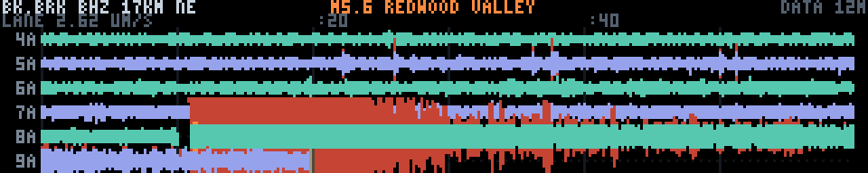

Six hours of raw ground motion from a seismometer ten miles away, drawn as a
drum recorder. Six traces, an hour each, oldest at the top, newest at the
bottom, the pen at the leading edge of the data.

`quake` is the other end of this pipeline and the two are deliberately a pair.
That panel shows earthquakes *after* somebody's algorithm has decided they were
earthquakes: located, magnitudes assigned, plotted as discs on a map. This one
shows the measurement all of that is derived from — one station, one channel,
the ground going up and down — before anything has been decided about it. The
drum is one of the most recognisable scientific images there is, and it happens
to fit a 5:1 letterbox exactly.

**The quiet is the data.** Most of the time this panel is six ragged flat
lines, and the raggedness is not instrument noise: it is the microseism, the
whole Pacific coast ringing at five to eight seconds from swell hitting the
continental shelf. It gets louder when there is weather offshore, and you can
watch that happen over a few days. Nothing on this panel is more important than
the fact that a normal afternoon looks like a normal afternoon, because
everything the panel is for depends on the eye knowing what normal is.

**The clipping is deliberate.** The vertical scale is fixed against the
*background* — one trace lane is 2.5 times the background's own peak-to-peak,
so a quiet hour fills about two fifths of its lane — and an event that will not
fit is allowed to run out of its lane and scribble over its neighbours, in a
warmer colour so it is obvious whose ink it is. That is what the paper ones do
and what the framed ones in every seismology department look like. Rescaling to
fit would be worse in both directions: it would flatten the background to a
hairline on the rare days it mattered, and it would draw an M5 and an M2 at the
same size with a different number on the axis. The overrun is capped at one and
a half lanes, which is reached often — the M5.6 in the screenshot is five
hundred times the background, or two hundred and sixty lanes of trace asking
for twenty rows of panel — so the cap is doing real work and one local
earthquake still cannot black out the whole picture.

The screenshot is a real six hours: 04:00 to 09:20 Pacific on 24 June 2026,
ending seventy minutes after the M5.6 near Redwood Valley, 190 km north. The
lane it lands in saturates for the rest of that hour, which is the coda and the
aftershock sequence and not a drawing fault — the columns after the burst sit
at two to four times the background for another fifty minutes. It was captured
by pinning `FT_HELICORDER_END=2026-06-24T16:20:00` (UTC), which is the
fetcher's one testing lever and is unset on the wall.

**Where the numbers come from.** BK.BRK, Byerly Vault, an STS-2 broadband
seismometer under the UC Berkeley campus, 37.8735 N 122.2610 W — 17 km
north-east of this building, close enough that anything the room would feel is
emphatic on the trace, and a real instrument somebody could go and look at.
BHZ is its 40 samples-a-second vertical channel. Berkeley runs its own network
and NCEDC serves it over FDSN, keyless and with no signup:
`service.ncedc.org/fdsnws/dataselect/1/query?net=BK&sta=BRK&cha=BHZ&...`. The
data is about a second behind real time, which is startling the first time you
notice it. BK.BRIB (Briones) and BK.BKS answer the same query shape if this
vault ever goes off the air.

**The one real cost was the compression.** NCEDC hands out miniSEED with Steim2
compression and there is no ASCII option for this network — EarthScope's
`irisws/timeseries` will serve ASCII but does not archive BK, only the global
networks, and a panel captioned "the ground near you" showing a station in New
Mexico would be a lie told to avoid writing a decoder. So `ftdata.py` has a
Steim2 decoder in it, about a hundred lines: 64-byte frames of sixteen
big-endian words, word 0 a map of two bits per following word saying how many
differences that word holds, and the samples are the running sum of those
differences with the first sample carried separately.

Two things about it are worth writing down. The first is that **the
differences are packed right-aligned against bit 0**, and the obvious thing to
write — shift down from bit 31 — decodes every record into a plausible-looking
wiggle of entirely invented numbers, because for the two- and three-nibble
cases the top two bits are a sub-type field and the differences live in what is
left. Seven 4-bit differences occupy bits 0–27 and bits 28–29 are simply
unused. The second is that **the format carries the answer**: each record
stores its own last sample redundantly in the header frame, the reverse
integration constant, for no other reason than to let a decoder prove it walked
the differences correctly. It is asserted on every record and a mismatch
raises, so a subtly wrong decoder cannot quietly become six hours of fiction.
`scripts/test-helicorder.py` round-trips the decoder against a Steim2 *encoder*
written for the test, over a series chosen so that all seven packings are
exercised, and separately checks that corrupting that constant is refused.

The decoder is vectorised rather than looped because it runs on the wall's own
Pi: six hours is 864,000 samples, and a per-sample Python loop is a minute
there against about eighty milliseconds like this.

**What is stored is an envelope, not a waveform.** Six hours of BHZ is 1.7 MB
of miniSEED and what the panel can draw is 1800 columns one pixel wide, so each
12 seconds is reduced to its minimum and its maximum — which is exactly what a
pen does, and is the one decimation that does not lie about amplitude. A mean
would flatten every burst and a subsample would hit or miss one at random. That
is 3600 numbers, about 23 kB of JSON, and it is the whole six hours at the
finest resolution the panel has.

**It tops up rather than refetching.** The columns are anchored to absolute
12-second bins, so a fetch five minutes after the last one asks NCEDC for five
minutes — 23 kB — and slides the stored columns along by the number of bins the
window moved. A cold start, or a gap longer than the window, fetches the whole
six hours once. Refetching six hours every five minutes would be 20 MB an hour
off the shop wifi to receive the same 1.7 MB seventy times over; this is 280 kB
an hour. The fetch function takes `cache_dir` for this reason and is flagged as
a blob product to get it, which is the only hook `fetch()` has for "this
fetcher needs to read its own last record". It writes no sidecar.

The baseline is removed before storing. A broadband vault wanders a couple of
thousand counts over six hours with the temperature and the tide, which at this
scale is half a lane of slow drift that has nothing to do with anything, so a
two-minute box smoothing of the column midpoints is subtracted. That is the
modern version of the pen's zero adjustment, and nothing a local earthquake
does is slower than two minutes.

**The events are borrowed, not refetched.** `quake-usgs` is already in the
cache with a week of located events in it, so any event that falls inside the
window is marked on the trace — a dark bar under the ink with a bright cap
above and below the lane — and the largest one gets its magnitude and place in
the header. Two details make the marks honest rather than decorative. They are
slid from origin time by the P-wave travel time at 6.1 km/s, so the mark lands
where the ground here started moving rather than where the earthquake started,
which at 200 km is thirty seconds and a couple of columns. And an event is only
marked if its magnitude clears **two plus a hundredth per kilometre** of
distance: the catalogue is complete to about M1 around here and a quiet week
holds a couple of hundred events inside 300 km, nearly all far too small to
have reached this vault. An M2.5 at Willits is 190 km of rock away and is not
on this trace at any scale; marking it would be the panel claiming something
the picture does not show, which is the one thing a raw-data panel must not do.
That record belongs to `quake` and is never written here; if it is missing the
marks go and nothing else does.

**The vertical scale is stated in real units.** The instrument response comes
out of NCEDC's station service — 2.53×10⁹ counts per metre per second for this
vault, and it has changed eight times since 1996, so the epoch covering the
data is the one used — and the axis strip says what one full lane is worth in
microns per second peak to peak. Around 2.5 µm/s on a quiet day. A wiggle
nobody can put a number on is decoration.

**The three states.** Fresh draws normally with the fetch age in the corner.
Past the 1800 s TTL the corner says `STALE` in red and the drum keeps drawing,
because six hours of ground motion does not stop being six hours of ground
motion and every lane is labelled with the hour it belongs to. A gap inside the
window — the station down, the request truncated — is drawn as a red dash on
that lane's zero line rather than as a flat trace, which would be the panel
claiming the ground was still when in fact nobody was listening. The pen sits
at the end of the *data*, so if the fetcher stopped an hour ago the last lane
stops an hour short and the gap is visible. No record at all, a corrupt one or
one with no samples in it gets a clean `NO SEISMOGRAM` card.

**Motion.** The drum draws itself in reading order when the segment starts,
line by line, at about six hours in two and a half seconds, with the pen at the
writing point. It is the one animation this subject actually asks for, and it
is the reason `build()` bakes seven frames instead of two: a line's ink can
overrun into the line *below*, which has not been written yet, so the
half-drawn drum is not something the finished picture can be masked back into.
`stack[i]` is the paper with lines 0..i on it, `render()` takes everything left
of the pen from `stack[lane]` and everything right of it from `stack[lane-1]`,
and cutting the picture at the pen's column rather than at the lane's rows is
what makes the overrun appear exactly when the pen reaches it. Two whole-frame
slices, no mask. Afterwards a slow sheen crosses the paper and the pen
breathes; both are functions of the segment's own `t`, so the preview baker and
the wall see the same animation.

**Frame budget.** Everything is baked. `render()` is one frame copy plus either
two slice assignments (revealing) or a multiply-and-add over a 40-column window
(the sheen), plus two short column writes for the pen — six or seven numpy
calls, and numpy costs tens of microseconds a call on the wall whatever the
array size, so the call count is the budget and not the pixel count. Measured
over fourteen hundred frames here: **mean 0.021 ms, p50 0.023, p95 0.031, p99
0.036**, worst frame 0.083 ms; the reveal is cheaper than the steady state at
0.005 ms mean. `build()` is 3–5 ms, once, on the scheduler's worker thread. The
fetcher's cold pass is 1.7 MB and about a second of network plus 80 ms of
decode here, which is the only part of this that will be noticeably slower on
the Pi — and it happens once, in another process.

Run:

    python3 ftdata.py --once --only helicorder-bk
    python3 helicorder.py --host 127.0.0.1
    python3 helicorder.py --gain 1.5          # a louder trace
    FT_DATA_CACHE=/tmp/empty python3 helicorder.py     # the no-data card
    python3 scripts/test-helicorder.py

### sats

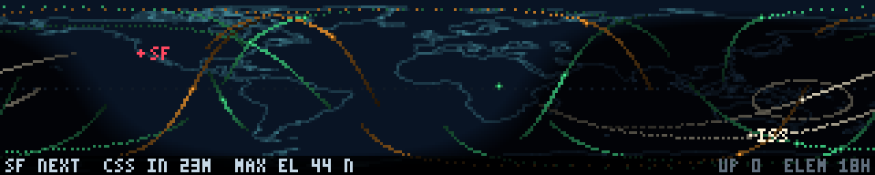

What is overhead, right now. Coastlines, the day/night terminator for this
exact minute, fifteen satellites each carrying twenty minutes of ground track
behind it and twenty ahead, the ISS labelled, San Francisco marked, and a strip
along the bottom saying when the next thing goes over the workshop and how high
it gets — `SF NEXT  CSS IN 23M  MAX EL 44 N`. The roster is the ISS and
Tiangong, nine amateur birds from AO-7 (launched 1974, still worked today)
through SO-50 and FUNcube to GreenCube at 5900 km and QO-100 sitting
motionless over Africa, and four polar weather satellites.

**The reason this one exists.** Every other live-data demo here is only as
alive as the fetcher: a tide curve with a dead fetcher is a still picture.
Orbital elements are not a measurement, they are a *description of an orbit*,
and turning one into a position needs nothing but the time of day — so this
panel moves continuously and correctly on a cache record three days old, and
would keep moving all week. `ftdata.py` fetches CelesTrak's GP elements **once
a day** (`ttl` three days, `interval` 86400) and trims 80 kB of three group
queries down to a 3.7 kB record of seven mean elements per satellite. The
obvious pick for a ham-adjacent wall would have been NOAA 15/18/19, the APT
birds a cheap dongle can hear; `GROUP=noaa` returns *not found* now and those
three are gone from `GROUP=weather` too, because NOAA ended POES operations in
2025. Their successors are here instead, Meteor-M2 3 being the one still
sending LRPT that anybody in the shop could receive.

**The projection is a plate carrée squashed exactly two and a half times.**
360° across 320 columns is 1.125° a column; the whole 180° of latitude across
64 rows is 2.8125° a row. There is no honest way round it — a true-scale world
map 320 px wide is 160 rows tall — and the alternative, keeping the scale and
cropping to the 72° that fit, would cut off everything above 36 N, which is the
ISS for most of its orbit and every polar bird entirely. So the world is
squashed, Greenland comes out short and fat, and nothing is missing.
`--lat-span 72` crops instead, for comparison. The coastline is Natural Earth
1:110m, simplified offline and baked into the source as 3.5 kB the same way
`defcon.py` bakes its own, so there is nothing to fetch at run time.

**The propagator is Kepler plus J2 secular rates, and it is not SGP4** — worth
saying plainly, because the picture looks identical either way and the
difference only ever shows up as a satellite arriving somewhere a minute early.
It does Brouwer element recovery (the mean motion in a TLE is a Kozai mean, and
using it directly gets the period wrong by seconds an orbit), the three J2
secular rates — nodal regression, which is what walks the ISS ground track west
about 5° a day, apsidal rotation, and the correction to the mean motion — and
the TLE's own *ṅ*/2 term as a quadratic in mean anomaly, which is the one piece
of drag a Kepler propagator can carry. It does **not** do SGP4's short-period
terms or BSTAR drag, which is why BSTAR is not even stored.

Measured against a public SGP4 service at five moments spanning three days, on
elements 18 hours old, the ISS subsatellite point comes out **0.09° away, 12 km
— a twelfth of a column** — rising to 0.13° when propagated a further three days
ahead, with altitude agreeing to 8 km. That is a better answer than it has any
right to be and comes almost entirely from carrying the *ṅ*/2 term. For drawing
where things are it is indistinguishable from the real thing; for pointing a
dish it is not.

The pass strip is computed once in `build()` — a 30 s search over the next day
for everything above 10°, with the horizon crossings interpolated across the
cell they fall in and the maximum refined by a parabola through the samples
either side of it. That last part is not fussiness: a pass that goes nearly
overhead moves a degree of elevation a second, so a raw grid maximum reads
88.4 where the truth is 88.8, and the raw grid *time* is half a minute out —
which is the difference between "IN 42M" and being wrong about it.

**Past the record's three-day TTL the panel stops drawing satellites and says
ORBITS TOO OLD.** That is a harder line than the other data demos take and it
is the right one here: a stale tide curve is visibly the wrong shape, but a
stale orbit is a perfectly plausible dot in the wrong place and nothing on the
panel would give it away.

Everything on it moves every frame, so nothing about the satellites is cached;
what is cached is everything that does not move — the map, the terminator
(rebuilt every two and a bit minutes, when the sun has moved half a column) and
the strip. A frame is one full-frame copy, about sixty numpy calls over a
single 1815-element array, and four scatters: **0.35 ms p50 and 0.37 ms p95**
on a desktop, so about 37 ms on the wall's 600 MHz Pi against the 50 that
20 fps allows. Three things paid for that and are worth knowing before touching
the file — Kepler's equation is not iterated (the equation of the centre to
second order plus one Newton step is already finer than the propagation it
feeds, where five blind iterations cost 45 numpy calls a frame for nothing),
geodetic latitude is a closed form rather than a fixed point (agrees with the
converged answer to 0.0007°, a four-hundredth of a row), and sidereal time over
a forty-minute track is a straight line.

`scripts/test-sats.py` is 69 checks: Kepler by substitution, GMST against its
published value at J2000, the projection against the corners of the map, the
propagation against that SGP4 service with an hour of deliberate clock error as
the control, the pass search against a brute-force 5 s scan of the same orbits,
and then the pixels — every dot read back off the panel and converted to a
latitude and longitude, the footprint ring measured to check every one of its
pixels is the right angular distance from the satellite it belongs to, and the
lit half of the map cross-correlated against where the sun actually is, with an
inverted terminator as the control. Fresh, stale and absent caches each run in
a **separate process**, because `ftdata.CACHE_DIR` binds at import and
reloading the module in one process has produced a false pass here before.

The footprint check earned its place immediately: it caught a ring wrapped as
`x % 360 - 180` instead of `(x + 180) % 360 - 180`, which is the same thing for
an eastern longitude and half a world out for a western one, and which drew a
beautiful circle around nothing at all.

```console
$ python3 ftdata.py --once --only sats    # elements; once a day is plenty
$ python3 sats.py --host 127.0.0.1
$ python3 sats.py --rate 600              # an orbit past in nine seconds
$ python3 sats.py --lat-span 72           # true scale, poles cropped
$ python3 sats.py --site 51.48,-0.00 --site-name GRN   # somebody else's sky
$ FT_DATA_CACHE=/tmp/nothing python3 sats.py           # the no-data card
```


### ships

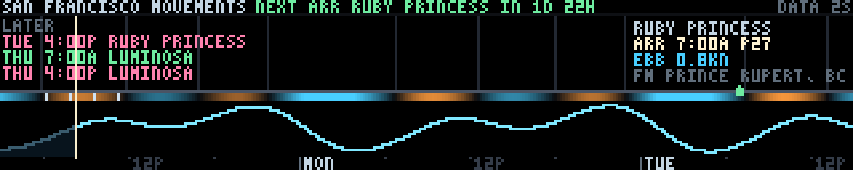

Ships in and out of San Francisco, drawn against the water they ride. Two and
a half days run left to right with now marked: every scheduled arrival and
departure at the Port's cruise berths as a mark on the axis, captioned with the
vessel, the time, the berth and where she is coming from or going to.
Underneath, on exactly the same axis, the predicted tide at Fort Point and a
ribbon of the predicted current at the Golden Gate — warm where the flood is
running in, cold where the ebb is running out, dark and still at the turn, with
a faint vertical dropped through the board at every predicted slack.

**That pairing is the entire point of the panel.** Big ships are handled
around the water. The Bay entrance runs to five knots, and the interesting
question about a movement is not what time it is but what the tide is doing at
that time — so each caption carries a third line, `SLACK` or `EBB 2.1KN`,
taken from the current prediction at the moment of the mark, and each mark can
be read against the dark bands in the ribbon. A ship sitting on the slack is
working with the water; one that is not has other constraints. Neither half of
this panel can tell you that on its own.

**Why there are no moving ships on it.** The obvious source is AIS, and every
live AIS feed within reach wants a key: aisstream.io, MarineTraffic and
VesselFinder all register you first, and AISHub's price is a receiver of your
own feeding the pool. The [Marine Exchange of the San Francisco Bay
Region](https://www.sfmx.org/daily-reports) publishes precisely the report this
demo would want — due to arrive, due to depart, vessels in port, updated around
the clock — and sells it to members; the samples are public and the live ones
are not. There is no keyless live-position feed for this bay, so there is no
dead-reckoned map here and nothing pretends there is. What *is* public, free
and authoritative is the Port of San Francisco's own [cruise terminal
schedule](https://www.sfport.com/maritime/cruise): a PDF calendar of every
cruise call at Piers 27 and 35 for the year, with vessel, berth, line, ETA and
ETD to the minute and the port either side. Cruise ships are the largest things
that come through the Gate on a published timetable, which makes them the ones
this panel can say something true about.

**These are berth times, not bridge times**, and that is worth being plain
about. The sheet says when a ship is alongside Pier 27; a ship alongside at
07:00 passed under the Golden Gate the better part of an hour earlier. Nothing
converts between the two, because the offset depends on the pilot, the ship and
the day, and an invented one drawn to the minute would look exactly as
authoritative as the published number beside it.

**The PDF is parsed here rather than by a library.** There is no PDF module in
this project's dependencies and adding one to a Pi for eleven columns of a
table is a poor trade, so `ftdata.py` inflates the content streams, recovers
the (x, y) of every text run, groups runs into rows by y, and assigns each cell
to the nearest column of *the header row it found in the document*. Reading the
columns off the page rather than out of a table of offsets in the source is
what makes it survive a layout edit; when it does eventually break it raises,
and `fetch()` leaves the previous record in place. Two files are fetched, one
per calendar year, because in December the interesting window is on next year's
sheet, and either failing is skipped rather than fatal. Grouping text by
*stream* instead of by *page* is the trap: a page's content is often split
across several streams and a table row lands either side of the split, which
silently lost a column off five calls before the page tree got walked properly.

The product is **`sfport-cruise`**, ttl a week and interval six hours. The
payload is a year-long calendar, so like the tide predictions it keeps telling
the truth long after it was fetched — what expires is not the data but the
confidence that this is the current revision, and the Port reissues the sheet
every few weeks. Six hours between fetches because the file changes a handful
of times a quarter and is a quarter megabyte a time; four passes a day still
puts a revision on the wall the day it is published, and keeps a PDF off the
fifteen-minute timer where it would be pure waste.

**The axis is stepped and clipped.** Stepped, because a window measured
continuously from now slides a fraction of a pixel a minute and takes every
label, tick and curve column with it; quantising the left edge to half an hour
costs three pixels of drift, lets the cursor traverse between steps the way
tide.py's does, and turns a redraw every few minutes into one every thirty.
Clipped, because the NOAA payload only reaches about two days past the moment
it was fetched — so the right-hand edge is pulled back to wherever the
predictions actually stop, and *whichever of the two runs out first*. The water
level is sampled every six minutes and the current every thirty, so the
current's last sample is up to half an hour short of the tide's; clipping to
the tide alone overran it, `covers()` refused, and the ribbon, the slack guides
and every phase line silently went away, leaving a completely plausible panel
with the best thing on it missing. When less than half a day of prediction is
left the panel says so rather than drawing an axis with no water under it.

**A quiet window is a true statement and has to look like one.** Cruise calls
here run from two a week in February to two a day in September, so a two-day
axis is often empty. The header always carries the next movement and a
countdown to it, and a short `LATER` ledger fills the space the marks are not
using with the next three dated calls beyond the right-hand edge — clearly off
the axis, and skipped wherever a caption already is. Captions themselves are a
ladder rather than a truncation: two movements of the same call are typically
nine hours apart, which is almost exactly one caption wide, so a caption that
will not fit tries shorter forms and then gives up and leaves its mark, because
a mark with no words is a movement you can still see and two captions on top of
each other is neither.

**Age is part of the data, and the frame loop never touches the disk.** The
cache is read once in `build()` and `render()` reads nothing, which is stricter
than tide.py's periodic reload and is there because the scheduler builds the
next segment on a worker thread. That would leave the age frozen at build time,
so the elapsed displayed time is added back on: the corner counts up on its
own and the TTL trips exactly as it would if the file were being reread. A
schedule past its week draws its calls with `STALE` beside the age; a missing,
corrupt or empty one draws the words and the command that fixes it and no axis
at all. Losing only the predictions still draws the board.

**Cost.** Everything is a function of the window, so the whole picture is
rasterised once — the curve, the ribbon's colours, the ticks, every caption —
and a frame is that copy plus three overlays: the past half of the curve
painted under the cursor from a precomputed mask, the breathing now cursor, and
the stipple. About fifteen numpy calls on 320-element arrays, **0.020 ms p95
here**, which at the 76–114x this project keeps measuring is 1.5–2.5 ms on the
wall against a 50 ms budget at 20 fps. The first static picture is drawn in
`build()` (0.9 ms here) so the frame being crossfaded into is not the expensive
one; the window steps twice an hour, and that one frame costs about 0.6 ms
here, so roughly one hitch every thirty minutes.

**The stipple is the only thing that moves, and it moves carefully.** The axis
is *time*, not distance — two adjacent columns are eleven minutes apart, not
eleven metres — so drifting anything along it at the speed of the water is a
picture of nothing, and a phase advanced by the local current comes apart into
noise within seconds of being switched on, which is exactly what the first
version did. What is honest to animate is the water *now*, over the run of the
present flood or ebb: from the turn behind us to the turn ahead is one sign of
velocity, so a stipple crossing it at one uniform speed says which way it is
running, how hard, and how much of it is left, and cannot alias.

**Asserted rather than eyeballed**, because this is another panel that can be
plausibly wrong. `scripts/test-ships.py` checks the ribbon's *sense* against
the fetched velocity rather than against how it looks — an inverted ribbon is a
handsome picture in which every ship sails on the wrong water; that every
predicted slack has a full-height guide and no column three hours off one does;
that every movement is on the axis at its own column in the colour of its
direction; that a caption names its vessel, its clock time and the water at
that moment, read back off the panel with the demo's own glyph masks; that the
stipple moves, moves the way the water runs, and stays inside the run. Frames
are rendered **sequentially from a fresh `build()`** every time, because this
demo is not a pure function of `t` and sampling it at scattered timestamps has
produced three separate wrong conclusions in this project. The fresh, stale,
absent, corrupt and no-predictions cases each run in a **separate process**
with `FT_DATA_CACHE` set, since `ftdata.CACHE_DIR` binds at import and
reloading the module in one process only looks like it works.

```console
$ python3 ftdata.py --once
$ python3 ships.py --at '2026-09-14 10:00'      # a busier week
$ python3 scripts/test-ships.py
```

### bikes

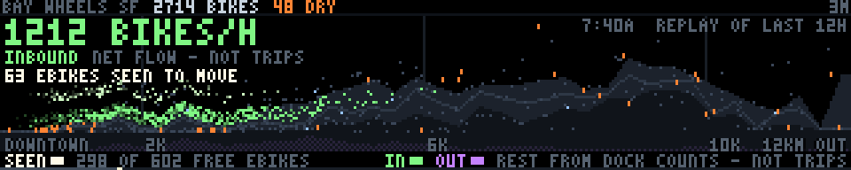

San Francisco's shared bikes, drawn as what they actually are: a fluid on a
hillside. Bay Wheels is less a fleet of vehicles than a tide — every weekday
morning the city's bikes get ridden downhill and eastward into the financial
district, and every evening they come back up, while the operator's vans push
them the other way in between. The count of bikes in the city barely moves. What
moves is *where they are*, and a station at zero bikes and a station with no free
dock are both failures that a total cannot show. So the panel is a hill: all 383
San Francisco docks laid out left to right in order of **ground altitude**,
Embarcadero and Mission Bay at three metres on the left, Twin Peaks and Buena
Vista at a hundred and fifty on the right. The ridge is the city's own
hypsometry. Each dock colours the strip of ridge it sits on — hot amber where it
is dry, quiet teal where it is healthy, cold blue where it is jammed — and the
big number in the sky says how far the whole fleet has slid.

**Why a hill and not a map.** A map of the Bay with dots on it is what `adsb`
already draws, and `adsb` is about individual objects with velocity vectors,
which this is the opposite of: a slow scalar field over three hundred fixed
locations. But the stronger argument is that geography is not the variable that
explains this data and altitude is. Bikes roll downhill for free and have to be
pedalled, or trucked, back up, so gravity is the force the whole system spends
its day losing to, and putting gravity on the x axis is what makes the fight
visible. A map would spend three hundred columns saying that San Francisco is
seven miles square, and would put a station on Nob Hill two pixels from one at
the foot of it. Sorting by height puts them at opposite ends of the panel, which
is where they belong. The cost is that the picture is not a place — you cannot
find your own dock on it — and that is a real loss, taken deliberately.

**The number in the sky is the fleet's centre of mass.** The record carries two
averages: the mean altitude of a bike you could go and unlock, and the mean
altitude of a *parking space*, which is where the fleet would sit if it were
spread evenly across the docks. The difference is the headline, in metres.
Negative — the usual state by teatime — means the fleet has run downhill and the
hills are running dry. It is deliberately a metre count and not a bike count, so
it does not move when the operator adds a hundred bikes to the city overnight:
this panel is about *distribution*, which is the thing that actually fails, and
a number that mixed distribution with fleet size would be neither.

**The source.** GBFS, the open bikeshare standard, keyless and with no signup, at
`gbfs.lyftbikes.com/gbfs/en/` — note that `gbfs.baywheels.com` 301-redirects
there, so the demo uses the destination directly. Three files a pass:
`station_information.json` (348 kB, near-static: names, coordinates,
capacities), `station_status.json` (243 kB, regenerated every minute: bikes and
docks per station) and `free_bike_status.json` (200 kB: the undocked ebikes).
790 kB every ten minutes is 1.3 kB/s averaged, about half what `quake` costs.
`station_information` could be fetched far more rarely, and the first draft did;
re-fetching it every pass is what makes a newly-installed dock appear correctly
instead of being silently dropped, and 348 kB is not worth a staleness bug.
The record that comes out is **6.8 kB** — four arrays over the stations inside
the city, sorted by height, a 64-bin histogram of the loose bikes, and two dozen
scalars. The arrays stay per-station rather than being binned into panel columns
by the fetcher, for the same reason `caiso-mix` stores thirteen fuels and not
five bands: how to bin them is a drawing decision and belongs where it can be
argued with.

**GBFS has no elevation in it, so the elevation is baked.** `demos/bikes-terrain.npz`
carries the ground height of all 634 system stations, keyed by station id.

    source     opentopodata.org public API, dataset ned10m — the USGS 3D
               Elevation Program 1/3 arc-second seamless DEM, ~10 m posting,
               public domain, keyless
    stations   gbfs.lyftbikes.com/gbfs/en/station_information.json
    retrieved  2026-08-10, 100 locations per request at 1 request/second
    arrays     ids, elev (m), lat, lon, meta (the recipe, as text)
    licence    public domain (USGS); Bay Wheels GBFS is published openly

Baked rather than fetched because a terrain service is a second thing that can
be down and the ground does not move. A station the bake has never heard of —
one installed since — takes the height of the nearest baked station, which in a
city with a dock every few blocks is a great deal better than dropping it, and
is counted in the payload as `interpolated` so the number is checkable. Note the
`aster30m` dataset, which is the obvious first choice, is wrong here by ten
metres at the waterfront: it reads 11 m at Embarcadero and Bay where NED reads
2.8. On a panel whose whole low end is the interesting part that is not a
rounding error. There is no `scripts/make-bikes-terrain.py` in the tree because
adding one was outside the file list this demo was written under; the recipe
above is complete and reproduces the file exactly.

**The crop is San Francisco only.** Bay Wheels is one system covering four
separated cities — SF, Oakland/Emeryville/Berkeley across the bay, and San Jose
fifty miles south — and they do not share a commute, a terrain or a tide.
Putting them on one altitude axis would sit a San Jose dock at 25 m next to a
Nob Hill dock at 25 m and mean nothing by it. The box (37.700–37.840 N,
122.530–122.350 W) is the city and county plus the handful of Daly City docks on
its south edge: 383 of the system's 634 stations, and the ones whose hill is the
story. The other 251 are in the elevation bake, so changing the crop is one
constant.

**The occupancy ramp is diverging and its middle is the dimmest part of it.**
Empty and full are both failures and both have to be visible; a dock that is
between a fifth and four fifths full is working and nobody needs to look at it.
So the ramp runs hot amber at zero, through a quiet dark teal across the whole
healthy middle, to a cold near-white blue at capacity, and what glows on the
panel is what is wrong. Warm-is-empty is the convention every dock map uses and
was not worth being clever about. Individual failures also get their own marks,
because a column is one or two docks wide and averaging can hide a single dry
one: a dry dock flies a two-pixel flag above the ridge, which *pulses* — the
only animation here that carries meaning rather than merely proving the panel is
alive — and a jammed one bites two pixels down into the rock.

**The vertical scale is a square root, and the gridlines say so.** Half of San
Francisco's docks are below 21 m. Drawn linearly the entire interesting low city
is squashed into six rows and the panel is a flat line with a spike on the end;
under a square root it is a hill. The contours are labelled in metres so the
compression is declared rather than hidden.

**The mist above the ridge is a different fleet.** Several hundred ebikes are
parked loose at the kerb rather than in any dock, and they are a genuinely
different population: nobody rebalances them, they simply pile up wherever the
last rider left them. Having no dock, they have no altitude of their own, so each
takes the altitude of its nearest station and the histogram of that is stippled
at quarter density over the ridge. Where the mist is thick, loose bikes have
collected. It is drawn three rows clear of the crest and never on it — a
one-row error there would replace the occupancy colours with grey stipple and
read as "quiet" rather than as "missing", which is the failure mode the test
script checks for by name.

**The feeds have no history, so the fetcher grows one.** `station_status` is a
snapshot, and the commute pump is only visible over a day, so each pass appends
one sample to a rolling series inside the record: ten-minute buckets keyed on
absolute epoch, 24 hours, capped at 150 entries and trimmed on every write. That
keying is what makes every failure mode benign. A pass that runs twice inside one
bucket overwrites instead of lengthening the series; a missed pass leaves a hole,
and the hole is *visible* because the epochs are stored rather than assumed
regular; a clock that jumps backwards — a Pi with no RTC getting NTP for the
first time after boot — drops the future rather than leaving the series in an
order the demo would draw as a scribble. It is also the one product here that is
deliberately **not** `volatile`: the accumulated day is the only thing in this
cache that cannot be re-fetched, so it goes on disk and survives a reboot.

The lane draws that series as a signed area against the docks' own altitude, and
it **does not join up its gaps** — an hour when the fetcher was not running is
left blank rather than bridged, because the whole reason the series exists is to
show a shape and an interpolated shape is an invention in the shape of data. On a
cold cache almost the whole lane is gap, the caption reads `24H TRACK BUILDING`,
and it fills in over a day. The lane is scaled to the range the day actually had
rather than symmetrically around zero: in this city the fleet is below its docks
almost every hour of every day, so a zero-centred lane would leave half its
thirteen rows permanently blank and squeeze the few metres of daily swing —
which is the entire signal — into six. Zero is forced to stay inside the range,
so the reference line is always drawn and the sign is never in doubt.

**Three data states, and a fourth that is worse than stale.** Past its
half-hour TTL the panel still draws, with the age and `STALE` in red, because a
twenty-minute-old occupancy map is nearly right. Past `--max-age` (six hours) it
is refused outright and gets a no-data card naming the age: by then every dock
that was dry has been refilled, and a confident hillside of this morning's
colours is the one lie this panel could tell. No record at all gets the same card
and the command that fixes it.

**Frame budget.** Everything is baked in `build()` — ridge, rock, contours,
occupancy colours, mist, flags, lane, legend and header are rasterised once into
two uint8 frames. `render()` copies one, runs the sheen over a 32-column window
(one multiply, one add, one copy), writes the dry flags at a pulsing brightness
through a single fancy index, and draws the now-line in the lane. Eight or nine
numpy calls a frame, and the cost model on the wall is calls and not pixels.
Measured here over 3000 frames: **mean 0.026 ms, p50 0.027, p95 0.036, p99
0.048**, worst frame 0.067. `build()` is 2.0 ms. Even at a hundredfold that is
under 4 ms of a 50 ms budget. `render` is a pure function of `t` with
`--reload 0`, and the test script asserts it; with the default `--reload 300` it
asks the wall clock whether to re-read the cache, exactly as `caiso` does.

**What was hard.** Three things, all of them about the ridge. Laying stations
out by *metre* rather than by rank piles two hundred docks into the leftmost
fifty pixels and leaves the right half of the panel empty, so the x axis is
rank and the ridge is the sorted profile — which has to be said out loud,
because it looks like a cross-section of the city and is not one. Drawing the
ridge one pixel per column gives a dotted line wherever the hill is steep, with
sky showing through it, so the surface is a band from the ridge row up to
halfway towards its higher neighbour. And the per-column aggregation started as
`np.add.at` and then `np.add.reduceat`; the first is startlingly slow and the
second is simply wrong here, because the column slices overlap wherever a column
gets fewer docks than the one before it and `reduceat` can only sum between
consecutive start indices. It is a differenced prefix sum now, which is exact
and has no loop in it.

**One disclosure about the screenshot.** The hill, the numbers and the mist are a
real Bay Wheels snapshot. The 24-hour lane under it is synthesised, because the
series accumulates ten minutes at a time and this panel was written in an
afternoon; the first real day of it appears on the wall a day after the fetcher
starts.

    python3 ftdata.py --once --only baywheels
    python3 bikes.py --host 127.0.0.1
    FT_DATA_CACHE=/tmp/empty python3 bikes.py      # the no-data card
    python3 scripts/test-bikes.py
### bgp

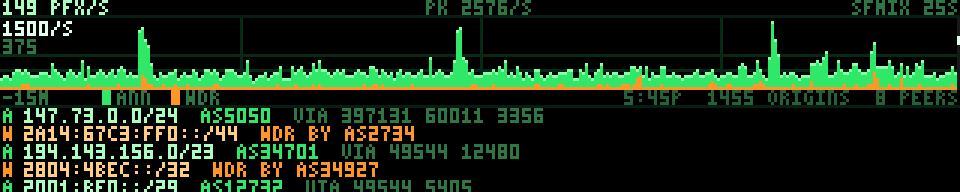

The internet's routing table, churning, as San Francisco's own exchange hears
it. Fifteen minutes of the global default-free zone across 320 columns, second
by second, with a ticker of the actual prefixes scrolling underneath. The number
in the corner is how many prefixes a second are being announced or withdrawn to
the RouteViews collector at SFMIX — which is a couple of miles from the wall and
is where the makerspace's own ISP hands its traffic off. The routes on this
panel are the ones the room's packets are steered by, which is not a claim any
other vantage point could make.

BGP never stops. Somewhere on earth a network announces or withdraws a prefix a
few thousand times a second, most of it churn from a handful of unstable origins
and occasionally something that matters, and the shape of that noise is the only
thing this panel is trying to say: **a constant hiss with structure in it.** A
quarter of an hour of it is a floor of a hundred-odd prefixes a second with
spikes an order of magnitude above it, and every spike is a real event — a
session that reset and re-sent its whole table, a network that flapped,
somebody's maintenance window.

**This is the one panel on the wall showing infrastructure its audience
operates, and that makes the honesty load-bearing.** There are already five
demos here in the green-on-black terminal register — `wardial`, `ansi`, `wopr`,
`defcon`, `sneakers` — and every one of them is a prop with invented numbers in
a hacker-movie typeface. This one deliberately borrows the same visual language
and then has to earn its way back out of it. So the prefixes in the ticker are
literal strings out of the MRT dump, the AS numbers are real and lookupable,
IPv6 is in there because the real table is half IPv6, and the awkward numbers
are left on the screen rather than smoothed off. Somebody who knows what
`2a14:67c3:ff0::/44` is can check this panel against their own looking glass and
find it correct. That is the test it is built to pass.

**Why the data is a quarter of an hour old, on purpose.** The obvious source is
RIPE's RIS Live, which streams the whole DFZ over plain HTTP as
newline-delimited JSON and would put the panel a second behind the world. It was
tried first and rejected twice over. Unfiltered it delivered **78 MB in 25
seconds**, which is not going near a Pi on shop wifi; and any affordable use of
it is *sampled* — open the socket, read twenty seconds, close it, and be blind
for the other hundred and sixty. A burst lasting a minute would simply not
appear, and a chart that silently omits the interesting parts is worse than a
coarser one that does not. RouteViews has the opposite shape: every collector
writes a complete MRT dump of every update it saw in each fifteen-minute window
and publishes it about a minute after the window closes, bzip2'd. One 1.2 MB
file buys **the entire window** — 75,000 messages, 150,000 prefixes, per-second
resolution, nothing sampled away. Trading fifteen minutes of latency for a chart
with nothing missing from it is the right trade for a panel about texture, and
the age is on the screen in any case.

Two things had to be measured rather than assumed, and both are in `ftdata.py`:
the RIS Live filters go in an `X-RIS-Subscribe` **header** and not in the query
string (the query-string forms are silently ignored — a `host=rrc11` parameter
changes nothing and you get the firehose), and `socketOptions.includeRaw` does
not work on the HTTP streaming endpoint at all, so every message carries its own
hex-encoded wire form whether you want it or not. That is roughly half the
bytes. RIPEstat was also tried and timed out twice at 25 s from this machine
while every other RIPE endpoint answered, so nothing here is built on it.

**MRT is parsed by hand, in `ftdata.py`, and that needs justifying.** The usual
answers are `libbgpstream` and `mrtparse`; the first is a C library with a
build, the second a dependency tree, and neither is going on a Pi to do
something this file already does for the Port's cruise PDF. The wire format is
RFC 6396 for the framing and RFC 4271 plus RFC 4760 for the UPDATE inside it,
and the part a churn counter needs is small: walk the record frames, find the
BGP UPDATEs, count the prefixes in the withdrawn block, the NLRI block and the
two multiprotocol attributes, and read the AS_PATH. What is deliberately *not*
implemented is everything else — communities, MED, aggregators, the two-byte-ASN
subtypes nobody has emitted this decade. An attribute the parser does not
understand is stepped over by its own length field, which is why an unknown one
cannot desynchronise the walk.

It is also where all the plausible wrong answers live, so it is the part with
the most tests. `scripts/test-bgp.py` builds MRT byte by byte and asserts
against arithmetic, because every one of these failures draws a panel that looks
completely fine:

  * **A miscounted prefix block.** NLRI is a length-in-*bits* byte followed by
    that many bits rounded up to whole octets, with the trailing zero octets
    left off the wire entirely. Get the rounding wrong and the walk
    desynchronises, the rest of the record is garbage, and the chart is just a
    different height. There are `/22` and `/25` cases in the tests for exactly
    this: a `/25` is on the wire as four octets and a `/22` as three.
  * **IPv6 silently missing.** v6 routes are not in the NLRI field at all; they
    ride inside `MP_REACH_NLRI`, which is an *optional* attribute. A parser that
    skips attributes it does not recognise — which is what a parser must do —
    drops half the real table and reports a perfectly plausible rate.
  * **The AS path read off the wrong end.** The origin is the last ASN of the
    last segment. Reading the first gives the peer, and the ticker then
    confidently prints the collector's own neighbours as the origin of
    everything on the internet.
  * **The ET record variant.** Real RouteViews files are 100% type 17, which is
    type 16 with four extra bytes of microseconds ahead of the body. Four bytes
    of offset error lands the parser in the middle of a peer address.

**The axis is square root, and it says so.** This was the one real design
problem. BGP churn is a floor around 150 prefixes a second with spikes twenty
times that, and a linear axis fitted to the spikes draws the floor — the panel's
entire subject — as one row of green along the bottom with no texture in it at
all. The first version did exactly that and was unreadable. Fitting the axis to
the floor instead clips every spike flat, and the spikes are the events. Log
would be the usual answer for a rate and cannot be used here, because a stacked
area cannot be drawn on a log axis: a zero has nowhere to go, and half the
columns have no withdrawals in them. Square root splits the difference the way
this data wants — the floor lands around a fifth of the height with its texture
intact and a twentyfold spike still reaches the top.

A non-linear axis that does not admit it is a lie, so there are **two** numbers
down the left edge instead of one: the full scale and the value at half height.
Under this transform the half-height number is a *quarter* of the full scale,
not a half, and anybody who reads both discovers the axis in about a second —
which is exactly the audience this panel has. The ladder the full scale rounds
onto has 1.5, 3 and 7 on it as well as the usual 1, 2 and 5, which is not
decoration either: a 1/2/5 ladder rounds a 2760/s peak up to 5000, and on a
square-root axis that leaves the tallest event of the quarter hour at three
quarters of the height with a quarter of the chart permanently empty above it.

**Withdrawals get their own colour and the bottom of the stack.** They are about
five per cent of prefix churn and they are far more likely than an announcement
to be somebody's outage, so folding them into one line would hide the only part
of this number that is unambiguously bad news. They are underneath rather than
on top because they are the smaller quantity and a two-pixel band floating on a
moving surface cannot be read, whereas one sitting on the floor has a straight
edge to be measured against. Their band has a **one-row minimum** wherever there
were any at all: a single withdrawn prefix in a 900-second window is four
ten-thousandths of a row, and an outage that vanishes from the chart because it
was small is precisely the failure this panel must not have.

**The ticker is a reservoir sample, and that is a real distortion worth naming.**
Its 48 lines are drawn from across the whole fifteen minutes rather than off the
front, because the front of a window is regularly one router dumping its table
and forty-eight lines of the same peer is not what the routing table looks like.
Announcements and withdrawals go into the *same* reservoir at their true
proportions, which means most windows have one or two amber lines in the loop
and some have none — that is correct, and the chart is what carries the real
ratio. What the ticker cannot show is a prefix's second announcement: only the
first prefix of each UPDATE becomes a line, so a message announcing six prefixes
contributes one. The chart counts all six.

A withdrawal line names the **peer** that sent it and says `WDR BY`, because a
withdrawal genuinely has no origin — an UPDATE that withdraws a prefix carries
no AS_PATH, there being no longer a path to describe. Inventing one from a
previous announcement would be the exact kind of plausible lie this panel exists
not to tell. AS path prepending is collapsed on the way to the screen: a path
like `[16582]×9` is one network saying one thing nine times and costs 36 pixels
of a ticker line to say nothing.

One detail worth knowing, since it looks like a bug and is not: **Monkeybrains'
own prefixes never appear on this panel.** AS32329 did not show up once in a
sampled window's 2,261 distinct ASNs, and that is the system working — a stable
route generates no churn, and the whole panel is a picture of instability.
Everything on it is, by construction, somebody having a worse day than the
makerspace's ISP.

**Frame budget.** Everything is baked in `build()`: the header, the chart, the
legend and the entire ticker are rasterised once into a static frame and one
tall strip, which is what makes the scroll two slice copies a frame rather than
a re-render. `render()` does one copy of the top of the panel, one window into
the strip, and three short writes for the pulse — five or six numpy calls, and
the cost model on the wall is calls and not pixels. Measured over a full 1200
frame (60 s) loop on the desktop this was written on: **mean 0.004 ms, p50
0.004, p95 0.004, p99 0.006**, worst frame 0.022 ms. `build()` is about 4 ms.
Even at two hundred times slower this is under a millisecond a frame against a
50 ms budget, and the only thing that could change that is the ticker strip
growing, which it cannot — it is 48 lines by construction.

`render()` is a **pure function of `t`** and is asserted to be: a cold
`render(7.3)` is byte-identical to the same moment reached by driving from zero.
The scroll and the pulse are both driven by the segment's own `t` and never by
the wall clock, which is what makes them the same animation on the wall and
under a preview baker rendering a hundred frames in a millisecond. The only
clock read is the periodic cache re-read, same as `caiso`.

**Three states.** Fresh is the panel above. A record past its 45-minute TTL
still draws — a picture of the routing table from an hour ago is still a picture
of the routing table — with `STALE` and the age in red in the header, because
the one thing this panel must never do is imply that a flat stretch is happening
now. No record at all gets a no-data card. All three are rendered in separate
processes by the test script, since `ftdata.CACHE_DIR` binds at import and
reloading the module in one process does not test what it looks like it tests.

The fetcher pulls one file every 15 minutes on the collector's own cadence,
turning 1.2 MB of bzip2 (12.5 MB of MRT, 75,000 records) into an 11 kB record.
Both ends are capped — `BGP_MAX_BZ2`, `BGP_MAX_MRT`, `BGP_MAX_RECORDS` — at
roughly five times normal, so they never fire in ordinary operation and do fire
on the day a collector emits a pathological window; a capped parse says so in
the record and its rates are computed against the span actually parsed rather
than the fifteen minutes it was supposed to be. `FT_BGP_COLLECTOR` and
`FT_BGP_SITE` move the vantage point, since every RouteViews collector publishes
the identical layout and somebody forking this wall for another city should not
have to edit code.

    $ python3 ftdata.py --once --only bgp-sfmix
    $ python3 bgp.py --host 127.0.0.1
    $ FT_DATA_CACHE=/tmp/empty python3 bgp.py      # the no-data card
    $ python3 scripts/test-bgp.py
### sfmix

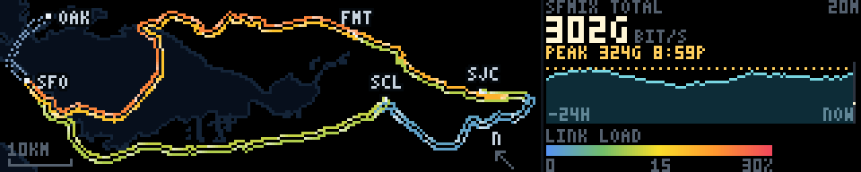

A NOC weathermap for the San Francisco Metropolitan Internet Exchange: the
oldest picture in network operations, drawn for the exchange this wall's owner
helps run. The fibre goes where the fibre actually goes, each span is coloured
by how much traffic is on it, and light runs along it at a speed proportional
to that traffic, so the map is alive rather than a diagram. Five metros from
San Francisco down to San Jose, the five inter-metro trunks between them, and
on the right the number an exchange is judged by — how many bits are crossing
it right now, today's curve, and where the peak was.

**The data is the exchange's own, from three keyless endpoints.**
`portal.sfmix.org/statistics/map/map.json` is the public structure: twelve
sites, five metros, twenty-two cables, and — the part that matters here —
`metro_cables`, pre-aggregated inter-metro trunks carrying their real coarse
fibre routes as lon/lat polylines. `/statistics/map/traffic` is live bits per
second per opaque cable id. `/statistics/metrics/?panel=ix_total&range=24h` is
the aggregate, ingress and egress summed over every member port at 300 s
resolution. Nothing needs a key and nothing here is private: the precise
carrier geometry and the cable-id-to-circuit mapping live in files the portal
never serves, and this panel never asks for them.

Both map.json and the traffic feed carry a `generation` string, and the fetcher
treats it as a **safety interlock rather than a version number**. The cable ids
are opaque *per generation* — rebuilt from scratch every time the portal re-runs
its NetBox build — so traffic joined onto the wrong generation does not fail
loudly, it quietly colours trunks with numbers belonging to other trunks. The
two are fetched, compared, and the structure refetched once if they disagree
(the ordinary race: the builder republished between the two GETs). A second
disagreement raises, and `fetch()` keeps the last good record.

About 135 KB of JSON becomes a 7 KB record. The twelve sites collapse to five
metros, because at this scale — eighty kilometres across two hundred columns,
so a third of a kilometre a pixel — the six Santa Clara facilities are the same
pixel and the six intra-metro cables between them are zero pixels long. The per
link 24-hour series and per-member breakdowns go entirely. The routes are
Douglas–Peucker simplified from 846 vertices to 153 at a tolerance of a third
of a pixel. The aggregate curve is bucketed from 289 points to 97 taking each
bucket's **maximum**, and the true peak and its timestamp are carried
separately, because the peak is the whole point of the curve and a decimation
that shaved it would be the one lie this record could tell.

**The map is turned forty-five degrees, and that decides the entire layout.**
SFMIX's footprint is a corridor — San Francisco and Oakland at the top, then
Fremont, Santa Clara and San Jose strung down the south bay. North up, that
cloud is 56 × 64 km: very nearly square, and a square on a 5:1 letterbox wastes
three quarters of the wall. Turned 45°, it is 82 × 23 km, an aspect of 3.62
against the map pane's 3.6, and it fits **at true scale in both axes with
nothing stretched**. The rotation is not a stylistic choice, it is the only way
this geography is a letterbox. So the arrow bottom-right says where north is
and the bar bottom-left says how far ten kilometres is, and it stays a real
map: anisotropic scaling would have filled the box exactly and would silently
have been a lie about distance, so the slack went into margin instead.

The alternative was the schematic subway diagram the portal itself draws when
zoomed out, which is more legible in the abstract and throws away the one thing
this particular audience already knows by heart — the shape of their own bay.
The coastline is the label that needs no text, and it is why the Dumbarton
crossing on the San Francisco–Fremont trunk reads as a bridge rather than as a
line that happens to bend.

**Two strands per trunk, because in and out are different numbers.** A
weathermap has split every link into two half-arrows since MRTG, and the reason
is that a link is not one quantity: San Jose–Fremont was carrying 118 Gb/s one
way and 67 the other while this was written, 19.6% and 11.2% of the same 600
Gb/s of fibre. So each trunk is two parallel one-pixel tracks either side of its
route, each coloured by *its own* direction's load, with light running along it
in that direction. The counter-flow reads from across the room, and the busier
half is both the warmer one and the faster one.

**The colour ramp is the portal's own, compressed four-fold, and the legend
says so.** SFMIX's map colours 0–80% blue-green-yellow-orange-red, which is the
right scale for a map you lean into and can spot a link about to melt. An
exchange deliberately overbuilds its backbone, so on that scale every trunk
here is blue, all day, forever — a dead panel that is also uninformative. This
one keeps the five hues and runs them **0 to 30 per cent**, which is where the
traffic actually lives: on a normal evening the quiet Santa Clara–San Jose
trunk is blue at 2.5%, San Francisco–Santa Clara is a yellow-green 11.9%, and
San Francisco–Fremont is orange at 24.3%. The ramp is drawn bottom right with
its numbers on it, because a colour scale without its numbers is decoration.
The compression is honest in the direction that matters: nothing on this panel
can look calmer than it is, and 30% or more clamps to red rather than wrapping.
The scale is fixed and not derived from the day's own maximum — a traffic light
whose boundaries move with the traffic is not a traffic light.

**Three things are deliberately not the ramp.** A `planned` trunk — San
Francisco–Oakland, in the structure and not yet lit — is dashed in the portal's
own slate blue, outside the ramp entirely, and carries no light; colouring an
unlit fibre "0%, healthy blue" would be the easiest lie available here. A trunk
whose members reported nothing at all is grey, which is a different statement
from zero. And a direction genuinely measured at zero *is* drawn at the bottom
of the ramp, because zero is a fact — but it gets no comets, since running
light along it would say bits are moving when the measurement says they are not.

**The right third is the aggregate.** Total exchanged right now, at 2x, large
enough to read from the far bench; today's 24-hour curve under it with the peak
marked as a dotted rule and labelled with its clock time; the time axis
captioned inside the chart at both ends because 64 rows had exactly one row
spare and the legend needed it. Ingress and egress across the whole exchange
agree to two parts in ten thousand — which is what an exchange *is* — so it is
one curve and the word is "exchanged" rather than a side picked arbitrarily.
The curve is zero-based: a traffic curve zoomed onto its own top few per cent is
the classic way to make a flat day look like an event.

**What was hard.** Captions. Five three-letter metro codes on an 80 × 23 km map
collide with each other and land on top of the trunks, and five-pixel white type
over a yellow cable is unreadable in a way a screenshot at 3x hides completely.
Two things fixed it: every caption gets a one-pixel dark halo around each
stroke, and each one is placed at whichever of four fixed offsets has the fewest
lit pixels already under it — scored against the half-drawn frame, so San Jose's
caption steps off the orange trunk that terminates on it. It scores once and
does not iterate, so a given metro's caption is in the same place every build.

The other one was the flow direction, and it is exactly why `test-sfmix.py`
exists. `render()` lights a pixel where `(s + speed·t) mod period` is near zero,
so the lit position along a strand is `s = −speed·t` and the sign that sends a
comet from a to z is a *negative* speed. The first version negated both the
phase and the speed for the reverse strand — which looks like the symmetric
thing to do, is a no-op on direction, and sent both tracks of every trunk the
same way. It is undetectable in a still frame and very hard to see in motion.
The test builds a synthetic trunk carrying traffic in one direction only,
identifies the comet pixels as exactly the pixels where the rendered frame
differs from the baked one, and measures a **circular** mean of their positions
modulo the comet period — a plain centroid jitters backwards at random as the
leading comet leaves the end while the next enters, and a test built on one
passes or fails by luck.

**Frame budget.** Everything is baked in `build()`: the sea, the shoreline, all
ten strands, the nodes, the captions, the header, the chart and the legend go
into one uint8 frame. `render()` does a full-frame copy, six arithmetic passes
over a flat array of the 1170 pixels that carry flowing light, one fancy-indexed
write of those pixels, and a one-pixel dot on the chart — ten numpy calls, all
into preallocated buffers, nothing that formats a string or allocates, and
nothing that depends on how many comets happen to be lit. Over 1200 frames on
the development machine: mean 0.027 ms, p50 0.026, p95 0.029, p99 0.039, worst
0.057. `build()` is 4–5 ms, once, on the scheduler's worker thread, most of it
resampling the coastline.

`render` is a **pure function of `t`**, which is unusual for a data panel here
and is asserted rather than assumed: a cold `render(4.35)` is byte-identical to
the same instant reached by stepping from zero.

**The coastline** is `sfmix-map.npz`, 4.5 KB: a 768 × 768 bit-packed land/sea
mask over lon −122.80..−121.60, lat 37.05..38.00, rasterised by an even-odd
scanline fill from the exchange's own committed, public, coarse basemap water
rings (`portal/mapbuild/data/basemap-water.json`, OSM-derived). It is
deliberately not `adsb-coast.npz`, which stops at 37.4 N and therefore has no
south bay — which is most of this map.

Product `sfmix-ix`, TTL 30 minutes, fetched every 5 minutes (the resolution of
the underlying counters; asking faster returns the same numbers and costs the
portal a Prometheus burst). Past its TTL the panel still draws, with the age and
STALE in red where the age goes, because the routes and the day's curve are
still true and only "now" has gone soft. With no record at all, a no-data card.

    python3 ftdata.py --once --only sfmix-ix
    python3 sfmix.py --host 127.0.0.1
    python3 sfmix.py --util-full 15        # a tighter ramp on a quiet day
    FT_DATA_CACHE=/tmp/empty python3 sfmix.py     # the no-data card
    python3 scripts/test-sfmix.py

## Group buttons

Sixty-three cards is a lot of switches. The thing people actually want from the
panel during an event is a mode — *just the data ones*, *just the movie ones*,
*just the Sequoia Fabrica ones* — and getting there by hand means working down
the whole list on a phone while the room fills up.

So the panel has a row of group buttons above the cards. Pressing one enables
that group's entries and disables everything else. It is not a view filter: the
wall changes. `All` puts the whole rotation back.

They behave as radio buttons, because the modes are exclusive — but membership
is not, and that distinction is the reason the taxonomy lives where it does.
`tide` is honestly both a data panel and a San Francisco panel; `voxel` is both
a demoscene technique and a flight over the Bay; `scroller` is both a classic
scroller and a sign that says SEQUOIA FABRICA. Each of them is in two groups. A
model that forced every demo into exactly one bucket would have had to pick a
loser in each of those cases, and the wrong answer would then be baked into the
rotation file for good.

#### The file

`rotation-groups.json`, next to the rotation and separate from it:

```json
{"version": 1,
 "groups": [
   {"key": "data", "label": "Data",
    "description": "Live panels reading the outside world",
    "members": ["propagation", "adsb", "goes", "..."]}
 ]}
```

Separate for two reasons. Groups are a presentation concern, and the same
taxonomy should survive a different running order — betelgeuse's rotation is one
installation's, the taxonomy is not. And the rotation file is the one that gets
edited every time a demo is added, by somebody who is thinking about frame
budgets and transitions rather than about the panel; a field on every entry
there would rot.

**Names it does not recognise are skipped.** This is load-bearing, not
defensive programming for its own sake. The file names demos that are not in
every installation, and in practice it is edited days before the demos it names
exist — the six live-data panels went into it while they were still being
written. Resolution happens once at startup against the loaded rotation, and
the startup log says how many names it dropped, in one line rather than one per
name. It is one line because there are usually a few in flight, and a paragraph
of warnings at every restart is how people learn to skip the startup log.

A group that resolves to nothing at all is dropped rather than kept, because a
button that would empty the wall is worse than a button that is not there.
`set_only()` refuses an empty set for the same reason, the way `set_all()`
already refused to switch the last effect off.

`all` is not in the file. It is synthesised, so that an edit to the file cannot
take away the way back.

#### The API

One new op on `/api/command`:

```json
{"op": "select", "group": "data"}
```

The obvious implementation was `all(off)` followed by a `toggle` per member,
entirely from the page. That is N+1 round trips and N+1 frames, and the wall
would visibly play a half-applied group for about a second on its way to the
right one. Every other op in this file lands at the top of one frame, and this
one does too: the whole set changes under the rotation lock, once.

The payload is the group's key rather than a list of names, so the group file
stays the only place membership is written down — a client cannot invent a set
of its own, and editing the file is genuinely enough to change what the buttons
do.

The group list rides on `/api/schema` alongside the option schemas, because it
is fixed for the life of the process and is fetched once per page load. Which
group is *active* rides on `/api/state`, because that changes.

Indices past the playhead are invalidated and the effect on air plays out its
slot, exactly as a single toggle already did. Cutting mid-segment because
somebody chose a mode is a worse answer than the next forty seconds being the
old mode.

#### When it is none of them

The interesting state is the one after somebody presses `Movies` and then flips
a single card. The live set is now no group, and a button still drawn as
pressed would be claiming a mode the wall is not in.

So the scheduler compares the enabled set against each group and answers `null`
when it matches none of them — `"group": null` in the state — and the page
lights no button and shows a quiet `custom mix` next to the row. Flip the card
back and the claim comes back. The comparison is server-side so that every
phone looking at the wall agrees, and it is a handful of frozenset comparisons
once a second against a snapshot that is being rebuilt anyway.

`all` is tested first, so a group that happened to list the entire rotation
loses the tie — that is the same selection under a more specific name than
anyone chose.

#### The taxonomy

Seven groups plus `All`, which is as many as fits across a phone without the
row becoming its own screen. Every one of the rotation's entries is in at least
one; thirteen are in two.

| group | what is in it |
|---|---|
| Data | the live outside-world panels: propagation, adsb, goes, caiso, sats, winds, quake, wx, ships, tide |
| Movies | wopr, defcon, tron, sneakers, trench, fsn, esper, headroom, gibson, wardial, ansi |
| Makerspace | console, knit, sewing, printer, lathe, wheel, laser, scope, splitflap, scroller, sf-tree, sf-tree-bounce |
| San Francisco | goldengate, karl, sunset, grove, voxel, sf-tree, sf-tree-bounce, wardial, tide, ships, quake, caiso, adsb, wx |
| Demoscene | fire, tunnel, starfield, metaballs, rotozoom, twister, water, cycle, floor, voxel, boing, scroller, fireworks, daliclock |
| Games | pacman, pacman-ghosts, space-invaders, mario, nyancat, toasters, boing |
| Algorithms | sort, wireworld, life, maze, slime, fireflies, chladni, scope |

Some of these took a decision rather than a lookup. `console` is in Makerspace
rather than anywhere filmic because it types out Arduino one-liners that people
in the space wrote, and it is the only demo anyone can add to without touching
code. `scope` is in both Makerspace and Algorithms: it is a bench instrument, and
it is also the closest thing here to a live plot of a function. `chladni` sits
in Algorithms rather than Demoscene because it is a physics simulation that
happens to be pretty, not an effect. `wardial` is in San Francisco as well as
Movies — the exchange it works through is a real one.

Bandwidth for a network group was considered and dropped. `bgp` and `sfmix`
would have been the whole of it, both are honestly data panels, and two members
does not earn a button on a phone.

## demoscene.py

The shared part. Each demo parses the usual options, precomputes what it can,
then hands a `render(t, frame) -> (H, W, 3)` callback to a fixed-rate loop
that pushes frames with `send_array_banded()`.

```python
import demoscene as ds

ap = ds.parser("Bouncing dot")
ap.add_argument("--radius", type=float, default=6.0)
args = ap.parse_args()

def render(t, frame):
    ...

ds.run(render, args)
```

It also carries the colour helpers, which matter more than they look. An
effect that computes one scalar per pixel and maps it through a palette is
both far cheaper than computing RGB directly and much easier to make look
good, since the palette carries the art. `gradient()` builds a lookup table
from colour stops, `rainbow()` sweeps hue, and `fire`, `ice`, `toxic` and
`magma` ship ready to use.

## Writing one that looks right on a wide panel

These effects are usually written for something squarer and taller than a
320x64 wall, and most of them need adjusting for it. Things that caught us:

- Anything with a **rate per row** — fire's cooling, for one — is tuned for a
  screen two or three times taller. Over 64 rows it never finishes, and you
  get a solid sheet of colour.
- **Shading on radius** needs scaling against the display, and on a panel this
  wide almost every pixel counts as near, so the effect flattens out. Shade on
  something in the effect's own units instead, like depth.
- A **tiled texture** must be genuinely seamless or rotation will show hard
  diagonal seams. Sine terms need whole numbers of cycles across the texture,
  and a radial term cannot tile at all.
- **Single-pixel elements** carry no weight. A near star drawn the same size
  as a far one makes a starfield read as static rather than as motion.

The frame-interval trace in [`../tools/ft-emulator`](../tools/ft-emulator) is useful
here: a stall shows up as a spike there long before it moves the average, and
stalls rather than average jitter are what read as visible flicker.

## Older Python demos

`fsa.py`, `grid.py`, `ripple.py` and `sierpinski_rain.py` predate the shared
module and use `flaschen_np.py`, a local numpy client, setting pixels
individually rather than pushing frames.
